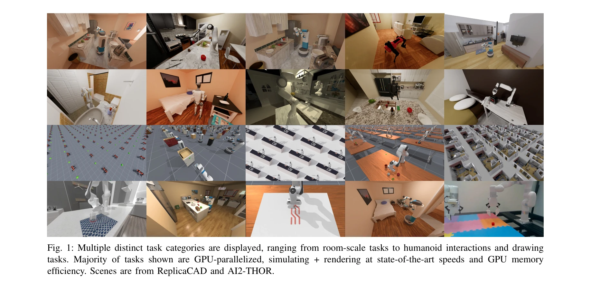
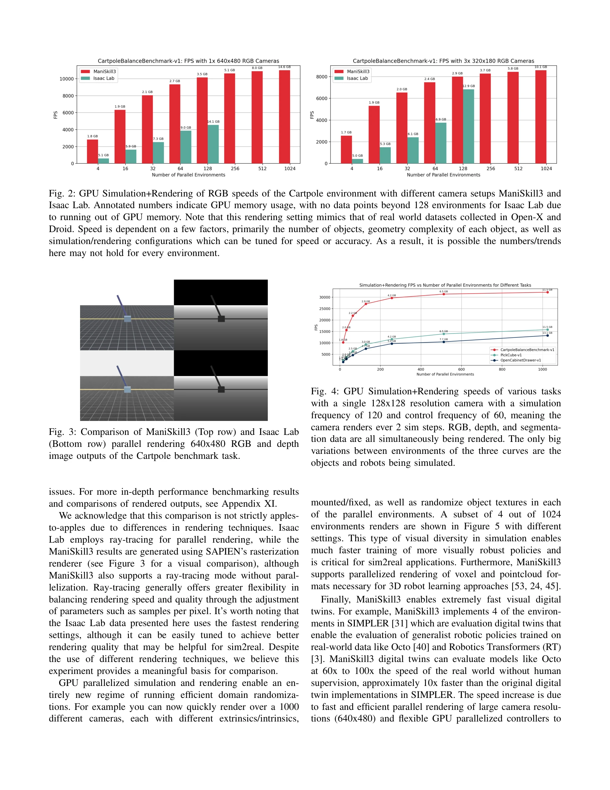
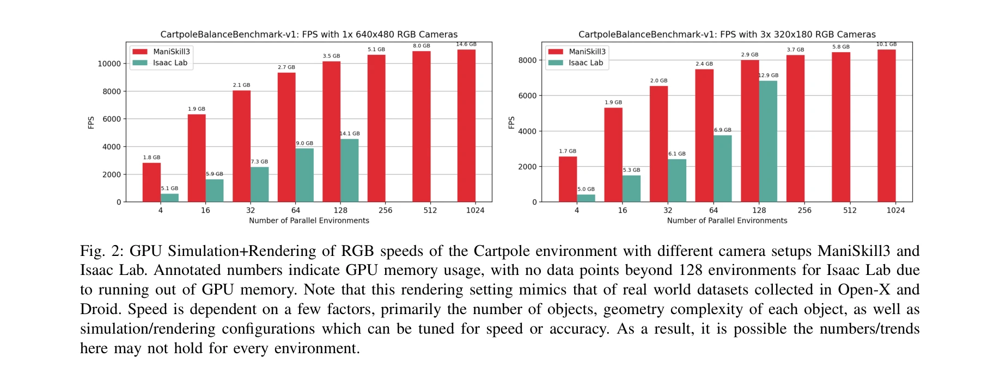

# ManiSkill3: GPU Parallelized Robotics Simulation and Rendering for Generalizable Embodied AI

> **저자**: Stone Tao, Fanbo Xiang, Arth Shukla, Yuzhe Qin, Xander Hinrichsen, Xiaodi Yuan, Chen Bao, Xinsong Lin, Yulin Liu, Tse-kai Chan, Yuan Gao, Xuanlin Li, Tongzhou Mu, Nan Xiao, Arnav Gurha, Viswesh Nagaswamy Rajesh, Yong Woo Choi, Yen-Ru Chen, Zhiao Huang, Roberto Calandra, Rui Chen, Shan Luo, Hao Su | **날짜**: 2024-10-01 | **URL**: [https://arxiv.org/abs/2410.00425](https://arxiv.org/abs/2410.00425)

---

## Essence

*Fig. 1: Multiple distinct task categories are displayed, ranging from room-scale tasks to humanoid interactions and draw*

ManiSkill3는 GPU 병렬화된 로봇 시뮬레이션 및 렌더링 프레임워크로, 접촉이 풍부한 물리 엔진과 다양한 조작 작업을 지원하여 시뮬레이션 속도를 10-1000배 향상시킨다.

## Motivation

- **Known**: 기존 로봇 학습 시뮬레이션은 Isaac Sim, Mujoco 등이 있으나, 이들은 좁은 범위의 작업만 지원하고 빠른 병렬 렌더링이 부족하다. GPU 병렬화 시뮬레이션은 로봇 강화학습을 가능하게 했다.
- **Gap**: 기존 GPU 시뮬레이터들은 이질적 시뮬레이션(각 병렬 환경이 다른 장면을 포함)을 지원하지 않으며, 빠른 병렬 렌더링 부재로 시각 기반 RL 학습이 비효율적이다.
- **Why**: 로봇 조작 학습은 대규모 데이터가 필요하나 실세계 수집은 비용이 크고 낮은 성공률을 보인다. 빠른 시뮬레이션은 학습 시간을 단축하고 다양한 작업에서 일반화 가능한 정책을 학습할 수 있게 한다.
- **Approach**: ManiSkill3는 SAPIEN 병렬 렌더링 시스템과 PhysX GPU 시뮬레이션을 활용하여 최소한의 Python/PyTorch 오버헤드로 설계했으며, 이질적 시뮬레이션을 지원하기 위해 데이터 지향적 시스템 아키텍처를 도입했다.

## Achievement

*Fig. 4: GPU Simulation+Rendering speeds of various tasks*

- **최고 성능 GPU 병렬 시뮬레이션+렌더링**: 30,000+ FPS 달성, 기타 플랫폼 대비 2-3배 낮은 GPU 메모리 사용으로 장시간 학습이 시간 단위로 단축
- **가장 포괄적인 작업 환경**: 테이블탑 조작, 모바일 조작, 방 규모 장면, 휴머노이드, 손가락 민첩 조작 등 12개 카테고리와 20+개 로봇 구현체 제공
- **이질적 시뮬레이션 지원**: 각 병렬 환경에서 완전히 다른 객체, 관절, 방 규모 장면 시뮬레이션 가능
- **대규모 시연 데이터셋**: 모션 플래닝, RL, 원격조작으로부터 수백만 프레임 제공
- **통합 API 및 기준선**: 도메인 무작위화, 궤적 재생, 컨트롤러 변환, PPO 등 RL 및 learning-from-demonstrations 기준선 포함

## How

*Fig. 2: GPU Simulation+Rendering of RGB speeds of the Cartpole environment with different camera setups ManiSkill3 and*

- PhysX 기반 GPU 시뮬레이션 엔진으로 병렬화된 물리 계산 수행
- SAPIEN 병렬 렌더링 시스템으로 동시에 여러 환경의 시각 정보 생성
- 데이터 지향적 메모리 관리로 가변 자유도의 객체/관절 지원하는 이질적 시뮬레이션 구현
- 객체 지향 API로 복잡한 텐서 인덱싱 제거하고 사용자 친화적 인터페이스 제공
- RLPD, RFCL 등 online learning from demonstrations 알고리즘으로 소수 시연으로부터 대규모 데이터셋 생성
- 도메인 무작위화(카메라 포즈, 객체 재질) 지원으로 일반화 능력 향상

## Originality

- **이질적 GPU 병렬 시뮬레이션**: 기존 Isaac Lab, Brax 등은 동질 시뮬레이션만 지원하는 반면, ManiSkill3는 각 병렬 환경에서 완전히 다른 장면 시뮬레이션 가능한 첫 사례
- **통합 병렬 렌더링**: Isaac Lab은 폐쇄 소스 Isaac Sim 의존, Brax/MJX는 렌더링 미지원이나 ManiSkill3는 오픈 소스 SAPIEN 기반 고속 병렬 렌더링 제공
- **온라인 학습 기반 데이터 파이프라인**: Robocasa의 MimicGen과 달리, RLPD/RFCL을 활용한 더 유연한 시연 확장 방식으로 보상 함수 설계 어려운 복잡 작업 대응
- **가장 광범위한 작업 다양성**: 12개 카테고리, 20+개 로봇으로 기존 프레임워크(Isaac Lab 5개, RoboCasa 2개)보다 훨씬 포괄적

## Limitation & Further Study

- **접촉 물리 모델링 한계**: 현재 구현은 복잡한 접촉 현상(점성, 미끄러짐 등)을 완벽히 표현하지 못하여 sim2real 갭 존재 가능성
- **스케일 한계**: 30,000+ FPS는 단순 환경 기준이며, 고복잡도 장면에서는 성능 저하
- **온라인 학습 의존성**: 어려운 작업은 여전히 온라인 학습 알고리즘(RLPD, RFCL)에 의존하여 초기 시연 품질이 중요
- **sim2real 검증 부족**: 논문에서 대부분 시뮬레이션 내 성과 제시, 실세계 로봇 실험 결과 제시 미흡
- **후속 연구**: 더 정교한 접촉 모델 통합, 실제 로봇에서의 대규모 검증, 자동 보상 함수 설계 방법 개발 필요

## Evaluation

- Novelty: 4/5
- Technical Soundness: 4/5
- Significance: 4/5
- Clarity: 4/5
- Overall: 4/5

**총평**: ManiSkill3는 이질적 GPU 병렬 시뮬레이션과 고속 병렬 렌더링을 결합한 로봇 학습 플랫폼으로, 기존 시뮬레이터의 속도와 메모리 효율성 한계를 획기적으로 개선하고 12개 작업 카테고리와 대규모 시연 데이터셋을 제공하여 로봇 일반화 조작 학습에 중요한 기여를 한다.

## Related Papers

- 🔗 후속 연구: [[papers/1483_MuBlE_MuJoCo_and_Blender_simulation_Environment_and_Benchmar/review]] — ManiSkill3의 GPU 병렬화 시뮬레이션을 MuJoCo+Blender 조합으로 확장하여 더 현실적인 시각 렌더링을 추가함
- 🔄 다른 접근: [[papers/1523_Re3Sim_Generating_High-Fidelity_Simulation_Data_via_3D-Photo/review]] — 둘 다 고충실도 시뮬레이션을 다루지만 1469는 로봇 조작에, 1523은 3D 재구성 기반 접근에 특화됨
- 🏛 기반 연구: [[papers/1412_GaussGym_An_open-source_real-to-sim_framework_for_learning_l/review]] — GaussGym의 real-to-sim framework가 GPU 가속 시뮬레이션의 기반 기술을 제공함
- 🔗 후속 연구: [[papers/1325_cuRoboV2_Dynamics-Aware_Motion_Generation_with_Depth-Fused_D/review]] — dynamics-aware motion generation을 대규모 로봇 시뮬레이션으로 확장한다
- 🔗 후속 연구: [[papers/1430_iGibson_10_a_Simulation_Environment_for_Interactive_Tasks_in/review]] — 시뮬레이션 환경을 더 확장된 robotics 플랫폼으로 발전시켰다
- 🔄 다른 접근: [[papers/1483_MuBlE_MuJoCo_and_Blender_simulation_Environment_and_Benchmar/review]] — 둘 다 GPU 가속 시뮬레이션을 제공하지만 1483은 MuJoCo+Blender 조합으로, 1469는 순수 GPU 병렬화로 접근함
- 🏛 기반 연구: [[papers/1523_Re3Sim_Generating_High-Fidelity_Simulation_Data_via_3D-Photo/review]] — ManiSkill3의 고충실도 물리 시뮬레이션이 3D 재구성 기반 sim-to-real 전이의 기반을 제공함
- 🏛 기반 연구: [[papers/1508_Openfly_A_comprehensive_platform_for_aerial_vision-language/review]] — ManiSkill3의 GPU 병렬화 시뮬레이션 기술이 항공 VLN 플랫폼의 기반 기술을 제공함
- 🔗 후속 연구: [[papers/1313_ComFree-Sim_A_GPU-Parallelized_Analytical_Contact_Physics_En/review]] — GPU 가속 물리 시뮬레이션을 로봇 조작 학습으로 확장한 플랫폼이다
- 🏛 기반 연구: [[papers/1556_Lightning_Grasp_High_Performance_Procedural_Grasp_Synthesis/review]] — ManiSkill3의 GPU 가속 시뮬레이션 기술이 고성능 절차적 그래스프 생성의 기반 플랫폼을 제공함
- 🔗 후속 연구: [[papers/1577_MolmoSpaces_A_Large-Scale_Open_Ecosystem_for_Robot_Navigatio/review]] — ManiSkill3의 GPU 시뮬레이션을 230k 환경과 42M 그래프로 확장하여 대규모 생태계를 구축함
