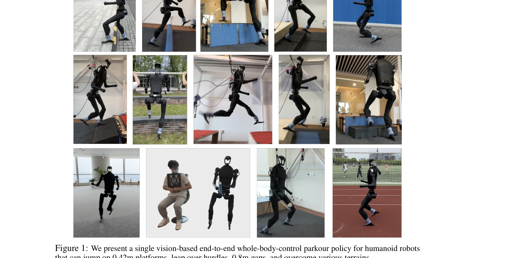
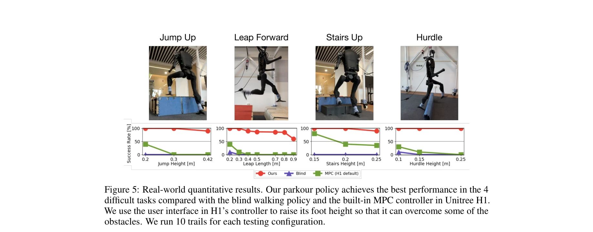
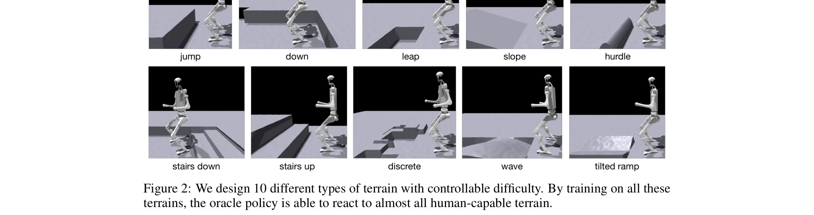

# Humanoid Parkour Learning

> **저자**: Ziwen Zhuang, Shenzhe Yao, Hang Zhao | **날짜**: 2024-06-15 | **URL**: [https://arxiv.org/abs/2406.10759](https://arxiv.org/abs/2406.10759)

---

## Essence

*Figure 1: We present a single vision-based end-to-end whole-body-control parkour policy for humanoid robots*

비전 기반 end-to-end 강화학습으로 인간형 로봇이 동작 데이터 없이 다양한 파쿠르 기술(점프, 간격 도약, 허들 넘기 등)을 수행할 수 있는 통합 정책을 학습한다.

## Motivation

- **Known**: 사족 로봇의 민첩한 보행은 학습 기반 방법으로 달성되었으나, 인간형 로봇 학습은 주로 평면 보행에 제한되고 동작 참조나 발 들기 장려 항(reward term)이 필요했다.
- **Gap**: 인간형 로봇이 단일 동작 참조 없이 다양한 파쿠르 기술을 통합적으로 학습하고, 현장에서 자율적으로 기술을 선택하며 실시간 온보드 처리로 배포할 수 있는 방법이 부재하다.
- **Why**: 파쿠르는 인간 수준의 민첩성을 요구하는 극도로 어려운 과제이며, 이를 해결하면 위험 지역 탐사 등 실무 응용으로 확대 가능하고 구현 엔지니어링 대신 학습 기반 접근의 가능성을 입증할 수 있다.
- **Approach**: 세 단계 학습 파이프라인: (1) Fractal noise를 이용한 평면 보행 정책 사전학습, (2) 10가지 terrain과 auto-curriculum으로 파쿠르 정책 학습(oracle policy), (3) DAgger로 비전 기반 정책 증류(distillation).

## Achievement

*Figure 5: Real-world quantitative results. Our parkour policy achieves the best performance in the 4*

- **다중 파쿠르 기술 통합**: 점프, 간격 도약(0.8m), 허들 넘기, 계단 등 10가지 이상의 인간 수준 지형을 단일 정책으로 처리
- **높은 성능 지표**: 0.42m 플랫폼 점프, 1.8m/s 야외 주행, 다양한 지형에서 견고한 보행
- **동작 참조 제거**: Motion prior 없이 학습하여 reward engineering 부담 감소
- **온보드 실시간 처리**: 정책이 온보드 계산, 센싱, 전원 지원만으로 배포 가능
- **Zero-shot sim-to-real**: 시뮬레이션에서 실제 로봇으로 추가 학습 없이 직접 전환
- **작업 전이 가능성**: Arm 액션 오버라이드로 인간형 이동 조작(mobile manipulation) 작업으로 확장 가능

## How

*Figure 2: We design 10 different types of terrain with controllable difficulty. By training on all these*

- Fractal noise 기반 지형 생성으로 자연스러운 발 들기 유도 (reward term 제거)
- 10가지 다양한 terrain 설계(Figure 2): 평면, 경사, 점프 대상, 간격, 허들 등 점진적 난이도 조정
- Scandot을 통한 terrain 정보 인코딩으로 depth 렌더링 계산 비용 절감
- Oracle policy: GRU + MLP 아키텍처로 scandot embedding, 추정 속도, proprioception 결합
- PPO 기반 강화학습으로 forward parkour 정책 학습
- DAgger로 oracle 정책을 Intel RealSense D435i depth 노이즈가 반영된 비전 기반 정책으로 증류
- Domain randomization 적용으로 sim-to-real 갭 완화
- Auto-curriculum mechanism으로 학습 진행률 자동 조정
- Virtual obstacle 추가로 위험 동작 억제

## Originality

- Motion prior 제거: 기존 인간형 보행은 참조 궤적이나 발 들기 reward 항이 필수였으나, Fractal noise만으로 다양한 기술 학습 가능함을 보임
- 통합 파쿠르 시스템: 별도 엔지니어링 없이 10가지 이상의 이질적 기술을 단일 정책으로 처리
- 비전 기반 증류 전략: Scandot oracle → RealSense depth 정책 증류로 계산 효율과 실용성 동시 달성
- 온보드 배포 최적화: 복잡한 비전 처리를 DAgger로 경량화하여 실시간 로봇 제어 가능

## Limitation & Further Study

- 평가가 주로 정성적(비디오) 결과에 의존하며, 정량적 성공률 지표가 제한적임
- Straight parkour track 가정으로 인한 제약: 복잡한 3D 환경이나 비선형 경로에 대한 적응 능력 미지수
- Terrain 다양성이 10가지로 제한되어, 예측 불가능한 실제 환경에서의 일반화 정도 불명확
- 실제 하드웨어 비용과 유지보수 난제로 인해 재현성과 광범위 검증 어려움
- 정책의 안정성과 실패 케이스에 대한 분석 부족
- 후속 연구: 3D 환경 네비게이션, 더 다양한 지형 포함, 강화된 정량적 평가 지표 개발, 비상 상황 회복 능력 강화

## Evaluation

- Novelty: 4/5
- Technical Soundness: 3/5
- Significance: 4/5
- Clarity: 4/5
- Overall: 4/5

**총평**: 인간형 로봇의 민첩한 다중-기술 파쿠르 학습을 동작 참조 없이 달성한 중요한 연구로, 실제 로봇 배포 성공과 높은 성능이 인상적이나, 정량적 평가와 극한 환경 일반화에 대한 논증이 보강되면 더욱 완성도 있을 것이다.

## Related Papers

- 🏛 기반 연구: [[papers/1457_HuB_Learning_Extreme_Humanoid_Balance/review]] — 파쿠르의 동적 기술들이 HuB의 극단적 균형 제어의 기반이 된다
- 🔗 후속 연구: [[papers/1477_Humanoid-Gym_Reinforcement_Learning_for_Humanoid_Robot_with/review]] — Humanoid-Gym의 기본 보행 학습을 파쿠르 기술로 확장했다
- 🔄 다른 접근: [[papers/1329_CityNavAgent_Aerial_Vision-and-Language_Navigation_with_Hier/review]] — 둘 다 동적 전신 움직임을 다루지만 Parkour는 파쿠르에, Deep Whole-body Parkour는 일반적 파쿠르에 집중한다
- 🔗 후속 연구: [[papers/1457_HuB_Learning_Extreme_Humanoid_Balance/review]] — Humanoid Parkour Learning의 동적 기술을 극단적 균형 제어로 확장했다
- 🏛 기반 연구: [[papers/1477_Humanoid-Gym_Reinforcement_Learning_for_Humanoid_Robot_with/review]] — 기본 보행 학습 프레임워크가 파쿠르 같은 고난도 기술의 기반이 된다
