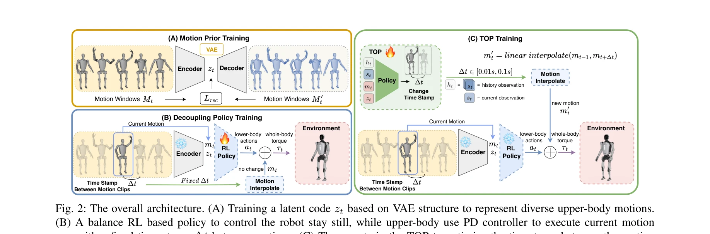
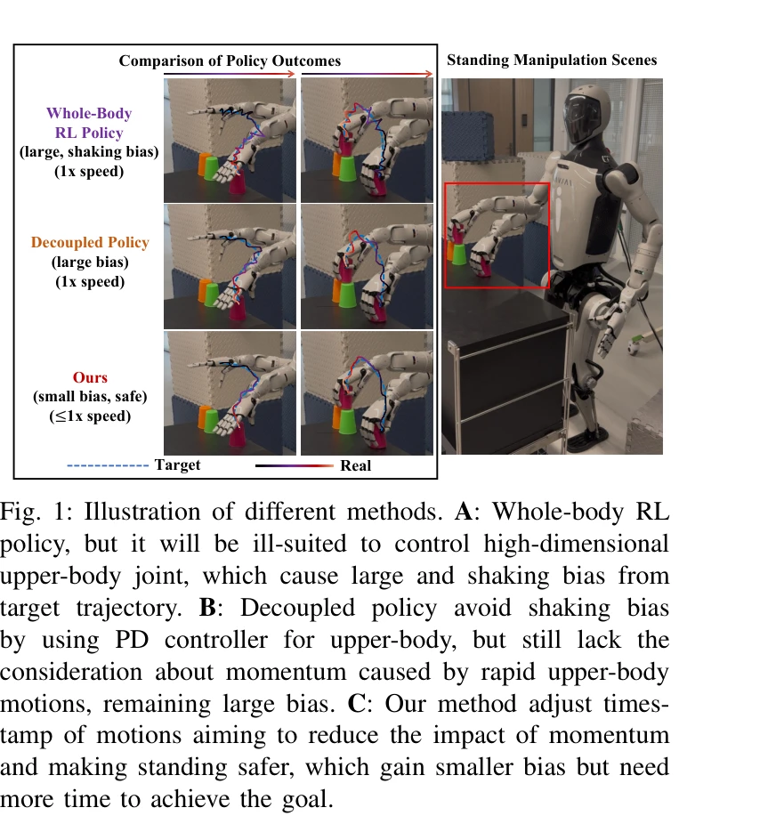

# Humanoid Policy ~ Human Policy

> **저자**: Ri-Zhao Qiu, Shiqi Yang, Xuxin Cheng, Chaitanya Chawla, Jialong Li, Tairan He, Ge Yan, David J. Yoon, Ryan Hoque, Lars Paulsen, Ge Yang, Jian Zhang, Sha Yi, Guanya Shi, Xiaolong Wang | **날짜**: 2025-03-17 | **URL**: [https://arxiv.org/abs/2503.13441](https://arxiv.org/abs/2503.13441)

---

## Essence

*Fig. 2: The overall architecture. (A) Training a latent code zt based on VAE structure to represent diverse upper-body m*

휴머노이드 로봇의 안정적이고 정확한 조작 작업을 위해 상체 움직임의 시간 궤적을 최적화하는 Time Optimization Policy (TOP)를 제안한다. VAE 기반 동작 표현, PD 제어기 기반 상체 제어, RL 기반 하체 제어를 결합하여 안정성, 정확성, 시간 효율성을 동시에 달성한다.

## Motivation

- **Known**: 휴머노이드 로봇의 전신 제어는 정밀성과 안정성 사이의 트레이드오프를 겪고 있으며, 기존 MPC 기반 방법이나 전신 RL은 각각 견고성 부족 또는 고차원 상체 관절 제어 정확성 부족 문제가 있다. 분리된 상체 PD 제어와 하체 RL 제어 방식이 제안되었으나 고속 상체 움직임으로 인한 모멘텀 영향을 충분히 고려하지 못한다.
- **Gap**: 기존 분리 제어 방식은 상체 움직임의 속도(타임스탬프)를 고정으로 처리하여 빠른 움직임의 모멘텀이 하체 안정성을 방해하는 문제를 해결하지 못한다. 움직임의 적절한 속도를 동적으로 결정하여 안정성, 정확성, 시간 효율성을 균형있게 최적화하는 방법이 부재하다.
- **Why**: 휴머노이드 로봇이 산업용 부품 조립, 가정용 서비스 등 다양한 실무 작업을 수행하기 위해서는 정밀한 조작과 안정적인 자세 유지가 필수적이며, 모멘텀으로 인한 낙상 위험을 최소화하면서도 작업 효율성을 유지해야 한다.
- **Approach**: 세 단계 프레임워크를 통해 상체 움직임의 시간 궤적을 최적화한다: (1) VAE를 통한 다양한 상체 동작의 구조적 표현 학습, (2) 상체는 PD 제어기로 정밀 제어하고 하체는 RL 정책으로 균형 유지, (3) TOP을 통한 동작 클립 간 타임스탬프 최적화로 모멘텀 영향 감소.

## Achievement

*Fig. 1: Illustration of different methods. A: Whole-body RL*

- **안정성과 정확성의 동시 달성**: 분리 제어 아키텍처와 TOP을 결합하여 고속 상체 움직임으로 인한 불안정성을 제거하면서 정밀한 궤적 추적 달성
- **시간 효율성 고려**: 단순히 느린 움직임으로 안정성을 확보하는 것이 아니라, 필요한 만큼만 속도를 조절하여 시간 효율성과 안정성의 균형 유지
- **실무 검증**: 시뮬레이션과 실제 휴머노이드 로봇을 이용한 다양한 조작 작업에서 우수한 성능과 일반화 능력 입증
- **새로운 학습 모듈**: TOP이라는 supervised reinforcement learning 모듈을 통해 동작 타임스탬프를 자동으로 최적화하는 신규 방법 제시

## How

*Fig. 2: The overall architecture. (A) Training a latent code zt based on VAE structure to represent diverse upper-body m*

- VAE를 활용하여 고차원 상체 움직임을 저차원 잠재 코드로 인코딩하고 다양한 동작의 공간-시간적 특징 학습
- 상체는 VAE 기반 동작 클립을 PD 제어기로 정확히 추적하고, 하체는 RL 정책으로 외부 교란에 대한 강건한 균형 유지
- TOP 정책이 현재 동작 윈도우의 타임스탬프를 동적으로 조정하여 다음 동작으로의 전환 속도 최적화 (선형 보간을 통해 new motion m'_t 계산)", 'Supervised reinforcement learning을 통해 TOP이 안정성(낙상 방지), 정확성(궤적 추적 오차), 시간 효율성(작업 완료 시간)의 세 가지 목표를 동시에 최적화하도록 학습

## Originality

- **동작 속도 최적화의 신규 관점**: 기존의 고정된 타임스탬프 기반 제어에서 벗어나 상체 동작의 시간 궤적을 동적으로 최적화하는 TOP 개념 도입
- **삼단계 계층적 프레임워크**: VAE 기반 동작 표현, 분리된 제어, 타임스탬프 최적화를 체계적으로 통합하는 구조 제시
- **모멘텀 중심의 문제 분석**: 기존 연구에서 간과된 고속 상체 움직임의 모멘텀이 하체 안정성에 미치는 영향을 명시적으로 인식하고 해결
- **Supervised RL을 통한 최적화**: 일반적인 RL이 아닌 지도 강화 학습을 통해 타임스탬프 최적화를 더 효율적으로 학습

## Limitation & Further Study

- **실험 규모**: 시뮬레이션과 실제 로봇 검증이 제시되었으나, 다양한 휴머노이드 플랫폼(다양한 DoF, 무게, 크기)에 대한 일반화 가능성이 충분히 입증되지 않음
- **동작 다양성**: VAE 학습에 사용된 상체 동작 데이터셋의 크기와 다양성에 대한 상세 정보 부족, 복잡한 전신 동작으로의 확장 가능성 불명확
- **비교 실험의 한계**: 단순 분리 제어와의 비교는 제시되나, 최신 MPC 기반 방법이나 다른 시간 최적화 기법과의 정량적 비교 부재
- **계산 복잡도**: TOP 정책의 실시간 추론 속도와 계산 비용에 대한 분석 부재, 온보드 컴퓨팅 환경에서의 적용 가능성 미평가
- **후속 연구**: 더 일반화된 동작 표현(diffusion model 등), 온라인 적응형 타임스탐프 최적화, 로봇 간 전이 학습(sim-to-real transfer) 개선

## Evaluation

- Novelty: 4/5
- Technical Soundness: 3/5
- Significance: 4/5
- Clarity: 4/5
- Overall: 4/5

**총평**: 이 논문은 휴머노이드 로봇의 조작 작업에서 간과되었던 상체 움직임의 모멘텀 문제를 명확히 인식하고, TOP을 통한 타임스탬프 최적화라는 창의적이고 실용적인 해결책을 제시한다. VAE 기반 동작 표현과 분리된 제어 구조와의 통합이 잘 설계되었으며, 시뮬레이션과 실제 로봇을 통한 검증도 수행되었다.

## Related Papers

- 🔄 다른 접근: [[papers/1451_HiWET_Hierarchical_World-Frame_End-Effector_Tracking_for_Lon/review]] — 두 논문 모두 상체 조작을 다루지만, Humanoid Policy는 시간 최적화에, HiWET는 world-frame tracking에 초점을 둔다.
- 🔗 후속 연구: [[papers/1453_Hold_My_Beer_Learning_Gentle_Humanoid_Locomotion_and_End-Eff/review]] — TOP의 상체 움직임 최적화는 SoFTA의 상하체 분리 제어와 결합하여 더욱 정교한 조작을 달성할 수 있다.
- 🏛 기반 연구: [[papers/1390_Expressive_Whole-Body_Control_for_Humanoid_Robots/review]] — Humanoid Policy의 VAE 기반 동작 표현은 expressive whole-body control의 기반 기술이 된다.
- 🔄 다른 접근: [[papers/1451_HiWET_Hierarchical_World-Frame_End-Effector_Tracking_for_Lon/review]] — 두 논문 모두 상체 조작을 다루지만, HiWET는 world-frame tracking에, Humanoid Policy는 시간 궤적 최적화에 초점을 둔다.
- 🔄 다른 접근: [[papers/1504_JAEGER_Dual-Level_Humanoid_Whole-Body_Controller/review]] — 두 논문 모두 상하체 분리 제어를 다루지만, JAEGER는 dual-level에, Humanoid Policy는 시간 최적화에 초점을 둔다.
