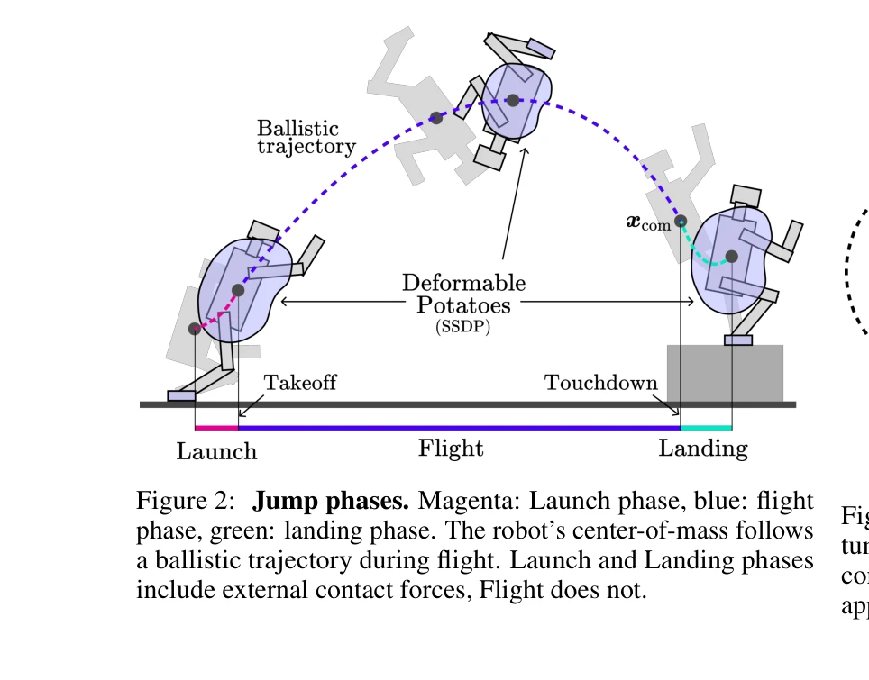
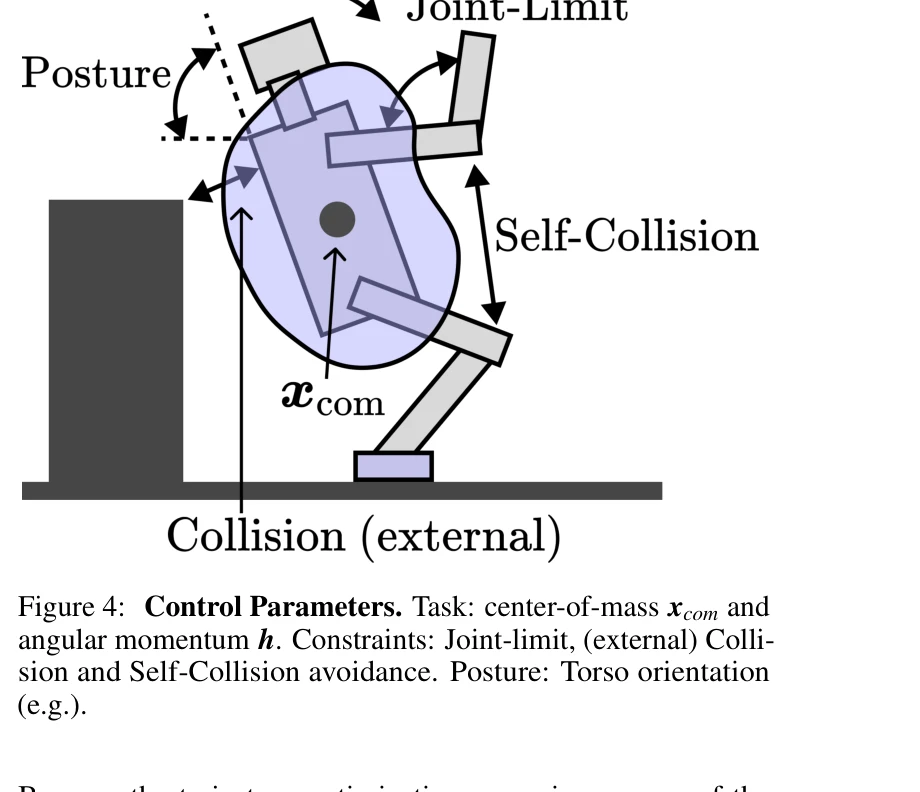

# Humanoid Robot Acrobatics Utilizing Complete Articulated Rigid Body Dynamics

> **저자**: Gerald Brantner | **날짜**: 2025-07-17 | **URL**: [https://arxiv.org/abs/2508.08258](https://arxiv.org/abs/2508.08258)

---

## Essence

*Figure 2: Jump phases. Magenta: Launch phase, blue: flight*

인문형 로봇이 완전한 강체역학 방정식을 활용하여 곡예 동작을 수행할 수 있도록 하는 제어 아키텍처를 제시한다. 궤적 최적화와 전신 제어를 매칭 모델 추상화로 중개하여 근사 없이 동역학을 고려한 제어를 실현한다.

## Motivation

- **Known**: 인문형 로봇의 보행에 관해서는 ZMP 방법과 SLIP 모델 등 확립된 연구가 있으며, Boston Dynamics의 고도의 동적 제어 방법들이 존재한다. 최근에는 중심 각운동량 제어와 단순화된 중심 동역학 모델을 활용한 곡예 동작 연구가 진행되고 있다.
- **Gap**: 기존 연구들은 모델 선형화나 단순화에 의존하여 실제 로봇의 성능 저하를 초래하거나, 계산 복잡성으로 인해 완전한 동역학 방정식을 직접 활용하지 못하고 있다. 고자유도 인문형 로봇에서 근사 없이 정확한 동역학을 고려한 궤적 최적화와 제어의 통합이 부족하다.
- **Why**: 인문형 로봇이 인간 수준의 곡예 동작을 수행할 수 있다면 인간 환경에서의 배치 가능성이 크게 확대되며, 보행과 달리기 등 다양한 동적 운동의 일반화된 형태로 작용할 수 있기 때문이다.
- **Approach**: operational-space 기반 전신 제어기(OPWBC)와 중심 동역학을 기반으로 하는 계층적 제어 구조를 설계하고, 모델 추상화를 통해 완전한 동역학 방정식을 활용한 궤적 최적화를 가능하게 한다. 제약 조건, 자세 제어, 중심의질량 및 각운동량 제어를 통합하여 비행-착지 단계별 제어를 구현한다.

## Achievement

*Figure 3: Launch. Center-of-mass xcom and angular momen-*

- **완전 동역학 기반 제어**: 모델 근사나 선형화 없이 완전한 articulated rigid body 동역학을 활용한 궤적 최적화 및 제어 아키텍처 제시
- **계층적 제어 통합**: 제약(joint limits, 충돌 회피), 작업(center-of-mass, angular momentum), 자세 제어를 우선순위 기반으로 통합한 whole-body 제어 프레임워크 구현
- **다양한 곡예 동작 실현**: 도약, 회전 동작, 트위스팅 점프 등 여러 고도의 동적 운동을 시뮬레이션에서 성공적으로 수행
- **모델 추상화 메커니즘**: 궤적 최적화의 계산 복잡성을 관리하면서도 실제 동역학과의 일관성을 유지하는 매칭 모델 추상화 기법 개발

## How

*Figure 4: Control Parameters. Task: center-of-mass xcom and*

- Operational-space 기반 whole-body 제어를 통해 고자유도 시스템에서 task와 posture의 decoupled 제어 달성
- Centroidal momentum matrix (Hang)와 inertia tensor를 이용한 중심 동역학 기반의 trajectory optimization
- Dynamically-consistent 일반화 역행렬(generalized inverse)과 null-space projection을 활용한 제어 토크 분해
- Launch, flight, landing 단계별로 서로 다른 제어 전략 적용 (launch 및 flight 단계에서의 contact force와 자세 제어 조정)
- MuJoCo 시뮬레이션 환경에서 complete articulated rigid body model의 명시적 방정식을 기반으로 validation

## Originality

- 완전한 동역학 방정식을 활용한 궤적 최적화와 제어의 통합 프레임워크를 제시하여, 기존의 model simplification 패러다임에서 벗어남
- Inertia-shaping과 angular momentum subspace 제어를 포함한 다층적 제어 구조로 높은 자유도의 곡예 동작 가능하게 함
- Model abstraction을 통해 계산 복잡성과 정확성 간의 trade-off를 해결하는 새로운 접근

## Limitation & Further Study

- 시뮬레이션 결과만 제시되었으며, 실제 하드웨어에서의 검증이 부재함
- 계산 복잡성 분석 및 실시간 성능에 대한 정량적 평가가 부족함
- 모델 추상화의 구체적인 형태와 궤적 최적화 알고리즘의 세부 구현이 명확하게 기술되지 않음
- 제어 파라미터 튜닝 과정과 최적화 과정의 수렴성 보장에 대한 논의 부재
- **후속 연구**: 실제 로봇 플랫폼에서의 구현 및 검증, MPC 기반의 동적 재계획 메커니즘 개발, 모델 불확실성에 대한 강건성 분석

## Evaluation

- Novelty: 4/5
- Technical Soundness: 3/5
- Significance: 4/5
- Clarity: 3/5
- Overall: 4/5

**총평**: 본 논문은 완전한 강체역학 방정식을 활용한 인문형 로봇의 곡예 제어라는 야심찬 목표를 제시하고, operational-space 제어와 중심 동역학을 통합한 체계적인 아키텍처를 제안한다. 시뮬레이션 결과는 접근법의 타당성을 보여주지만, 실제 하드웨어 검증과 상세한 구현 기술 공개가 후속되어야 실질적인 임팩트를 확보할 수 있을 것으로 판단된다.

## Related Papers

- 🔗 후속 연구: [[papers/1243_A_Hierarchical_Model-Based_System_for_High-Performance_Human/review]] — 완전한 강체역학 기반 곡예 제어가 ARTEMIS의 계층적 아키텍처에서 더 정밀한 동작 제어로 확장됩니다.
- 🏛 기반 연구: [[papers/1318_Control_of_Humanoid_Robots_with_Parallel_Mechanisms_using_Di/review]] — 병렬 메커니즘의 정확한 동역학 모델이 완전한 강체역학 방정식 활용의 기반을 제공합니다.
- 🔄 다른 접근: [[papers/1488_HUSKY_Humanoid_Skateboarding_System_via_Physics-Aware_Whole-/review]] — 곡예 동작과 스케이트보드 제어의 서로 다른 복잡한 전신 제어 문제 해결 접근법을 비교할 수 있습니다.
- 🏛 기반 연구: [[papers/1243_A_Hierarchical_Model-Based_System_for_High-Performance_Human/review]] — 계층적 소프트웨어 아키텍처가 곡예 동작을 위한 완전한 강체역학 제어 아키텍처의 기반이 됩니다.
- 🔗 후속 연구: [[papers/1318_Control_of_Humanoid_Robots_with_Parallel_Mechanisms_using_Di/review]] — 병렬 메커니즘 제어가 완전한 강체역학 방정식 기반 곡예 제어 아키텍처로 확장 적용됩니다.
- 🧪 응용 사례: [[papers/1619_VLA-RFT_Vision-Language-Action_Reinforcement_Fine-tuning_wit/review]] — Mastering Diverse Domains의 world model 기반 학습과 VLA-RFT의 효율적 fine-tuning을 결합한 범용 로봇 학습이 가능하다
- 🔄 다른 접근: [[papers/1488_HUSKY_Humanoid_Skateboarding_System_via_Physics-Aware_Whole-/review]] — physics-aware 전신 제어와 강체역학 기반 곡예 제어의 서로 다른 복잡한 동작 제어 접근법을 비교합니다.
