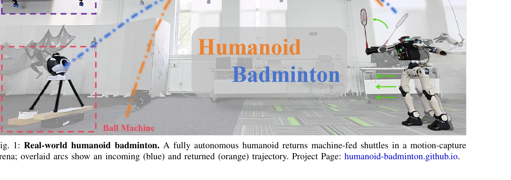
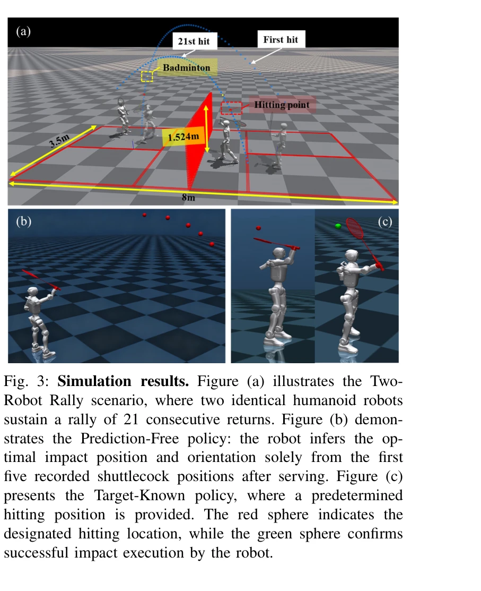
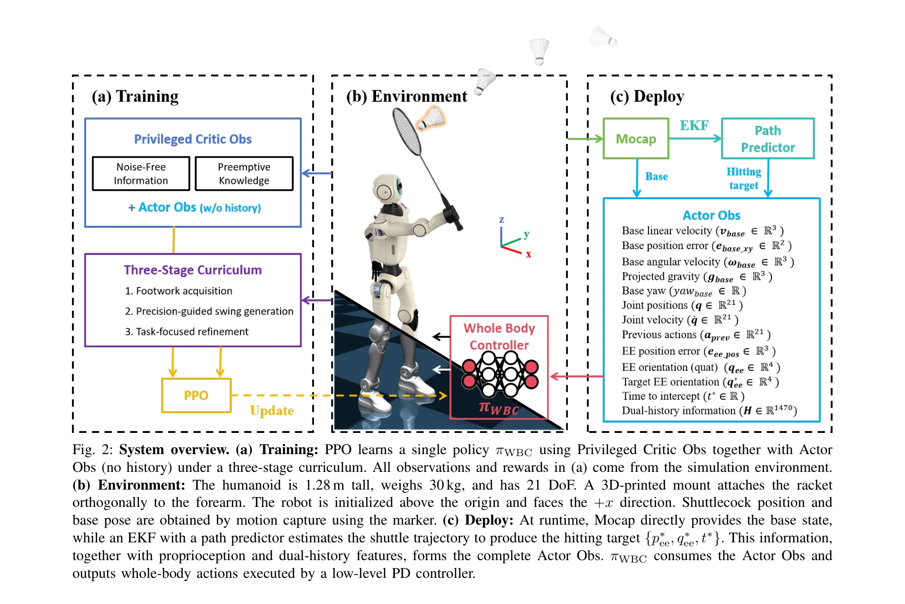

# Humanoid Whole-Body Badminton via Multi-Stage Reinforcement Learning

> **저자**: Chenhao Liu, Leyun Jiang, Yibo Wang, Kairan Yao, Jinchen Fu, Xiaoyu Ren | **날짜**: 2025-12-09 | **DOI**: [10.48550/arXiv.2511.11218](https://doi.org/10.48550/arXiv.2511.11218)

---

## Essence

*Fig. 1: Real-world humanoid badminton. A fully autonomous humanoid returns machine-fed shuttles in a motion-capture*

본 논문은 다단계 강화학습 커리큘럼을 통해 휴머노이드 로봇이 배드민턴을 플레이할 수 있도록 하는 통합 전신 제어기를 개발했으며, 시뮬레이션과 실제 환경에서 모두 검증했다.

## Motivation

- **Known**: 휴머노이드 로봇은 정적 장면과의 상호작용(보행, 조작)에서 강점을 보여왔으나, 탁구와 같은 동적 라켓 스포츠에서의 성공 사례는 제한적이었다.
- **Gap**: 기존 탁구 연구는 motion prior나 참조 동작에 의존했으며, 배드민턴의 큰 진폭 스윙으로 인한 전신 균형 유지와 발놀림-타격의 협응 학습이 부족했다.
- **Why**: 배드민턴은 0.6초 이내의 반응 시간, 3D 공간에서의 정밀한 라켓-셔틀 접촉, 그리고 다리와 팔의 협응된 임펄스 생성이 필요하므로, 동적 상호작용이 요구되는 실제 환경에서의 로봇 능력을 평가하는 좋은 벤치마크다.
- **Approach**: PPO 기반의 다단계 강화학습 파이프라인을 제시하되, 발놀림 습득 → 정밀 라켓 스윙 생성 → 작업 최적화 단계를 거쳐 전신 협응을 유도하고, 배포 시에는 EKF 기반 셔틀콕 궤적 예측기와 예측 없는 변형 모두를 제안한다.

## Achievement

*Fig. 3: Simulation results. Figure (a) illustrates the Two-*

- **최초의 실제 휴머노이드 배드민턴**: 21개 자유도 휴머노이드가 기계 서브 셔틀을 자율적으로 반환하며, 스윙 속도 약 5.3 m/s, 반사된 셔틀 속도 최대 19.1 m/s를 달성
- **시뮬레이션 랠리 성능**: 두 로봇이 21회 연속 타격을 유지
- **예측 없는 변형 검증**: 명시적 EKF 없이도 유사한 성능 달성
- **실제 환경 정확도**: 모션 캡처 기반 배포에서 높은 예측 및 제어 정확도 입증

## How

*Fig. 2: System overview. (a) Training: PPO learns a single policy πWBC using Privileged Critic Obs together with Actor*

- PPO를 사용한 다단계 강화학습 커리큘럼으로 footwork acquisition, precision-guided swing generation, task-focused refinement 실행
- Privileged Critic Observation(목표 정보 포함)과 Actor Observation(목표 없음)을 분리하여 가치 함수 학습과 정책 학습 최적화
- 약 20k 셔틀콕 궤적으로부터 무작위 추출된 hitting target(hit time, intercept position, racket orientation) 제공
- Extended Kalman Filter를 통한 실시간 셔틀콕 궤적 추정 및 예측
- 500 Hz PD 제어기와 50 Hz 정책 추론의 계층적 제어 구조
- 중간 정도의 domain randomization으로 시뮬레이션에서 학습 후 zero-shot 배포
- 예측 없는 변형: 5 프레임의 과거 셔틀 포즈만으로 hit timing과 target pose 추론

## Originality

- motion prior 또는 expert demonstration 없이 순수 강화학습으로 에너지 효율적인 스윙 발견
- 발놀림과 타격의 synergy를 명시적으로 촉진하는 다단계 커리큘럼 설계
- 탁구의 '가상 hit plane' 기반 2D 접근과 달리, 3D 공간 전체에서 orientation-aware contact 실현", '명시적 목표 base position 계산 없이 desired interception target만으로 전신 협응 달성
- end-to-end RL과 별도 학습 가능 예측기 없이 예측 제거 변형 제안

## Limitation & Further Study

- 현재 motion capture 기반 환경에서만 테스트되었으며, 기계 서브에만 적용됨 - 향후 로봇/인간 상대와의 랠리 필요
- 예측 없는 변형이 시뮬레이션 검증만 수행되었으므로 실제 환경 검증이 필요
- Domain randomization 강도와 커리큘럼 단계 전환 조건이 하이퍼파라미터 튜닝에 의존할 가능성
- 셔틀콕 시뮬레이션의 비행 모델(flip regime, drag 등)이 실제 물리와 완전히 일치하는지 불명확
- 온보드 비전 없이 외부 motion capture에 의존하므로 실제 경기장 배포의 확장성 제한

## Evaluation

- Novelty: 4/5
- Technical Soundness: 3/5
- Significance: 4/5
- Clarity: 4/5
- Overall: 4/5

**총평**: 본 논문은 다단계 강화학습 커리큘럼과 통합 전신 제어를 통해 휴머노이드 로봇의 동적 라켓 스포츠 능력을 처음으로 실제 환경에서 입증했으며, 복잡한 동작 상황에서의 로봇 제어 방법론으로서 높은 학술적 가치를 제공한다.

## Related Papers

- 🔄 다른 접근: [[papers/1450_HITTER_A_HumanoId_Table_TEnnis_Robot_via_Hierarchical_Planni/review]] — 두 논문 모두 라켓 스포츠를 다루지만, 배드민턴과 탁구라는 서로 다른 종목에 특화되어 있다.
- 🏛 기반 연구: [[papers/1447_HiFAR_Multi-Stage_Curriculum_Learning_for_High-Dynamics_Huma/review]] — 배드민턴의 multi-stage RL curriculum은 HiFAR의 curriculum learning 방법론에서 영감을 받는다.
- 🔗 후속 연구: [[papers/1525_Learning_Human-Like_Badminton_Skills_for_Humanoid_Robots/review]] — Human-like badminton skills의 학습 방법은 휴머노이드 배드민턴의 다단계 강화학습으로 구현된다.
- 🧪 응용 사례: [[papers/1593_TrackVLA_Unleashing_Reasoning_and_Memory_Capabilities_in_VLA/review]] — TrackVLA++의 visual tracking과 memory 기능이 MEM의 multi-scale embodied memory와 결합되어 장기 조작 작업에 효과적으로 활용 가능
- 🔄 다른 접근: [[papers/1450_HITTER_A_HumanoId_Table_TEnnis_Robot_via_Hierarchical_Planni/review]] — 두 논문 모두 휴머노이드의 라켓 스포츠를 다루지만, HITTER는 탁구에, 다른 논문은 배드민턴에 특화되어 있다.
