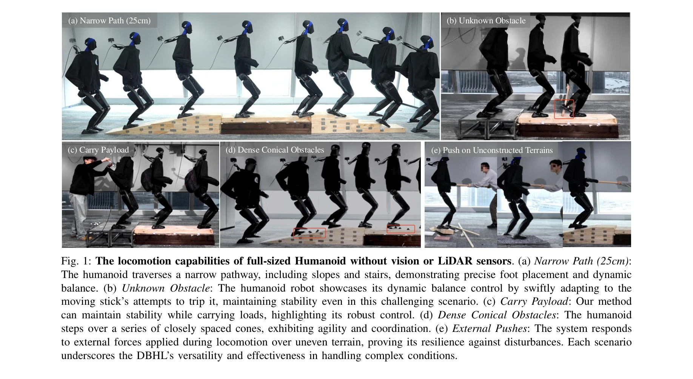
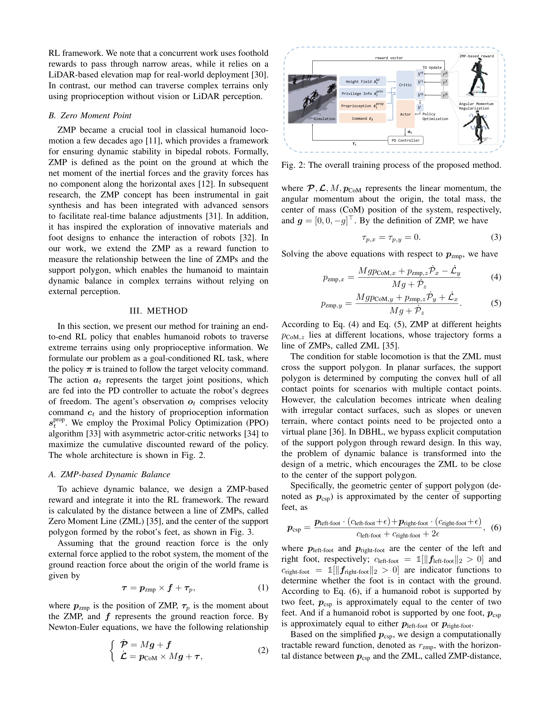

# Humanoid Whole-Body Locomotion on Narrow Terrain via Dynamic Balance and Reinforcement Learning

> **저자**: Weiji Xie, Chenjia Bai, Jiyuan Shi, Junkai Yang, Yunfei Ge, Weinan Zhang, Xuelong Li | **날짜**: 2025-02-24 | **URL**: [https://arxiv.org/abs/2502.17219](https://arxiv.org/abs/2502.17219)

---

## Essence

*Fig. 1: The locomotion capabilities of full-sized Humanoid without vision or LiDAR sensors. (a) Narrow Path (25cm):*

본 논문은 Zero Moment Point (ZMP) 기반 보상과 강화학습을 통합하여 휴머노이드 로봇이 시각이나 LiDAR 없이 고유감각만으로 좁은 지형과 예상치 못한 장애물을 통과할 수 있는 전신 보행 알고리즘을 제안한다.

## Motivation

- **Known**: 최근 강화학습 기반 휴머노이드 보행 방법들이 상당한 진전을 이루었으나, 주로 주기적 보행이나 모션 프리미티브에 의존하여 불안정 상황에서 빠르고 다양한 보행 조정 능력이 부족하다.
- **Gap**: 현존하는 방법들은 외부 지각에 의존하거나 관찰 불가능한 장애물 및 갑작스러운 균형 손실을 처리할 효과적인 메커니즘이 부족하며, 동적 균형 유지를 위한 직접적인 메커니즘이 없다.
- **Why**: 휴머노이드 로봇이 인간처럼 극단적인 지형과 조건에서 안정적으로 이동할 수 있게 하는 것은 실제 환경에서의 적응성과 견고성을 크게 향상시키는 데 중요하다.
- **Approach**: ZMP 개념을 RL 기반 보행 제어에 통합하여 ZMP와 지지 다각형 간의 관계를 측정하는 보상 함수를 설계하고, 비대칭 actor-critic 프레임워크와 함께 전신 제어 정책을 학습한다.

## Achievement

*Fig. 1: The locomotion capabilities of full-sized Humanoid without vision or LiDAR sensors. (a) Narrow Path (25cm):*

- **ZMP 기반 보상 함수 설계**: ZMP를 비평면 표면으로 확장하고 이를 RL 보상 함수로 통합하여 동적 균형 유지 능력을 향상시킴
- **전신 제어 프레임워크**: 각운동량 정규화(angular momentum regularization), 승법적 행동 노이즈(multiplicative action noise), 보상 벡터화(reward vectorization) 등 새로운 기법 도입
- **실제 로봇 검증**: Unitree H1-2 전신 휴머노이드 로봇에서 좁은 지형, 외부 방해, 계단 등 다양한 극단적 시나리오에서 성공적인 보행 능력 입증
- **고유감각만 사용**: 시각이나 LiDAR 없이 고유감각 정보만으로 복잡한 지형 통과 가능함을 실증

## How

*Fig. 2: The overall training process of the proposed method.*

- PPO 알고리즘에 비대칭 actor-critic 프레임워크 적용하여 시뮬레이션에서는 특권화된 정보(ZMP)로 보상 계산, 정책은 고유감각으로만 학습
- ZMP를 좁은 지형에서 동작하도록 확장하여 ZMP 좌표가 지지 다각형 중심에 가깝도록 하는 보상 함수 설계
- 상체 흔들림을 활용한 동적 균형 보조, 각운동량 정규화로 원하지 않는 몸체 회전 억제
- 여러 보상 항(ZMP 기반, 명령 추적, 정규화)을 각각의 가치 함수와 연결하는 보상 벡터화 기법으로 부정확한 가치 추정 방지
- 다양한 시뮬레이션 지형(좁은 경로, 계단, 비탈길 등)에서 광범위한 학습

## Originality

- 고전적 ZMP 개념을 현대 RL 프레임워크에 혁신적으로 통합하여 동적 균형을 명시적으로 모델링
- 비대칭 actor-critic을 통해 시뮬레이션 특권화 정보와 실제 고유감각 기반 제어의 간극을 해결하는 새로운 접근
- 전신 제어에서 상체 동역학을 동적 균형의 필수 요소로 명시적으로 포함
- 보상 벡터화 기법으로 여러 보상 항의 가치 추정 문제 해결

## Limitation & Further Study

- 시뮬레이션-현실 간 sim-to-real 전이 메커니즘에 대한 상세한 분석이 부족함
- 지형 종류 확대(예: 미끄러운 표면, 극도로 불규칙한 지형)에 대한 일반화 능력 미검증
- 고유감각 노이즈나 센서 오류에 대한 강건성 분석 필요
- 다른 휴머노이드 로봇 플랫폼으로의 적용 가능성 미평가
- 후속연구로 시각 정보 통합, 더 고차원적인 지형 예측, 학습 샘플 효율성 개선 필요

## Evaluation

- Novelty: 4/5
- Technical Soundness: 3/5
- Significance: 4/5
- Clarity: 4/5
- Overall: 4/5

**총평**: 본 논문은 고전적인 ZMP 개념을 강화학습에 창의적으로 통합하여 휴머노이드 로봇의 동적 균형 능력을 획기적으로 향상시켰으며, 실제 전신 로봇에서 극단적 환경에서의 우수한 성능을 실증했다. 고유감각만 사용하여 외부 센서 없이 복잡한 지형 통과가 가능한 점이 특히 중요한 기여이다.

## Related Papers

- 🔄 다른 접근: [[papers/1489_HWC-Loco_A_Hierarchical_Whole-Body_Control_Approach_to_Robus/review]] — 두 논문 모두 ZMP 기반 제어를 사용하지만, 하나는 좁은 지형 보행에, 다른 하나는 일반적인 robust locomotion에 특화되어 있다.
- 🏛 기반 연구: [[papers/1449_Learned_Perceptive_Forward_Dynamics_Model_for_Safe_and_Platf/review]] — 좁은 지형에서의 dynamic balance는 복잡한 야외 지형 탐색의 핵심 기반 기술이다.
- 🔗 후속 연구: [[papers/1424_Geometry-Aware_Predictive_Safety_Filters_on_Humanoids_From_P/review]] — ZMP 기반 보상을 통한 좁은 지형 보행은 geometry-aware predictive safety filters로 확장하여 안전성을 향상시킬 수 있다.
- 🏛 기반 연구: [[papers/1277_BeamDojo_Learning_Agile_Humanoid_Locomotion_on_Sparse_Footho/review]] — 좁은 지형에서의 동적 균형과 발판 계획의 기본 원리를 제공한다
- 🧪 응용 사례: [[papers/1633_X-VLA_Soft-Prompted_Transformer_as_Scalable_Cross-Embodiment/review]] — MetaMorph의 universal controller와 X-VLA의 scalable cross-embodiment를 결합한 범용 로봇 제어가 가능하다
- 🏛 기반 연구: [[papers/1541_Learning_to_Get_Up_Across_Morphologies_Zero-Shot_Recovery_wi/review]] — 7개 형태에서 낙상 복구하는 통합 정책의 기반이 되는 메타 학습 접근법이 MetaMorph의 범용 컨트롤러 학습과 일치한다.
- 🔄 다른 접근: [[papers/1489_HWC-Loco_A_Hierarchical_Whole-Body_Control_Approach_to_Robus/review]] — 두 논문 모두 안전한 보행을 다루지만, HWC-Loco는 일반적인 robust control에, 다른 논문은 좁은 지형에 특화되어 있다.
- 🔗 후속 연구: [[papers/1363_Diffusion_Transformer_Policy/review]] — Universal controller를 위한 transformer 기반 MetaMorph가 diffusion transformer policy의 일반화 능력을 확장한다.
- 🔄 다른 접근: [[papers/1404_From_Experts_to_a_Generalist_Toward_General_Whole-Body_Contr/review]] — MetaMorph의 universal transformer controller가 BumbleBee의 expert-generalist framework와 다른 방식으로 일반화를 달성한다.
