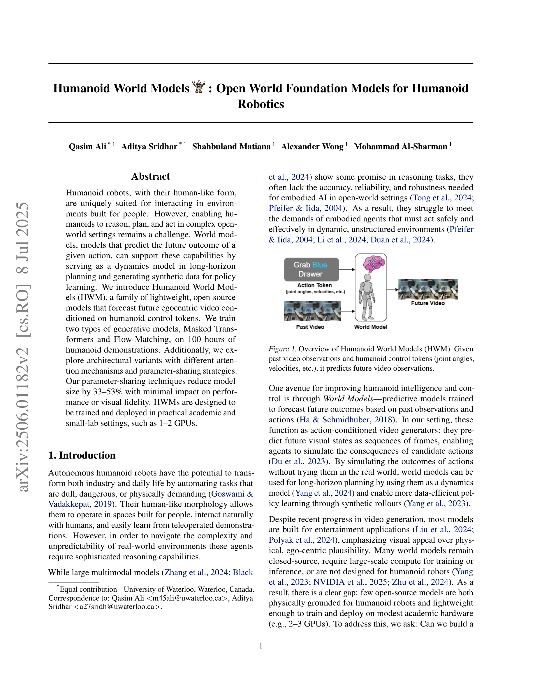
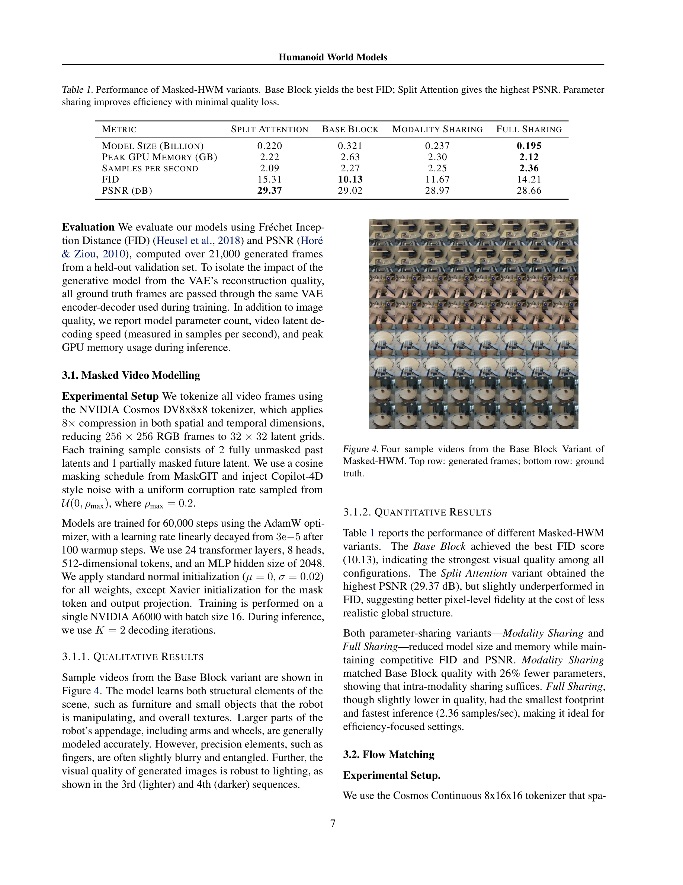
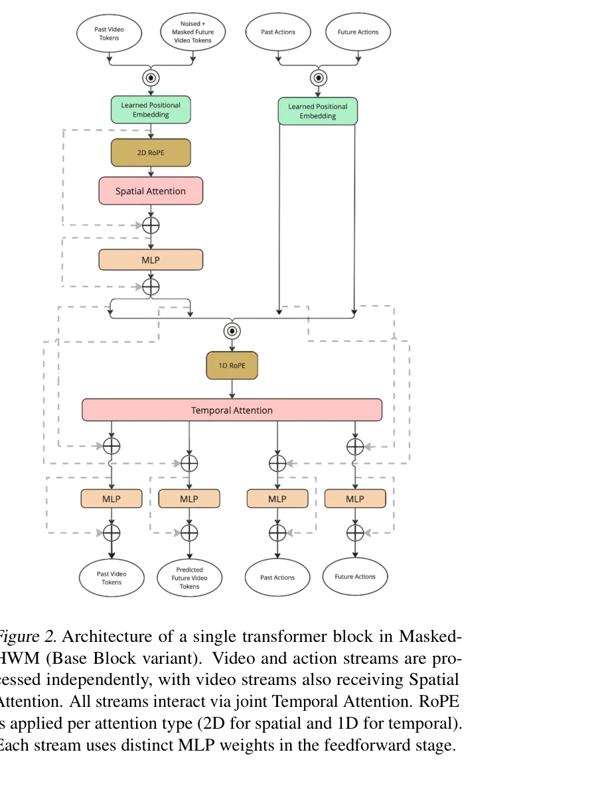

# Humanoid World Models: Open World Foundation Models for Humanoid Robotics

> **저자**: Muhammad Qasim Ali, Aditya Sridhar, Shahbuland Matiana, Alex Wong, Mohammad Al-Sharman | **날짜**: 2025-06-01 | **URL**: [https://arxiv.org/abs/2506.01182](https://arxiv.org/abs/2506.01182)

---

## Essence

*Figure 1. Overview of Humanoid World Models (HWM). Given*

Humanoid World Models (HWM)는 100시간의 휴머노이드 데모 데이터로 학습된 경량 오픈소스 세계 모델 계열로, Masked Transformer와 Flow-Matching 기반 구조를 탐색하며 2-3개 GPU에서 학습 및 배포 가능하도록 설계되었다.

## Motivation

- **Known**: World models은 행동의 미래 결과를 예측하는 동적 모델로서 장기 계획과 정책 학습에 유용하며, 최근 비디오 생성 기술이 발전했으나 대부분 엔터테인먼트 용도이거나 휴머노이드 로봇에 특화되지 않았다.
- **Gap**: 기존의 물리적으로 타당한 휴머노이드 특화 world model 중 오픈소스이면서 소규모 학술 환경(1-2 GPU)에서 학습 및 배포 가능한 경량 모델이 부족하다.
- **Why**: 휴머노이드 로봇이 인간중심 환경에서 복잡한 개방형 세계에서 추론, 계획, 행동하기 위해 신뢰성 높은 내부 시뮬레이터가 필요하며, 접근성 높은 세계 모델은 로봇 연구의 민주화를 가능케 한다.
- **Approach**: Masked Transformer와 Flow-Matching 두 가지 생성 모델 패러다임을 비교하며, joint/cross-attention 메커니즘과 공유/분리 파라미터 전략을 포함한 4가지 아키텍처 변형을 탐색한다.

## Achievement

*Figure 4. Four sample videos from the Base Block Variant of*

- **Masked Transformer 우수성**: 같은 데이터셋과 컴퓨팅 제약 하에서 Masked Transformer가 Flow-Matching 모델을 일관되게 초과 성능했다
- **효율적 파라미터 공유**: 파라미터 공유 전략으로 모델 크기를 33-53% 감소시키면서도 성능과 시각적 충실도에 최소한의 영향만 미쳤다
- **아키텍처 통찰**: Masked Transformer에서는 joint attention이, Flow-Matching에서는 split attention이 최고 성능을 달성했다
- **실용적 경량성**: 100시간의 휴머노이드 데모로 학습된 오픈소스 모델로 1-2 GPU 환경에서 배포 가능하도록 설계되었다

## How

*Figure 2. Architecture of a single transformer block in Masked-*

- VQ-VAE 기반 토큰화를 통해 비디오를 양자화된 잠재 공간에서 작업한다
- Masked Transformer: 비자동회귀 토큰 예측으로 공간-시간 양방향 문맥을 활용하고 병렬 디코딩을 가능케 한다
- Flow-Matching: diffusion의 대안으로 더 간단한 학습과 빠른 샘플링을 제공한다
- Joint vs. cross-attention 메커니즘과 공유 vs. 분리 파라미터 전략을 포함한 4가지 아키텍처 변형을 비교 평가한다
- 과거 비디오 관찰과 휴머노이드 제어 토큰(관절 각도, 속도 등)을 조건으로 미래 이고중심(egocentric) 비디오를 예측한다

## Originality

- 휴머노이드 로봇에 특화된 물리적으로 타당한 세계 모델로서 기존 엔터테인먼트 중심 비디오 생성 모델과 차별화된다
- Masked Transformer와 Flow-Matching 두 패러다임의 직접 비교를 통해 휴머노이드 작업에서의 효과성을 체계적으로 분석한다
- 경량성을 위한 파라미터 공유 전략을 통해 33-53% 크기 감소를 달성하면서도 성능 손실을 최소화한다
- 소규모 학술 환경 배포를 목표로 설계한 최초의 오픈소스 휴머노이드 특화 world model이다

## Limitation & Further Study

- Flow-Matching 모델이 Masked Transformer보다 일관되게 낮은 성능을 보이는 이유에 대한 깊이 있는 분석이 필요하다
- 100시간의 데이터셋이 제한적일 수 있으며, 더 큰 규모 데이터에서의 확장성 검증이 필요하다
- 실제 로봇 플랫폼에서의 실증적 평가(planning, policy learning)가 제시되지 않아 실제 효용성 검증이 부족하다
- 아키텍처 선택(attention 메커니즘, 파라미터 공유)이 데이터셋 및 컴퓨팅 제약에 의존하므로 일반화 가능성이 불명확하다
- 후속 연구로 더 큰 데이터셋, 다양한 휴머노이드 플랫폼, 실제 계획 및 정책 학습 애플리케이션 통합이 필요하다

## Evaluation

- Novelty: 4/5
- Technical Soundness: 3/5
- Significance: 4/5
- Clarity: 4/5
- Overall: 4/5

**총평**: 본 논문은 휴머노이드 로봇을 위한 실용적이고 접근성 높은 경량 세계 모델을 제시하며, 아키텍처 설계와 효율성 최적화에 대한 체계적 분석을 제공한다. 다만 실제 로봇 애플리케이션에서의 검증과 더 큰 규모의 평가가 추가되면 영향력이 더욱 강화될 것이다.

## Related Papers

- 🔗 후속 연구: [[papers/1308_CLoSD_Closing_the_Loop_between_Simulation_and_Diffusion_for/review]] — Humanoid World Models는 LEO의 3D 구체화 개념을 인간형 로봇을 위한 범용 제어기로 확장한다
- 🔗 후속 연구: [[papers/1513_Parallels_Between_VLA_Model_Post-Training_and_Human_Motor_Le/review]] — Humanoid World Model과 VLA 모델 post-training이 인간과 유사한 학습 과정의 확장된 이해를 제시한다.
- 🔗 후속 연구: [[papers/1526_Real-World_Humanoid_Locomotion_with_Reinforcement_Learning/review]] — 휴머노이드 월드 모델의 개념을 실제 환경에서의 제로샷 배포가 가능한 구체적인 locomotion 정책으로 구현한 형태임
- 🧪 응용 사례: [[papers/1572_Sim-to-Real_Reinforcement_Learning_for_Vision-Based_Dexterou/review]] — 인간 비디오 기반 ICL 조작 학습이 MimicPlay의 장기 모방학습 관찰 프레임워크에서 실제 적용될 수 있다.
- 🧪 응용 사례: [[papers/1591_Towards_Diverse_Behaviors_A_Benchmark_for_Imitation_Learning/review]] — 대규모 human video 데이터의 다양성을 imitation learning 알고리즘이 학습할 수 있는 벤치마크 환경으로 구현한다.
- 🔗 후속 연구: [[papers/1634_ZeroMimic_Distilling_Robotic_Manipulation_Skills_from_Web_Vi/review]] — Humanoid World Models가 ZeroMimic의 skill distillation을 world model 관점에서 확장한 포괄적 접근
- 🔗 후속 연구: [[papers/1608_Vision-Language-Action_VLA_Models_Concepts_Progress_Applicat/review]] — Humanoid World Models가 VLA 모델의 실제 적용에서 world modeling 측면을 강화한 발전 형태
- 🔗 후속 연구: [[papers/1422_GENMO_A_GENeralist_Model_for_Human_MOtion/review]] — human motion modeling을 world model로 확장한 포괄적 접근이다
- 🔄 다른 접근: [[papers/1428_GraspDreamer_생성형_인간_시연_기반_기능적_파지_모방_학습/review]] — MimicPlay도 인간 시연 영상을 통한 장기 모방 학습을 다룬다.
