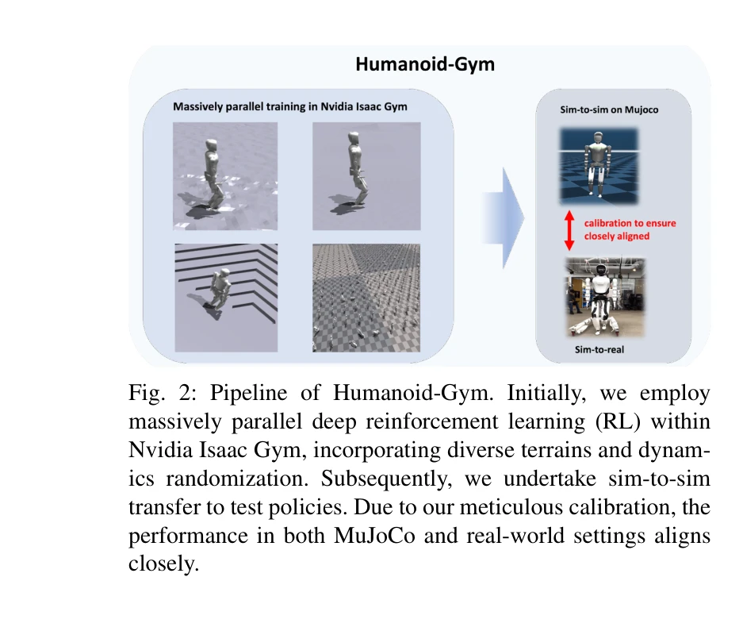
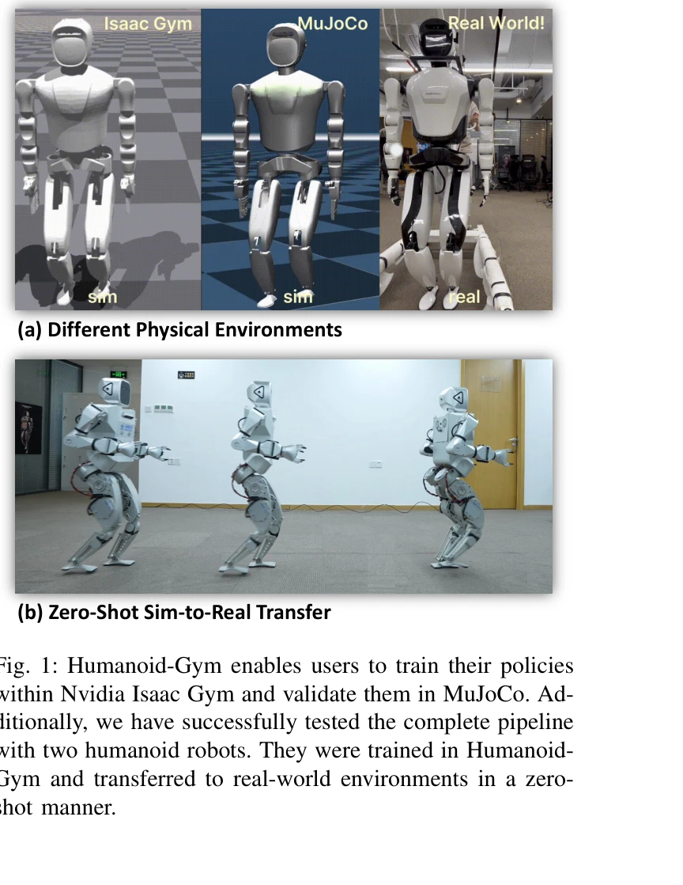

# Humanoid-Gym: Reinforcement Learning for Humanoid Robot with Zero-Shot Sim2Real Transfer

> **저자**: Xinyang Gu, Yen-Jen Wang, Jianyu Chen | **날짜**: 2024-04-08 | **URL**: [https://arxiv.org/abs/2404.05695](https://arxiv.org/abs/2404.05695)

---

## Essence

*Fig. 2: Pipeline of Humanoid-Gym. Initially, we employ*

Humanoid-Gym은 Nvidia Isaac Gym 기반의 강화학습 프레임워크로, 인간형 로봇의 보행 기술을 학습하고 제로샷 시뮬레이션-현실 전이를 달성하도록 설계되었다. 이 프레임워크는 Isaac Gym에서 MuJoCo로의 시뮬레이션-시뮬레이션 검증 도구를 통합하여 정책의 견고성과 일반화를 보장한다.

## Motivation

- **Known**: 강화학습은 사족 로봇과 Cassie 같은 이족 로봇의 보행 제어에 성공했으나, 인간형 로봇의 경우 더 복잡한 구조로 인해 시뮬레이션-현실 간격(sim-to-real gap)이 크다.
- **Gap**: 인간형 로봇의 제로샷 시뮬레이션-현실 전이에 대한 공개 소스 프레임워크 및 방법론이 부족하여, 실제 로봇에 적용 가능한 접근법의 개발이 필요하다.
- **Why**: 인간형 로봇은 인간 중심의 환경에 최적화되어 있어 기술 개발이 중요하며, 제로샷 전이 달성은 현실 로봇 학습의 효율성과 실용성을 크게 향상시킨다.
- **Approach**: Asymmetric Actor Critic 방법과 PPO 알고리즘을 활용하여 훈련 시 특권 정보를 사용하고, 정밀한 도메인 랜덤화와 보상 설계를 통해 시뮬레이션-현실 간격을 최소화한다.

## Achievement

*Fig. 1: Humanoid-Gym enables users to train their policies*

- **오픈소스 RL 프레임워크**: 체계적인 시스템 설계와 함께 Humanoid-Gym을 공개하여 인간형 로봇 학습을 위한 접근 가능한 도구를 제공한다.
- **제로샷 시뮬레이션-현실 전이**: XBot-S(1.2m)와 XBot-L(1.65m) 두 가지 크기의 인간형 로봇에서 훈련된 정책을 실시간 조정 없이 현실 환경에 성공적으로 적용한다.
- **시뮬레이션-시뮬레이션 검증 도구**: Isaac Gym에서 MuJoCo로의 전이를 통해 정책을 다양한 물리 역학 환경에서 검증하여 견고성을 보장한다.

## How

*Fig. 2: Pipeline of Humanoid-Gym. Initially, we employ*

- PPO 알고리즘에 Asymmetric Actor Critic 방법을 적용하여 훈련 중 특권 정보(마찰, 체질량, 푸시 힘 등) 활용
- 주기적 접촉 마스크(periodic stance mask)와 정현파 참조 모션을 통해 이중 지지 및 단일 지지 상 동작 설계
- 도메인 랜덤화를 통해 마찰 계수, 체질량, 지형 변동성 등을 변화시켜 시뮬레이션-현실 간격 최소화
- 100Hz 제어 주파수와 1000Hz 내부 PD 컨트롤러를 통한 고해상도 정밀 제어
- 속도 추적, 보행 안정성, 접촉 부드러움을 포함하는 4가지 성분의 복합 보상 함수 설계
- MuJoCo 환경의 세밀한 칼리브레이션을 통해 현실과 시뮬레이션 동역학 일치

## Originality

- 인간형 로봇의 제로샷 시뮬레이션-현실 전이를 실제 하드웨어(XBot-S, XBot-L)에서 검증한 최초의 공개 프레임워크
- Isaac Gym과 MuJoCo 간 시뮬레이션-시뮬레이션 검증 파이프라인을 통합하여 정책 견고성을 사전에 평가할 수 있는 혁신적 접근
- 부분 관찰 가능성(POMDP) 환경에서 훈련 중 특권 정보를 활용한 Asymmetric Actor Critic 방식 적용
- 주기적 접촉 마스크와 정현파 참조 모션을 결합한 인간형 로봇 특화 보상 설계

## Limitation & Further Study

- 평탄한 지형과 불규칙한 지형 외 복잡한 환경(계단, 장애물 회피 등)에 대한 평가 부족
- XBot-S, XBot-L 두 모델만 검증되어 더 다양한 크기와 형태의 인간형 로봇 적용 필요
- 상체 제어 및 손 조작과 같은 고급 기술 통합 미흡
- 대규모 병렬 처리 훈련 비용 및 계산 리소스에 대한 상세 분석 부재
- 후속 연구: 다양한 환경 조건과 로봇 형태에 대한 확장, 상체 기술 통합, 실시간 적응 제어 개발

## Evaluation

- Novelty: 4/5
- Technical Soundness: 3/5
- Significance: 4/5
- Clarity: 4/5
- Overall: 4/5

**총평**: Humanoid-Gym은 인간형 로봇의 제로샷 시뮬레이션-현실 전이를 달성한 실용적이고 공개 가능한 프레임워크로, 체계적인 시스템 설계와 세밀한 칼리브레이션을 통해 로봇 학습 분야에 중요한 기여를 한다. 다만 다양한 환경과 상체 기술에 대한 확장이 필요하다.

## Related Papers

- 🏛 기반 연구: [[papers/1470_Humanoid_Parkour_Learning/review]] — 기본 보행 학습 프레임워크가 파쿠르 같은 고난도 기술의 기반이 된다
- 🔗 후속 연구: [[papers/1478_HumanoidBench_Simulated_Humanoid_Benchmark_for_Whole-Body_Lo/review]] — Humanoid-Gym의 기본 프레임워크를 HumanoidBench가 벤치마크로 확장했다
- 🔄 다른 접근: [[papers/1534_Learning_Sim-to-Real_Humanoid_Locomotion_in_15_Minutes/review]] — 둘 다 sim-to-real 휴머노이드 학습을 다루지만 Humanoid-Gym은 범용 프레임워크에, 15분 학습은 빠른 적응에 집중한다
- 🧪 응용 사례: [[papers/1375_Embodiment-Aware_Generalist_Specialist_Distillation_for_Unif/review]] — EAGLE의 embodiment-aware 방법을 Humanoid-Gym 환경의 다양한 휴머노이드 모델에 적용하여 통합 제어가 가능하다.
- 🧪 응용 사례: [[papers/1442_JARVIS-1_Open-World_Multi-task_Agents_with_Memory-Augmented/review]] — MineDojo 환경에서 개발된 에이전트가 JARVIS-1의 멀티태스크 학습 방법론을 실제 적용하는 사례가 됩니다.
- 🧪 응용 사례: [[papers/1478_MineDreamer_Learning_to_Follow_Instructions_via_Chain-of-Ima/review]] — MineDojo 환경에서 개발된 학습 방법론이 상상 기반 지시 따르기 에이전트의 훈련에 활용됩니다.
- 🏛 기반 연구: [[papers/1482_MP5_A_Multi-modal_Open-ended_Embodied_System_in_Minecraft_vi/review]] — MineDojo의 개방형 에이전트 학습 환경이 멀티모달 체화 시스템의 기반 플랫폼을 제공합니다.
- 🧪 응용 사례: [[papers/1563_Scaling_Instructable_Agents_Across_Many_Simulated_Worlds/review]] — MineDojo의 internet-scale embodied agents가 SIMA의 다양한 3D 환경 학습을 마인크래프트 환경에서 구체적으로 구현한다.
- 🔗 후속 연구: [[papers/1470_Humanoid_Parkour_Learning/review]] — Humanoid-Gym의 기본 보행 학습을 파쿠르 기술로 확장했다
- 🏛 기반 연구: [[papers/1478_HumanoidBench_Simulated_Humanoid_Benchmark_for_Whole-Body_Lo/review]] — Humanoid-Gym의 기본 프레임워크를 벤치마크로 확장하여 평가 기준을 제시한다
- 🔄 다른 접근: [[papers/1550_Learning_with_pyCub_A_Simulation_and_Exercise_Framework_for/review]] — iCub용 Python 시뮬레이터 pyCub과 휴머노이드 강화학습용 Humanoid-Gym이 모두 교육 및 연구용 시뮬레이션 환경을 제공한다.
