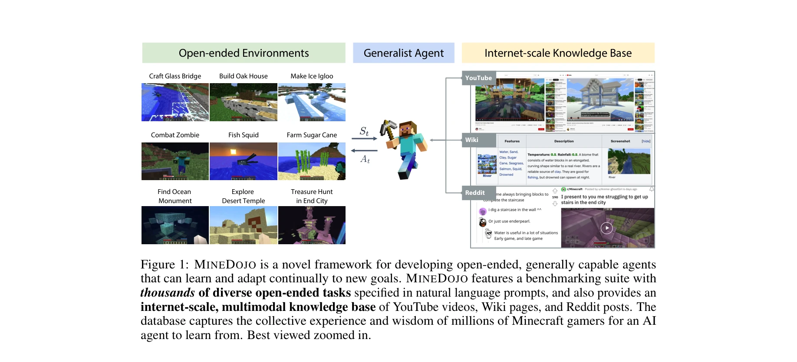
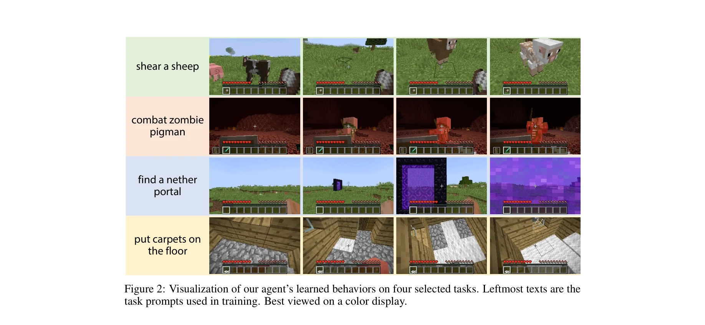
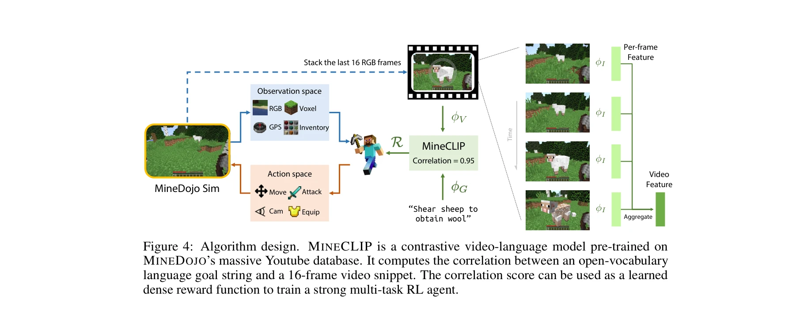

# MineDojo: Building Open-Ended Embodied Agents with Internet-Scale Knowledge

> **저자**: Linxi Fan, Guanzhi Wang, Yunfan Jiang, Ajay Mandlekar, Yuncong Yang, Haoyi Zhu, Andrew Tang, De-An Huang, Yuke Zhu, Anima Anandkumar | **날짜**: 2022-06-17 | **URL**: [https://arxiv.org/abs/2206.08853](https://arxiv.org/abs/2206.08853)

---

## Essence

*Figure 1: MINEDOJO is a novel framework for developing open-ended, generally capable agents*

MineDojo는 Minecraft 게임을 기반으로 수천 개의 개방형 작업, 인터넷 규모의 멀티모달 지식베이스(YouTube 영상, Wiki, Reddit), 그리고 사전학습된 비디오-언어 모델을 보상함수로 활용하는 에이전트 학습 알고리즘을 통합하여 일반화 능력을 갖춘 embodied agent를 개발하는 프레임워크이다.

## Motivation

- **Known**: Atari, Go 같은 전문 영역에서 자율 에이전트가 높은 성과를 달성했지만, 이들은 고립된 환경에서 제한된 수동 설계 목표로 학습하여 광범위한 작업 일반화에 실패한다.
- **Gap**: 기존 에이전트는 (1) 다양한 개방형 작업을 지원하는 환경, (2) 대규모 멀티모달 사전 지식, (3) 유연하고 확장 가능한 에이전트 아키텍처 중 하나 이상이 부족하여 일반화 가능한 에이전트 개발이 제한되어 있다.
- **Why**: 인간처럼 지속적으로 학습하고 적응할 수 있는 일반화된 embodied agent는 AI 분야의 장기적 목표이며, 이는 다양한 실제 응용(로봇공학, 게임 AI 등)에 필수적이다.
- **Approach**: MineDojo는 개방형 Minecraft 환경에 수천 개의 자연어 작업을 정의하고, 100만 이상의 Minecraft 플레이어가 생성한 730K+ YouTube 영상, 6K+ Wiki 페이지, 340K+ Reddit 포스트를 수집한 뒤, CLIP 스타일의 contrastive video-language model (MineClip)을 이용해 자동 보상함수를 학습하여 에이전트를 훈련한다.

## Achievement

*Figure 2: Visualization of our agent’s learned behaviors on four selected tasks. Leftmost texts are the*

- **시뮬레이션 플랫폼**: MineRL Challenge 대비 두 자리 수 규모로 확대된 1,581개의 programmatic 작업과 creative 작업들로 구성된 벤치마크 제공
- **지식베이스**: 730K+ YouTube 영상(시간 정렬 자막 포함), 6K+ Wiki 페이지, 340K+ Reddit 멀티미디어 포스트로 구성된 인터넷 규모 데이터셋 구축
- **학습 알고리즘**: 사전학습된 video-language model을 보상함수로 활용하여 수동 보상 설계 없이 자연언어 작업 수행 가능
- **평가 프로토콜**: YouTube 영상에서 사전학습된 대규모 video-language model을 활용한 자동 평가 메트릭 제안(Inception score, FID score에서 영감)
- **성능**: 12개 실험 작업의 대다수를 해결했으며, 수동 설계 보상 대비 최대 73% 성공률 개선 달성

## How

*Figure 4: Algorithm design. MINECLIP is a contrastive video-language model pre-trained on*

- Minecraft의 three worlds (Overworld, Nether, End)를 모두 지원하도록 MineRL 기반 시뮬레이터 확장
- Programmatic 작업(자동 검증 가능)과 Creative 작업(자동 검증 불가능)의 두 범주로 작업 정의
- GPT-3를 활용하여 YouTube 튜토리얼에서 채굴한 아이디어를 기반으로 창의적 작업 정의 자동화
- 730K+ Minecraft YouTube 영상과 시간 정렬 자막을 수집하여 MineClip (contrastive video-language model) 훈련
- MineClip의 learned correlation score를 개방어휘(open-vocabulary) 멀티태스크 보상함수로 활용하여 RL 훈련
- 자연언어 작업 지정에 따라 에이전트가 조건부로 행동하는 unified observation/action space 설계
- Human scoring과 보완적 성질의 learned evaluation metric을 제안하여 creative 작업 평가

## Originality

- **개방형 환경과 규모**: Minecraft의 procedural generation을 활용하여 기존 벤치마크(MineRL, 161개)보다 두 자리 수 많은 개방형 작업 구성
- **인터넷 규모 데이터 체계적 구축**: Minecraft 커뮤니티의 집단 지식을 구조화하여 다중 소스(YouTube, Wiki, Reddit) 통합 지식베이스 구성
- **Video-language 모델 기반 보상학습**: CLIP-style contrastive learning을 영상-텍스트 정렬에 활용하여 밀집 보상 설계 없이 개방어휘 보상함수 학습
- **자동 평가 프로토콜**: 생성형 AI(이미지 품질 평가 메트릭 영감) 평가 방식을 embodied agent 평가에 적용하여 human evaluation의 비용 문제 해결
- **Unified agent architecture**: 모든 작업에 동일한 observation/action space와 natural language conditioning을 적용하여 Transformer pre-training 패러다임 활용 가능 설계

## Limitation & Further Study

- Learned evaluation metric이 human judgment와의 합의도가 검증되었지만, 실제 creative 작업의 복잡한 성공 기준을 완벽히 포착하지 못할 가능성
- 현재 에이전트는 12개 작업에 대해 평가되었으므로, 더 광범위한 작업 범위에서의 일반화 성능 검증 필요
- Minecraft 도메인에 특화된 프레임워크로, 다른 embodied environment(로봇공학, 다른 게임)로의 전이 가능성 미검토
- MineClip 모델의 학습에 사용된 YouTube 데이터의 편향(특정 플레이 스타일, 언어 편향) 영향 분석 부재
- 긴 지평(long-horizon) creative 작업에 대한 구체적 성공 사례와 실패 사례 분석 필요
- 후속연구: 다중 모달리티 통합(사운드, 3D 기하학), 연속 학습(continual learning) 능력 강화, 다른 도메인 적응 가능성 탐색

## Evaluation

- Novelty: 4/5
- Technical Soundness: 3/5
- Significance: 4/5
- Clarity: 4/5
- Overall: 4/5

**총평**: MineDojo는 개방형 환경, 인터넷 규모 지식베이스, 대규모 사전학습 모델을 통합하여 일반화된 embodied agent 연구의 완성도 높은 프레임워크를 제공하며, 전체 코드와 데이터를 공개함으로써 커뮤니티 기여도 우수하다. 다만 다른 도메인 전이 가능성 검증과 더 복잡한 작업에서의 성능 확장이 향후 과제이다.

## Related Papers

- 🔄 다른 접근: [[papers/1321_Bootstrap_Your_Own_Skills_Learning_to_Solve_New_Tasks_with_L/review]] — MineDojo와 BOSS 모두 LLM을 활용한 개방형 환경 스킬 학습을 다루지만, 게임 기반 대규모 환경 vs 로봇 조작 스킬 체이닝이라는 서로 다른 도메인과 접근법을 사용한다
- 🔗 후속 연구: [[papers/1408_GenSim_Generating_Robotic_Simulation_Tasks_via_Large_Languag/review]] — MineDojo의 인터넷 규모 멀티모달 지식베이스가 GenSim의 LLM 기반 시뮬레이션 작업 생성을 더 대규모이고 다양한 환경으로 확장한 구현체이다
- 🏛 기반 연구: [[papers/1416_Grounding_Large_Language_Models_in_Interactive_Environments/review]] — MineDojo의 대규모 개방형 환경이 GLAM의 LLM-RL 통합 방법론을 더 복잡하고 현실적인 환경에서 검증할 수 있는 플랫폼 기반을 제공한다
- 🔄 다른 접근: [[papers/1408_GenSim_Generating_Robotic_Simulation_Tasks_via_Large_Languag/review]] — GenSim과 MineDojo 모두 LLM을 활용한 대규모 작업 환경 구축을 다루지만, 로봇 시뮬레이션 vs 게임 환경이라는 서로 다른 도메인을 적용한다
- 🔗 후속 연구: [[papers/1416_Grounding_Large_Language_Models_in_Interactive_Environments/review]] — MineDojo의 대규모 멀티모달 환경이 GLAM의 LLM-RL 통합 방법론을 더 복잡하고 개방적인 환경에서 검증할 수 있는 확장된 플랫폼을 제공한다
- 🔗 후속 연구: [[papers/1540_RoboGen_Towards_Unleashing_Infinite_Data_for_Automated_Robot/review]] — MineDojo의 인터넷 규모 데이터를 활용한 오픈엔드 에이전트 구축 방법론을 RoboGen의 대규모 로봇 데이터 생성에 적용할 수 있다.
- 🔄 다른 접근: [[papers/1623_Voyager_An_Open-Ended_Embodied_Agent_with_Large_Language_Mod/review]] — 오픈엔드 구체화 에이전트에서 Voyager의 Minecraft 환경과 MineDojo의 인터넷 규모 데이터 활용 방식을 자동 커리큘럼과 평생 학습 측면에서 비교할 수 있다.
- 🔄 다른 접근: [[papers/1321_Bootstrap_Your_Own_Skills_Learning_to_Solve_New_Tasks_with_L/review]] — MineDojo와 BOSS 모두 LLM을 활용한 개방형 환경에서의 스킬 학습을 다루지만, 게임 환경 vs 로봇 조작이라는 서로 다른 도메인을 적용한다
