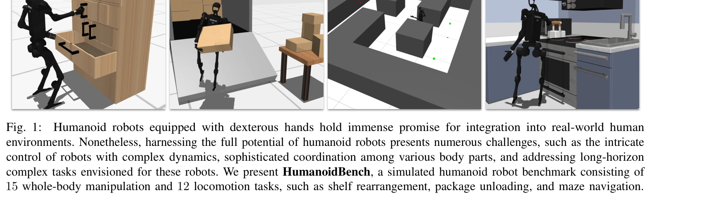
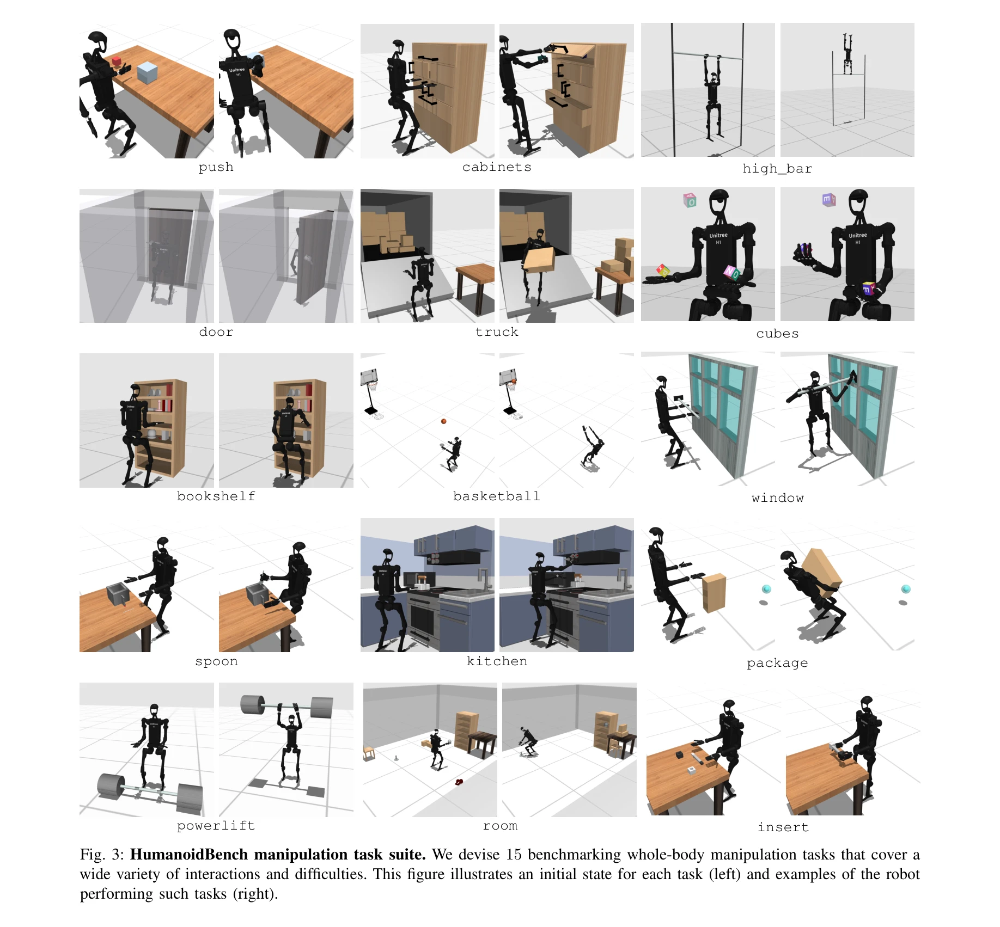
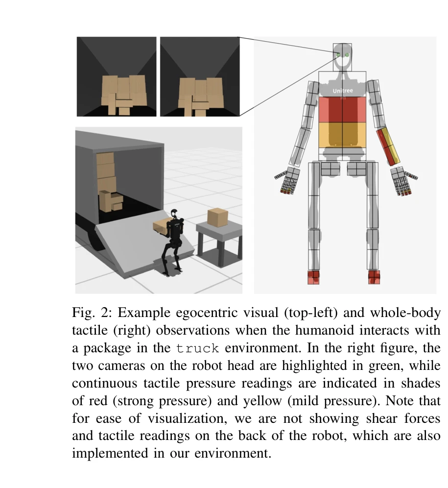

# HumanoidBench: Simulated Humanoid Benchmark for Whole-Body Locomotion and Manipulation

> **저자**: Carmelo Sferrazza, Dun-Ming Huang, Xingyu Lin, Youngwoon Lee, Pieter Abbeel | **날짜**: 2024-03-15 | **URL**: [https://arxiv.org/abs/2403.10506](https://arxiv.org/abs/2403.10506)

---

## Essence

*Fig. 1:*

HumanoidBench는 휴머노이드 로봇의 전신 조작 및 보행 작업을 위한 시뮬레이션 벤치마크를 제시하며, 최신 강화학습 알고리즘의 한계를 드러내고 계층적 학습 접근법의 우월성을 보여준다.

## Motivation

- **Known**: 로봇 학습은 조작과 보행 분야에서 진전을 이루었으나, 휴머노이드 로봇의 경우 비싼 하드웨어와 복잡한 동역학으로 인해 알고리즘 연구가 지연되고 있다.
- **Gap**: 기존 벤치마크들은 단일 팔 조작, 간단한 그리퍼, 또는 순수 보행 작업에만 초점을 맞추어 다양한 신체 부위의 협력과 긴 지평의 전신 제어 문제를 다루지 못하고 있다.
- **Why**: 휴머노이드 로봇의 실제 배포를 가속화하려면 안전하고 비용 효율적인 시뮬레이션 환경에서 강화학습 알고리즘을 체계적으로 검증할 수 있는 플랫폼이 필수적이다.
- **Approach**: Unitree H1 휴머노이드에 Shadow Hand 2개를 장착한 MuJoCo 시뮬레이션 환경을 구축하고, 15개의 전신 조작 작업과 12개의 보행 작업으로 구성된 벤치마크 스위트를 제공하며, 최신 RL 알고리즘과 계층적 강화학습(HRL) 접근법을 평가한다.

## Achievement

*Fig. 3: HumanoidBench manipulation task suite. We devise 15 benchmarking whole-body manipulation tasks that cover a*

- **포괄적 벤치마크 제공**: 75차원 행동 공간, 27개 다양한 작업을 포함하는 첫 휴머노이드 전신 제어 벤치마크 구축
- **알고리즘 성능 분석**: 최신 RL 알고리즘들이 대부분의 작업에서 어려움을 겪으나, 견고한 저수준 정책(보행, 도달)으로 지원되는 HRL이 우수한 성능 달성
- **개방형 리소스**: 다중 휴머노이드 모델(H1, G1, Digit) 및 엔드이펙터 지원, 오픈소스 코드 공개로 커뮤니티 접근성 제공
- **관찰 모달리티 다양화**: 동심 시각, 전신 촉각 센서 포함으로 현실적 감각 피드백 시뮬레이션

## How

*Fig. 2: Example egocentric visual (top-left) and whole-body*

- MuJoCo 물리 엔진 활용하여 Unitree H1 휴머노이드와 Shadow Hand 2개 정확한 시뮬레이션
- package unloading, shelf rearrangement, basketball catching, window wiping 등 다양한 조작 작업 설계
- maze navigation, stair climbing, slope walking 등 12개 보행 작업으로 저수준 스킬 제공
- PPO, SAC, DDPG 등 최신 RL 알고리즘과 저수준 정책(walking, reaching)을 활용한 계층적 RL 접근법 비교 평가
- 동심 카메라와 촉각 압력 센서로부터의 관찰 신호 포함

## Originality

- 휴머노이드 로봇의 dexterous hand를 명시적으로 포함한 첫 대규모 시뮬레이션 벤치마크 제시
- 보행과 조작을 통합한 27개 작업으로 전신 제어의 복잡성 체계적 평가
- 저수준 보행/도달 스킬과 고수준 작업 간 계층적 학습의 효과를 실증적으로 입증
- 기존 벤치마크 대비 훨씬 높은 행동 공간 차원(61), 자유도(75), 작업 지평(500-1000) 제공

## Limitation & Further Study

- 순전히 시뮬레이션 기반이므로 현실-시뮬레이션 간격(sim-to-real gap) 문제 미해결; 실제 휴머노이드에서의 정책 전이 성능 검증 필요
- 제시된 HRL 접근법은 저수준 정책의 사전 학습이 필요하므로, 완전 엔드투엔드 학습의 실현 가능성과 확장성 미검증
- 계층적 학습의 작업 분해 방법이 수동 설계에 의존하며, 자동화된 스킬 발견 메커니즘 부재
- 더 복잡한 동적 객체 상호작용이나 다중 에이전트 협력 시나리오 미포함
- 후속 연구는 sim-to-real transfer learning 방법론, 자가 감독학습 기반 저수준 정책 자동 발견, 실제 H1 하드웨어 배포 검증 필요

## Evaluation

- Novelty: 4/5
- Technical Soundness: 3/5
- Significance: 4/5
- Clarity: 4/5
- Overall: 4/5

**총평**: HumanoidBench는 휴머노이드 로봇 연구를 가속화할 포괄적이고 도전적인 시뮬레이션 벤치마크를 제공하며, 기존 RL 알고리즘의 한계와 계층적 학습의 가능성을 명확히 드러냈다. 다만 실제 하드웨어 배포와 자동화된 스킬 발견 메커니즘은 향후 과제로 남아있다.

## Related Papers

- 🏛 기반 연구: [[papers/1477_Humanoid-Gym_Reinforcement_Learning_for_Humanoid_Robot_with/review]] — Humanoid-Gym의 기본 프레임워크를 벤치마크로 확장하여 평가 기준을 제시한다
- 🔗 후속 연구: [[papers/1531_Learning_Humanoid_Standing-up_Control_across_Diverse_Posture/review]] — RLBench의 벤치마킹 개념을 휴머노이드 전신 제어에 특화하여 적용했다
- 🔄 다른 접근: [[papers/1621_VLABench_A_Large-Scale_Benchmark_for_Language-Conditioned_Ro/review]] — 둘 다 로봇 학습 벤치마크이지만 HumanoidBench는 전신 제어에, VLABench는 언어 조건부 조작에 집중한다
- 🔗 후속 연구: [[papers/1623_Voyager_An_Open-Ended_Embodied_Agent_with_Large_Language_Mod/review]] — MineDreamer의 chain-of-imagination을 통한 명령 따르기 학습을 Voyager의 자동 커리큘럼과 반복적 프롬프팅에 통합하여 더 정교한 탐험 전략을 개발할 수 있다.
- 🔗 후속 연구: [[papers/1477_Humanoid-Gym_Reinforcement_Learning_for_Humanoid_Robot_with/review]] — Humanoid-Gym의 기본 프레임워크를 HumanoidBench가 벤치마크로 확장했다
