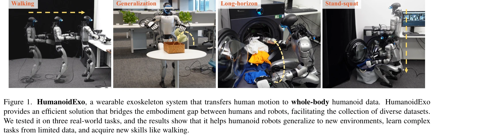

# HumanoidExo: Scalable Whole-Body Humanoid Manipulation via Wearable Exoskeleton

> **저자**: Rui Zhong, Yizhe Sun, Junjie Wen, Jinming Li, Chuang Cheng, Wei Dai, Zhiwen Zeng, Huimin Lu, Yichen Zhu, Yi Xu | **날짜**: 2025-10-03 | **DOI**: [10.48550/arXiv.2510.03022](https://doi.org/10.48550/arXiv.2510.03022)

---

## Essence

*Figure 1. HumanoidExo, a wearable exoskeleton system that transfers human motion to whole-body humanoid data. HumanoidEx*

웨어러블 외골격계(exoskeleton)를 이용해 인간의 전신 동작을 휴머노이드 로봇 데이터로 변환하는 HumanoidExo 시스템을 제시하여, 휴머노이드 정책 학습에 필요한 대규모 다양한 데이터 수집의 병목을 해결한다.

## Motivation

- **Known**: 기존에는 시뮬레이션, 웹 비디오, 직접 원격조종 등으로 휴머노이드 데이터를 수집했으나, 시뮬레이션-실제 간극, 형태학적 차이, 확장성 제한 등의 문제가 있었다.
- **Gap**: 휴머노이드 로봇의 전신 조작(whole-body manipulation)에 필요한 대규모 데이터 수집은 여전히 어렵고 비용이 크며, 기존 외골격 시스템은 주로 팔 조작에만 초점을 맞추고 있다.
- **Why**: 대규모 고품질 데이터는 휴머노이드 로봇의 일반화, 복잡한 전신 제어 학습, 새로운 기술 습득을 가능하게 하므로 데이터 수집의 효율성과 확장성 개선이 중요하다.
- **Approach**: 경량 wearable exoskeleton으로 상체 7자유도를 추적하고 back-mounted LiDAR로 하체의 6D 기저 자세를 포착하여 전신 궤적을 생성한 후, HE-VLA(Vision-Language-Action 모델)에 imitation learning과 reinforcement learning을 결합하여 정책을 학습한다.

## Achievement

*Figure 5. Examples for PlaceToy (Task 1), Walk & PlaceToy (Task 2), and PlaceLaundry (Task 3). We designed three tasks t*

- **데이터 효율성**: 단 5개의 실제 로봇 시연만으로 복잡한 전신 제어를 학습 가능
- **일반화 능력**: HumanoidExo 데이터로 훈련한 정책이 새로운 환경으로 효과적으로 일반화
- **새로운 기술 습득**: 실제 로봇 시연 없이 exoskeleton 데이터만으로 걷기(walking) 같은 새로운 기술 학습 가능

## How

*Figure 2. Hardware overview for HumaniodExo. We integrated a Mid-360 LiDAR for acquiring exoskeleton motion odometry. Fo*

- **상체 정렬**: 외골격의 7개 관절을 로봇 팔과 직접 매핑하기 위해 DH(Denavit-Hartenberg) 파라미터와 forward kinematics 사용
- **하체 추적**: back-mounted Mid-360 LiDAR로 연산자의 몸통 6D 자세 획득
- **모션 재타겟팅**: 외골격과 LiDAR 데이터를 융합하여 로봇에 실행 가능한 전신 궤적 생성
- **정책 학습**: HE-VLA에서 imitation learning과 actor-critic reinforcement learning을 혼합하여 균형과 안정성 보장
- **실험 검증**: table-top manipulation, stand-squat 통합 조작, 보행 통합 전신 조작의 3가지 실제 작업으로 평가

## Originality

- **최초 전신 시스템**: 휴머노이드 로봇의 전신 정책 학습을 위한 in-the-wild exoskeleton 시스템 최초 제시
- **embodiment gap 해결**: 인간-로봇 간 형태학적 차이를 joint space 직접 매핑과 모션 재타겟팅으로 체계적으로 해결
- **하이브리드 학습 접근**: imitation learning과 reinforcement learning을 결합하여 안정성 있는 전신 제어 구현
- **실용적 하드웨어 설계**: isomorphic 7-DoF arm 설계와 LiDAR 기반 기저 추적으로 스케일 가능한 데이터 수집 실현

## Limitation & Further Study

- **시스템 복잡성**: 외골격 하드웨어와 LiDAR 센싱의 정확도에 의존하며, 실제 도입에 비용과 기술적 난제 존재
- **제한된 다양성**: 현재 3가지 작업만 평가했으며, 더 광범위한 작업과 환경에서의 일반화 능력 검증 필요
- **실시간 처리**: 모션 재타겟팅과 정책 실행의 레이턴시, 대규모 온라인 수집 시 운영자 피로도 관리 방안 미흡
- **후속 연구**: (1) 더 다양한 휴머노이드 플랫폼으로의 이전 용이성 개선, (2) 무선 센서 기술로 휴대성 향상, (3) 적응형 정책 학습으로 embodiment 차이 자동 보정

## Evaluation

- Novelty: 4/5
- Technical Soundness: 3/5
- Significance: 4/5
- Clarity: 4/5
- Overall: 4/5

**총평**: HumanoidExo는 웨어러블 exoskeleton과 LiDAR를 결합하여 휴머노이드 로봇의 전신 조작 데이터 수집을 최초로 체계화한 혁신적 연구로, 데이터 효율성과 일반화 능력 측면에서 실질적인 기여를 보여준다. 다만 시스템의 복잡성과 제한된 평가 범위가 실무 적용의 과제이며, 추가 검증과 개선이 필요하다.

## Related Papers

- 🔄 다른 접근: [[papers/1468_Humanoid_Manipulation_Interface_Humanoid_Whole-Body_Manipula/review]] — 둘 다 휴머노이드 조작 데이터 수집을 다루지만 HumanoidExo는 외골격 기반에, HuMI는 로봇 없는 수집에 집중한다
- 🏛 기반 연구: [[papers/1454_HOMIE_Humanoid_Loco-Manipulation_with_Isomorphic_Exoskeleton/review]] — 외골격 기반 데이터 수집이 HOMIE의 실시간 제어 시스템의 기반이 된다
- 🔗 후속 연구: [[papers/1586_NuExo_A_Wearable_Exoskeleton_Covering_all_Upper_Limb_ROM_for/review]] — NuExo의 상체 외골격을 전신 휴머노이드 데이터 수집으로 확장했다
- 🧪 응용 사례: [[papers/1302_CHILD_Controller_for_Humanoid_Imitation_and_Live_Demonstrati/review]] — 확장 가능한 전신 조작에서 CHILD의 직접 관절 매핑이 적용된다
- 🔗 후속 연구: [[papers/1617_VLA-Cache_Efficient_Vision-Language-Action_Manipulation_via/review]] — MoLe-VLA의 동적 layer-skipping과 VLA-Cache의 temporal caching을 결합한 효율성 향상 방법론이다
- 🔗 후속 연구: [[papers/1454_HOMIE_Humanoid_Loco-Manipulation_with_Isomorphic_Exoskeleton/review]] — HumanoidExo의 외골격 데이터 수집을 실시간 제어 시스템으로 확장했다
- 🔄 다른 접근: [[papers/1468_Humanoid_Manipulation_Interface_Humanoid_Whole-Body_Manipula/review]] — 둘 다 휴머노이드 조작 데이터 수집을 다루지만 HuMI는 로봇 없는 수집에, HumanoidExo는 외골격 기반 수집에 집중한다
- 🔄 다른 접근: [[papers/1486_HumDex_Humanoid_Dexterous_Manipulation_Made_Easy/review]] — 둘 다 휴머노이드 조작을 다루지만 HumDex는 손재주에, HumanoidExo는 데이터 수집에 집중한다
- 🧪 응용 사례: [[papers/1586_NuExo_A_Wearable_Exoskeleton_Covering_all_Upper_Limb_ROM_for/review]] — 웨어러블 외골격 NuExo의 전신 움직임 캡처 기능이 HumanoidExo의 스케일러블 전신 조작에서 실제 활용될 수 있다.
