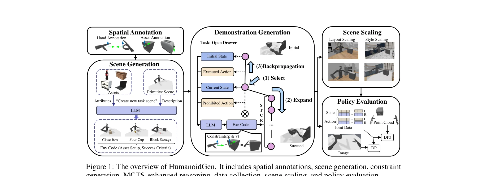
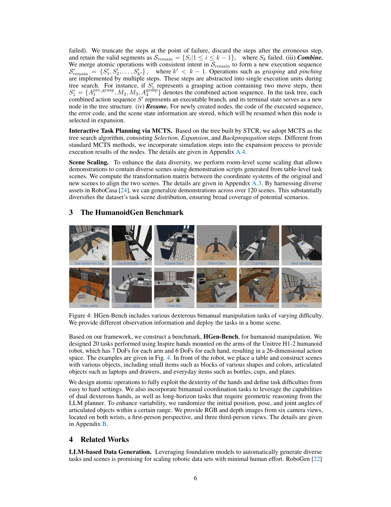

# HumanoidGen: Data Generation for Bimanual Dexterous Manipulation via LLM Reasoning

> **저자**: Zhi Jing, Siyuan Yang, Jicong Ao, Ting Xiao, Yu-Gang Jiang, Chenjia Bai | **날짜**: 2025-07-01 | **URL**: [https://arxiv.org/abs/2507.00833](https://arxiv.org/abs/2507.00833)

---

## Essence

*Figure 1: The overview of HumanoidGen. It includes spatial annotations, scene generation, constraint*

HumanoidGen은 LLM 추론과 원자적 손동작을 활용하여 인간형 로봇의 양팔 정교한 조작 작업을 자동으로 생성하고 시연 데이터를 수집하는 프레임워크이다. MCTS 기반 강화 추론을 통해 장기 작업과 불충분한 주석에 대한 계획 능력을 개선한다.

## Motivation

- **Known**: 기존 로봇 조작 데이터셋은 주로 단일 팔 로봇에 중점을 두고 있으며, 양팔 정교한 조작을 위한 고품질 시뮬레이션 작업과 시연이 부족하다. 텔레작업은 실제 객체 배포와 숙련된 조작자가 필요하여 작업 다양성 확보가 어렵다.
- **Gap**: 인간형 로봇의 양팔 정교한 조작을 위한 자동화된 작업 생성 및 대규모 시연 데이터 수집 프레임워크가 부재하며, 특히 긴 수평선 작업과 공간 제약 조건 생성에서의 LLM 추론 능력이 제한적이다.
- **Why**: 인간형 로봇은 양팔 조정과 정교한 손 조작을 통해 더 복잡한 작업을 수행할 수 있으나, 충분한 고품질 데이터 없이는 이러한 능력을 활용하기 어렵다. 자동화된 데이터 생성은 확장 가능한 정책 학습을 가능하게 한다.
- **Approach**: 공간 주석 기반 LLM 계획자를 통해 환경 설정과 성공 기준을 생성하고, 원자적 손동작과 객체 어포던스를 활용하여 팔 움직임의 공간 제약 조건 체인을 자동 생성한다. MCTS 변형을 도입하여 장기 작업에서의 LLM 추론을 강화한다.

## Achievement

*Figure 4: HGen-Bench includes various dexterous bimanual manipulation tasks of varying difficulty.*

- **HGen-Bench 구축**: 20개의 다양한 난이도의 양팔 정교한 조작 작업으로 구성된 벤치마크 개발
- **자동 데이터 생성**: LLM 기반 코드 생성으로 제약 조건을 실행 가능한 형태로 변환하여 시연 자동 수집
- **MCTS 강화 추론**: 불충분한 주석과 장기 작업에서 LLM의 계획 능력을 현저히 향상시킴
- **확장성 검증**: 생성된 데이터셋 규모 증가에 따라 2D 및 3D diffusion policies의 성능이 지속적으로 향상됨을 실증

## How

*Figure 1: The overview of HumanoidGen. It includes spatial annotations, scene generation, constraint*

- **공간 주석 설계**: 자산과 정교한 손에 대해 핵심 점과 핵심 축을 주석 처리 (손 원자 동작, 자산 고유 정보, 자산-동작 주석)
- **장면 생성**: LLM 플래너가 자산, 장면, 작업 설명을 기반으로 환경 설정 및 성공 기준을 코드 형태로 생성
- **제약 조건 생성**: LLM이 객체 어포던스와 장면을 고려하여 팔 움직임을 위한 공간 제약 조건 체인 생성
- **궤적 최적화**: 생성된 제약 조건을 제약 최적화 문제로 변환하여 팔과 손 움직임 계산
- **MCTS 기반 추론**: introspective exploration을 포함한 MCTS 변형으로 LLM의 장기 계획 능력 강화
- **시나리오 증강**: 다양한 장면 배치를 통해 데이터 다양성 확보 및 정책 학습 성능 개선

## Originality

- 원자적 손동작과 공간 주석을 결합하여 LLM 기반 계획에 구조화된 제약 조건을 제공하는 novel annotation scheme 제시
- LLM 추론을 introspective exploration과 결합한 MCTS 변형으로 부분 관찰과 장기 작업 문제 해결
- 인간형 로봇의 양팔 정교한 조작을 위한 최초의 자동화된 대규모 데이터 생성 프레임워크 개발
- 다양한 난이도의 양팔 정교한 조작 작업을 포함한 HGen-Bench 벤치마크 공개

## Limitation & Further Study

- 공간 주석 준비가 수동적 프로세스로 새로운 자산이나 동작 추가 시 비용이 소모됨
- 현재 프레임워크는 SAPIEN 시뮬레이터 기반이며, 실제 로봇 환경에서의 시뮬-투-리얼 전이 성능 미검증
- 제약 조건 해결을 위한 궤적 최적화의 계산 복잡도와 수렴성에 대한 분석 부족
- MCTS 강화의 계산 오버헤드와 추론 성능 간의 trade-off 분석 필요
- **후속 연구**: (1) Stable Diffusion 등 생성 모델을 활용한 자동 주석 프로세스 확대, (2) 실제 인간형 로봇에서의 정책 배포 및 sim-to-real adaptation 연구, (3) 다양한 제약 조건 유형에 대한 더 효율적인 최적화 알고리즘 개발

## Evaluation

- Novelty: 4/5
- Technical Soundness: 3/5
- Significance: 4/5
- Clarity: 4/5
- Overall: 4/5

**총평**: HumanoidGen은 LLM 기반 계획과 구조화된 공간 주석을 결합하여 인간형 로봇의 양팔 정교한 조작을 위한 자동화된 데이터 생성을 실현한 혁신적 프레임워크이다. MCTS 강화 추론의 효과성과 생성 데이터의 확장성이 실증되어 로봇 학습의 새로운 패러다임을 제시한다.

## Related Papers

- 🏛 기반 연구: [[papers/1463_Humanoid_Agent_via_Embodied_Chain-of-Action_Reasoning_with_M/review]] — LLM 기반 데이터 생성이 Humanoid-COA의 추론 메커니즘의 기반이 된다
- 🔗 후속 연구: [[papers/1337_DexMimicGen_Automated_Data_Generation_for_Bimanual_Dexterous/review]] — DexMimicGen의 양팔 데이터 생성을 휴머노이드 전신으로 확장했다
- 🧪 응용 사례: [[papers/1540_Learning_to_Control_Physically-simulated_3D_Characters_via_G/review]] — RoboGen의 자동화된 로봇 태스크 생성 개념을 휴머노이드 양팔 조작에 구체적으로 적용했다
- 🔗 후속 연구: [[papers/1463_Humanoid_Agent_via_Embodied_Chain-of-Action_Reasoning_with_M/review]] — HumanoidGen의 LLM 기반 데이터 생성을 실시간 추론 시스템으로 확장했다
