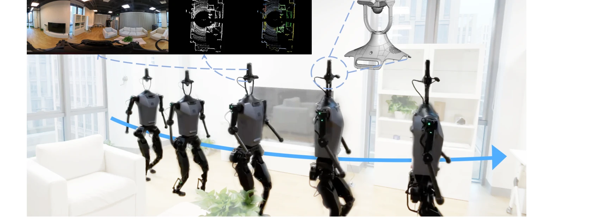
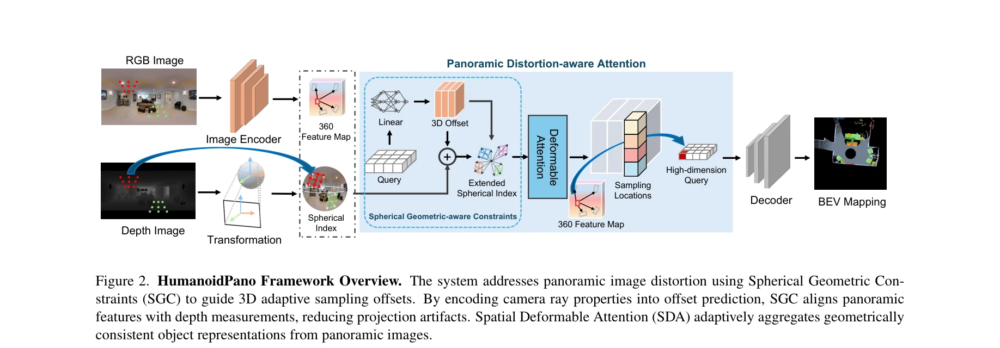

# HumanoidPano: Hybrid Spherical Panoramic-LiDAR Cross-Modal Perception for Humanoid Robots

> **저자**: Qiang Zhang, Zhang Zhang, Wei Cui, Jingkai Sun, Jiahang Cao, Yijie Guo, Gang Han, Wen Zhao, Jiaxu Wang, Chenghao Sun, Lingfeng Zhang, Hao Cheng, Yujie Chen, Lin Wang, Jian Tang, Renjing Xu | **날짜**: 2025-03-12 | **URL**: [https://arxiv.org/abs/2503.09010](https://arxiv.org/abs/2503.09010)

---

## Essence

*Figure 1. The humanoid robot autonomously navigates complex environments using HumanoidPano, which fuses panoramic visio*

휴머노이드 로봇의 자체 폐색과 제한된 시야각 문제를 극복하기 위해 파노라마 비전과 LiDAR을 기하학적으로 정렬하여 융합하는 HumanoidPano 프레임워크를 제시한다. Spherical Geometry-aware Constraints, Spatial Deformable Attention, Panoramic Augmentation을 통해 360°-to-BEV 융합을 달성한다.

## Motivation

- **Known**: 자율주행차는 rigid roof-mounted multi-sensor 배치로 폐색 없는 인식을 달성하고, 산업용 로봇팔은 Eye-in-Hand 비전 시스템으로 고정된 기하학적 관계를 유지한다. 파노라마 비전은 FOV 제약을 극복하지만 구면 투영 시 특징 왜곡, 영역 간 스케일 불일치, 깊이 인식 저하를 야기한다.
- **Gap**: 휴머노이드 로봇의 인체형 사지 구조는 조작 시 팔꿈치 폐색, 장애물 회피 시 허리 센서 차단으로 인한 심각한 자체 폐색을 유발한다. 기존 stereo vision, 멀티뷰 센싱, 자동차 LiDAR-카메라 등록 방식은 구면 투영-점군 기하학적 부호화 불일치와 동적 조인트 모션으로 인한 실시간 드리프트 문제를 해결하지 못한다.
- **Why**: 휴머노이드 로봇은 일반 목적 로보틱스의 가장 유망한 후보이나 perception 발전이 기계 설계 및 이동 전략에 비해 크게 뒤떨어져 있다. 정확한 BEV 의미론적 맵 생성은 복잡한 환경에서 자율 네비게이션과 조작 태스크를 가능하게 한다.
- **Approach**: 파노라마 카메라 광선 특성을 활용한 SGC로 기하학적 정렬을 유도하고, SDA로 구면 오프셋을 통해 계층적 3D 특징을 집계하며, 크로스뷰 변환과 의미론적 정렬을 결합한 Panoramic Augmentation으로 BEV-파노라마 특징 일관성을 강화한다.

## Achievement

*Figure 1. The humanoid robot autonomously navigates complex environments using HumanoidPano, which fuses panoramic visio*

- **360BEV-Matterport 벤치마크에서 SOTA 달성**: 파노라마 BEV 장면 이해에서 이전 방법을 능가하는 정밀도를 달성했다.
- **휴머노이드 로봇 실제 배포 검증**: 물리적 휴머노이드 플랫폼에서 정확한 BEV 분할 맵 생성 능력을 실증했다.
- **통합 지각 프레임워크**: 휴머노이드 생체역학 제약에 최적화된 범용 다중모달 지각 시스템을 제시했다.
- **구조적 제약의 설계 자산화**: 휴머노이드 로봇이 형태 특성에 적응한 알고리즘으로 생물학적 시각 한계를 초월할 수 있음을 시연했다.

## How

*Figure 2. HumanoidPano Framework Overview. The system addresses panoramic image distortion using Spherical Geometric Con*

- **Spherical Geometry-aware Constraints (SGC)**: 파노라마 카메라 광선 특성으로부터 기하학적 제약을 도출하여 왜곡 인식형 크로스모달 정렬을 위한 광선 기반 특징 변조를 활성화한다.
- **Spatial Deformable Attention (SDA)**: 적응형 공간 deformable attention과 샘플링을 통해 효율적인 360°-to-BEV 융합을 달성하며, 기하학적으로 완전한 객체 표현을 생성한다.
- **Panoramic Augmentation (AUG)**: 파노라마 이미지와 BEV 공간 변환(무작위 뒤집기, 혼합, 의미론적 맵 정렬)을 통합한 새로운 데이터 증강 방식으로 joint view 증강의 정렬 문제를 해결한다.
- **Spherical Vision Transformer**: 파노라마 비전과 LiDAR의 seamless 융합을 위해 기하학적으로 인식하는 modality alignment를 구현한다.
- **계층적 3단계 처리**: 픽셀 수준 의미론적 특징 추출(파노라마 이미징) → 기하학 인식형 깊이 프로파일링(LiDAR) → 크로스모달 특징 융합의 순차적 처리 구조를 설계한다.

## Originality

- **휴머노이드 로봇 전용 프레임워크**: 기존 자율주행차/산업용 로봇 지각 시스템과 다르게 인체형 사지 구조의 자체 폐색과 동적 기하학 변화를 직접 다루는 최초의 통합 접근
- **구면 기하학 인식 정렬**: 구면 투영의 왜곡을 단순히 무시하거나 후처리하지 않고, 광선 기반 제약으로 정렬 과정에 기하학적 원리를 내재화
- **파노라마-BEV 크로스뷰 증강**: 메트릭 일관성을 보존하면서 파노라마 이미지와 BEV 공간 변환을 동시에 수행하는 의미론적 정렬 기반 증강 전략
- **실제 휴머노이드 배포**: 시뮬레이션이 아닌 물리적 휴머노이드 플랫폼에서 네비게이션 태스크 직결의 BEV 맵 생성 검증

## Limitation & Further Study

- **데이터 scarcity**: 휴머노이드 로봇 다양성으로 인해 범용 센서 배치 표준이 부재하며 학습 데이터가 극히 제한적이다.
- **동적 기하학 드리프트**: 조인트 모션 중 실시간 정렬 행렬 변화에 대한 적응 메커니즘의 강건성이 미흡할 수 있다.
- **계산 효율성**: 계층적 처리와 multiple constraint 적용으로 인한 실시간 지연 특성이 상세히 분석되지 않음.
- **후속 연구 필요**: (1) 다양한 휴머노이드 플랫폼 간 transfer learning 성능 평가, (2) 악천후(저조도, 반사면)에서의 파노라마-LiDAR 융합 강건성 개선, (3) 조작 태스크 중 자체 폐색 시 feature recovery 메커니즘 개발

## Evaluation

- Novelty: 4/5
- Technical Soundness: 3/5
- Significance: 4/5
- Clarity: 4/5
- Overall: 4/5

**총평**: 휴머노이드 로봇의 고유한 지각 문제를 구체적으로 정의하고 구면 기하학 원리를 활용한 기하학 인식형 파노라마-LiDAR 융합 프레임워크로 해결하는 원창적이고 실용적인 연구이다. SOTA 벤치마크 성과와 실제 배포 검증으로 신뢰성을 확보하였으며, 구조적 제약을 설계 자산으로 전환하는 패러다임 전환을 제시한다.

## Related Papers

- 🏛 기반 연구: [[papers/1403_FRAME_Floor-aligned_Representation_for_Avatar_Motion_from_Eg/review]] — egocentric perception의 기본 표현 방법론을 제공한다
