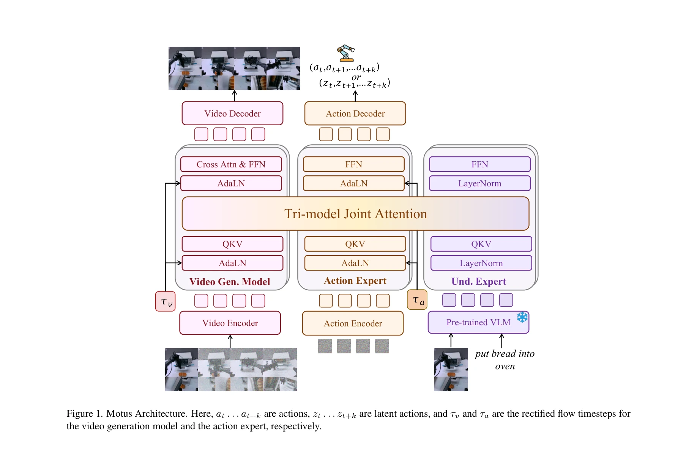

# Motus: A Unified Latent Action World Model

> **저자**: Hongzhe Bi, Hengkai Tan, Shenghao Xie, Zeyuan Wang, Shuhe Huang, Haitian Liu, Ruowen Zhao, Yao Feng, Chendong Xiang, Yinze Rong, Hongyan Zhao, Hanyu Liu, Zhizhong Su, Lei Ma, Hang Su, Jun Zhu | **날짜**: 2025-12-15 | **URL**: [https://arxiv.org/abs/2512.13030](https://arxiv.org/abs/2512.13030)

---

## Essence

*Figure 1. Motus Architecture. Here, at . . . at+k are actions, zt . . . zt+k are latent actions, and τv and τa are the r*

Motus는 vision-language-action 모델, world 모델, inverse dynamics 모델, video generation 모델을 unified latent action world model로 통합하는 embodied agent 프레임워크이며, Mixture-of-Transformer 아키텍처와 optical flow 기반 latent action을 통해 대규모 이질적 데이터 학습을 가능하게 한다.

## Motivation

- **Known**: 기존 embodied agent 방법들은 VLA, WM, IDM, VGM을 분리된 모델로 구축하고 있으며, 일부 연구는 이들을 부분적으로 통합하려 시도했으나 완전한 통일을 이루지 못했다.
- **Gap**: 현존 방법들은 5가지 주요 확률분포를 모두 통합하지 못하고 있으며, 이질적 데이터(인터넷 비디오, egocentric 데모, 로봇 궤적)에서 대규모 action 사전학습이 어렵다.
- **Why**: 통일된 embodied agent는 이해, 세계 모델링, 제어를 하나의 시스템으로 통합해야 하며, 이를 통해 일반적 다중모달 priors와 domain-specific priors를 효과적으로 활용할 수 있다.
- **Approach**: Motus는 Tri-model Joint Attention을 통해 vision-language understanding, video generation, action 전문가를 통합하고, UniDiffuser 스타일의 scheduler로 modality 간 flexible switching을 지원하며, optical flow 기반 latent action과 3단계 학습 파이프라인으로 대규모 action 사전학습을 수행한다.

## Achievement

*Figure 1. Motus Architecture. Here, at . . . at+k are actions, zt . . . zt+k are latent actions, and τv and τa are the r*

- **통합 아키텍처**: 5가지 embodied intelligence 패러다임(WM, IDM, VLA, VGM, Video-Action Joint Prediction Model)을 하나의 unified model로 통합
- **성능 향상**: 시뮬레이션에서 X-VLA 대비 +15%, π0.5 대비 +45% 개선, 실제 로봇에서 +11~48% 개선
- **확장 가능한 학습 레시피**: 3단계 학습 파이프라인과 6계층 데이터 피라미드를 통한 cross-embodiment 지식 전이
- **Latent action 표현**: optical flow 기반 pixel-level delta action으로 무레이블 비디오에서의 사전학습 가능

## How

*Figure 1. Motus Architecture. Here, at . . . at+k are actions, zt . . . zt+k are latent actions, and τv and τa are the r*

- **Mixture-of-Transformer (MoT) 아키텍처**: understanding expert, video generation model, action expert를 shared multi-head self-attention layer로 연결하는 Tri-model Joint Attention 설계
- **UniDiffuser 스타일 scheduler**: 각 modality에 서로 다른 timestep과 noise scale 할당으로 flexible한 inference mode switching 실현
- **Deep Compression Autoencoder (DC-AE)**: optical flow를 저차원 latent으로 인코딩하되, 소수의 action label로 supervision하여 robotic activity에 초점 맞춤
- **3단계 학습 파이프라인**: video pretraining → latent action pretraining → embodiment-specific action finetuning
- **6계층 데이터 피라미드**: web-scale, egocentric human, simulation, task-agnostic, multi-robotic, target-robotic 데이터 활용

## Originality

- optical flow를 universal motion expression으로 활용하여 cross-embodiment action 표현을 통합한 novel latent action 설계
- Tri-model Joint Attention을 통한 새로운 multimodal fusion 방식으로 specialized functionality 보존과 cross-modal knowledge fusion 동시 달성
- 3단계 학습 파이프라인과 6계층 데이터 피라미드를 통한 체계적인 대규모 multi-domain pretraining 및 finetuning 전략
- UniDiffuser 기반의 flexible scheduler로 5가지 서로 다른 modeling mode의 adaptive switching 구현

## Limitation & Further Study

- optical flow 추출의 계산 비용과 부정확성이 latent action 학습에 미치는 영향에 대한 분석 부족
- 6계층 데이터 피라미드 구성 시 각 계층의 최적 크기 비율과 영향도에 대한 ablation study 제한적
- 서로 다른 로봇 embodiment 간의 action space 불일치 문제를 optical flow로 완전히 해결하는지 검증 필요
- 실제 로봇 실험이 제한된 환경과 task에 한정되어 일반화 가능성 검증 필요
- 후속 연구로 더 다양한 embodiment과 복잡한 조작 task에 대한 확대 실험 필요

## Evaluation

- Novelty: 4/5
- Technical Soundness: 4/5
- Significance: 4/5
- Clarity: 4/5
- Overall: 4/5

**총평**: Motus는 분산된 embodied agent 아키텍처를 unified model로 통합하면서 optical flow 기반 latent action과 체계적인 multi-stage 학습으로 대규모 이질적 데이터 활용을 가능하게 한 혁신적 연구이며, 강력한 실험 성과와 함께 embodied AI의 통합 모델링에 대한 새로운 패러다임을 제시한다.

## Related Papers

- 🏛 기반 연구: [[papers/1533_Learning_Perceptive_Humanoid_Locomotion_over_Challenging_Ter/review]] — 복잡한 지형에서의 인지 기반 이동 제어 방법론이 HumanoidPano의 360도 지형 인식 시스템에 직접 적용 가능하다
- 🔄 다른 접근: [[papers/1500_OmniVLA_Physically-Grounded_Multimodal_VLA_with_Unified_Mult/review]] — 다중 센서 융합을 통한 물리적 환경 인식에서 파노라마-LiDAR 융합과 다중 모달 센서 통합의 상호 보완적 접근법이다
- 🔗 후속 연구: [[papers/1364_Diffusion-VLA_Generalizable_and_Interpretable_Robot_Foundati/review]] — 해석 가능한 로봇 파운데이션 모델의 3D 공간 표현을 HumanoidPano의 기하학적 제약에 통합할 수 있다
- 🔗 후속 연구: [[papers/1368_EgoDemoGen_Egocentric_Demonstration_Generation_for_Viewpoint/review]] — Motus의 unified latent action world model이 DiWA의 diffusion policy adaptation을 더 통합된 관점으로 확장한다.
- 🔄 다른 접근: [[papers/1500_OmniVLA_Physically-Grounded_Multimodal_VLA_with_Unified_Mult/review]] — 물리적 센서 정보 통합에서 mmWave/음향과 파노라마-LiDAR은 상호 보완적인 다중 모달 인식 접근법을 제시한다
- 🧪 응용 사례: [[papers/1533_Learning_Perceptive_Humanoid_Locomotion_over_Challenging_Ter/review]] — 복잡한 지형에서의 인지 기반 이동 제어가 HumanoidPano의 360도 지형 인식과 결합하여 실제 환경 적응 능력을 향상시킬 수 있다
