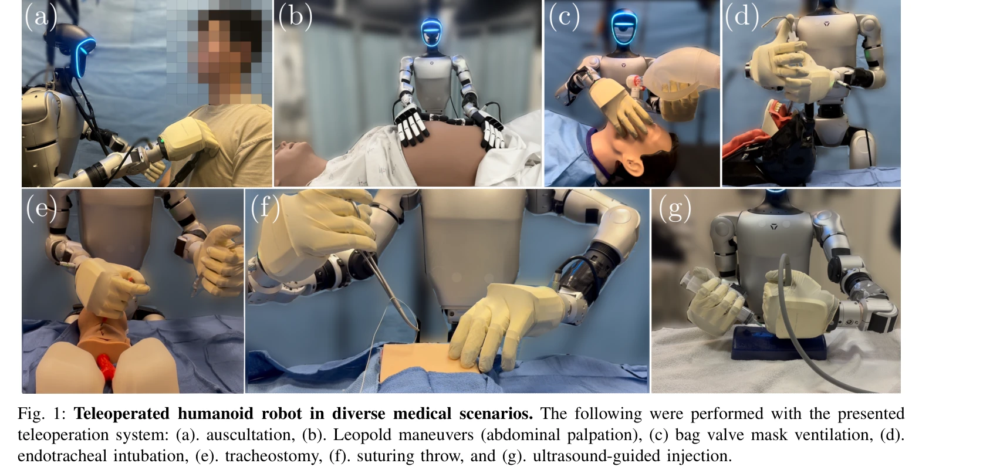
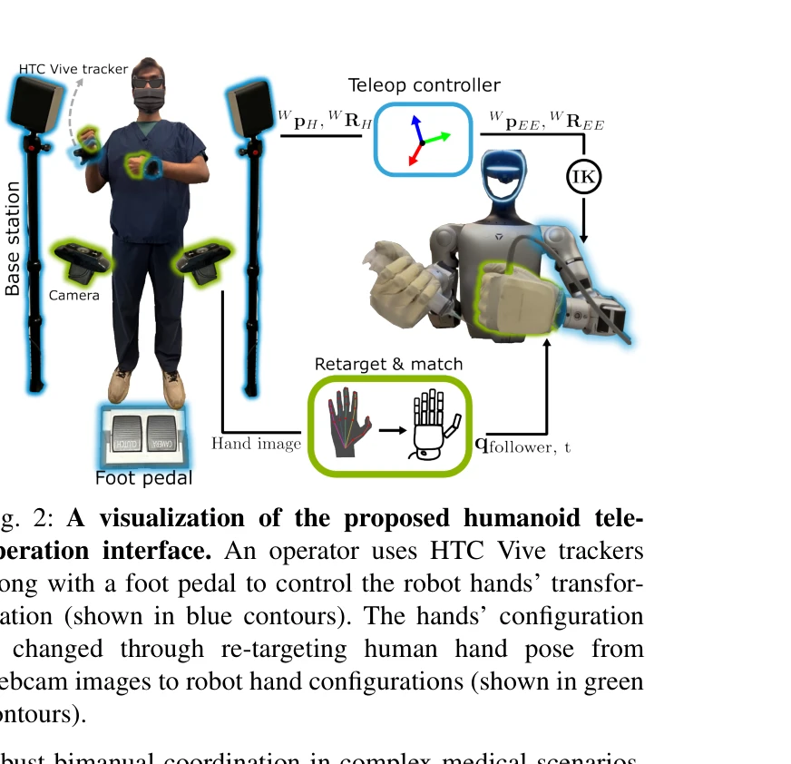

# Humanoids in Hospitals: A Technical Study of Humanoid Robot Surrogates for Dexterous Medical Interventions

> **저자**: Soofiyan Atar, Xiao Liang, Calvin Joyce, Florian Richter, Wood Ricardo, Charles Goldberg, Preetham Suresh, Michael Yip | **날짜**: 2025-03-17 | **URL**: [https://arxiv.org/abs/2503.12725](https://arxiv.org/abs/2503.12725)

---

## Essence

*Fig. 1: Teleoperated humanoid robot in diverse medical scenarios. The following were performed with the presented*

이 논문은 Unitree G1 휴머노이드 로봇에 양팔 원격조종 시스템을 구축하여 신체 검진, 응급 처치, 정밀 바늘 작업 등 7가지 의료 절차를 수행할 수 있는 가능성을 탐색하였다.

## Motivation

- **Known**: 휴머노이드 로봇의 인간형 민첩성과 적응성이 주목받고 있으며, 의료 분야의 노동 부족 문제가 심화되고 있다. 기존 의료용 로봇은 특정 분야(복강경 수술, 정형외과 등)에만 특화되어 있다.
- **Gap**: 휴머노이드 로봇이 직접 의료 절차를 원격조종으로 수행할 수 있는지에 대한 실증적 연구가 부족하며, 다양한 의료 도구 조작과 정밀 작업 수행의 기술적 가능성이 미탐색 상태이다.
- **Why**: 고령화 사회와 의료 인력 부족 문제를 해결하기 위해 휴머노이드 로봇의 의료 적용 가능성을 규명하는 것이 중요하며, 이를 통해 미래의 로봇 의료 통합에 대한 기초를 마련할 수 있다.
- **Approach**: HTC Vive tracker, WiLoR 손 포즈 추적, 다중 카메라 시스템을 통합한 고충실도 양팔 원격조종 시스템을 개발하고, impedance controller를 적용하여 의료 도구의 안전하고 정밀한 조작을 가능하게 하였다.

## Achievement

*Fig. 1: Teleoperated humanoid robot in diverse medical scenarios. The following were performed with the presented*

- **양팔 원격조종 시스템 개발**: HTC Vive tracker, WiLoR 기반 손 포즈 재타겟팅, 듀얼 풋 페달 인터페이스를 통합하여 다양한 파지 구성을 지원하는 원격조종 플랫폼 구축
- **7가지 의료 절차 수행 실증**: 청진, Leopold maneuver (복부 촉진), bag-valve-mask 환기, 기관 내 삽관, 기관절개술, 봉합 시술, 초음파 유도 주입 등 다양한 임상 작업 성공 수행
- **정량적 성능 달성**: 환기 및 초음파 유도 작업에서 기술적으로 의미 있는 성능 지표 확보
- **Impedance controller 적용**: 외부 힘에 반응하는 컴플라이언스 제어로 초음파 프로브 위치 결정 등 접촉 감지 작업에서 안전하고 정밀한 힘 조절 실현
- **가상 spring-damper 메커니즘**: 양팔 동기화 및 힘 공유를 통해 BVM 환기와 같은 협력 작업 지원

## How

*Fig. 2: A visualization of the proposed humanoid tele-*

- **연산자 제어 인터페이스**: HTC Vive tracker와 WiLoR을 이용한 멀티카메라 손 포즈 추적으로 고충실도 양팔 입력 확보 및 kinematic re-targeting (식 1)으로 인간 손 자세를 로봇 관절각으로 변환
- **다중 카메라 신뢰도 가중치 계산**: 각 카메라 뷰의 관점(φᵢ)에 기반한 cosine 신뢰도 인수(식 2-3)로 강건한 3D 포즈 추정
- **상대 모션 매핑**: Clutch 메커니즘으로 저장된 포즈로부터의 증분 모션만 반영 (식 4-5), 의도하지 않은 움직임 방지
- **Impedance 제어**: Joint torque (τ)로부터 Jacobian을 통해 Cartesian end-effector force (FEE)를 추정하고 gravity compensation (τg)과 함께 impedance 조절 (식 6)로 안전한 접촉 상호작용 구현
- **가상 spring-damper 메커니즘**: 양팔 간 동기화 및 협력 작업에서의 힘 공유 실현

## Originality

- 휴머노이드 로봇의 직접적인 의료 절차 수행이라는 개념적 전환 - 기존 비임상 작업 중심에서 벗어나 청진, 삽관, 기관절개술 등 실제 임상 작업 직접 수행
- WiLoR 기반 멀티카메라 손 포즈 추적과 kinematic re-targeting의 의료 응용 - 손 키포인트의 신뢰도 가중치 융합(식 2-3)을 통한 강건한 포즈 인식
- Impedance control과 가상 spring-damper를 결합한 양팔 접촉 제어 - 정밀한 힘 조절이 필요한 의료 작업에 적응형 compliance 제공
- 7가지 다양한 의료 절차에 대한 통합 평가 - 신체 검진, 응급 처치, 정밀 바늘 작업을 포함한 광범위한 의료 시나리오 커버

## Limitation & Further Study

- **힘 출력의 한계**: 높은 강도를 요구하는 절차에서 부족한 힘 출력으로 인한 성능 제약
- **센서 감도 문제**: 센서 민감도 부족으로 인해 임상 정확성에 영향을 미치는 한계
- **시뮬레이션 환경**: 실제 임상 환경이 아닌 시뮬레이션 설정에서의 평가로 현실 적용 시 미지의 변수 존재
- **지연 시간 및 시각 피드백**: 원격조종 시스템의 지연이 정밀 작업에 미치는 영향에 대한 심층 분석 부족
- **후속 연구 방향**: (1) 로봇 팔의 힘 출력 증강 및 센서 민감도 개선, (2) 실제 병원 환경에서의 임상 검증, (3) 자동화 알고리즘 개발을 통한 원격조종 부담 감소, (4) 안전성 및 규제 측면의 표준 수립

## Evaluation

- Novelty: 4/5
- Technical Soundness: 3/5
- Significance: 4/5
- Clarity: 4/5
- Overall: 4/5

**총평**: 이 논문은 휴머노이드 로봇의 의료 분야 직접 적용이라는 혁신적인 시도로서, 고충실도 양팔 원격조종 시스템과 impedance 제어 기법을 통해 다양한 임상 절차 수행 가능성을 입증했다. 다만 센서 감도와 힘 출력의 기술적 한계로 인해 실제 임상 환경 적용까지는 추가 연구가 필요한 상황이다.

## Related Papers

- 🏛 기반 연구: [[papers/1462_Human-Robot_Collaboration_for_the_Remote_Control_of_Mobile_H/review]] — 인간-로봇 협력의 개념이 의료용 휴머노이드 시스템의 기반이 된다
- 🔗 후속 연구: [[papers/1512_LapSurgie_Humanoid_Robots_Performing_Surgery_via_Teleoperate/review]] — LapSurgie의 수술 도구 조작을 일반적인 의료 절차로 확장했다
- 🔄 다른 접근: [[papers/1246_A_Rapid_Instrument_Exchange_System_for_Humanoid_Robots_in_Mi/review]] — 둘 다 의료용 휴머노이드를 다루지만 Hospitals는 포괄적 의료업무에, Instrument Exchange는 도구 교체에 집중한다
- 🧪 응용 사례: [[papers/1246_A_Rapid_Instrument_Exchange_System_for_Humanoid_Robots_in_Mi/review]] — 병원 환경에서 휴머노이드 로봇의 의료용 텔레오퍼레이션 실제 적용 사례다
- 🧪 응용 사례: [[papers/1462_Human-Robot_Collaboration_for_the_Remote_Control_of_Mobile_H/review]] — 인간-로봇 협력의 개념을 의료용 휴머노이드 로봇에 구체적으로 적용한 사례이다
- 🏛 기반 연구: [[papers/1512_LapSurgie_Humanoid_Robots_Performing_Surgery_via_Teleoperate/review]] — 수술용 도구 조작 기술이 포괄적인 의료용 휴머노이드 시스템의 기반이 된다
