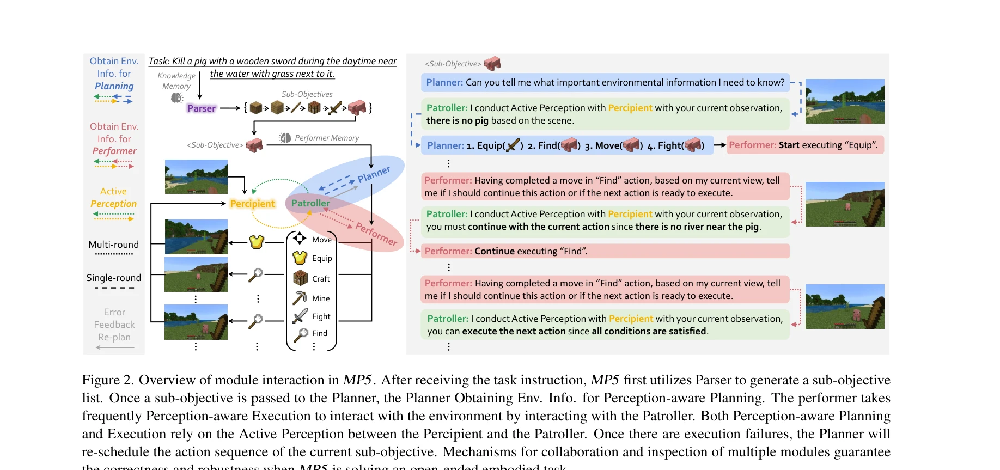
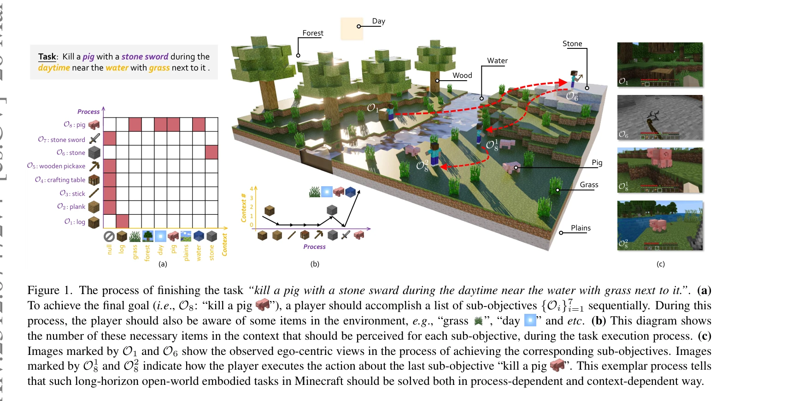

# MP5: A Multi-modal Open-ended Embodied System in Minecraft via Active Perception

> **저자**: Yiran Qin, Enshen Zhou, Qichang Liu, Zhenfei Yin, Lu Sheng, Ruimao Zhang, Yu Qiao, Jing Shao | **날짜**: 2023-12-12 | **URL**: [https://arxiv.org/abs/2312.07472](https://arxiv.org/abs/2312.07472)

---

## Essence

*Figure 2. Overview of module interaction in MP5. After receiving the task instruction, MP5 first utilizes Parser to gene*

MP5는 Minecraft에서 장기-지평선 개방형 태스크를 해결하기 위해 MLLMs 기반의 다중모듈 embodied 시스템으로, active perception scheme을 통해 프로세스 의존성과 컨텍스트 의존성을 모두 처리한다.

## Motivation

- **Known**: 최근 LLMs는 장기-지평선 태스크를 sub-objectives로 분해하는 데 성공했으나, 기존 접근법들은 정확한 장면 데이터를 가정하며 컨텍스트 의존적 실행에 취약하다.
- **Gap**: embodied 에이전트가 개방형 perception, 상황 인식 계획, 그리고 다중 모듈의 통합 스케줄링을 동시에 수행할 수 있는 시스템 설계가 부족하다.
- **Why**: 실제 embodied 환경에서 정확한 장면 정보 없이도 장기-지평선 개방형 태스크를 해결할 수 있는 robust 에이전트 개발이 embodied AI의 핵심 목표이기 때문이다.
- **Approach**: MP5는 Parser, Percipient, Planner, Performer, Patroller 5개 모듈을 설계하고, Percipient와 Patroller 간의 다중-라운드 active perception을 통해 상황-인식적 계획 및 실행을 가능하게 한다.

## Achievement

*Figure 1. The process of finishing the task “kill a pig with a stone sward during the daytime near the water with grass *

- **프로세스 의존 태스크 성공률**: diamond-level 난제에서 22% 성공률 달성
- **컨텍스트 의존 태스크 성공률**: 4-6개의 주요 항목을 인식해야 하는 복잡한 장면 이해 태스크에서 91% 성공률 달성
- **개방형 태스크 해결**: 완전히 새로운 개방형 태스크에 대한 우수한 일반화 능력 시연
- **MineLLM 개발**: Minecraft 특화 multimodal LLM 도입으로 perception 정확도 향상

## How

*Figure 2. Overview of module interaction in MP5. After receiving the task instruction, MP5 first utilizes Parser to gene*

- **Parser 모듈**: LoRA-augmented LLM으로 장기 태스크를 순차적 sub-objectives 목록으로 분해
- **Percipient 모듈**: LoRA-enabled MineLLM으로 관찰된 이미지에 대한 다양한 질문에 답변
- **Planner 모듈**: external Memory를 갖춘 LLM으로 sub-objective의 action sequence 설계 및 refinement
- **Performer 모듈**: action sequence를 환경에서 실행하며 Patroller와 빈번히 상호작용
- **Patroller 모듈**: Percipient, Planner, Performer의 응답을 검증하고 active perception을 조율하는 검사자 역할
- **Active Perception Scheme**: Patroller가 Planner와 Performer의 쿼리에 따라 Percipient와 다중-라운드 상호작용하여 context-aware 정보 추출

## Originality

- 기존의 all-seeing 가정을 제거하고 실제 embodied perception의 선택성과 목적-지향성을 반영한 active perception scheme 도입
- 단순 hierarchical decomposition을 넘어 context-aware execution을 위한 Patroller의 검증 메커니즘 설계
- Minecraft 특화 MineLLM 개발로 일반 MLLMs의 한계를 극복한 점
- 5개 모듈의 통합 인터페이스와 multi-round active perception을 통한 시스템적 혁신

## Limitation & Further Study

- 22% 프로세스 의존 태스크 성공률은 여전히 낮으며, 더 복잡한 multi-step 추론이 필요한 영역 개선 필요
- Minecraft라는 제한된 환경에서의 검증으로, 실제 로봇이나 현실 환경으로의 전이 가능성 검토 필요
- MineLLM의 학습 데이터 규모, 일반화 능력, 그리고 다른 domains로의 적용성에 대한 상세 분석 부족
- Active perception의 computational overhead와 latency에 대한 분석 및 최적화 방향 제시 필요
- 후속 연구로 real-world embodied agents에의 적용, 더 효율적인 perception 스케줄링, 그리고 multi-agent 시나리오 확장 고려

## Evaluation

- Novelty: 4/5
- Technical Soundness: 3/5
- Significance: 4/5
- Clarity: 4/5
- Overall: 4/5

**총평**: MP5는 active perception scheme을 통해 process-dependent와 context-dependent 태스크를 통합적으로 처리하는 창의적인 접근법을 제시하며, MLLMs 기반 embodied AI의 실질적 발전을 보여준다. 다만 절대적 성능 수치와 실제 환경 전이 가능성에 대한 추가 검증이 요구된다.

## Related Papers

- 🔗 후속 연구: [[papers/1442_JARVIS-1_Open-World_Multi-task_Agents_with_Memory-Augmented/review]] — Minecraft 환경에서 멀티모달 에이전트를 능동적 인식으로 발전시켜 더욱 포괄적인 개방형 작업 해결 능력을 구현합니다.
- 🔄 다른 접근: [[papers/1478_MineDreamer_Learning_to_Follow_Instructions_via_Chain-of-Ima/review]] — 두 논문 모두 Minecraft에서 장기 작업을 다루지만, 하나는 능동적 인식에, 다른 하나는 상상 기반 실행에 집중합니다.
- 🏛 기반 연구: [[papers/1477_Humanoid-Gym_Reinforcement_Learning_for_Humanoid_Robot_with/review]] — MineDojo의 개방형 에이전트 학습 환경이 멀티모달 체화 시스템의 기반 플랫폼을 제공합니다.
- 🧪 응용 사례: [[papers/1623_Voyager_An_Open-Ended_Embodied_Agent_with_Large_Language_Mod/review]] — 개방형 체화 에이전트의 탐험과 학습 방법론이 Minecraft에서 능동적 인식을 구현하는 데 활용됩니다.
- 🔗 후속 연구: [[papers/1442_JARVIS-1_Open-World_Multi-task_Agents_with_Memory-Augmented/review]] — Minecraft 환경에서 멀티모달 시스템을 더욱 발전시켜 능동적 인식과 개방형 작업 해결 능력을 강화한 형태입니다.
- 🔗 후속 연구: [[papers/1478_MineDreamer_Learning_to_Follow_Instructions_via_Chain-of-Ima/review]] — Chain-of-Imagination을 능동적 인식과 결합하여 더욱 포괄적인 Minecraft 에이전트를 구현할 수 있습니다.
- 🔄 다른 접근: [[papers/1563_Scaling_Instructable_Agents_Across_Many_Simulated_Worlds/review]] — MP5의 Minecraft 기반 embodied system과 SIMA의 다양한 3D 환경은 모두 embodied AI를 위한 서로 다른 게임 환경 접근법이다.
- 🔗 후속 연구: [[papers/1304_ALFRED_A_Benchmark_for_Interpreting_Grounded_Instructions_fo/review]] — MP5는 ALFRED의 벤치마크 개념을 Minecraft 환경에서 멀티모달 구체화 시스템으로 확장한다
