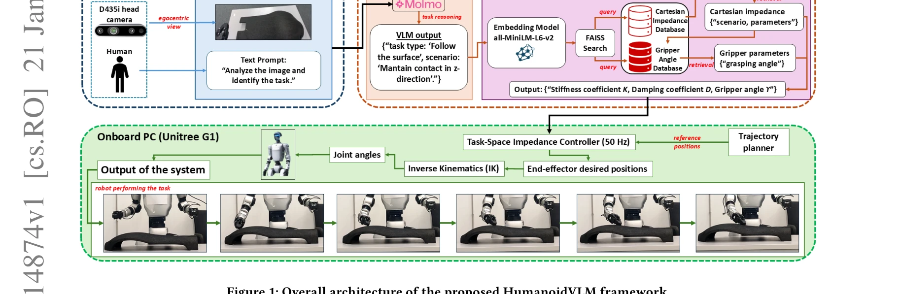
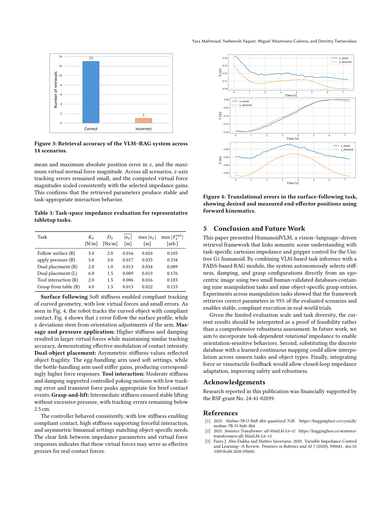

# HumanoidVLM: Vision-Language-Guided Impedance Control for Contact-Rich Humanoid Manipulation

> **저자**: Yara Mahmoud, Yasheerah Yaqoot, Miguel Altamirano Cabrera, Dzmitry Tsetserukou | **날짜**: 2026-01-21 | **URL**: [https://arxiv.org/abs/2601.14874](https://arxiv.org/abs/2601.14874)

---

## Essence

*Figure 1: Overall architecture of the proposed HumanoidVLM framework.*

HumanoidVLM은 Vision-Language Model과 Retrieval-Augmented Generation을 결합하여 Unitree G1 휴머노이드 로봇이 egocentric RGB 이미지로부터 작업에 적절한 Cartesian impedance 파라미터와 gripper 설정을 자동으로 선택하는 프레임워크를 제시한다.

## Motivation

- **Known**: Vision-Language Model은 강력한 semantic 이해 능력을 가지고 있으며, classical impedance control은 robot-environment interaction을 조절하기 위한 체계적인 방식을 제공한다. 기존 humanoid 제어 시스템은 주로 fixed, hand-tuned impedance gains에 의존한다.
- **Gap**: 현재의 humanoid 시스템은 visual semantics을 low-level manipulation 파라미터로 자동 변환할 수 없으며, contact-rich manipulation에서 task-dependent compliance를 동적으로 선택하는 능력이 부족하다.
- **Why**: Humanoid 로봇이 다양한 객체와 작업에 적응하려면 semantic perception과 compliant physical interaction의 연결이 필수적이며, 이는 안전하고 안정적인 human-robot collaboration을 위해 중요하다.
- **Approach**: VLM (Molmo-7B-O)을 사용하여 egocentric 이미지에서 manipulation task를 semantic하게 추론하고, FAISS-based RAG 모듈이 custom database에서 실험검증된 stiffness-damping 쌍과 object-specific grasp angle을 검색한 후, task-space impedance controller가 이를 실행한다.

## Achievement

*Figure 3: Retrieval accuracy of the VLM–RAG system across*

- **높은 retrieval 정확도**: 14개의 visual scenario에서 93%의 retrieval accuracy 달성
- **안정적인 상호작용 동역학**: z-axis tracking error가 1-3.5 cm 범위 내에서 유지되고 virtual force가 task-dependent impedance 설정과 일치
- **해석 가능한 제어**: semantic perception과 retrieval-based control의 연결로 adaptive humanoid manipulation의 실행 가능성 입증
- **실시간 시스템 구현**: 50 Hz task-space impedance controller와 external GPU 기반 VLM-RAG pipeline의 integrated 시스템 구현

## How

*Figure 1: Overall architecture of the proposed HumanoidVLM framework.*

- Molmo-7B-O 모델을 사용하여 structured yes/no queries로 task 추론
- all-MiniLM-L6-v2 sentence-transformer를 통해 semantic embedding 생성
- 두 개의 JSON database (impedance database, gripper database) 구축: 실제 G1 로봇 실험으로부터 검증된 파라미터 저장
- Cartesian mass-spring-damper 모델 적용: translational impedance parameters (K, D)는 VLM-RAG에서 선택, virtual mass M과 rotational impedance는 고정
- Impedance dynamics: M¥e + D¤e + Ke = 0 형태의 second-order ODE로 모델링
- Virtual force (Fvirt = Ke + D¤e)를 통해 physical contact force를 정량화
- Single-DoF gripper를 discrete action (open/close)으로 제어, 각 action은 database로부터 predefined joint angle target에 대응

## Originality

- VLM을 humanoid embodiment에 특화된 impedance control과 최초로 직접 연결
- Retrieval-augmented generation을 통해 hand-tuned impedance gains를 task-specific, experimentally-validated parameters로 대체
- Egocentric perception 기반으로 humanoid의 dual-arm manipulation에 adaptive compliance 적용
- Force-torque sensor 없이 virtual force 모델로 compliant interaction을 구현하는 practical 접근

## Limitation & Further Study

- Database coverage 제한: 9개의 조작 작업만 포함되어 있어 새로운 task에 대한 generalization 능력 미검증
- Force sensor 부재로 인한 제약: virtual force 모델은 실제 contact force의 proxy이며, 세밀한 force control이 필요한 작업에서 정확도 저하 가능
- Gripper 단순성: single-DoF gripper의 제약으로 복잡한 grasping 전략 불가능
- 시스템 지연: VLM-RAG 파이프라인이 external workstation에서 실행되므로 latency 영향 가능성
- 평가 제한: tabletop task 중심이며 dynamic interaction이 많은 작업에 대한 평가 부족
- 후속 연구: database 확장을 위한 systematic learning 메커니즘 개발, force-torque feedback 통합, 복잡한 객체 특성에 대한 더 정교한 impedance 선택 전략 필요

## Evaluation

- Novelty: 4/5
- Technical Soundness: 3/5
- Significance: 4/5
- Clarity: 4/5
- Overall: 4/5

**총평**: HumanoidVLM은 Vision-Language Model과 retrieval-augmented control을 통해 humanoid 로봇의 adaptive compliant manipulation을 실현하는 창의적이고 실용적인 접근을 제시한다. 높은 retrieval 정확도와 안정적인 실세계 성능으로 semantic perception과 low-level control의 의미 있는 연결을 시연하지만, database 확장성과 force feedback 통합 측면의 개선이 필요하다.

## Related Papers

- 🏛 기반 연구: [[papers/1445_Hierarchical_Vision-Language_Planning_for_Multi-Step_Humanoi/review]] — VLM 기반 작업 인식이 계층적 다단계 조작의 기반이 된다
- 🔄 다른 접근: [[papers/1452_HMC_Learning_Heterogeneous_Meta-Control_for_Contact-Rich_Loc/review]] — 둘 다 접촉 기반 휴머노이드 제어를 다루지만 HumanoidVLM은 VLM 기반에, HMC는 heterogeneous control에 집중한다
- 🔗 후속 연구: [[papers/1268_An_Empirical_Evaluation_of_Four_Off-the-Shelf_Proprietary_Vi/review]] — 멀티모달 VLM의 능력을 휴머노이드의 임피던스 제어에 특화하여 적용했다
- 🔗 후속 연구: [[papers/1445_Hierarchical_Vision-Language_Planning_for_Multi-Step_Humanoi/review]] — HumanoidVLM의 VLM 기반 임피던스 제어를 다단계 조작 계획으로 확장했다
- 🔄 다른 접근: [[papers/1452_HMC_Learning_Heterogeneous_Meta-Control_for_Contact-Rich_Loc/review]] — 둘 다 접촉 기반 휴머노이드 제어를 다루지만 HMC는 heterogeneous control에, HumanoidVLM은 VLM 기반 임피던스 제어에 집중한다
