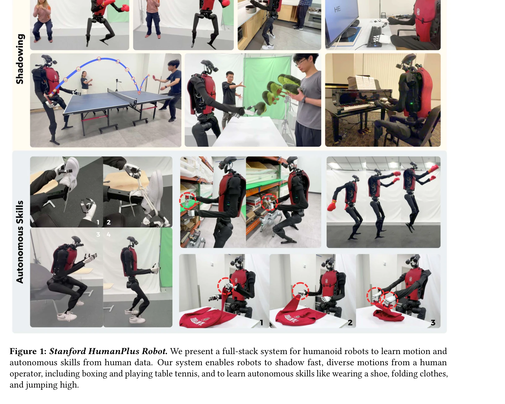

# HumanPlus: Humanoid Shadowing and Imitation from Humans

> **저자**: Zipeng Fu, Qingqing Zhao, Qi Wu, Gordon Wetzstein, Chelsea Finn | **날짜**: 2024-06-15 | **URL**: [https://arxiv.org/abs/2406.10454](https://arxiv.org/abs/2406.10454)

---

## Essence

*Figure 1: Stanford HumanPlus Robot. We present a full-stack system for humanoid robots to learn motion and*

인간 데이터로부터 휴머노이드 로봇이 모션과 자율 기술을 학습할 수 있는 풀스택 시스템을 제시하며, RGB 카메라를 통한 실시간 shadowing과 behavior cloning 기반 imitation learning을 결합한다.

## Motivation

- **Known**: 휴머노이드 로봇이 인간과 유사한 형태 인수를 가지고 있어 대규모 인간 데이터 활용이 가능하다는 주장이 있었으나, 실제 구현에서는 인식 및 제어의 복잡성, 형태학적·작동학적 차이, 그리고 egocentric vision 기반 학습 데이터 파이프라인의 부재로 인해 어려움을 겪어왔다.
- **Gap**: 휴머노이드의 복잡한 동역학과 고차원 상태/행동 공간에서 효율적인 전신 teleoperation과 실시간 모션 추적을 위한 저비용 시스템이 부재했으며, RGB 카메라만으로 whole-body 데이터를 수집하고 소수의 데모로부터 자율 기술을 학습할 수 있는 통합 파이프라인이 없었다.
- **Why**: 휴머노이드 로봇이 일반 목적 로봇으로서 인간이 완수할 수 있는 모든 작업을 해결하기 위해서는 인간 데이터를 효과적으로 활용해야 하며, 이를 통해 로봇 데이터 부족 문제를 우회하고 다양한 기술의 신속한 학습을 가능하게 할 수 있기 때문이다.
- **Approach**: Reinforcement Learning으로 simulation에서 task-agnostic low-level policy(Humanoid Shadowing Transformer)를 AMASS 40시간 모션 데이터셋으로 훈련하여 sim-to-real 전이를 실현하고, RGB 기반 human pose estimation과 retargeting을 통해 실시간 shadowing을 구현한 후, 수집된 egocentric RGB 데이터로 behavior cloning을 수행하여 Humanoid Imitation Transformer 기반의 vision-conditioned skill policy를 학습한다.

## Achievement

- **Shadowing System**: 단일 RGB 카메라와 Humanoid Shadowing Transformer를 활용하여 인간 operator가 실시간으로 33-DoF 휴머노이드의 전신을 제어 가능하게 함
- **Autonomous Skill Learning**: 최대 40개의 demonstration으로부터 신발 신기→일어나기→걷기, 창고 랙에서 물건 내리기, 스웨트셔츠 접기, 물건 정렬하기, 타이핑, 로봇 인사 등의 작업을 60-100% 성공률로 자율 완수
- **Data Pipeline**: Shadowing을 통해 real-world 기반 whole-body 데이터 수집 파이프라인 구축으로 motion capture 시스템의 고비용·위치 제약 해결
- **Zero-shot Transfer**: Simulation 기반 훈련된 low-level policy가 real-world 환경으로 zero-shot 전이 성공
- **Hybrid Architecture**: Action prediction과 forward dynamics prediction을 결합한 transformer 기반 구조로 image feature space 정규화를 통해 vision overfitting 방지

## How

- AMASS 40시간 human motion dataset으로부터 인간 pose를 humanoid pose로 retargeting하여 RL 훈련 데이터 생성
- Decoder-only transformer 구조의 Humanoid Shadowing Transformer를 훈련하여 retargeted humanoid pose를 conditioned input으로 받아 전신 joint control 출력
- State-of-the-art human body/hand pose estimation 알고리즘(예: [58], [81])으로 RGB 이미지로부터 실시간 human pose 추출
- 추출된 human pose를 humanoid morphology로 retargeting하여 Humanoid Shadowing Transformer의 입력으로 전달
- Egocentric binocular RGB 카메라를 통해 shadowing 중 whole-body data 수집
- 수집된 egocentric RGB와 proprioceptive 데이터로 behavior cloning 수행하여 vision-based skill policy 훈련
- Imitation learning에서 forward dynamics prediction을 auxiliary task로 추가하여 image feature 활용도 강화

## Originality

- Low-level policy의 task-agnostic 설계로 단일 policy가 다양한 skill을 수행하도록 구성한 점(기존 RL 기반 휴머노이드 접근은 task-specific이었음)
- 단일 RGB 카메라 기반 whole-body teleoperation 시스템 구현으로 모션 캡처·exoskeleton·VR 등 고비용 장비 대체
- Shadowing을 통한 실세계 데이터 수집 파이프라인으로 sim-to-real RGB perception gap 우회
- Action prediction과 forward dynamics prediction을 결합하는 transformer 기반 hybrid 아키텍처로 overfitting 문제 해결

## Limitation & Further Study

- **데모 수량**: 최대 40개 demonstration으로 학습하는 것은 여전히 매우 제한적이며, 더 복잡한 기술 학습을 위해서는 더 많은 데이터 필요 가능성
- **성공률 편차**: 60-100% 성공률로 작업 간 성능 편차가 상당하며, 실패 원인 분석 및 개선 방안이 상세히 제시되지 않음
- **일반화 능력**: 특정 환경·조건에서 수집된 데이터로 훈련된 skill이 다른 환경으로의 generalization 능력에 대한 평가 부족
- **Hardware Specificity**: 33-DoF 커스텀 휴머노이드에 특화된 시스템으로, 다른 휴머노이드 플랫폼으로의 전이 가능성 미불명
- **후속연구**: 더 적은 데모로 복잡한 기술 학습을 가능하게 하는 meta-learning 또는 few-shot learning 접근, 시뮬레이션 기반 pre-training의 영향도 정량화, 여러 휴머노이드 플랫폼 간 policy 전이 방법론 개발

## Evaluation

- Novelty: 4/5
- Technical Soundness: 4/5
- Significance: 4/5
- Clarity: 4/5
- Overall: 4/5

**총평**: HumanPlus는 휴머노이드 로봇이 인간 데이터로부터 효율적으로 학습할 수 있는 실용적인 풀스택 시스템을 구현함으로써, 로봇 학습의 데이터 부족 문제를 해결하고 자율 휴머노이드 개발에 대한 새로운 경로를 제시한다. 특히 RGB 기반 shadowing과 imitation learning의 결합은 높은 기술적 완성도와 실제 적용 가능성을 보여주며, 휴머노이드 분야에서 의미 있는 기여를 한다.

## Related Papers

- 🔄 다른 접근: [[papers/1440_HDMI_Learning_Interactive_Humanoid_Whole-Body_Control_from_H/review]] — 둘 다 인간 비디오로부터 휴머노이드 학습을 다루지만 HumanPlus는 전반적 스킬에, HDMI는 물체 상호작용에 집중한다
- 🔄 다른 접근: [[papers/1467_Humanoid_Locomotion_as_Next_Token_Prediction/review]] — 둘 다 인간 데이터로부터 휴머노이드 학습을 다루지만 HumanPlus는 모방학습에, Next Token은 transformer 기반에 집중한다
- ⚖️ 반론/비판: [[papers/1426_HumanPlus_Humanoid_Shadowing_and_Imitation_from_Humans/review]] — 동일한 HumanPlus 시스템이지만 다른 관점이나 개선사항을 제시할 수 있다
- 🏛 기반 연구: [[papers/1313_ComFree-Sim_A_GPU-Parallelized_Analytical_Contact_Physics_En/review]] — 고성능 물리 시뮬레이션의 기반 프레임워크를 제공하는 연구다
- 🔄 다른 접근: [[papers/1440_HDMI_Learning_Interactive_Humanoid_Whole-Body_Control_from_H/review]] — 둘 다 인간 동작 비디오로부터 휴머노이드 제어를 학습하지만 HDMI는 물체 상호작용에, HumanPlus는 전반적 스킬에 집중한다
- 🔄 다른 접근: [[papers/1467_Humanoid_Locomotion_as_Next_Token_Prediction/review]] — 둘 다 인간 데이터로부터 휴머노이드 학습을 다루지만 Next Token Prediction은 transformer 기반에, HumanPlus는 모방학습에 집중한다
- 🔗 후속 연구: [[papers/1468_Humanoid_Manipulation_Interface_Humanoid_Whole-Body_Manipula/review]] — HumanPlus의 인간 동작 학습을 로봇 없는 데이터 수집으로 확장했다
- 🧪 응용 사례: [[papers/1526_Learning_Human-to-Humanoid_Real-Time_Whole-Body_Teleoperatio/review]] — H2O의 휴머노이드 전신 제어 기법이 HumanPlus의 인간 모방 및 섀도잉 시스템에서 실제 적용될 수 있다.
- 🏛 기반 연구: [[papers/1550_Learning_with_pyCub_A_Simulation_and_Exercise_Framework_for/review]] — Python 기반 휴머노이드 시뮬레이션 pyCub이 MuJoCo Playground의 모듈형 시뮬레이션 프레임워크를 기반으로 한다.
- 🏛 기반 연구: [[papers/1567_Mechanical_Intelligence-Aware_Curriculum_Reinforcement_Learn/review]] — MuJoCo Playground의 GPU 가속 시뮬레이션 환경이 MJX 기반 폐곡선 운동학 시뮬레이션의 기술적 토대를 제공함
- 🔄 다른 접근: [[papers/1566_Masquerade_Learning_from_In-the-wild_Human_Videos_using_Data/review]] — 인간 비디오에서 휴머노이드 조작 학습의 다른 접근법으로 섀도잉과 모방 학습을 비교할 수 있다.
