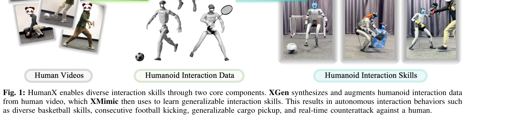
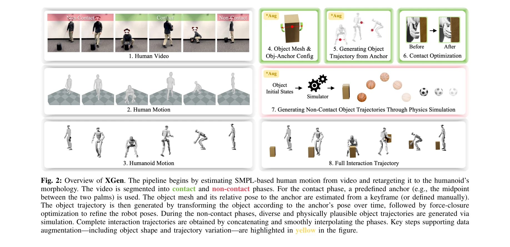

# HumanX: Toward Agile and Generalizable Humanoid Interaction Skills from Human Videos

> **저자**: Yinhuai Wang, Qihan Zhao, Yuen Fui Lau, Runyi Yu, Hok Wai Tsui, Qifeng Chen, Jingbo Wang, Jiangmiao Pang, Ping Tan | **날짜**: 2026-02-02 | **DOI**: [10.48550/arXiv.2602.02473](https://doi.org/10.48550/arXiv.2602.02473)

---

## Essence

*Fig. 1: HumanX enables diverse interaction skills through two core components. XGen synthesizes and augments humanoid in*

HumanX는 인간 영상으로부터 휴머노이드 로봇을 위한 상호작용 스킬을 학습하는 전체 스택 프레임워크로, XGen의 물리 기반 데이터 합성과 XMimic의 모방 학습을 통해 작업별 보상 설계 없이 일반화 가능한 실세계 상호작용 능력을 획득한다.

## Motivation

- **Known**: 인간 영상으로부터 휴머노이드 로봇으로 모션 retargeting하고 reinforcement learning으로 복잡한 동적 스킬을 학습하는 것이 유망하나, 모노큘러 영상에서의 인간-물체 상호작용 추정에서 occlusion과 depth ambiguity 문제가 있으며, RL은 작업별 reward engineering이 필요해 확장성이 제한된다.
- **Gap**: 기존 접근법들은 고품질 HOI 데이터의 부족 또는 세밀한 작업별 reward engineering의 필요성으로 인해 다양한 상호작용 스킬의 확장 가능한 학습이 제한되며, 실세계 배포 시 sim-to-real gap과 낮은 일반화 능력에 직면한다.
- **Why**: 휴머노이드 로봇이 인간 환경에서 자연스럽게 작동하고 일상 물체와 상호작용하기 위해서는 단일 영상 시연으로부터 다양한 상호작용 스킬을 효율적이고 확장 가능하게 획득할 수 있는 방법이 필수적이다.
- **Approach**: XGen은 모노큘러 영상에서 추출한 인간 모션을 retargeting하고 물리 시뮬레이션으로 로봇-물체 상호작용 궤적을 합성한 후 물체 형상과 궤적 변화로 augmentation하며, XMimic은 이 합성 데이터를 활용하여 통일된 보상 스킴으로 일반화 가능한 상호작용 스킬을 학습한다.

## Achievement

*Fig. 1: HumanX enables diverse interaction skills through two core components. XGen synthesizes and augments humanoid in*

- **다양한 도메인 스킬 획득**: 농구, 축구, 배드민턴, 짐 운반, 격투 등 5가지 도메인에서 10개의 서로 다른 스킬을 단일 영상 시연으로부터 학습
- **복잡한 기술 습득**: 외부 perception 없이 pump-fake turnaround fadeaway jumpshot과 같은 복잡한 기술 수행 (80% 이상 성공률)
- **지속적 상호작용**: 10회 이상의 연속 인간-로봇 패싱과 같은 폐루프 상호작용 달성
- **강력한 일반화**: 기존 방법 대비 8배 이상 높은 일반화 성공률 달성
- **실세계 전이**: Unitree G1 휴머노이드에서 zero-shot 전이로 실제 상호작용 수행
- **신시스 동작**: 물체 제거 후 자동 재파지싱, 페인트와 실제 공격 구별 등 emergent adaptive behavior 시현

## How

*Fig. 2: Overview of XGen. The pipeline begins by estimating SMPL-based human motion from video and retargeting it to the*

- **XGen의 인간 모션 처리**: SMPL 기반 인간 pose 추정 및 로봇 형태학으로 retargeting
- **물리 기반 객체 궤적 합성**: contact phase에서는 anchor 기반 객체 위치 추정 및 force-closure optimization으로 로봇 pose 정제, non-contact phase에서는 물리 시뮬레이션으로 다양한 궤적 생성
- **확장 가능한 데이터 augmentation**: 물체 메시 기하학적 스케일링, 접촉-비접촉 phase 변환 및 궤적 변동으로 단일 영상으로부터 광범위한 상호작용 분포 생성
- **XMimic의 통일 보상 스킴**: 정확한 모방과 복잡한 상호작용 행동 학습을 지원하는 reward 설계
- **유연한 perception 적응**: 다양한 실세계 perception 제약에 대응 가능한 정책
- **두 단계 teacher-student 학습**: 일반화 우선 학습으로 원본 시연 범위를 초과하는 generalization 달성
- **마찰 초기화 및 상호작용 우선 학습**: disturbed initialization과 interaction-prioritized objective로 robust한 배포 지원

## Originality

- **물리 기반 패러다임 전환**: photometric 충실성보다 물리적 타당성을 우선하는 새로운 데이터 합성 패러다임으로 occlusion과 depth ambiguity 문제 해결
- **작업 무관 HOI 학습**: task-specific reward engineering 없이 단일 통일 reward로 다양한 상호작용 스킬 습득
- **효율적 augmentation 전략**: 접촉 및 비접촉 phase 분리를 통한 차별화된 augmentation 방식으로 극도로 제한된 데이터로부터 일반화
- **폐루프 상호작용 능력**: 동적 객체 상호작용의 복잡성을 극복하고 지속적 인간-로봇 상호작용 실현
- **emergent 적응 행동**: 단순 모방을 넘어 페인트 감지, 물체 재파지싱 등 실시간 상호작용 추론 능력

## Limitation & Further Study

- **단일 영상 의존성**: 인간과 물체 상호작용의 초기 추정이 영상의 품질과 장면 복잡성에 크게 의존
- **로봇 형태학 특화**: SMPL-humanoid retargeting에 기반하여 다른 로봇 형태(쿼드러페드 등)로의 확장 용이성 미지수
- **Perception 제약**: 폐루프 상호작용 시 MoCap 시스템 의존으로 실제 배포 시 접근성 제약
- **객체 유형 한정**: 평가에서 상대적으로 형태가 간단한 물체(공, 박스) 중심으로 복잡한 기하학적 특성의 물체 적용 미검증
- **sim-to-real gap 명시적 분석 부족**: 합성 데이터와 실제 로봇 동역학 간 괴리에 대한 상세 분석 부재
- **후속 연구 방향**: (1) 다중 객체 상호작용, (2) 다양한 로봇 형태로의 확장, (3) 카메라 기반 폐루프 제어 통합, (4) 더 복잡한 환경 기하학으로의 확장

## Evaluation

- Novelty: 4/5
- Technical Soundness: 3/5
- Significance: 4/5
- Clarity: 4/5
- Overall: 4/5

**총평**: HumanX는 물리 기반 데이터 합성과 통일된 모방 학습을 통해 작업별 reward engineering을 제거하면서도 실세계 휴머노이드에서 강력한 일반화 능력을 보여주는 혁신적 프레임워크로, 단일 영상으로부터 다양한 상호작용 스킬 획득의 확장성 문제를 크게 진전시킨 의의 있는 연구이다.

## Related Papers

- 🔄 다른 접근: [[papers/1519_Learning_Athletic_Humanoid_Tennis_Skills_from_Imperfect_Huma/review]] — 둘 다 인간 영상으로부터 휴머노이드 스킬을 학습하지만 1485는 일반적 상호작용에, 1519는 특정 운동(테니스)에 특화됨
- 🏛 기반 연구: [[papers/1287_BeyondMimic_From_Motion_Tracking_to_Versatile_Humanoid_Contr/review]] — π₀ VLA 모델이 인간 영상으로부터 휴머노이드 상호작용 스킬을 학습하는 이론적 기반을 제공함
- 🧪 응용 사례: [[papers/1372_DROID_A_Large-Scale_In-The-Wild_Robot_Manipulation_Dataset/review]] — EgoMimic의 자기중심 영상 기반 모방 학습이 HumanX framework의 실제 구현 방법을 제시함
- 🔗 후속 연구: [[papers/1458_HuBE_Cross-Embodiment_Human-like_Behavior_Execution_for_Huma/review]] — HumanX의 상호작용 스킬 학습을 다양한 체형에 적용할 수 있도록 확장한 framework임
- 🔄 다른 접근: [[papers/1519_Learning_Athletic_Humanoid_Tennis_Skills_from_Imperfect_Huma/review]] — 둘 다 인간 영상에서 휴머노이드 스킬을 학습하지만 1519는 특정 운동(테니스)에, 1485는 일반적 상호작용에 특화됨
- 🏛 기반 연구: [[papers/1438_HandX_Scaling_Bimanual_Motion_and_Interaction_Generation/review]] — HumanX의 agile humanoid interaction 기법이 HandX의 양손 상호작용 모델링에 기반 아이디어를 제공합니다.
