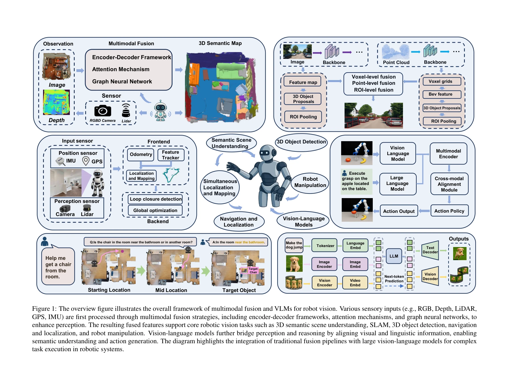

# Multimodal Fusion and Vision-Language Models: A Survey for Robot Vision

> **저자**: Xiaofeng Han, Shunpeng Chen, Zenghuang Fu, Zhe Feng, Lue Fan, Dong An, Changwei Wang, Li Guo, Weiliang Meng, Xiaopeng Zhang, Rongtao Xu, Shibiao Xu | **날짜**: 2025-04-03 | **URL**: [https://arxiv.org/abs/2504.02477](https://arxiv.org/abs/2504.02477)

---

## Essence

*Figure 1: The overview figure illustrates the overall framework of multimodal fusion and VLMs for robot vision. Various *

로봇 비전을 위한 멀티모달 융합 기법과 Vision-Language Model(VLM)의 응용을 체계적으로 리뷰하며, encoder-decoder, attention, graph neural network 등의 융합 전략과 SLAM, 3D 객체 감지, 네비게이션, 조작 등 핵심 로봇 태스크에서의 실제 구현을 분석한다.

## Motivation

- **Known**: 전통적인 unimodal 접근법은 occlusion, 조명 변화, 텍스처 부족 등의 복잡한 환경에서 인식 제약을 겪으며, encoder-decoder, Transformer, contrastive learning 등이 모달리티 간 의존성 모델링에 널리 사용되고 있다.
- **Gap**: 기존 리뷰들은 semantic segmentation과 object detection 같은 기본 태스크에 주로 집중하였으며, multimodal SLAM, 로봇 조작, embodied navigation 같은 복잡한 추론과 장기 결정 태스크에 대한 체계적 분석이 부족하다.
- **Why**: 멀티모달 융합과 VLM은 로봇의 강건한 장면 이해, 일반화, 자연스러운 인간-로봇 상호작용을 가능하게 하며, 동적이고 불완전하게 관찰 가능한 환경에서의 실용적 가치가 크다.
- **Approach**: task-oriented 관점에서 semantic scene understanding, SLAM, 3D detection, navigation, manipulation 등 5개 핵심 태스크에 대해 멀티모달 융합 아키텍처와 VLM을 비교 분석하며, 주요 데이터셋과 실제 배포 시 직면하는 과제를 도출한다.

## Achievement

*Figure 1: The overview figure illustrates the overall framework of multimodal fusion and VLMs for robot vision. Various *

- **전통적 융합과 VLM의 통합 분석**: 아키텍처 설계, 기능 특성, 적용 태스크 측면에서 encoder-decoder, attention, graph neural network 기반 방법과 LLM 기반 VLM의 연결성과 상호보완성을 체계적으로 비교
- **복잡한 로봇 태스크 확장**: multimodal SLAM, 로봇 조작, embodied navigation 등 복잡한 추론과 장기 결정 태스크에서의 멀티모달 융합과 VLM의 잠재력을 시연
- **멀티모달 우위 명확화**: unimodal 접근법 대비 강화된 인식 강건성, 의미론적 표현성, cross-modal alignment, 고수준 추론의 이점 강조
- **멀티모달 데이터셋 체계화**: 모달 조합, 커버 태스크, 적용 시나리오, 한계를 포함한 주요 로봇 데이터셋의 심층 분석 제공
- **핵심 과제 및 미래 방향 제시**: cross-modal alignment, efficient training, real-time optimization 과제를 식별하고 self-supervised learning, structured spatial memory, adversarial robustness 등 해결책 제안

## How

*Figure 1: The overview figure illustrates the overall framework of multimodal fusion and VLMs for robot vision. Various *

- Encoder-decoder framework를 통한 heterogeneous 모달리티 통합 및 unified feature representation 설계
- Attention-based 아키텍처를 이용한 modality alignment과 cross-modal attention 메커니즘 적용
- Graph neural network를 활용한 scene 내 relational structure 모델링
- Transformer 기반 구조로 모달리티 간 의존성 모델링
- Contrastive learning과 자체 지도 학습(self-supervised learning)을 통한 robust multimodal representation 학습
- 대규모 pretrained VLM (LLM 기반)의 zero-shot, instruction following, visual question answering 능력 활용
- SLAM, 3D detection, navigation, manipulation 등 5개 핵심 태스크에서의 실제 구현 분석
- 공개 데이터셋의 모달 조합, 커버리지, 한계 평가

## Originality

- 전통적 multimodal fusion 방법과 emerging VLM을 통합하여 아키텍처, 기능, 적용 측면에서 체계적으로 비교 분석한 최초의 종합 리뷰
- 기존 리뷰 대비 5개 핵심 로봇 태스크(semantic understanding, SLAM, 3D detection, navigation, manipulation)를 모두 포함한 확장된 스코프
- Cross-modal self-supervised learning과 lightweight fusion 방법론을 명시적으로 다룬 첫 번째 리뷰
- Multimodal SLAM과 embodied navigation 같은 복잡한 장기 결정 태스크에서의 VLM 활용 분석을 최초로 제시
- Real-world robotic deployment 관점에서의 domain adaptation, adversarial robustness, human feedback 통합 등 실용적 과제 제시

## Limitation & Further Study

- 현재 리뷰의 범위가 RGB, depth, LiDAR, tactile 등 기본 센서 모달리티에 주로 제한되어 있으며, thermal, event-based camera 등 추가 모달리티의 활용 가능성 미흡
- Cross-modal alignment 문제에 대한 일반화된 솔루션이 부재하여 task-specific 해법에 의존
- 제한된 주석 데이터(limited annotated data)와 동적 환경에서 pretrained VLM의 적응성 여전히 제한적
- Real-time deployment와 계산 효율성 간의 trade-off에 대한 구체적 설계 지침 부족
- **후속 연구 방향**: (1) efficient training 메커니즘으로 computational cost 감소, (2) cross-modal self-supervised learning 강화, (3) structured spatial memory와 environment modeling으로 spatial intelligence 향상, (4) adversarial robustness와 human feedback 통합으로 윤리적 배포 실현

## Evaluation

- Novelty: 4/5
- Technical Soundness: 3/5
- Significance: 4/5
- Clarity: 4/5
- Overall: 4/5

**총평**: 본 리뷰는 로봇 비전 분야에서 멀티모달 융합과 VLM의 응용을 가장 포괄적으로 다룬 첫 번째 종합 리뷰로서, 5개 핵심 로봇 태스크, cross-modal self-supervised learning, lightweight fusion 등을 체계적으로 분석하고 명확한 미래 방향을 제시하여 향후 로봇 비전 연구의 중요한 참고 자료가 될 수 있다.

## Related Papers

- 🧪 응용 사례: [[papers/1469_Humanoid_Occupancy_Enabling_A_Generalized_Multimodal_Occupan/review]] — 로봇 비전을 위한 멀티모달 융합 기법의 체계적 분석이 휴머노이드 occupancy 인식 시스템 설계에 적용됩니다.
- 🔗 후속 연구: [[papers/1607_Vision-Language_Navigation_A_Survey_and_Taxonomy/review]] — 시각-언어 네비게이션 서베이를 멀티모달 융합과 VLM 관점에서 확장하여 더욱 포괄적인 분석을 제공합니다.
- 🏛 기반 연구: [[papers/1608_Perceptive_Humanoid_Parkour_Chaining_Dynamic_Human_Skills_vi/review]] — VLA 모델의 개념과 응용이 로봇 비전에서 멀티모달 융합의 이론적 토대를 제공합니다.
- 🔗 후속 연구: [[papers/1590_Omni-Perception_Omnidirectional_Collision_Avoidance_for_Legg/review]] — 범용 로봇을 위한 기초 모델 서베이를 멀티모달 융합과 VLM의 구체적 적용으로 심화 발전시킨 형태입니다.
- 🏛 기반 연구: [[papers/1469_Humanoid_Occupancy_Enabling_A_Generalized_Multimodal_Occupan/review]] — 로봇 비전을 위한 멀티모달 융합 기법이 occupancy 인식 시스템의 다중 센서 통합 방법론의 토대가 됩니다.
