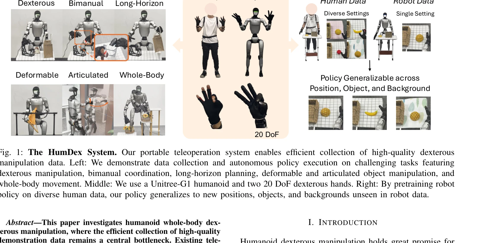

# HumDex: Humanoid Dexterous Manipulation Made Easy

> **저자**: Liang Heng, Yihe Tang, Jiajun Xu, Henghui Bao, Di Huang, Yue Wang | **날짜**: 2026-03-12 | **URL**: [https://arxiv.org/abs/2603.12260](https://arxiv.org/abs/2603.12260)

---

## Essence

*Fig. 1: The HumDex System. Our portable teleoperation system enables efficient collection of high-quality dexterous*

IMU 기반 모션 트래킹을 활용한 휴머노이드 전신 손재주 조작용 휴대식 텔레오퍼레이션 시스템으로, learning-based 핸드 리타겟팅과 두 단계 모방 학습(인간 데이터 사전학습 + 로봇 데이터 파인튜닝)을 통해 최소 데이터로 새로운 환경에 대한 일반화를 달성한다.

## Motivation

- **Known**: 기존 텔레오퍼레이션 시스템은 모션캡처(고정 인프라 필요), 엑소스켈레톤(휴대성 낮음), VR 기반(폐색 문제)의 trade-off를 가지며, 인간 데이터를 활용한 테이블탑 조작 연구는 존재하지만 휴머노이드 손재주 조작에 적용된 사례는 제한적이다.
- **Gap**: 휴머노이드 전신 손재주 조작의 고품질 시연 데이터 수집이 병목이며, 기존 최적화 기반 핸드 리타겟팅은 정확도와 일반화 성능이 낮고, 큰 embodiment gap으로 인해 인간 데이터를 직접 활용하기 어렵다.
- **Why**: 휴머노이드 로봇이 실제 환경에서 복잡한 장시간 작업을 수행하려면 효율적이고 정확한 데이터 수집 방식이 필수적이며, 인간 데이터를 활용할 수 있다면 수집 비용을 크게 절감할 수 있다.
- **Approach**: IMU 15개를 착용하여 폐색 없는 전신 추적을 달성하고, learning-based MLP 리타겟팅으로 부드러운 핸드 제어를 구현한 후, 두 단계 프레임워크로 인간 데이터의 일반적 동작 사전을 학습하고 로봇 데이터로 정확한 실행을 파인튜닝한다.

## Achievement

*Fig. 3: Evaluation Tasks and Generalization. We visualize the initial state and key steps in our evaluated tasks. In the*

- **휴대식 고정밀 텔레오퍼레이션**: IMU 기반 추적으로 고정 인프라 없이 다양한 환경에서 포괄적 전신 동작 추적 가능
- **Learning-based 핸드 리타겟팅**: 최적화 기반 대비 실제 배포에서 현저히 우수한 성능으로 수동 파라미터 튜닝 제거
- **두 단계 모방 학습**: 인간 데이터 사전학습으로 일반화 능력 향상, 로봇 데이터 파인튜닝으로 embodiment gap 해소
- **최소 데이터 일반화**: 새로운 객체, 위치, 배경에 대한 일반화를 로봇 데이터 수집 최소화 상태에서 달성
- **복잡한 작업 지원**: 20 DoF 손재주 제어, 양팔 조정, 장시간 계획, 변형/관절 객체 조작 등 다양한 과제 시연

## How

*Fig. 2: System Overview. (A) Our teleoperation pipeline and hand retargeting policy training. (B) Our imitation learning*

- IMU 센서 15개로 operator 전신의 위치와 방향 추적, 포괄적 동작 범위 지원
- 5개 손가락 끝점(fingertip) 위치로부터 로봇 손 관절각을 예측하는 lightweight MLP regressor 훈련
- 자동화된 필터로 파인 pinch 실패, 비정상 각도 등 저품질 프레임 제거
- 인간 데이터에서 retargeting 결과를 joint target으로 사용하고 전 프레임 action으로 proprioceptive state 근사
- Stage 1: 다양한 인간 시연으로 ACT policy 사전학습으로 일반적 동작 패턴 학습
- Stage 2: 로봇 텔레오퍼레이션 데이터로만 파인튜닝하여 로봇 embodiment에 맞게 정제
- Egocentric RGB와 approximated proprioceptive state를 입력으로 action chunk 예측

## Originality

- **IMU 기반 텔레오퍼레이션의 새로운 적용**: 모션캡처와 VR의 trade-off를 우회하여 high-precision과 portability 동시 달성
- **Learning-based 핸드 리타겟팅**: 최적화 기반에서 벗어나 실시간 이추론과 수동 튜닝 제거
- **인간 데이터의 체계적 활용**: 휴머노이드 손재주 조작에서 embodiment gap을 극복하는 두 단계 프레임워크 제안
- **개방형 재현성**: 전체 시스템을 open-source로 제공하여 재현성과 확장성 보장
- **복합 작업의 통합 지원**: 전신 동작, 양팔 조정, 손재주 제어를 단일 시스템에서 통합

## Limitation & Further Study

- Embodiment gap 완전 해소 부재: 인간과 로봇 체형 차이로 인한 정확도 손실 여전히 존재 가능성
- 로봇 파인튜닝 데이터 필요성: 완전히 인간 데이터만으로는 불충분하며 로봇 데이터 파인튜닝 단계 필수
- Hand retargeting의 5 fingertip 기반 제약: 손가락 끝점만 사용하므로 손 내부 복잡한 관절 제어에 제한 가능성
- 다양한 로봇 플랫폼 검증 부족: Unitree-G1와 특정 20 DoF 손만 시험하여 타 로봇 체형 적응성 미검증
- **후속 연구**: 더 효율적 embodiment gap 해소 방법, 다양한 로봇 플랫폼 일반화, 손가락 관절 제어 정밀도 향상, 강화 학습을 통한 사후 최적화

## Evaluation

- Novelty: 4/5
- Technical Soundness: 3/5
- Significance: 4/5
- Clarity: 4/5
- Overall: 4/5

**총평**: HumDex는 휴머노이드 손재주 조작 데이터 수집의 실질적 병목을 IMU 기반 텔레오퍼레이션과 learning-based 리타겟팅으로 효과적으로 해결하며, 인간 데이터를 체계적으로 활용하는 두 단계 학습 프레임워크로 최소 로봇 데이터 수집으로도 새로운 환경에 대한 일반화를 달성한다. 재현성 높은 open-source 공개와 복합한 실제 작업 시연으로 로보틱스 커뮤니티에 실질적 기여를 한다.

## Related Papers

- 🔄 다른 접근: [[papers/1479_HumanoidExo_Scalable_Whole-Body_Humanoid_Manipulation_via_We/review]] — 둘 다 휴머노이드 조작을 다루지만 HumDex는 손재주에, HumanoidExo는 데이터 수집에 집중한다
- 🏛 기반 연구: [[papers/1341_Dexterous_Teleoperation_of_20-DoF_ByteDexter_Hand_via_Human/review]] — Dexterous Teleoperation의 손 제어 기술이 HumDex의 손재주 조작의 기반이 된다
- 🔗 후속 연구: [[papers/1335_DexCap_Scalable_and_Portable_Mocap_Data_Collection_System_fo/review]] — DexCap의 모션 캡처를 IMU 기반 휴머노이드 전신 제어로 확장했다
