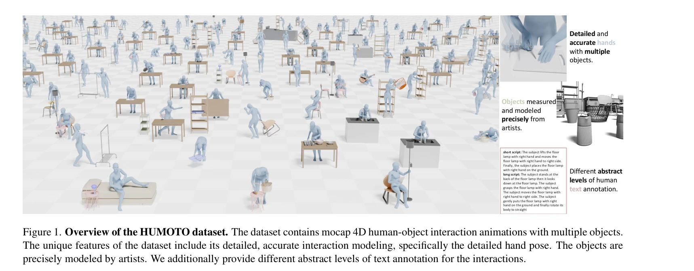

# HUMOTO: A 4D Dataset of Mocap Human Object Interactions

> **저자**: Jiaxin Lu, Chun-Hao Paul Huang, Uttaran Bhattacharya, Qixing Huang, Yi Zhou | **날짜**: 2025-04-14 | **URL**: [https://arxiv.org/abs/2504.10414](https://arxiv.org/abs/2504.10414)

---

## Essence

*Figure 1. Overview of the HUMOTO dataset. The dataset contains mocap 4D human-object interaction animations with multipl*

HUMOTO는 735개 시퀀스(7,875초)로 구성된 고품질 4D 인간-객체 상호작용 데이터셋으로, 63개의 정밀하게 모델링된 객체와 72개의 관절화된 부위를 포함하여 다양한 일상 활동을 캡처한다.

## Motivation

- **Known**: 기존 HOI 데이터셋(GRAB, BEHAVE, OMOMO 등)은 제한된 객체 수, 부정확한 손-객체 상호작용, 또는 고정된 장면으로 인해 복잡한 실제 다중 객체 상호작용을 충분히 캡처하지 못했다.
- **Gap**: 특히 다중 객체와의 상호작용, 정밀한 손 움직임, 그리고 의미있는 작업 흐름이 있는 포괄적인 4D HOI 데이터가 부족했다.
- **Why**: 고품질 HOI 데이터는 모션 생성, 로봇공학, 컴퓨터 비전, embodied AI 시스템의 발전에 필수적이며, 정확한 인간-객체 상호작용 모델링은 애니메이션, 로봇 학습, 이미지/비디오 생성 등 다양한 응용에 중요하다.
- **Approach**: Scene-Driven LLM Scripting 파이프라인으로 자연스러운 작업 진행 흐름을 가진 완전한 시나리오를 생성하고, motion capture 슈트와 dual-Kinect RGB-D 센서를 활용한 다중 센서 시스템으로 폐색 상황에서도 정밀한 캡처를 수행한 후, 전문 아티스트에 의한 철저한 검증과 정제를 진행했다.

## Achievement

*Figure 2. Scene-Driven LLM Scripting. We established target*

1. **대규모 고충실도 데이터셋**: 735개 시퀀스, 63개 정밀 모델링 객체, 72개 관절화된 부위를 포함한 포괄적인 HOI 데이터셋 구축
2. **Scene-Driven LLM Scripting**: 목표 장면에 기반한 계층적 시나리오 생성으로 의미있고 다양한 일상 활동 캡처
3. **다중 센서 통합 방식**: EMF 기술 mocap 슈트와 RGB-D 센서 결합으로 폐색 상황에서도 세부 상호작용 정확도 확보
4. **품질 평가 메트릭**: HOI 데이터셋의 정량적 평가를 위한 벤치마크 및 평가 지표 제시
5. **엄격한 데이터 정제**: 전문 아티스트에 의한 독립적 검증으로 foot sliding과 object penetration 최소화

## How

*Figure 2. Scene-Driven LLM Scripting. We established target*

- Scene-Driven LLM Scripting: 요리, 정리정돈, 야외 활동 등 다양한 장면에 대해 LLM이 자연스러운 동작 스크립트 생성
- 다중 센서 캡처: electromagnetic field 기술 mocap 슈트로 인간 동작 추적, dual-Kinect RGB-D 센서로 객체 포즈 기록
- 객체 모델링: 실제 측정 데이터를 기반으로 전문 아티스트가 63개 객체를 정밀하게 3D 메시 모델링
- 데이터 정제: 각 시퀀스를 전문 아티스트가 검증하고 정제하여 자연스럽면서도 정확한 움직임 보장
- 텍스트 주석: 짧은 스크립트, 긴 스크립트 등 다양한 추상 수준의 텍스트 주석 제공

## Originality

- Scene-Driven LLM Scripting 파이프라인으로 의미있는 작업 흐름과 자연스러운 진행을 보장하는 새로운 데이터 생성 방식 제시
- EMF mocap 슈트와 RGB-D 센서를 결합한 다중 센서 시스템으로 폐색 문제 해결
- 전문 아티스트의 엄격한 검증과 정제 프로세스로 기존 대비 우수한 데이터 품질 달성
- HOI 데이터셋의 정량적 평가를 위한 메트릭과 벤치마크 체계 도입

## Limitation & Further Study

- 캡처 비용과 전문 자원의 높은 요구로 인해 추가 데이터 확장의 어려움
- 실험실 환경에서 캡처된 데이터로 야생 환경(in-the-wild) 상황의 일반화 성능은 미지수
- 선정된 63개 객체와 5개 장면(침실, 거실, 욕실, 주방, 야외)이 실제 인간-객체 상호작용의 전체 다양성을 대표하지 못할 수 있음
- 후속 연구에서는 더 다양한 객체 카테고리, 사용자 그룹, 문화적 맥락을 포함하도록 확장 필요

## Evaluation

- Novelty: 4/5
- Technical Soundness: 3/5
- Significance: 4/5
- Clarity: 4/5
- Overall: 4/5

**총평**: HUMOTO는 다중 객체와의 정밀한 상호작용을 포함한 고품질 4D HOI 데이터셋으로, Scene-Driven LLM Scripting과 다중 센서 통합 방식을 통해 기존 데이터셋의 한계를 극복했으며, 모션 생성, 로봇공학, 컴퓨터 비전 분야의 중요한 자산이 될 것으로 기대된다.

## Related Papers

- 🔗 후속 연구: [[papers/1573_SimpleVLA-RL_Scaling_VLA_Training_via_Reinforcement_Learning/review]] — HUMOTO의 고품질 4D 상호작용 데이터가 Mimicking-Bench의 휴머노이드-장면 상호작용 벤치마크를 보완함
- 🏛 기반 연구: [[papers/1376_EgoScale_Scaling_Dexterous_Manipulation_with_Diverse_Egocent/review]] — EmbodMocap의 4D 인간-장면 재구성 기술이 고품질 모션캡처 데이터셋 구축의 기반을 제공함
- 🧪 응용 사례: [[papers/1355_DexGarmentLab_Dexterous_Garment_Manipulation_Environment_wit/review]] — DexGarmentLab의 정밀한 조작 환경이 4D 인간-객체 상호작용 데이터의 실제 활용 사례를 보여줌
- 🏛 기반 연구: [[papers/1305_ClimbingCap_Multi-Modal_Dataset_and_Method_for_Rock_Climbing/review]] — 복잡한 인간-물체 상호작용 데이터 구축의 방법론적 기반을 제공한다
- 🔗 후속 연구: [[papers/1324_CRISP_Contact-Guided_Real2Sim_from_Monocular_Video_with_Plan/review]] — contact-guided real2sim을 4D human-object interaction 데이터로 확장한 연구다
- 🔗 후속 연구: [[papers/1364_Efficient_and_Scalable_Monocular_Human-Object_Interaction_Mo/review]] — 4D human-object interaction을 더 대규모 데이터셋으로 확장한 연구다
- 🏛 기반 연구: [[papers/1573_SimpleVLA-RL_Scaling_VLA_Training_via_Reinforcement_Learning/review]] — HUMOTO의 고품질 4D 상호작용 데이터가 휴머노이드-장면 상호작용 벤치마크의 기반 데이터를 제공함
- 🧪 응용 사례: [[papers/1549_Learning_Whole-Body_Human-Humanoid_Interaction_from_Human-Hu/review]] — HUMOTO의 고품질 인간-객체 상호작용 데이터가 인간-휴머노이드 협력 학습의 훈련 데이터를 제공함
