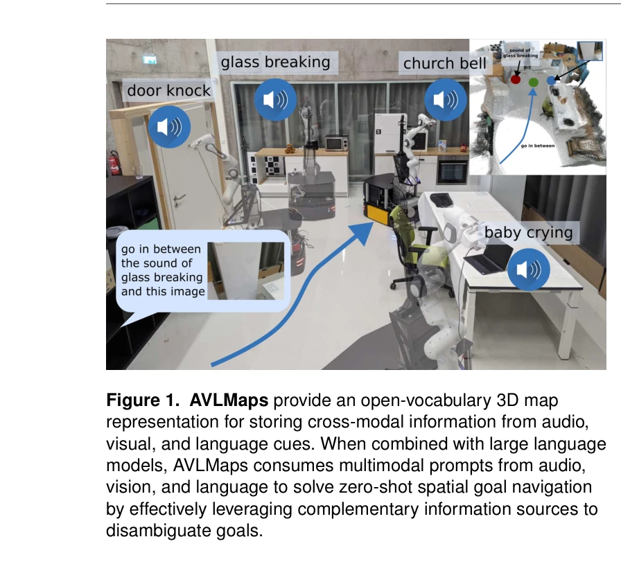
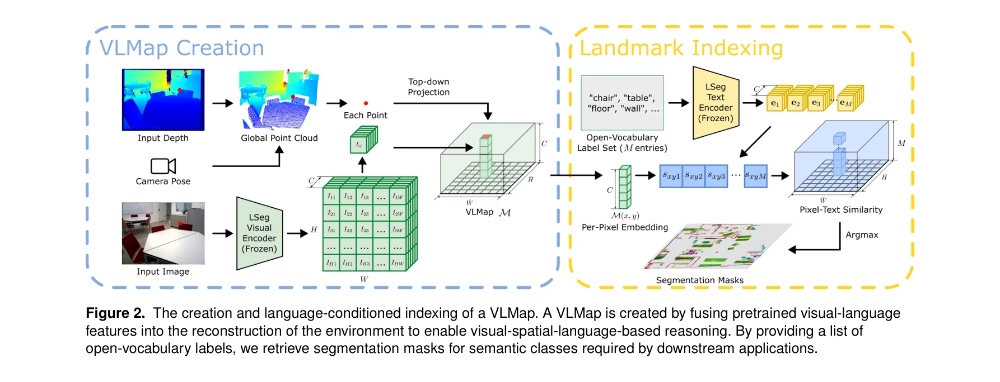

# Multimodal Spatial Language Maps for Robot Navigation and Manipulation

> **저자**: Chenguang Huang, Oier Mees, Andy Zeng, Wolfram Burgard | **날짜**: 2025-06-07 | **URL**: [https://arxiv.org/abs/2506.06862](https://arxiv.org/abs/2506.06862)

---

## Essence

*Figure 1. AVLMaps provide an open-vocabulary 3D map*

로봇 네비게이션과 조작을 위해 pretrained multimodal foundation model의 특징을 3D 환경 재구성과 융합한 spatial language map (VLMaps, AVLMaps)을 제안한다. 이를 통해 자연어, 이미지, 오디오 등 다중모달 쿼리를 공간상의 목표 위치로 그라운딩할 수 있다.

## Motivation

- **Known**: Vision-language models (VLMs)는 pretrained multimodal foundation models을 활용하여 로봇의 시각 관찰을 객체 설명에 매칭할 수 있다. 하지만 기존 방법들은 환경 매핑과 단절되어 있거나 공간적 정확도가 부족하며 비전 정보만 사용한다.
- **Gap**: 기존 언어-기반 로봇 네비게이션 방법들은 'sofa와 TV 사이'와 같은 공간적 관계 표현을 지역화할 수 없고, 다양한 로봇 플랫폼에서 재사용 불가능하며, 오디오 같은 추가 모달리티를 활용하지 못한다.
- **Why**: 로봇이 복잡한 자연언어 지시를 따르고 다양한 센서 입력을 활용하여 모호한 환경에서 목표를 정확히 식별할 수 있도록 하는 것은 실제 로봇 응용에 필수적이다.
- **Approach**: Pretrained multimodal foundation models (vision-language 및 audio-language models)의 특징을 3D voxelized map에 밀집적으로 융합하여 공간-의미론적 표현을 구축한다. VLMaps은 시각-언어 특징을, AVLMaps은 여기에 오디오 정보를 추가로 통합한다.

## Achievement

*Figure 1. AVLMaps provide an open-vocabulary 3D map*

- **VLMaps 개발**: Pretrained multimodal features를 3D 환경 재구성과 융합하여 'sofa와 TV 사이'같은 공간 관계를 직접 지역화 가능", '**다양한 로봇 플랫폼 지원**: 동일 voxelized map에서 서로 다른 로봇 형태를 위한 맞춤형 obstacle map을 생성 가능
- **AVLMaps 확장**: 오디오, 시각, 언어 정보를 통합한 통일된 3D 공간 표현으로 멀티모달 목표 쿼리 지원
- **성능 향상**: 모호한 시나리오에서 top-1 recall이 기존 방법 대비 50% 향상, zero-shot 다중모달 목표 네비게이션 달성
- **다양한 로봇 작업 지원**: Mobile robots과 tabletop manipulators 모두에서 네비게이션 및 조작 작업 수행 가능

## How

*Figure 2. The creation and language-conditioned indexing of a VLMap. A VLMap is created by fusing pretrained visual-lang*

- 표준 exploration 알고리즘을 사용하여 로봇의 비디오 스트림과 오디오 녹음으로부터 multimodal spatial language map 자동 구축
- Pretrained multimodal foundation models (CLIP, AudioCLIP, CLAP 등)에서 밀집 특징을 계산하고 3D voxel grid에 융합
- Large Language Models (LLMs)와 Socratic 방식으로 조합하여 자연언어 명령을 공간적으로 그라운딩된 목표 시퀀스로 변환
- 다중모달 쿼리(텍스트, 이미지, 오디오 스니펫)를 voxel grid에서 공간 위치로 매칭하여 목표 지역화
- 오디오, 시각, 의미론적 정보를 활용하여 모호한 환경에서 다양한 가능한 목표 위치 중 올바른 위치 식별

## Originality

- Semantic mapping과 multimodal foundation models을 처음으로 3D spatial representation에 통합하여 공간적 정밀도와 개방형 어휘 이해 동시 달성
- Audio modality를 로봇 네비게이션 맵에 처음으로 체계적으로 도입하여 공간적 다중모달 쿼리 지원
- 단일 map representation이 여러 로봇 embodiments에서 재사용 가능한 설계로 멀티모달 spatial reasoning을 유연하게 확장
- Multimodal ambiguity resolution을 spatial context를 활용하여 해결하는 혁신적 접근법

## Limitation & Further Study

- Pretrained multimodal foundation models의 성능에 크게 의존하므로, 모델 성능 향상에 따라 시스템 성능이 제한됨
- 3D reconstruction quality에 의존하여 poorly reconstructed areas에서 기능 저하 가능
- 계산 비용이 모든 voxel에서 multimodal features를 계산해야 하므로 메모리 및 처리 시간 증가
- Real-world 설정에서의 제한된 평가 - 더 다양한 환경과 시나리오에서의 강건성 검증 필요
- 오디오 정보는 실내 환경에서만 수집 가능하고, 배경 음향 잡음에 대한 robustness 개선 필요
- 향후 다른 센서 모달리티(LiDAR, thermal imaging 등) 통합 탐색 필요

## Evaluation

- Novelty: 4/5
- Technical Soundness: 3/5
- Significance: 4/5
- Clarity: 4/5
- Overall: 4/5

**총평**: 본 논문은 multimodal foundation models을 3D spatial map에 창의적으로 통합하여 기존 방법의 공간 정밀도와 멀티모달 이해 한계를 동시에 해결한 의미 있는 기여다. Audio modality의 도입과 다양한 로봇 플랫폼 지원으로 실용적 확장성이 우수하며, 50% 성능 향상 등 정량적 결과도 강력하다.

## Related Papers

- 🏛 기반 연구: [[papers/1461_LM-Nav_Robotic_Navigation_with_Large_Pre-Trained_Models_of_L/review]] — 사전훈련된 멀티모달 모델의 특징을 공간적으로 융합하는 방법론이 로봇 네비게이션의 기반 기술을 제공합니다.
- 🔄 다른 접근: [[papers/1470_MapNav_A_Novel_Memory_Representation_via_Annotated_Semantic/review]] — 두 논문 모두 공간적 언어 표현을 다루지만, 하나는 3D 융합에, 다른 하나는 top-down 맵에 집중합니다.
- 🔗 후속 연구: [[papers/1612_Visual_Language_Maps_for_Robot_Navigation/review]] — 기본적인 시각 언어 맵을 멀티모달(언어, 이미지, 오디오) 쿼리가 가능한 공간 맵으로 발전시킨 형태입니다.
- 🏛 기반 연구: [[papers/1505_Open-vocabulary_Queryable_Scene_Representations_for_Real_Wor/review]] — 오픈 어휘 장면 표현이 공간 언어 맵에서 다양한 모달리티를 공간적으로 그라운딩하는 기반을 제공합니다.
- 🔗 후속 연구: [[papers/1461_LM-Nav_Robotic_Navigation_with_Large_Pre-Trained_Models_of_L/review]] — 사전훈련된 모델들의 조합을 멀티모달 공간 언어 맵과 결합하여 더욱 정교한 네비게이션을 구현할 수 있습니다.
- 🔗 후속 연구: [[papers/1470_MapNav_A_Novel_Memory_Representation_via_Annotated_Semantic/review]] — 공간 언어 맵을 annotated semantic map으로 발전시켜 더욱 구조화된 네비게이션 정보를 제공합니다.
- 🏛 기반 연구: [[papers/1441_JanusVLN_Decoupling_Semantics_and_Spatiality_with_Dual_Impli/review]] — 공간 언어 맵이 시각-언어 네비게이션에서 공간-기하학적 정보와 의미론적 정보를 분리하는 기초를 제공합니다.
- 🔗 후속 연구: [[papers/1612_Visual_Language_Maps_for_Robot_Navigation/review]] — Visual Language Maps의 2D 기반 접근법이 Multimodal Spatial Language Maps의 다중 모달 확장과 결합되어 더 풍부한 공간 이해를 달성할 수 있음
- 🔄 다른 접근: [[papers/1332_CLIP-Fields_Weakly_Supervised_Semantic_Fields_for_Robotic_Me/review]] — Multimodal Spatial Language Maps는 CLIP-Fields와 유사한 공간-언어 매핑이지만 멀티모달 접근법을 사용한다
