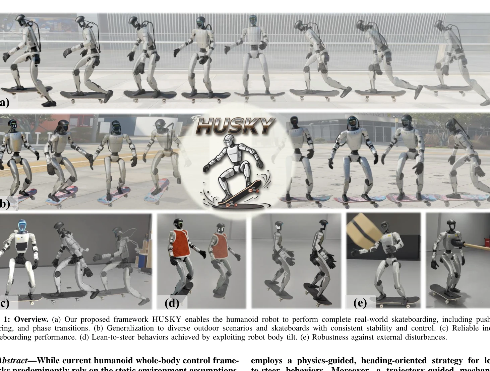
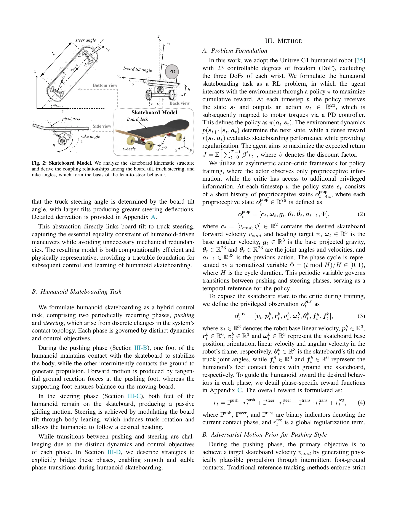

# HUSKY: Humanoid Skateboarding System via Physics-Aware Whole-Body Control

> **저자**: Jinrui Han, Dewei Wang, Chenyun Zhang, Xinzhe Liu, Ping Luo, Chenjia Bai, Xuelong Li | **날짜**: 2026-02-03 | **DOI**: [10.48550/arXiv.2602.03205](https://doi.org/10.48550/arXiv.2602.03205)

---

## Essence

*Fig. 1: Overview. (a) Our proposed framework HUSKY enables the humanoid robot to perform complete real-world skateboardi*

HUSKY는 인문형 로봇이 스케이트보드를 탈 수 있도록 하는 physics-aware 전신 제어 프레임워크로, 비홀로노믹 제약과 복잡한 인간-객체 상호작용을 관리한다.

## Motivation

- **Known**: 인문형 로봇의 전신 제어는 정적 환경을 가정하며, 이차 스케이트보딩이나 롤러스케이팅 같은 단순한 비홀로노믹 시스템은 선행연구에서 다루어졌다.
- **Gap**: 인문형 로봇의 스케이트보드 탑승은 높은 차원의 상태-행동 공간, 강한 언더액추에이션, 그리고 푸시-스티어링 페이즈 간 전환의 복잡성으로 인해 미해결 상태이다.
- **Why**: 스케이트보딩은 동적 불안정성과 복잡한 접촉 역학을 포함한 현실적인 도전 과제를 다루므로 인문형 로봇 제어 기술 발전을 촉진할 수 있다.
- **Approach**: HUSKY는 보드 틸트-스티어링 각도의 키네마틱 제약을 명시적으로 모델링하고, AMP 기반 푸시 학습, physics-guided 스티어링 전략, 그리고 페이즈 전환을 위한 궤적 계획을 통합한다.

## Achievement

*Fig. 1: Overview. (a) Our proposed framework HUSKY enables the humanoid robot to perform complete real-world skateboardi*

- **Physics-informed 시스템 모델링**: tan σ = tan λ sin γ 제약을 도출하여 보드 틸트와 트럭 스티어링 각도의 복잡한 기계적 결합을 캡처
- **Hybrid 동역학 공식화**: 푸시와 스티어링 페이즈 간의 구별되는 접촉 위상을 포함한 하이브리드 제어 문제로 스케이트보딩을 모델링
- **실시간 동적 안정성**: Unitree G1 플랫폼에서 실내외 환경에서 안정적이고 민첩한 스케이트보드 조작 달성
- **제너럴리제이션**: 다양한 스케이트보드 및 야외 환경에서 일관된 성능 유지

## How

*Fig. 2: Skateboard Model. We analyze the skateboard kinematic structure*

- 보드 틸트 각도 γ와 트럭 스티어링 각도 σ 간의 키네마틱 결합 관계를 기하학적으로 도출 및 검증
- DRL을 사용하여 AMP 모션 프라이어를 통해 인간 유사의 푸시 동작 학습
- Physics-guided heading-oriented 전략으로 신체 틸트를 스티어링으로 변환하는 lean-to-steer 행동 구현
- 푸시와 스티어링 간의 매끄러운 전환을 위해 궤적 계획 메커니즘 적용
- PD 제어기를 통해 23 DoF 행동을 모터 토크로 매핑

## Originality

- 인문형 로봇 스케이트보딩이라는 완전히 새로운 문제 정의 및 시스템적 접근
- 보드 틸트-스티어링 제약의 명시적 도출로 physics-aware 학습 실현
- AMP, physics-guided 제어, 궤적 계획을 통합한 hybrid learning-control 프레임워크의 독창적 설계
- 실제 하드웨어(Unitree G1)에서 sim-to-real 성공 달성

## Limitation & Further Study

- 스케이트보드 썹션 모델을 단순화된 키네마틱 모델로 근사화하여 복잡한 동적 효과 일부 미포함
- 학습에 대규모 병렬 시뮬레이션이 필요하며 실제 하드웨어 추가 정제(fine-tuning) 필요
- 현재 Unitree G1 플랫폼에 국한되어 있으며 다른 인문형 로봇으로의 제너럴리제이션 미검증
- **후속연구**: (1) 전체 서스펜션 역학 모델 통합, (2) 다양한 지형과 속도 범위 확대, (3) 손 조작을 포함한 멀티태스킹 시나리오 탐색

## Evaluation

- Novelty: 4/5
- Technical Soundness: 3/5
- Significance: 4/5
- Clarity: 4/5
- Overall: 4/5

**총평**: HUSKY는 인문형 로봇의 스케이트보딩을 처음 체계적으로 해결한 혁신적 연구로, physics-aware 모델링과 learning-control 통합을 통해 실제 환경에서 안정적인 동적 제어를 실현했다.

## Related Papers

- 🔄 다른 접근: [[papers/1500_iRonCub_3_The_Jet-Powered_Flying_Humanoid_Robot/review]] — 스케이트보드 탑승과 제트 비행의 서로 다른 비홀로노믹 제약 조건 하의 휴머노이드 제어를 비교할 수 있습니다.
- 🔄 다른 접근: [[papers/1472_Humanoid_Robot_Acrobatics_Utilizing_Complete_Articulated_Rig/review]] — physics-aware 전신 제어와 강체역학 기반 곡예 제어의 서로 다른 복잡한 동작 제어 접근법을 비교합니다.
- 🏛 기반 연구: [[papers/1516_Learning_Aerodynamics_for_the_Control_of_Flying_Humanoid_Rob/review]] — 물리 인식 제어 프레임워크가 제트 엔진 비행 제어의 공기역학적 제약 관리에 기초를 제공합니다.
- 🏛 기반 연구: [[papers/1500_iRonCub_3_The_Jet-Powered_Flying_Humanoid_Robot/review]] — 제트 추진 시스템의 복잡한 제약 조건이 스케이트보드 제어의 비홀로노믹 제약 관리에 기초가 됩니다.
- 🔄 다른 접근: [[papers/1472_Humanoid_Robot_Acrobatics_Utilizing_Complete_Articulated_Rig/review]] — 곡예 동작과 스케이트보드 제어의 서로 다른 복잡한 전신 제어 문제 해결 접근법을 비교할 수 있습니다.
- 🔗 후속 연구: [[papers/1516_Learning_Aerodynamics_for_the_Control_of_Flying_Humanoid_Rob/review]] — Deep Neural Network 기반 비행 제어가 physics-aware 전신 제어 프레임워크로 확장 적용됩니다.
