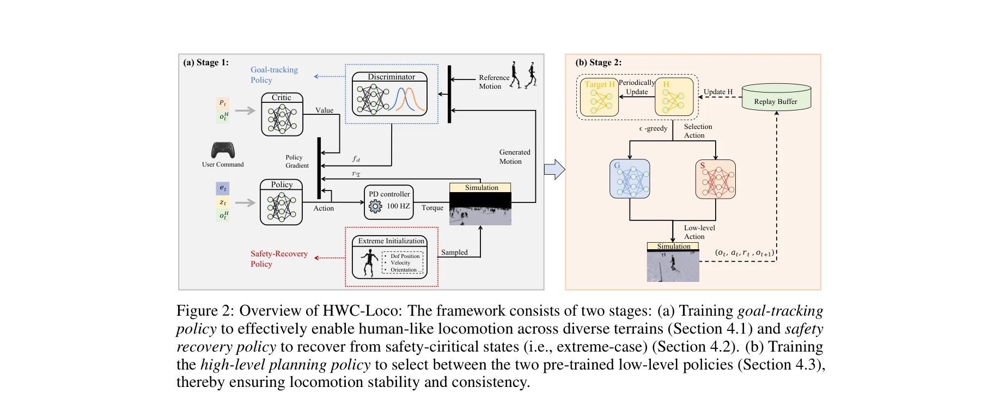

# HWC-Loco: A Hierarchical Whole-Body Control Approach to Robust Humanoid Locomotion

> **저자**: Sixu Lin, Guanren Qiao, Yunxin Tai, Ang Li, Kui Jia, Guiliang Liu | **날짜**: 2025-03-02 | **URL**: [https://arxiv.org/abs/2503.00923](https://arxiv.org/abs/2503.00923)

---

## Essence

휴머노이드 로봇의 강건한 운동 제어를 위해 계층적 정책 구조를 활용한 HWC-Loco를 제안하며, 목표 추적과 안전 복구 간의 동적 트레이드오프를 해결한다.

## Motivation

- **Known**: 학습 기반 방법들이 휴머노이드 로봇 제어에 효과적이지만, Sim2Real 갭과 안전-성능 트레이드오프 문제로 인해 실제 환경에서의 강건성이 제한적이다.
- **Gap**: 기존 robust optimization 접근법은 과도하게 보수적인 정책을 학습하여 작업 성능을 저하시키고, 목표 추적과 안전 회복 간의 동적 조절 메커니즘이 부족하다.
- **Why**: 휴머노이드 로봇의 복잡한 물리 구조와 고자유도로 인해 안전성과 작업 효율성을 동시에 달성하는 제어 정책이 필수적이며, 다양한 실제 환경에서의 신뢰성 있는 운동이 실용적 응용의 핵심이다.
- **Approach**: 정책 학습을 robust optimization 문제로 재구성하고, 목표 추적 정책, 안전 복구 정책, 고수준 계획 정책의 계층적 구조를 통해 상황에 따라 두 정책 간 선택을 동적으로 조절한다.

## Achievement

*Figure 2: Overview of HWC-Loco: The framework consists of two stages: (a) Training goal-tracking*

- **계층적 제어 프레임워크**: 목표 추적과 안전 복구 정책을 분리하고 고수준 계획 정책으로 동적 조절하여 보수성 문제 해결
- **극한 사례 추정 메커니즘**: 불확실성 집합 구성으로 배포 환경의 안전-critical 시나리오에 명시적으로 대응
- **ZMP 기반 동적 제약**: Zero Moment Point를 활용한 안정성 보장 메커니즘 도입
- **광범위한 평가**: 다양한 지형, 로봇 구조, 운동 과제에서 시뮬레이션 및 실제 환경 모두에서 우수한 성능 입증

## How

*Figure 2: Overview of HWC-Loco: The framework consists of two stages: (a) Training goal-tracking*

- POMDP 기반 휴머노이드 로봇 제어 환경 정의 (상태, 행동, 관찰, 전이함수, 보상)
- 작업 보상 rT, 페널티 보상 rP, 정규화 보상 rR으로 구성된 목적함수 설계
- 인간 행동 모방을 통한 정규화로 human behavior norms 반영
- 극한-사례 추정 메커니즘으로 배포 환경의 불확실성 집합 구성
- ZMP 기반 동적 제약으로 다양한 외란 하에서의 안정성 보장
- 고수준 계획 정책이 hazardous 상태 감지 시 안전-복구 정책으로 동적 전환

## Originality

- 목표-안전 트레이드오프를 명시적으로 다루는 계층적 정책 구조의 새로운 설계
- 극한-사례 추정 메커니즘을 통한 구조화된 도메인 랜덤화 접근법
- ZMP 기반 동적 제약을 RL 정책 학습에 통합한 방식
- 휴머노이드 로봇의 전신 제어에서 계층적 robust optimization 적용

## Limitation & Further Study

- 고수준 계획 정책의 hazardous 상태 감지 메커니즘 설계 세부사항이 명확하지 않음
- 극한-사례 추정 메커니즘의 유효성이 특정 도메인에 제한될 수 있음
- 실제 환경 실험의 범위가 제한적일 가능성
- 후속 연구: 다양한 센서 모달리티를 활용한 hazard 감지 고도화, 온라인 적응형 uncertainty set 학습, 장기 실제 환경 배포 평가

## Evaluation

- Novelty: 4/5
- Technical Soundness: 3/5
- Significance: 4/5
- Clarity: 4/5
- Overall: 4/5

**총평**: HWC-Loco는 휴머노이드 로봇의 안전-성능 트레이드오프를 해결하는 창의적인 계층적 제어 프레임워크를 제안하며, 광범위한 실험을 통해 강건성을 입증했으나, 일부 메커니즘의 상세한 설명과 실제 환경 검증의 확대가 필요하다.

## Related Papers

- 🔄 다른 접근: [[papers/1475_Humanoid_Whole-Body_Locomotion_on_Narrow_Terrain_via_Dynamic/review]] — 두 논문 모두 안전한 보행을 다루지만, HWC-Loco는 일반적인 robust control에, 다른 논문은 좁은 지형에 특화되어 있다.
- 🔗 후속 연구: [[papers/1453_Hold_My_Beer_Learning_Gentle_Humanoid_Locomotion_and_End-Eff/review]] — HWC-Loco의 hierarchical control은 SoFTA의 gentle locomotion과 결합하여 안전하고 부드러운 보행을 달성할 수 있다.
- 🏛 기반 연구: [[papers/1424_Geometry-Aware_Predictive_Safety_Filters_on_Humanoids_From_P/review]] — HWC-Loco의 robust control은 geometry-aware predictive safety filters의 안전 보장 메커니즘에 기반한다.
- 🔄 다른 접근: [[papers/1453_Hold_My_Beer_Learning_Gentle_Humanoid_Locomotion_and_End-Eff/review]] — 두 논문 모두 안정성을 중시하지만, SoFTA는 gentle locomotion에, HWC-Loco는 전반적인 robust control에 초점을 둔다.
- 🔄 다른 접근: [[papers/1475_Humanoid_Whole-Body_Locomotion_on_Narrow_Terrain_via_Dynamic/review]] — 두 논문 모두 ZMP 기반 제어를 사용하지만, 하나는 좁은 지형 보행에, 다른 하나는 일반적인 robust locomotion에 특화되어 있다.
