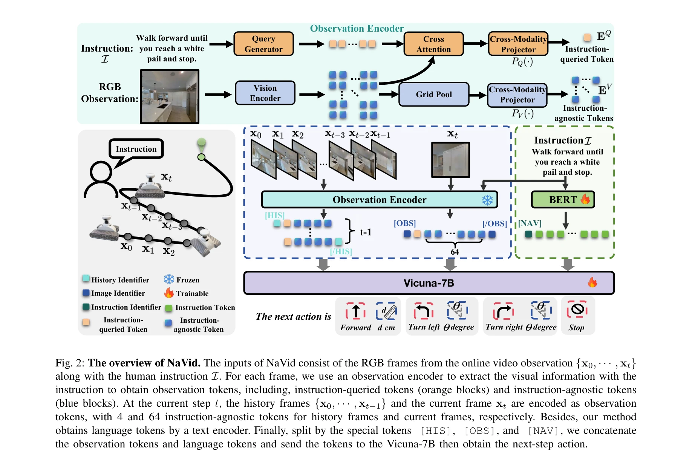
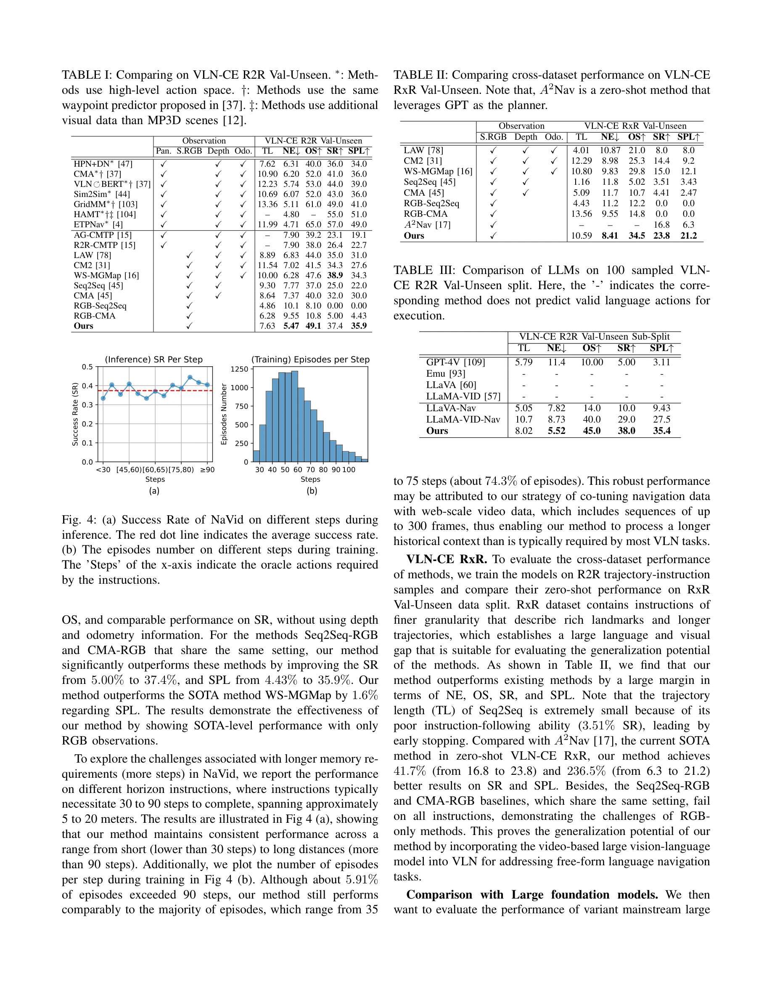

# NaVid: Video-based VLM Plans the Next Step for Vision-and-Language Navigation

> **저자**: Jiazhao Zhang, Kunyu Wang, Rongtao Xu, Gengze Zhou, Yicong Hong, Xiaomeng Fang, Qi Wu, Zhizheng Zhang, He Wang | **날짜**: 2024-02-24 | **URL**: [https://arxiv.org/abs/2402.15852](https://arxiv.org/abs/2402.15852)

---

## Essence

*Fig. 2: The overview of NaVid. The inputs of NaVid consist of the RGB frames from the online video observation {x0, · · *

NaVid는 비디오 기반 대규모 VLM을 활용하여 시각-언어 네비게이션에서 RGB 카메라 입력만으로 로봇의 다음 행동을 계획하는 첫 시도이며, 지도나 깊이 정보 없이 시뮬레이션과 실제 환경 모두에서 최고 성능을 달성한다.

## Motivation

- **Known**: VLN은 자율 구현 AI의 핵심 과제로, 기존 방법들은 이산 환경에서 주로 연구되었거나 RGBD, 오도메터, 지도 등 다양한 입력을 필요로 한다. 최근 대규모 VLM의 발전으로 다양한 AI 분야에서 뛰어난 일반화 성능을 보였다.
- **Gap**: 기존 VLN 방법들은 오도메터 노이즈, 깊이 인식의 도메인 갭, Sim-to-Real 전이에서의 문제가 있으며, 이산 환경 또는 텍스트 기반 관찰 인코딩으로 제한된다. 연속 환경에서 RGB만으로 end-to-end 네비게이션을 수행하는 실용적인 VLA 모델이 부재하다.
- **Why**: 대규모 VLM은 웹 규모 사전 학습을 통해 강력한 일반화 능력을 입증했으며, VLN의 Sim-to-Real 전이와 도메인 일반화는 실제 로봇 배포에 필수적인 문제이다.
- **Approach**: NaVida는 사전 학습된 vision encoder와 LLM을 결합하여 비디오 형태의 로봇 관찰을 instruction-queried token과 instruction-agnostic token으로 인코딩한다. 510k 네비게이션 샘플과 763k 웹 데이터로 학습하여 연속 환경에서 low-level executable action을 직접 추론한다.

## Achievement

*Fig. 4: (a) Success Rate of NaVid on different steps during*

- **VLN-CE 벤치마크 성능**: R2R-CE 데이터셋에서 최고 수준의 성능 달성
- **크로스 데이터셋 일반화**: R2R-RxR 평가에서 큰 성능 향상 시연
- **Sim-to-Real 강건성**: RGB 입력만으로 4개 다양한 실내 장면에서 200개 명령어에 대해 약 66% 성공률 달성
- **단순화된 입력**: 지도, 오도메터, 깊이 정보 없이 모노큘러 RGB 비디오만 필요
- **시공간 컨텍스트 인코딩**: 비디오 기반 모델링으로 로봇의 역사적 궤적을 효과적으로 인코딩

## How

*Fig. 2: The overview of NaVid. The inputs of NaVid consist of the RGB frames from the online video observation {x0, · · *

- Vision encoder를 사용하여 RGB 프레임에서 instruction-queried token(지시문 관련)과 instruction-agnostic token(전역 정보)의 두 종류 토큰 추출
- Cross-Modality Projector로 시각 토큰을 언어 공간으로 매핑
- BERT 기반 instruction identifier로 인스트럭션 처리
- Vicuna-7B LLM을 사전 학습된 상태에서 활용하여 네비게이션 추론
- Action 공간을 정량적 인자(이동 거리 cm, 회전 각도)를 포함한 언어 형태로 정의
- 역사 관찰과 현재 관찰의 토큰 수를 다르게 설정하여 적응적 컨텍스트 제공

## Originality

- 연속 환경에서 VLN을 위한 첫 번째 비디오 기반 VLM 제안으로, RGB만 사용한 end-to-end 네비게이션은 인간의 네비게이션 방식을 모방
- instruction-queried와 instruction-agnostic 토큰의 이중 인코딩 메커니즘으로 선택적 시각 특징 추출
- LLM 기반 VLN 방법 대비 더 현실적인 모델링으로 이산 공간이 아닌 연속 환경에서 저수준 실행 가능한 동작 직접 추론
- 오도메터, 깊이, 지도에 대한 의존성 제거로 Sim-to-Real 갭 자연스럽게 해결

## Limitation & Further Study

- 실제 환경 평가가 4개 장면으로 제한되어 더 광범위한 다양성 검증 필요
- 66% 성공률은 아직 실용적 배포에 완전히 충분하지 않으며, 실패 사례 분석 부재
- 비디오 기반 모델의 계산 복잡도와 추론 속도에 대한 논의 미흡
- 긴 지시문이나 복잡한 환경에서의 성능 한계 미분석
- 후속 연구로 더 많은 실제 환경 데이터, 다중 모드 입력 조합, 동적 장애물 처리 등이 필요

## Evaluation

- Novelty: 4/5
- Technical Soundness: 3/5
- Significance: 4/5
- Clarity: 4/5
- Overall: 4/5

**총평**: NaVid는 VLM의 강력한 일반화 능력을 VLN에 성공적으로 적용한 혁신적 연구로, RGB만으로 연속 환경에서 실제 로봇 네비게이션을 수행하는 첫 실용적 VLA 모델이다. Sim-to-Real 전이의 오랜 문제를 우아하게 해결하고 우수한 크로스 데이터셋 일반화를 보여준다.

## Related Papers

- 🔄 다른 접근: [[papers/1470_MapNav_A_Novel_Memory_Representation_via_Annotated_Semantic/review]] — 두 논문 모두 VLN에서 비전 기반 계획을 다루지만, 하나는 비디오 VLM에, 다른 하나는 의미적 맵에 집중합니다.
- 🔗 후속 연구: [[papers/1490_NavigateDiff_Visual_Predictors_are_Zero-Shot_Navigation_Assi/review]] — 비디오 기반 행동 계획을 diffusion 기반 시각적 예측과 결합하여 더욱 강력한 네비게이션을 구현할 수 있습니다.
- 🧪 응용 사례: [[papers/1607_Vision-Language_Navigation_A_Survey_and_Taxonomy/review]] — 시각-언어 네비게이션의 분류 체계에서 비디오 기반 VLM 접근법의 위치와 활용을 이해할 수 있습니다.
- 🏛 기반 연구: [[papers/1632_World_Simulation_with_Video_Foundation_Models_for_Physical_A/review]] — 비디오 기초 모델을 활용한 세계 시뮬레이션이 VLN에서 미래 상태 예측의 이론적 기반을 제공합니다.
- 🔗 후속 연구: [[papers/1470_MapNav_A_Novel_Memory_Representation_via_Annotated_Semantic/review]] — 비디오 기반 VLM을 annotated semantic map과 결합하여 더욱 효과적인 네비게이션 계획을 수립할 수 있습니다.
- 🔄 다른 접근: [[papers/1490_NavigateDiff_Visual_Predictors_are_Zero-Shot_Navigation_Assi/review]] — 두 논문 모두 시각 기반 네비게이션을 다루지만, 하나는 diffusion 예측에, 다른 하나는 비디오 VLM에 집중합니다.
- 🏛 기반 연구: [[papers/1575_SmartWay_Enhanced_Waypoint_Prediction_and_Backtracking_for_Z/review]] — NaVid의 video-based VLM navigation이 SmartWay의 MLLM 기반 navigator의 기초 방법론을 제공한다.
- 🧪 응용 사례: [[papers/1607_Vision-Language_Navigation_A_Survey_and_Taxonomy/review]] — VLN survey에서 제시한 분류 기준이 NaVid의 video-based VLM planning 접근법의 평가와 비교 분석에 활용 가능
