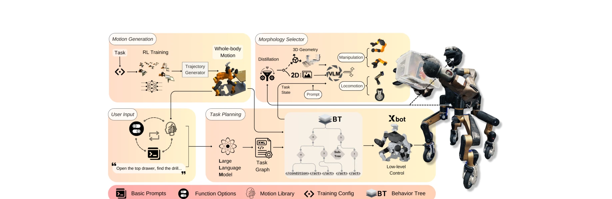
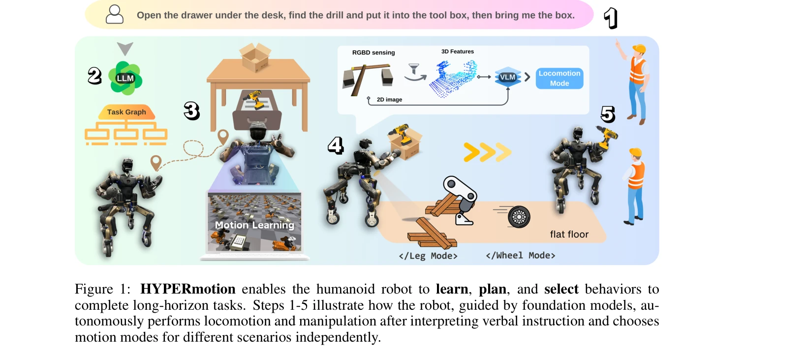

# HYPERmotion: Learning Hybrid Behavior Planning for Autonomous Loco-manipulation

> **저자**: Jin Wang, Rui Dai, Weijie Wang, Luca Rossini, Francesco Ruscelli, Nikos Tsagarakis | **날짜**: 2024-06-20 | **URL**: [https://arxiv.org/abs/2406.14655](https://arxiv.org/abs/2406.14655)

---

## Essence

*Figure 2: Overview of HYPERmotion.We decompose the framework into four sectors: Motion*

HYPERmotion은 강화학습, 전신 최적화, LLM/VLM을 결합하여 휴머노이드 로봇이 자유 텍스트 명령으로 복잡한 로코-매니퓰레이션 작업을 자율적으로 수행할 수 있도록 하는 프레임워크이다.

## Motivation

- **Known**: 최근 휴머노이드 로봇 제어 연구가 진전되었으나 대부분 이동성에 중점을 두며, LLM 기반 계획은 주로 고정 베이스 팔에만 적용되어 왔다.
- **Gap**: 휴머노이드 로봇의 높은 자유도와 복잡한 동역학으로 인해 LLM 기반 온라인 계획과 전신 운동 학습을 실제 환경에서 통합한 연구가 부족하다.
- **Why**: 장시간 과제(자재 취급, 가사, 작업 보조)를 자율적으로 수행하는 휴머노이드 로봇을 위해서는 다양한 환경에 적응 가능하면서도 언어 지시를 이해할 수 있는 시스템이 필수적이다.
- **Approach**: 분해된 훈련 전략으로 작업 특화 RL을 수행하고 운동 라이브러리를 구축한 후, LLM이 태스크 그래프를 생성하고 VLM이 공간 기하학 정보와 함께 로봇 형태소 선택을 가이드한다.

## Achievement

*Figure 1: HYPERmotion enables the humanoid robot to learn, plan, and select behaviors to*

- **전신 운동 학습**: 38개 액추에이터를 위한 RL과 전신 최적화 결합으로 고자유도 로봇의 완전한 신체 조정 가능
- **계층적 작업 그래프**: LLM을 통해 자유 텍스트 명령을 원시 행동의 시퀀스로 변환하는 행동 트리 구조 구현
- **로봇 형태소 선택자**: VLM과 공간 기하학 정보를 활용하여 단일/이중 팔, 다리/바퀴형 이동 방식 자동 선택
- **시뮬레이션과 실제 환경 검증**: 미학습 작업에 대한 효율적인 적응과 비구조화된 장면에서의 고도의 자율성 입증

## How

*Figure 2: Overview of HYPERmotion.We decompose the framework into four sectors: Motion*

- **모션 생성 부문**: 작업 특화 RL 구성 선택 및 병렬 훈련, 저차원 궤적을 전신 공간에 투영하는 통합 운동 생성기 사용
- **운동 라이브러리**: 학습된 기술 단위를 저장하여 재사용 가능한 스킬 풀 구축
- **사용자 입력 부문**: 기본 프롬프트, 함수 옵션, 운동 라이브러리로 구성된 구조화된 텍스트 입력 제공
- **작업 계획 부문**: LLM이 계층적 작업 그래프(작업 로직, 조건 판정, 행동 포함) 생성
- **행동 트리 해석**: 생성된 태스크 그래프를 행동 트리로 변환하여 로봇 가이드 및 하위 레벨 실행 지시
- **형태소 선택**: VLM으로 2D 이미지/깊이 데이터에서 3D 특징 추출 및 로봇 고유 특성과 통합하여 모션 모드 선택

## Originality

- 휴머노이드 로봇의 전신 제어를 위해 RL과 최적화 기반 제어를 효과적으로 결합한 분해 훈련 전략의 제시
- LLM의 계획 능력과 VLM의 시각적 이해를 로봇 형태소 선택과 공간 추론에 통합한 새로운 파이프라인
- 운동 라이브러리 기반 스킬 재사용을 통해 고자유도 로봇의 온라인 계획과 실시간 학습을 동시에 실현
- 실제 환경 배포까지 고려한 시뮬레이션-투-리얼 파이프라인 구현

## Limitation & Further Study

- 높은 자유도 시스템에서 RL 훈련 비용이 여전히 높으며, 새로운 작업마다 모션 라이브러리 확장에 추가 훈련 필요
- LLM의 환각(hallucination) 문제로 인해 부적절한 태스크 그래프 생성 가능성 존재
- 실제 환경의 동적 제약과 예측 불가능한 상황에서의 안정성 및 회복력에 대한 상세 분석 부족
- VLM의 공간 기하학 이해 정확도가 복잡한 환경에서 저하될 수 있으며, 이에 대한 강건성 평가 필요
- **후속 연구**: 메타-러닝이나 적응형 제어를 통한 훈련 효율성 개선, 불확실성 처리 메커니즘 강화, 다양한 휴머노이드 플랫폼으로의 일반화

## Evaluation

- Novelty: 4/5
- Technical Soundness: 3/5
- Significance: 4/5
- Clarity: 4/5
- Overall: 4/5

**총평**: HYPERmotion은 RL, 최적화, 언어 모델을 체계적으로 통합하여 고자유도 휴머노이드 로봇의 자율적 로코-매니퓰레이션을 처음으로 실현한 혁신적인 연구이며, 이론과 실제 환경 검증의 균형을 잘 맞추었다.

## Related Papers

- 🔄 다른 접근: [[papers/1406_From_Motion_to_Behavior_Hierarchical_Modeling_of_Humanoid_Ge/review]] — HYPERmotion과 GBC 모두 휴머노이드의 복잡한 작업 수행을 다루지만, 하이브리드 계획 vs 계층적 모델링이라는 서로 다른 아키텍처 접근법을 사용한다
- 🔗 후속 연구: [[papers/1439_IPR-1_Interactive_Physical_Reasoner/review]] — HYPERmotion의 로코-매니퓰레이션이 HARMON의 전신 동작 생성을 이동과 조작이 통합된 더 복잡한 작업으로 확장한다
- 🏛 기반 연구: [[papers/1314_Commanding_Humanoid_by_Free-form_Language_A_Large_Language_A/review]] — Humanoid-LLA의 자유형식 언어 명령 처리 능력이 HYPERmotion의 자유 텍스트 명령 기반 로코-매니퓰레이션에 언어 이해의 기반 기술을 제공한다
- 🔄 다른 접근: [[papers/1439_IPR-1_Interactive_Physical_Reasoner/review]] — HARMON과 HYPERmotion 모두 언어 기반 휴머노이드 제어를 다루지만, 전신 동작 생성 vs 로코-매니퓰레이션이라는 서로 다른 작업 범위를 가진다
- 🔗 후속 연구: [[papers/1527_Learning_Humanoid_Arm_Motion_via_Centroidal_Momentum_Regular/review]] — hybrid behavior planning의 개념을 centroidal momentum 기반 사지 조율로 구체화하여 전신 제어에 특화시킨 발전된 형태임
- 🔄 다른 접근: [[papers/1406_From_Motion_to_Behavior_Hierarchical_Modeling_of_Humanoid_Ge/review]] — GBC와 HYPERmotion 모두 휴머노이드의 복잡한 행동 계획을 다루지만, 계층적 모델링 vs 하이브리드 계획이라는 서로 다른 접근법을 사용한다
