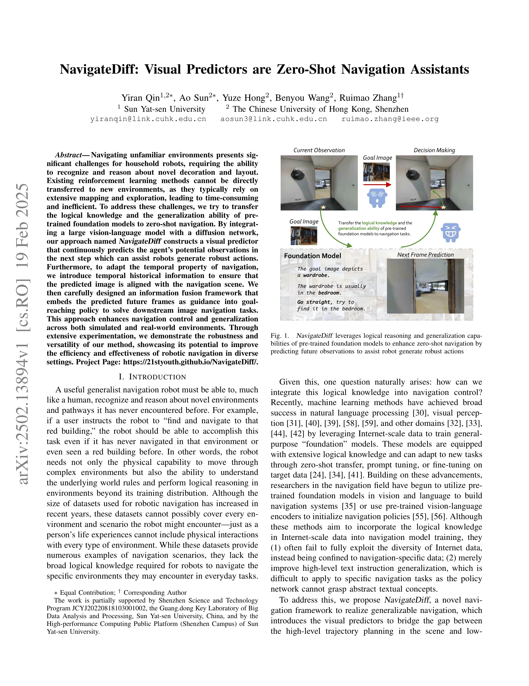
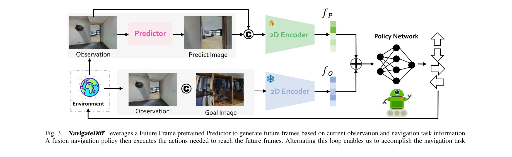
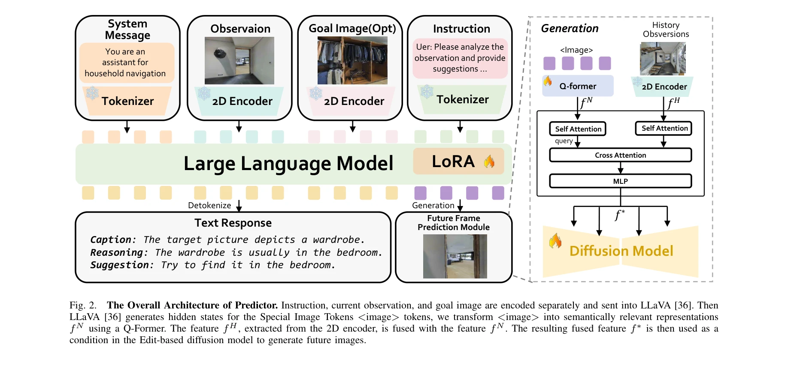

# NavigateDiff: Visual Predictors are Zero-Shot Navigation Assistants

> **저자**: Yiran Qin, Ao Sun, Yuze Hong, Benyou Wang, Ruimao Zhang | **날짜**: 2025-02-19 | **URL**: [https://arxiv.org/abs/2502.13894](https://arxiv.org/abs/2502.13894)

---

## Essence

*Fig. 1.*

NavigateDiff는 vision-language model과 diffusion network를 결합하여 미래 프레임을 예측하는 visual predictor를 구축하고, 이를 통해 로봇이 제로샷(zero-shot) 상황에서 미지의 환경을 효과적으로 네비게이션할 수 있도록 지원한다.

## Motivation

- **Known**: 기존의 강화학습 기반 네비게이션 방법은 광범위한 매핑과 탐색에 의존하므로 새로운 환경으로의 직접적 전이가 어렵다. 최근 foundation model들이 자연언어처리, 시각인식 등 다양한 도메인에서 성공적으로 활용되고 있다.
- **Gap**: 기존 접근법들은 vision-language encoder를 네비게이션 정책 초기화에만 사용하거나 인터넷 규모 데이터의 다양성을 충분히 활용하지 못하며, 추상적 텍스트 개념을 저수준 네비게이션 태스크에 적용하기 어렵다.
- **Why**: 가정용 로봇이 미지의 환경에서 효율적으로 작동하려면 높은 수준의 추론 능력과 저수준의 제어 능력을 모두 갖춰야 하며, foundation model의 논리적 지식을 실질적인 로봇 제어에 연결하는 것이 중요하다.
- **Approach**: NavigateDiff는 높은 수준의 태스크 추론과 저수준의 로봇 제어를 분리하여, vision-language model로 미래 프레임을 예측하고 이를 Hybrid Fusion Policy Network에 입력하여 로봇 제어 신호를 생성한다.

## Achievement

*Fig. 3. NavigateDiff leverages a Future Frame pretrained Predictor to generate future frames based on current observatio*

- **새로운 네비게이션 프레임워크 제안**: 높은 수준의 추론과 저수준의 제어를 분리하는 NavigateDiff 프레임워크를 제안하여 네비게이션의 효과성과 일반화 능력을 향상시킨다.
- **Visual Predictor 구축**: Large vision-language model과 diffusion model을 결합하여 미래 관찰 프레임을 예측하는 predictor를 개발하고, temporal historical information을 통합하여 네비게이션 시나리오와의 정렬을 보장한다.
- **Hybrid Fusion Policy Network**: 목표 이미지, 현재 관찰, 생성된 미래 프레임 등 다양한 시각 정보 소스를 통합하는 policy network를 설계하여 안정적이고 강건한 로봇 제어를 실현한다.
- **광범위한 실험 검증**: 시뮬레이션 및 실제 환경에서 광범위한 실험을 수행하여 제안 방법의 강건성과 다재다능함을 입증한다.

## How

*Fig. 2.*

- Large vision-language model과 LoRA (Low-Rank Adaptation)를 사용하여 goal image와 current observation으로부터 캡션과 추론을 생성한다.
- Diffusion model을 활용하여 vision-language model의 출력 정보와 함께 temporal historical information을 입력으로 받아 다음 단계의 예상 프레임을 생성한다.
- 생성된 future frame을 goal image 및 current observation과 함께 Hybrid Fusion Policy Network에 입력하여 로봇의 최종 제어 신호를 결정한다.
- System message와 tokenizer를 통해 MLLM을 네비게이션 전문 어시스턴트로 구성하고, 2D encoder로 이미지 정보를 처리한다.

## Originality

- **탈중앙화된 추론-제어 구조**: 기존의 end-to-end 방식과 달리, high-level 추론과 low-level 제어를 명확히 분리하여 각각이 자신의 역할에 집중하도록 설계한 것이 혁신적이다.
- **Visual prediction 기반 정책 생성**: Foundation model의 미래 프레임 예측 능력을 네비게이션 정책 생성의 중간 단계로 활용하는 새로운 접근 방식이다.
- **Temporal 정보의 통합**: 단순한 이미지 예측을 넘어 temporal historical information을 명시적으로 통합하여 네비게이션의 시간적 특성을 고려한다.
- **Zero-shot 성능 달성**: Foundation model의 일반화 능력을 직접적으로 활용하여 사전 학습 데이터에 없는 환경에서도 작동할 수 있음을 보여준다.

## Limitation & Further Study

- **계산 복잡도**: Vision-language model과 diffusion model을 함께 사용하므로 실시간 로봇 제어에서의 지연 시간이 실제 적용 가능성을 제약할 수 있다.
- **예측 오류 누적**: 생성된 미래 프레임이 부정확할 경우, 이것이 policy network의 의사결정에 악영향을 미칠 수 있는 error propagation 문제가 존재한다.
- **복잡한 동적 환경 대응**: 예측 모델이 급격한 환경 변화나 예상 외의 장애물을 충분히 처리하지 못할 가능성이 있다.
- **후속 연구 방향**: (1) 경량화된 모델을 통한 실시간성 개선, (2) 예측 오류에 대한 강건성 증대, (3) 다양한 로봇 플랫폼으로의 확장, (4) 사용자 지시사항의 더욱 정교한 통합 방안 개발이 필요하다.

## Evaluation

- Novelty: 4/5
- Technical Soundness: 3/5
- Significance: 4/5
- Clarity: 4/5
- Overall: 4/5

**총평**: NavigateDiff는 foundation model의 논리적 추론 능력과 이미지 생성 능력을 창의적으로 결합하여 zero-shot 네비게이션에 새로운 접근법을 제시한다. 높은 수준의 추론과 저수준의 제어를 분리하는 구조와 미래 프레임 예측을 중간 표현으로 활용하는 아이디어는 로봇 네비게이션 분야에 상당한 기여를 할 수 있는 논문이다.

## Related Papers

- 🔗 후속 연구: [[papers/1443_L3MVN_Leveraging_Large_Language_Models_for_Visual_Target_Nav/review]] — LLM 기반 시각적 목표 네비게이션을 diffusion 네트워크와 결합하여 더욱 정교한 미래 예측 기반 네비게이션을 구현합니다.
- 🔄 다른 접근: [[papers/1489_NaVid_Video-based_VLM_Plans_the_Next_Step_for_Vision-and-Lan/review]] — 두 논문 모두 시각 기반 네비게이션을 다루지만, 하나는 diffusion 예측에, 다른 하나는 비디오 VLM에 집중합니다.
- 🏛 기반 연구: [[papers/1360_Diffusion_Models_Are_Real-Time_Game_Engines/review]] — diffusion 모델의 실시간 생성 능력이 시각적 예측을 통한 제로샷 네비게이션의 핵심 기술입니다.
- 🧪 응용 사례: [[papers/1590_Omni-Perception_Omnidirectional_Collision_Avoidance_for_Legg/review]] — 범용 로봇을 위한 기초 모델 개념이 제로샷 네비게이션 어시스턴트의 실제 구현에 적용됩니다.
- 🔗 후속 연구: [[papers/1311_Cognition_to_Control_-_Multi-Agent_Learning_for_Human-Humano/review]] — NavigateDiff는 ApexNav의 zero-shot navigation을 시각적 예측기 기반의 확산 모델로 확장한다
- 🔗 후속 연구: [[papers/1443_L3MVN_Leveraging_Large_Language_Models_for_Visual_Target_Nav/review]] — 시각적 목표 네비게이션에서 LLM 기반 추론을 diffusion 기반 예측과 결합하여 더욱 발전시킨 접근법입니다.
- 🔗 후속 연구: [[papers/1489_NaVid_Video-based_VLM_Plans_the_Next_Step_for_Vision-and-Lan/review]] — 비디오 기반 행동 계획을 diffusion 기반 시각적 예측과 결합하여 더욱 강력한 네비게이션을 구현할 수 있습니다.
- 🔄 다른 접근: [[papers/1584_NoMaD_Goal_Masked_Diffusion_Policies_for_Navigation_and_Expl/review]] — NoMaD는 diffusion policy를 사용하고 NavigateDiff는 visual predictors를 사용하여 제로샷 네비게이션을 달성하는 다른 접근법
