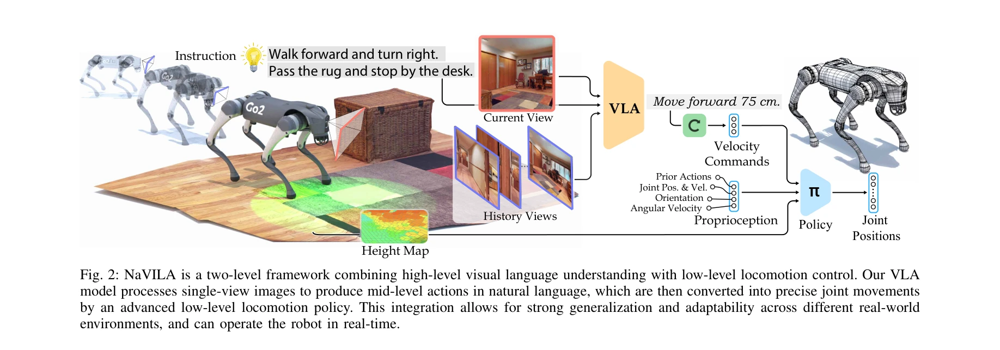
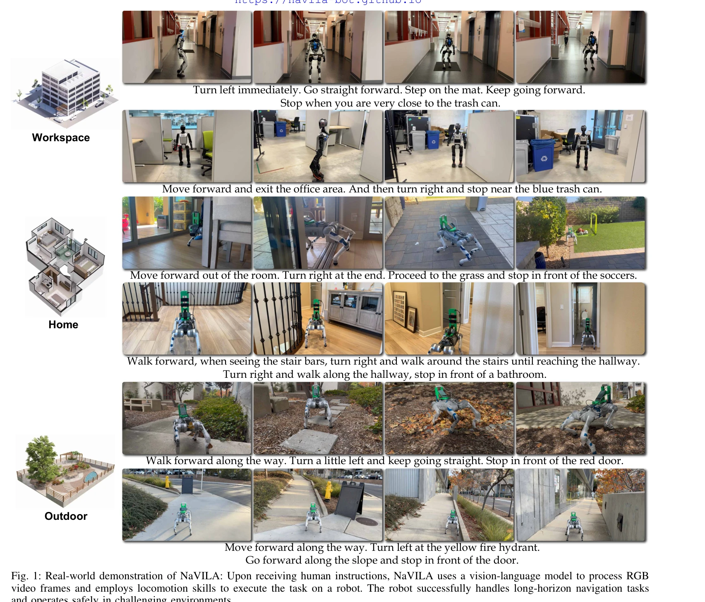

# NaVILA: Legged Robot Vision-Language-Action Model for Navigation

> **저자**: An-Chieh Cheng, Yandong Ji, Zhaojing Yang, Zaitian Gongye, Xueyan Zou, Jan Kautz, Erdem Bıyık, Hongxu Yin, Sifei Liu, Xiaolong Wang | **날짜**: 2024-12-05 | **URL**: [https://arxiv.org/abs/2412.04453](https://arxiv.org/abs/2412.04453)

---

## Essence

*Fig. 2: NaVILA is a two-level framework combining high-level visual language understanding with low-level locomotion con*

NaVILA는 Vision-Language-Action 모델과 locomotion RL policy를 통합한 2-단계 프레임워크로, 인간 언어 명령을 legged 로봇의 저수준 관절 제어로 번역하여 복잡한 환경에서의 시각-언어 네비게이션을 실현한다.

## Motivation

- **Known**: Vision-and-Language Navigation (VLN) 기술은 지도 없이 언어 명령을 따라 미지의 환경을 항법하는 로봇의 기본 능력이 되었으며, 최근 LLM과 VLM의 발전으로 end-to-end VLA 시스템들이 개발되고 있다.
- **Gap**: 기존 VLA 시스템들은 언어 지시를 직접 저수준 로봇 액션으로 변환하려 하는데, 이는 언어 기반 학습이 주인 VLM과 정확한 비언어적 제어의 필요성 간 불일치를 야기한다. Legged 로봇의 복잡한 관절 제어와 다양한 환경에서의 일반화 능력도 미흡하다.
- **Why**: Legged 로봇은 휠 기반 로봇보다 더 도전적이고 복잡한 환경(좁은 통로, 불규칙한 지형, 장애물)을 항법할 수 있으므로 실제 환경에서의 유용성이 높으며, 자연스러운 언어 인터페이스를 통한 로봇 제어는 인간-로봇 상호작용을 크게 개선한다.
- **Approach**: NaVILA는 VLM이 중수준 언어 액션(예: 'moving forward 75cm')을 생성하도록 fine-tuning하고, 이를 low-level visual locomotion RL policy가 실행하는 계층 분리 구조를 채택한다. VILA 기반 VLA 모델에는 내비게이션 특화 프롬프트, 역사 컨텍스트 통합, YouTube 인간 영상 데이터를 활용한 학습 전략을 적용한다.

## Achievement

*Fig. 1: Real-world demonstration of NaVILA: Upon receiving human instructions, NaVILA uses a vision-language model to pr*

- **벤치마크 성능 향상**: 기존 VLN 벤치마크에서 17% 이상 성공률 개선 달성
- **새로운 평가 기준 제시**: IsaacLab 기반 VLN-CE-Isaac 벤치마크 개발으로 저수준 제어와 현실적 환경 반영
- **실세계 검증**: 25개 명령에서 88% 성공률, 복잡한 명령에서 75% 성공률 달성
- **로봇 간 일반화**: Unitree Go2, Unitree H1, Booster T1 등 서로 다른 로봇에 같은 VLA 적용 가능
- **단계 정책의 우수성**: Vision 기반 locomotion policy가 blind policy 대비 14% 성공률 향상
- **인간 영상 학습**: YouTube 인간 투어 영상으로 직접 학습하여 연속 환경 항법 개선을 최초로 입증

## How

*Fig. 2: NaVILA is a two-level framework combining high-level visual language understanding with low-level locomotion con*

- **VILA 기반 VLM 선택**: 이미지 기반 VLM으로 강력한 일반화 능력과 광범위한 지식 활용
- **계층적 프롬프트 설계**: 현재 관찰과 역사 프레임을 구분하여 처리하는 내비게이션 특화 프롬프트 개발
- **다중 데이터 소스 통합**: 로봇 시연 데이터, 인간 영상, QA 태스크 등 다양한 데이터 혼합으로 학습
- **높이맵 기반 locomotion policy**: LiDAR 포인트 클라우드로부터 높이맵 구성 및 시뮬레이션 랜더마이제이션으로 sim-to-real 갭 해소
- **단일 단계 학습**: 정책 증류 없이 end-to-end vision 기반 locomotion 정책 학습
- **이중 주파수 운영**: 고계산 VLA는 저주파로, locomotion policy는 실시간으로 운영하여 효율성과 견고성 확보

## Originality

- **계층적 액션 표현**: 중수준 언어 액션을 통한 새로운 표현 방식으로 VLM의 강점(언어 기반 추론)과 로봇 실행의 요구(정확한 제어)를 조화
- **인간 영상 직접 학습**: YouTube 투어 영상을 내비게이션 학습에 활용하는 최초 시도로 대규모 실세계 데이터 활용
- **로봇 간 이전성**: 같은 VLA로 서로 다른 로봇 플랫폼 지원 가능한 모듈식 구조 제시
- **IsaacLab 벤치마크**: 저수준 제어와 현실적 환경을 반영한 새로운 평가 기준 도입

## Limitation & Further Study

- **계산 복잡도**: 대규모 VLM의 높은 계산 비용으로 실시간성 제약 가능성
- **단일 뷰 관찰**: 이미지 기반 VLM의 제약으로 인한 공간 인식의 한계
- **데이터 의존성**: 내비게이션 특화 학습 데이터의 품질과 규모에 따른 성능 편차 가능성
- **실외 환경 제약**: 강한 햇빛 등 극단적 환경에서의 견고성 검증 필요
- **후속 연구 방향**: 멀티 뷰 또는 3D 환경 표현 통합, 동적 장애물 처리 개선, 더 복잡한 다중 행동 계획 능력 강화

## Evaluation

- Novelty: 4/5
- Technical Soundness: 4/5
- Significance: 4/5
- Clarity: 4/5
- Overall: 4/5

**총평**: NaVILA는 언어 기반 고수준 추론과 저수준 로봇 제어를 효과적으로 분리하는 혁신적 프레임워크로, 광범위한 벤치마크 개선, 실세계 검증, 로봇 간 일반화 능력을 통해 legged 로봇 내비게이션의 실질적 진전을 이룬 우수한 연구이다.

## Related Papers

- 🔄 다른 접근: [[papers/1463_LOVON_Legged_Open-Vocabulary_Object_Navigator/review]] — 두 논문 모두 legged 로봇의 언어 기반 네비게이션을 다루지만, 하나는 VLA 모델에, 다른 하나는 open-vocabulary 객체 네비게이션에 집중합니다.
- 🧪 응용 사례: [[papers/1421_Genie_Sim_30__A_High-Fidelity_Comprehensive_Simulation_Platf/review]] — 일반적인 휴머노이드 제어 모델을 legged 로봇의 시각-언어 네비게이션에 특화 적용한 사례입니다.
- 🏛 기반 연구: [[papers/1576_SpatialVLA_Exploring_Spatial_Representations_for_Visual-Lang/review]] — 시각-언어-행동 모델의 공간적 표현이 legged 로봇 네비게이션의 기본 구조를 제공합니다.
- 🧪 응용 사례: [[papers/1264_AME-2_Agile_and_Generalized_Legged_Locomotion_via_Attention-/review]] — 어텐션 기반 민첩한 legged locomotion 기술이 언어 기반 네비게이션에서 저수준 제어로 활용됩니다.
- 🔄 다른 접근: [[papers/1463_LOVON_Legged_Open-Vocabulary_Object_Navigator/review]] — 두 논문 모두 legged 로봇의 언어 기반 네비게이션을 다루지만, 하나는 open-vocabulary 객체 네비게이션에, 다른 하나는 VLA 모델에 집중합니다.
- 🔗 후속 연구: [[papers/1488_NavDP_Learning_Sim-to-Real_Navigation_Diffusion_Policy_with/review]] — 다리 로봇의 시각-언어-행동 모델 구조를 NavDP의 지형 적응형 네비게이션에 확장 적용할 수 있다
- 🔄 다른 접근: [[papers/1568_Search-TTA_A_Multimodal_Test-Time_Adaptation_Framework_for_V/review]] — 비전-언어-액션 모델의 네비게이션 응용에서 다른 멀티모달 적응 전략을 제시한다.
