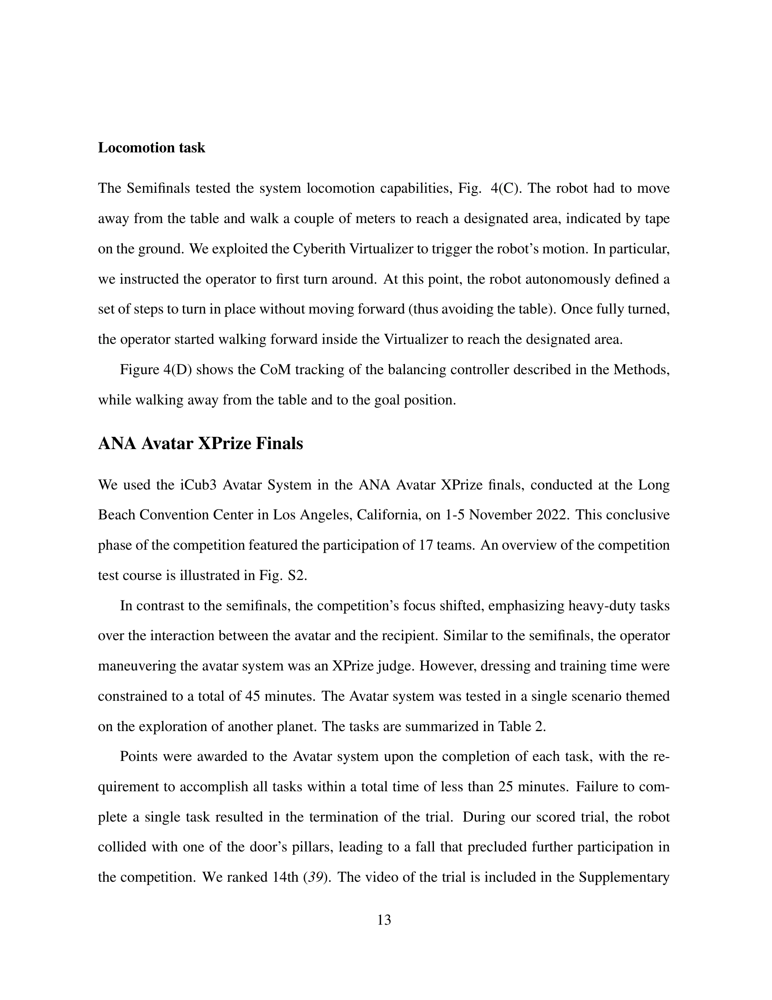

# iCub3 Avatar System: Enabling Remote Fully-Immersive Embodiment of Humanoid Robots

> **저자**: Stefano Dafarra, Ugo Pattacini, Giulio Romualdi, Lorenzo Rapetti, Riccardo Grieco, Kourosh Darvish, Gianluca Milani, Enrico Valli, Ines Sorrentino, Paolo Maria Viceconte, Alessandro Scalzo, Silvio Traversaro, Carlotta Sartore, Mohamed Elobaid, Nuno Guedelha, Connor Herron, Alexander Leonessa, Francesco Draicchio, Giorgio Metta, Marco Maggiali, Daniele Pucci | **날짜**: 2022-03-14 | **URL**: [https://arxiv.org/abs/2203.06972](https://arxiv.org/abs/2203.06972)

---

## Essence

원격에서 인간이 인간형 로봇 iCub3을 완전히 제어하여 구현 가능한 아바타 시스템으로, 로봇의 이동, 조작, 음성, 얼굴 표정을 포함한 다중 감각 피드백(시각, 청각, 촉각, 무게감, 접촉)을 통합한다.

## Motivation

- **Known**: 텔레오퍼레이션 시스템은 오랫동안 연구되었으며, 일부 휠 또는 다리 로봇 아바타가 개발되었다. 인간형 로봇은 사회적 상호작용과 수용성 측면에서 우수하지만, 양발 보행의 불안정성으로 인한 제어의 복잡성이 존재한다.
- **Gap**: 기존 인간형 로봇 아바타 시스템은 로봇의 자율적 균형 유지와 operator의 운동 재타겟팅을 완전히 통합하지 못했으며, 원격 거리에서 다중 모드 감각 피드백과 함께 로봇의 음성 및 얼굴 표정 제어를 함께 제공하는 통합 시스템이 부족하다.
- **Why**: COVID-19 팬데믹과 같은 생물학적 재난 상황에서 원격 조종 아바타의 필요성이 증대되었으며, ANA Avatar XPrize 같은 대규모 국제 경쟁을 통해 실제 응용 가능한 아바타 기술 개발의 중요성이 강조되었다.
- **Approach**: 경량의 비침습적 wearable 장치(iFeel)를 통해 operator의 운동과 힘을 추적하고, 로봇이 자율적으로 균형을 유지하며, 다중 감각 피드백을 제공하는 통합 아바타 시스템을 설계하고 구현했다. 이를 Biennale di Venezia(290km), We Make Future show(300km) 등 실제 원격 환경에서 검증했다.

## Achievement

*Figure 4(D) shows the CoM tracking of the balancing controller described in the Methods,*

- **iCub3 humanoid robot 개발**: 15년간의 iCub 플랫폼 진화를 통해 향상된 신체 크기와 이동 및 물리적 상호작용에 최적화된 최신 버전 제시
- **통합 아바타 시스템**: operator의 로봇 이동, 조작, 음성, 얼굴 표정을 동시에 제어하고 시각, 청각, 촉각, 무게감, 접촉 등 5가지 감각 모드의 피드백 제공
- **다중 실제 환경 검증**: 원격 미술관 방문(Venezia 290km), 공개 공연 무대 협업(Rimini 300km, 2000명 관중), ANA Avatar XPrize 경쟁 참여 등 3가지 실제 시나리오에서 성공적 구현
- **BiPedal 로봇 아바타 우수성 입증**: XPrize 최종 단계에서 경량 operator 장비(상업용+맞춤형 wearable)로 양발 보행을 완성한 유일한 팀으로 기록

## How

- Lightweight wearable 기술(iFeel)을 사용하여 operator의 신체 움직임과 힘 정보를 추적
- Robot Operating System(ROS) 및 YARP 미들웨어를 활용한 통신 레이어 구현으로 잠재적 네트워크 지연 대응
- Operator의 로코모션(이동) 명령을 high-level 참조값으로 변환하고 로봇이 자율적으로 안정성 제어
- Haptic/vibrotactile 피드백을 operator에게 제공하여 로봇의 균형 상태 및 환경 접촉 정보 전달
- Facial expression 제어 알고리즘을 통해 operator가 로봇의 감정 표현 실시간 조작
- 원격 거리에서의 latency를 고려한 통신 최적화 및 operator-avatar 간 실시간 동기화

## Originality

- 기존 텔로오퍼레이션 시스템과 달리 경량 wearable만으로 invasive exoskeleton 없이 완전한 신체 제어(로코모션 포함) 달성
- Humanoid 로봇의 양발 보행 안정성 자율 제어와 operator 운동 재타겟팅의 완전한 통합
- Facial expression 제어와 haptic 피드백을 포함한 감정적 측면까지 고려한 소셜 상호작용 중심의 아바타 시스템
- 국제 경쟁(ANA Avatar XPrize)에서 검증된 최초의 양발 보행 인간형 로봇 아바타 시스템

## Limitation & Further Study

- 원문에서 명시적인 기술적 한계 분석 부재하나, 양발 보행 로봇의 근본적 불안정성으로 인한 복잡한 제어 시스템의 robustness에 관한 추가 분석 필요
- 실제 운영 환경에서 네트워크 latency 영향에 대한 정량적 평가 및 임계값 설정 연구 부재
- Operator의 신체 크기/체형과 iCub3 간 운동학적 차이에서 발생하는 재타겟팅 오류에 대한 보상 메커니즘 상세 설명 부족
- 후속 연구: 더 극단적인 환경(불규칙한 지면, 높은 latency 네트워크)에서의 시스템 성능 평가 필요
- 후속 연구: 장시간 원격 제어에 따른 operator의 피로도 및 presence 감각에 관한 인지 연구 추진

## Evaluation

- Novelty: 4/5
- Technical Soundness: 3/5
- Significance: 4/5
- Clarity: 4/5
- Overall: 4/5

**총평**: 본 논문은 15년 진화의 iCub3와 경량 wearable 기반의 통합 아바타 시스템을 통해 원격 인간형 로봇 구현의 새로운 기준을 제시하며, 실제 대규모 공개 행사에서의 성공적 검증으로 산업 응용 가능성을 명확히 입증했다. 다만 기술적 한계 분석과 성능 임계값 정의가 보강될 필요가 있다.

## Related Papers

- 🔄 다른 접근: [[papers/1598_Open-TeleVision_Teleoperation_with_Immersive_Active_Visual_F/review]] — 원격 humanoid 제어에서 완전 몰입형 embodiment와 immersive active visual feedback의 서로 다른 접근 방식을 보여준다.
- 🔗 후속 연구: [[papers/1272_ARMADA_Augmented_Reality_for_Robot_Manipulation_and_Robot-Fr/review]] — 증강현실 기반 로봇 조작과 완전 몰입형 원격 embodiment가 human-robot interaction의 확장된 형태를 제시한다.
- 🧪 응용 사례: [[papers/1347_D2E_Scaling_Vision-Action_Pretraining_on_Desktop_Data_for_Tr/review]] — 능동적 관찰을 위한 로봇 헤드와 원격 완전 몰입형 embodiment가 multimodal sensing에서 공통적 활용 가능성을 보여준다.
