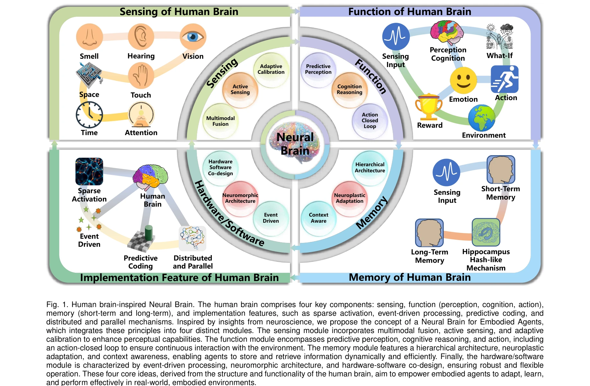

# Neural Brain: A Neuroscience-inspired Framework for Embodied Agents

> **저자**: Jian Liu, Xiongtao Shi, Thai Duy Nguyen, Haitian Zhang, Tianxiang Zhang, Wei Sun, Yanjie Li, Athanasios V. Vasilakos, Giovanni Iacca, Arshad Ali Khan, Arvind Kumar, Jae Won Cho, Ajmal Mian, Lihua Xie, Erik Cambria, Lin Wang | **날짜**: 2025-05-12 | **URL**: [https://arxiv.org/abs/2505.07634](https://arxiv.org/abs/2505.07634)

---

## Essence

*Fig. 1. Human brain-inspired Neural Brain. The human brain comprises four key components: sensing, function (perception,*

본 논문은 신경과학에서 영감을 받은 Neural Brain 프레임워크를 제안하여 embodied agent가 인간 수준의 적응성으로 실제 환경과 상호작용할 수 있도록 설계하였다. 이 프레임워크는 multimodal active sensing, perception-cognition-action 기능, neuroplasticity 기반 메모리, neuromorphic hardware/software 최적화를 통합한다.

## Motivation

- **Known**: 현재 AI 시스템, 특히 large language models는 패턴 인식과 기호 추론에서 뛰어나지만 물리적 세계와의 상호작용이 불가능한 disembodied 상태이다. 인간 뇌는 감각 처리, 인지, 행동을 계층적 분산 구조로 통합하여 동적 환경에서 적응적 행동을 가능하게 한다.
- **Gap**: Embodied 지능을 신경과학 관점에서 설계하고 구현하는 연구가 부족하며, 정적 AI 모델과 동적 실제 환경 배포 사이의 갭을 해결할 통합 프레임워크가 없다. 현존하는 modular perception-cognition-action 파이프라인과 end-to-end reinforcement learning은 적응성, 통합성, 에너지 효율성에서 제한을 보인다.
- **Why**: Embodied agent는 unstructured 환경에서 실시간으로 적응적으로 행동해야 하며, 이를 위해서는 감각-인지-행동의 폐쇄 루프 통합이 필수이다. 신경과학 기반의 통합 프레임워크는 현재 AI 시스템의 brittleness를 해결하고 일반화 가능한 자율 agent 개발을 가능하게 한다.
- **Approach**: 인간 뇌의 구조와 기능에서 영감을 얻어 Neural Brain을 정의하고, multimodal active sensing, closed-loop perception-cognition-action, neuroplasticity 기반 메모리, neuromorphic hardware/software co-design의 4가지 핵심 모듈을 통합하는 통일된 생물학적 영감 아키텍처를 제안한다.

## Achievement

*Fig. 1. Human brain-inspired Neural Brain. The human brain comprises four key components: sensing, function (perception,*

- **Neural Brain 정의 및 아키텍처**: Embodied agent를 위한 Neural Brain의 4가지 핵심 컴포넌트(Sensing, Function, Memory, Hardware/Software)를 명확히 정의하여 건축 가능한 청사진 제시
- **Multimodal 감각 통합**: 시각, 언어, 청각, 촉각, 후각, 공간 인식을 포함한 comprehensive multimodal sensing 프레임워크 구축
- **폐쇄루프 상호작용**: Predictive perception, cognitive reasoning, action의 폐쇄루프 구조로 환경과의 지속적 상호작용 실현
- **Neuroplasticity 기반 메모리**: Hierarchical architecture, context-aware retrieval, adaptive updating을 통한 동적 메모리 시스템
- **에너지 효율적 구현**: Event-driven processing과 neuromorphic hardware/software co-design으로 실시간 제어의 효율성 증대
- **종합적 문헌 리뷰**: Embodied agent 연구의 최신 동향을 4가지 측면에서 분석하고 인간 지능과의 갭 분석

## How

*Fig. 1. Human brain-inspired Neural Brain. The human brain comprises four key components: sensing, function (perception,*

- 인간 뇌의 구조 분석: hippocampus, prefrontal cortex, cerebellum 등의 기능을 embodied agent 아키텍처에 매핑
- Multimodal active sensing 구현: 다중 센서에서 수집한 정보를 효과적으로 융합하기 위한 adaptive calibration 적용
- Closed-loop perception-cognition-action 설계: Predictive coding 메커니즘으로 감각 예측 오류 최소화
- Neuroplasticity 기반 메모리: Short-term memory (working memory)와 long-term memory (hippocampal hash-like mechanism)의 계층적 구조 구현
- Event-driven neuromorphic 처리: Sparse activation으로 에너지 소비 감소 및 실시간 처리 달성
- Hardware/software co-design: Neuromorphic architecture 활용으로 효율적 계산 및 유연한 제어 구현

## Originality

- 신경과학 기반의 통합 프레임워크: 기존 robotics, machine learning, AI 연구와 달리 neuroscience 관점에서 embodied agent 설계의 이론적 기초 제공
- 4-모듈 아키텍처의 체계화: Sensing, Function, Memory, Hardware/Software를 인간 뇌 기능에 기반하여 명확하게 정의하고 통합
- Biologically-inspired 구현: Sparse activation, event-driven processing, predictive coding, distributed architecture 등 생물학적 원리를 실제 agent 구현에 직접 적용
- Multimodal 통합의 우선순위: 기존 vision-centric 접근을 넘어 청각, 촉각, 후각, 공간 인식 등을 동등하게 다루는 comprehensive multimodal framework 제안

## Limitation & Further Study

- **실제 구현의 부재**: 논문은 프레임워크와 설계 원칙을 제시하지만 구체적인 embodied agent 시스템 구현이나 실험 결과가 부족
- **정량적 검증 부족**: 제안된 Neural Brain 아키텍처의 성능을 정량적으로 평가할 벤치마크나 실험 비교가 제한적
- **Hardware 실현의 복잡성**: Neuromorphic hardware/software co-design의 구체적 구현 방법 및 scalability에 대한 상세 분석 필요
- **학습 메커니즘의 상세화**: Neuroplasticity 기반 메모리의 학습 알고리즘과 적응 메커니즘이 충분히 구체화되지 않음
- **후속 연구 방향**: 실제 humanoid robot (Atlas, Optimus, Unitree G1 등)에 적용하는 end-to-end 구현 및 평가 필요
- **일반화 성능**: 다양한 real-world unstructured 환경에서의 일반화 가능성과 robust 성능 검증 필요

## Evaluation

- Novelty: 4/5
- Technical Soundness: 3/5
- Significance: 4/5
- Clarity: 4/5
- Overall: 4/5

**총평**: 본 논문은 embodied AI의 설계 원칙을 신경과학 기반으로 체계적으로 정립한 중요한 이론적 기여를 제공하며, Neural Brain의 4가지 핵심 모듈을 명확히 정의함으로써 future embodied agent 연구의 통합적 청사진을 제시한다. 다만 구체적인 구현과 실험적 검증이 부족하므로, 실제 robotic system에 대한 end-to-end 적용을 통한 후속 연구로 이 프레임워크의 실효성을 입증할 필요가 있다.

## Related Papers

- 🔄 다른 접근: [[papers/1278_Behavior_Foundation_Model_for_Humanoid_Robots/review]] — Embodied agent를 위한 신경과학 영감 프레임워크와 행동 foundation model의 서로 다른 접근 방식을 보여준다.
- 🏛 기반 연구: [[papers/1610_PHUMA_Physically-Grounded_Humanoid_Locomotion_Dataset/review]] — Multimodal large language model이 신경과학 기반 embodied agent의 인지-행동 통합에 이론적 기반을 제공한다.
- 🔗 후속 연구: [[papers/1585_Now_You_See_That_Learning_End-to-End_Humanoid_Locomotion_fro/review]] — ThinkBot의 thought chain과 Neural Brain의 neuroscience-inspired reasoning이 embodied reasoning의 확장된 형태를 제시한다.
- 🔗 후속 연구: [[papers/1343_Cosmos-Reason1_From_Physical_Common_Sense_To_Embodied_Reason/review]] — Neural Brain은 Cosmos-Reason1의 구체화된 추론을 신경과학 영감 프레임워크로 확장한다
