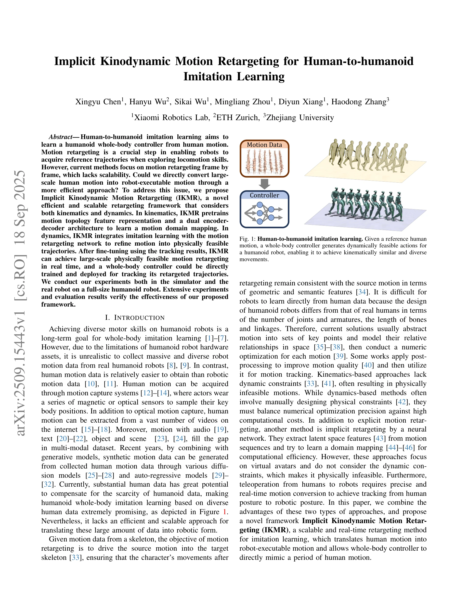

# Implicit Kinodynamic Motion Retargeting for Human-to-humanoid Imitation Learning

> **저자**: Xingyu Chen, Hanyu Wu, Sikai Wu, Mingliang Zhou, Diyun Xiang, Haodong Zhang | **날짜**: 2025-09-18 | **DOI**: [10.48550/arXiv.2509.15443](https://doi.org/10.48550/arXiv.2509.15443)

---

## Essence

*Fig. 2: Overall pipeline for our proposed framework. We model motion retargeting as a sequence-to-sequence mapping from *

본 논문은 인간의 모션을 휴머노이드 로봇이 실행 가능한 형태로 변환하는 Implicit Kinodynamic Motion Retargeting (IKMR) 프레임워크를 제안하며, 기구학과 역학을 모두 고려하여 대규모 모션 데이터를 실시간으로 처리할 수 있다.

## Motivation

- **Known**: 현재 모션 retargeting 방법들은 프레임 단위 처리로 인해 확장성이 부족하며, 기구학 기반 접근법은 역학적 제약을 고려하지 않아 물리적으로 실행 불가능한 모션을 생성한다. 신경망 기반의 implicit retargeting은 가상 아바타에는 적용되지만 동적 제약을 고려하지 않는다.
- **Gap**: 대규모 인간 모션 데이터를 효율적이고 확장 가능한 방식으로 로봇 실행형 모션으로 변환하는 방법이 부재하며, 기구학적 정확성과 역학적 실현 가능성을 동시에 만족하는 retargeting 프레임워크가 필요하다.
- **Why**: 휴머노이드 로봇의 다양한 운동 기술 학습을 위해서는 대규모 인간 모션 데이터 활용이 필수적이나, 로봇 모션 데이터 수집의 어려움이 있기 때문에 효율적인 모션 변환이 중요하다. 또한 실시간 tele-operation을 위해서는 빠른 모션 처리가 필요하다.
- **Approach**: IKMR은 skeleton-based graph convolutional encoder와 dual encoder-decoder 아키텍처를 통해 kinematics-aware pretraining을 수행하고, imitation learning과 motion retargeting network를 통합한 dynamics-aware fine-tuning으로 물리적으로 실행 가능한 모션을 생성한다.

## Achievement

*Fig. 1: Human-to-humanoid imitation learning. Given a reference human*

- **실시간 대규모 모션 처리**: 5000fps의 처리 속도로 기존 numeric optimization 기반 방법들(21-64fps)보다 80-240배 빠른 성능 달성
- **기구학-역학 통합**: FK와 동적 제약을 동시에 고려하여 물리적으로 실행 가능한 모션 생성
- **확장성 보장**: 벡터화를 통한 병렬 처리로 대규모 모션 데이터셋에 대한 확장성 확보
- **실로봇 검증**: Unitree G1 휴머노이드 로봇에서 시뮬레이션과 현실 환경 모두에서 유효성 입증

## How

*Fig. 2: Overall pipeline for our proposed framework. We model motion retargeting as a sequence-to-sequence mapping from *

- Skeleton tree의 계층적 구조를 graph로 모델링하여 skeleton-based graph convolutional encoder로 joint 간 위상 관계 학습
- Dual encoder-decoder 아키텍처에서 pretraining 시 encoder를 공유하고 각각의 decoder로 reconstruction loss 계산하여 latent space 정렬
- 동일 skeleton 구조의 paired human-humanoid motion 데이터셋으로 pretraining 수행
- Imitation learning을 통해 시뮬레이터에서 물리적으로 실행 가능한 tracking policy 학습 후, 이를 통해 motion decoder fine-tuning
- Fine-tuning된 decoder를 이용해 새로운 인간 모션을 로봇 실행형 모션으로 변환 후, whole-body controller 학습

## Originality

- Motion retargeting 문제에 implicit neural network 접근법 도입으로 기존 numeric optimization의 계산 비용 문제 해결
- Kinematics-aware pretraining과 dynamics-aware fine-tuning의 2단계 전략으로 기구학적 정확성과 역학적 실현성을 동시 달성
- Skeleton-based graph convolutional encoder를 통해 skeleton topology의 관계적 구조를 명시적으로 학습
- Imitation learning과 motion retargeting의 결합으로 시뮬레이션 데이터를 활용한 현실적 모션 생성
- Retargeting과 control 파이프라인의 통합으로 end-to-end 학습 가능 구조 제시

## Limitation & Further Study

- Pretraining에 paired human-humanoid motion 데이터셋이 필요하여 초기 데이터 수집 비용 존재
- Dynamics-aware fine-tuning 단계에서 시뮬레이터 기반 imitation learning이 필요하여 sim-to-real gap 가능성 미해결
- 복잡한 접촉 동역학(contact dynamics)이 필요한 모션(예: 미끄러짐, 충돌)에 대한 처리 능력이 제한적일 수 있음
- 다양한 로봇 형태(다리 개수, 관절 구조 등)에 대한 일반화 가능성이 명시되지 않음
- 후속 연구로 unsupervised learning을 통한 paired data 요구사항 제거 및 다양한 로봇 구조에 대한 generalization 방법 개발 필요

## Evaluation

- Novelty: 4/5
- Technical Soundness: 3/5
- Significance: 4/5
- Clarity: 4/5
- Overall: 4/5

**총평**: 본 논문은 기존 frame-by-frame retargeting의 확장성 문제를 implicit neural network로 해결하고, kinematics와 dynamics를 통합한 체계적 접근을 통해 실제 로봇에서 동작 가능한 모션 변환을 달성하였다. 실시간 성능과 실로봇 검증으로 높은 실용성을 입증하였으나, paired data 요구사항과 sim-to-real gap 해결 등에서 개선의 여지가 있다.

## Related Papers

- 🔗 후속 연구: [[papers/1442_Heracles_Bridging_Precise_Tracking_and_Generative_Synthesis/review]] — IKMR의 kinodynamic retargeting이 Heracles의 state-conditioned diffusion과 결합하여 더 강건한 모션 변환을 가능하게 함
- 🔄 다른 접근: [[papers/1561_Make_Tracking_Easy_Neural_Motion_Retargeting_for_Humanoid_Wh/review]] — 둘 다 모션 리타겟팅을 다루지만 1493은 implicit kinodynamic 접근으로, 1561은 neural 분포 학습으로 해결함
- 🏛 기반 연구: [[papers/1600_Opt2Skill_Imitating_Dynamically-feasible_Whole-Body_Trajecto/review]] — DDP 기반 동역학적 실현 가능한 궤적 생성이 implicit kinodynamic retargeting의 이론적 기반을 제공함
- 🔗 후속 연구: [[papers/1360_DynaRetarget_Dynamically-Feasible_Retargeting_using_Sampling/review]] — implicit 방법을 사용한 kinodynamic retargeting의 확장된 버전이다
- 🏛 기반 연구: [[papers/1442_Heracles_Bridging_Precise_Tracking_and_Generative_Synthesis/review]] — Implicit kinodynamic motion retargeting이 정밀한 추적과 생성형 합성을 결합하는 이론적 기반을 제공함
- 🔄 다른 접근: [[papers/1561_Make_Tracking_Easy_Neural_Motion_Retargeting_for_Humanoid_Wh/review]] — 둘 다 kinodynamic motion retargeting을 다루지만 1561은 neural 분포 학습으로, 1493은 implicit 방법으로 접근함
