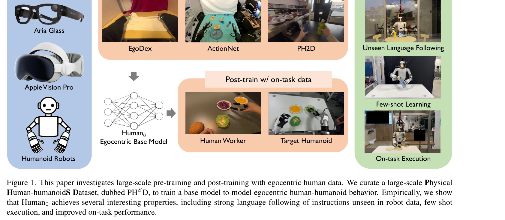
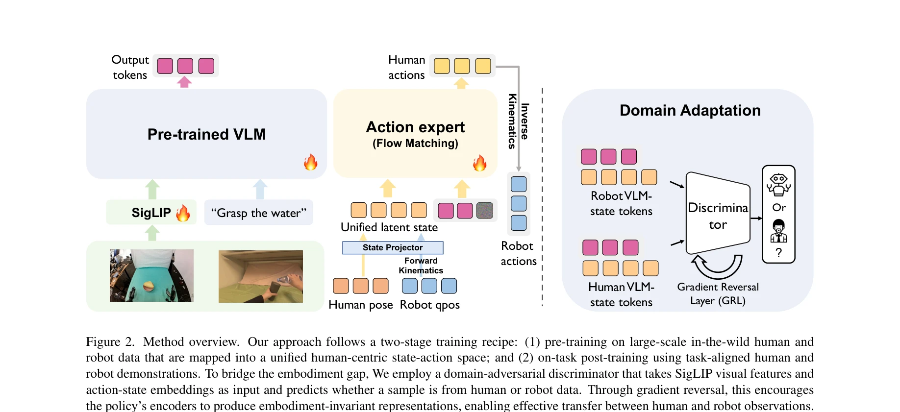

# In-N-On: Scaling Egocentric Manipulation with in-the-wild and on-task Data

> **저자**: Xiongyi Cai, Ri-Zhao Qiu, Geng Chen, Lai Wei, Isabella Liu, Tianshu Huang, Xuxin Cheng, Xiaolong Wang | **날짜**: 2025-11-19 | **URL**: [https://arxiv.org/abs/2511.15704](https://arxiv.org/abs/2511.15704)

---

## Essence

*Figure 1. This paper investigates large-scale pre-training and post-training with egocentric human data. We curate a lar*

본 논문은 대규모 egocentric 인간 데이터(in-the-wild와 on-task)를 활용하여 humanoid 로봇의 조작 정책을 학습하는 Human0 모델을 제시하고, 1,000시간 이상의 다양한 in-the-wild 데이터와 20시간 이상의 on-task 데이터를 포함한 PHSD 데이터셋을 구축했다.

## Motivation

- **Known**: 기존 연구들은 in-the-wild 데이터만으로 pre-training하거나 on-task 데이터만으로 co-training하는 단일 접근법을 사용했다. 인간 데이터는 로봇 조작 학습의 풍부한 자원이지만 데이터 이질성으로 인해 최적의 활용이 어려웠다.
- **Gap**: 기존 연구는 in-the-wild와 on-task 데이터를 통합하는 체계적인 방법론이 부족했으며, 두 데이터 소스를 pre-training과 post-training으로 구분하여 활용하는 연구가 없었다.
- **Why**: 대규모 인간 데이터를 효과적으로 활용하면 로봇 조작 모델의 일반화 능력과 robustness를 크게 향상시킬 수 있으며, 언어 지시 따르기와 few-shot 학습 같은 emergent 능력을 얻을 수 있다.
- **Approach**: 본 논문은 unified human-centric state-action space를 정의하고, in-the-wild 데이터로 base model을 pre-training한 후 on-task 데이터로 post-training하는 이단계 학습 recipe를 제안한다. Domain adaptation 기법을 적용하여 인간-humanoid 간 gap을 최소화한다.

## Achievement

*Figure 1. This paper investigates large-scale pre-training and post-training with egocentric human data. We curate a lar*

- **PHSD 데이터셋 구축**: 1,000시간 이상의 in-the-wild egocentric 비디오와 20시간 이상의 on-task 데이터를 포함하는 대규모 Physical Human-humanoidS Dataset 구축
- **Human0 모델**: Flow matching 기반의 language-conditioned egocentric 조작 정책 모델 개발
- **언어 이해 능력**: 로봇 학습 데이터에 없는 unseen 언어 지시를 따르는 능력 달성
- **Few-shot 학습**: 제한된 샘플로 새로운 작업을 빠르게 학습하는 능력 입증
- **Robustness 향상**: On-task 데이터를 통한 post-training으로 실제 humanoid 로봇에서의 성능 대폭 개선

## How

*Figure 2. Method overview. Our approach follows a two-stage training recipe: (1) pre-training on large-scale in-the-wild*

- Unified human-centric state-action space 정의: head pose(Thead ∈ SE(3)), wrist pose, finger keypoints 포함
- Robot IK/FK 및 hand retargeting 알고리즘을 활용한 differentiable 변환으로 인간과 humanoid 데이터 상호 변환
- Multiple sources의 데이터를 unified format으로 처리 및 정규화
- Flow matching 기반의 language-conditioned 정책 학습
- Domain adaptation 기법 적용으로 naive data mixing으로 인한 hidden state의 embodiment 차별 문제 해결
- Pre-training stage에서 diverse in-the-wild 데이터로 기초 모델 학습
- Post-training stage에서 task-specific on-task 데이터로 모델 개선

## Originality

- In-the-wild와 on-task 데이터를 pre-training과 post-training으로 명확히 구분하는 체계적인 data recipe 제시 (기존에는 이 두 접근법을 분리하여 연구함)
- Unified human-centric state-action space 설계로 다양한 humanoid 하드웨어 간 확장성 확보
- Naive data mixing의 hidden state 차별 문제를 분석하고 domain adaptation으로 해결하는 algorithmic advance
- Egocentric perspective에서의 대규모 인간-humanoid 공동 학습 데이터셋 구축 및 공개 계획
- Flow matching을 활용한 language-conditioned 정책 학습의 egocentric 확장

## Limitation & Further Study

- 평가가 주로 Unitree H1, G1 humanoid 두 종류에 제한되어 다양한 로봇 embodiment으로의 일반화 가능성이 미검증
- On-task 데이터 수집 비용과 scalability 문제에 대한 실질적 분석 부족
- Domain adaptation 기법의 이론적 근거와 일반성에 대한 깊은 논의 부족
- Fine-tuning/post-training 과정에서 catastrophic forgetting에 대한 정량적 분석 미흡
- Real robot 실험의 시나리오가 제한적이며, 더 복잡한 long-horizon 작업에 대한 평가 필요
- **후속연구**: 더 다양한 로봇 형태에서의 cross-embodiment 일반화 성능 검증, on-task 데이터 수집의 최적 전략 연구, 더 큰 규모의 on-task 데이터로 성능 상한선 탐색

## Evaluation

- Novelty: 4/5
- Technical Soundness: 3/5
- Significance: 4/5
- Clarity: 4/5
- Overall: 4/5

**총평**: 본 논문은 egocentric 인간 데이터를 활용한 로봇 조작 학습에서 in-the-wild와 on-task 데이터의 역할을 명확히 규정하고, 이를 통합하는 체계적 방법론과 대규모 데이터셋을 제시하여 실제 humanoid 로봇에서 언어 이해, few-shot 학습, robustness 향상을 달성했다. 데이터셋과 모델의 공개 계획은 커뮤니티에 큰 기여가 될 것으로 예상되나, 다양한 embodiment으로의 일반화와 이론적 깊이 측면에서는 개선의 여지가 있다.

## Related Papers

- 🏛 기반 연구: [[papers/1372_EgoMimic_Scaling_Imitation_Learning_via_Egocentric_Video/review]] — egocentric 인간 행동 학습 방법론이 대규모 PHSD 데이터셋의 휴머노이드 모방 학습에 핵심 이론적 기반을 제공한다
- 🔗 후속 연구: [[papers/1370_DoReMi_Grounding_Language_Model_by_Detecting_and_Recovering/review]] — wild 환경에서의 로코-조작 데이터 수집 프레임워크를 In-N-On의 대규모 데이터 파이프라인에 통합할 수 있다
- 🔄 다른 접근: [[papers/1376_EmbodMocap_In-the-Wild_4D_Human-Scene_Reconstruction_for_Emb/review]] — 다양한 egocentric 조작 데이터 확장에서 EgoScale과 In-N-On은 상호 보완적인 데이터 수집 전략을 제시한다
- 🔗 후속 연구: [[papers/1372_EgoMimic_Scaling_Imitation_Learning_via_Egocentric_Video/review]] — In-the-wild와 on-robot 데이터를 통합한 egocentric manipulation이 EgoMimic의 human-robot 데이터 통합 학습을 확장한다.
- 🔗 후속 연구: [[papers/1376_EmbodMocap_In-the-Wild_4D_Human-Scene_Reconstruction_for_Emb/review]] — In-N-On의 in-the-wild와 on-robot learning이 EgoScale의 대규모 egocentric learning을 실제 환경으로 확장한다.
- 🏛 기반 연구: [[papers/1476_MimicPlay_Long-Horizon_Imitation_Learning_by_Watching_Human/review]] — 대규모 egocentric 데이터셋 구축 방법론이 HWM의 학습 데이터 확장에 직접적으로 활용 가능하다
- 🔗 후속 연구: [[papers/1522_RDT-1B_a_Diffusion_Foundation_Model_for_Bimanual_Manipulatio/review]] — 대규모 egocentric 데이터 수집 방법론을 Humanoid-X의 2천만 포즈-텍스트 쌍 데이터셋 구축에 적용하여 데이터 품질을 향상시킬 수 있다
