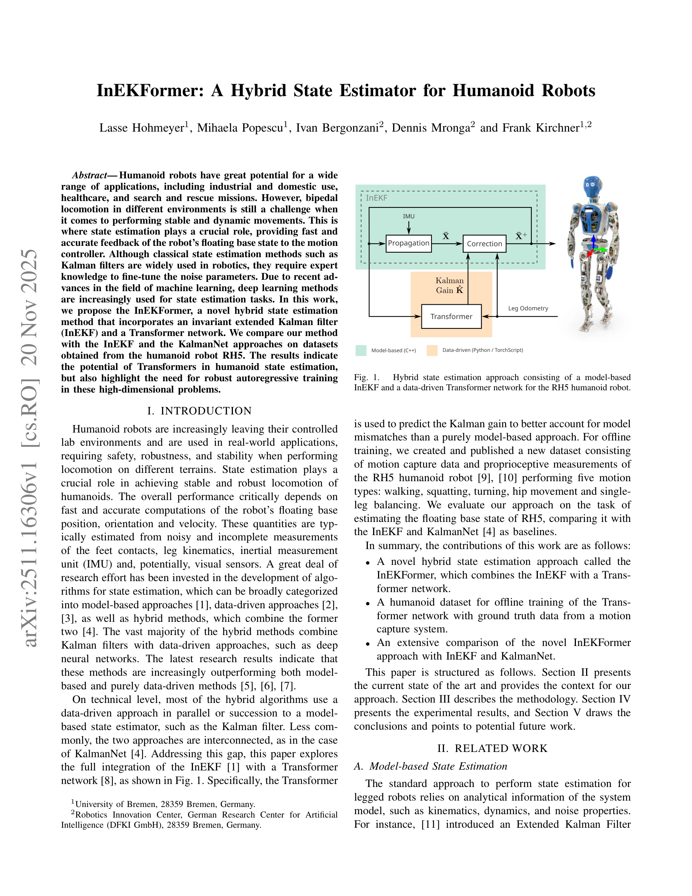
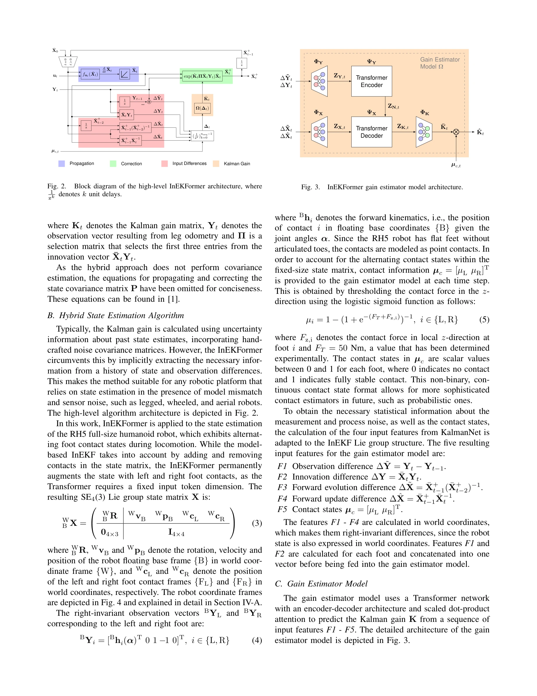

# InEKFormer: A Hybrid State Estimator for Humanoid Robots

> **저자**: Lasse Hohmeyer, Mihaela Popescu, Ivan Bergonzani, Dennis Mronga, Frank Kirchner | **날짜**: 2025-11-20 | **URL**: [https://arxiv.org/abs/2511.16306](https://arxiv.org/abs/2511.16306)

---

## Essence

*Fig. 1.*

InEKFormer는 Invariant Extended Kalman Filter(InEKF)와 Transformer 네트워크를 통합한 하이브리드 상태 추정 방법으로, 휴머노이드 로봇의 부동 베이스(floating base) 상태를 정확하게 추정한다.

## Motivation

- **Known**: 고전적인 Kalman filter는 로보틱스에서 널리 사용되지만 노이즈 파라미터 튜닝에 전문 지식이 필요하다. 최근 hybrid 방법들은 model-based와 data-driven 접근법을 결합하여 단일 방법보다 우수한 성능을 보인다.
- **Gap**: 기존 KalmanNet 및 KalmanFormer 등의 hybrid 방법은 표준 Kalman filter를 사용하거나 low-dimensional 문제(간단한 진자, Lorenz attractor 등)에만 적용되었다. 특히 full-size humanoid robot에 internally coupled hybrid 방법이 InEKF와 Transformer를 결합하여 적용된 사례가 없다.
- **Why**: 휴머노이드 로봇의 bipedal locomotion은 다양한 환경에서 안정적이고 동적인 움직임을 수행해야 하므로, 빠르고 정확한 상태 추정이 모션 컨트롤러의 성능을 결정하는 핵심 요소이다.
- **Approach**: InEKFormer는 InEKF의 상태 전파 및 보정 단계를 유지하면서, Transformer 네트워크를 사용하여 Kalman gain을 학습함으로써 모델 오류와 비선형성을 보상한다. RH5 휴머노이드 로봇의 모션 캡처 데이터를 활용한 새로운 dataset을 생성하여 offline training을 수행한다.

## Achievement

*Fig. 2.*

- **InEKFormer 방법 제안**: InEKF와 Transformer를 내부적으로 결합한 하이브리드 상태 추정 알고리즘 개발
- **휴머노이드 dataset 공개**: 모션 캡처 데이터와 고유 센서 측정값으로 구성된 RH5 로봇 dataset 구축 (walking, squatting, turning, hip movement, single-leg balancing)
- **포괄적 비교 평가**: InEKF와 KalmanNet 방법과 비교하여 Transformer의 상태 추정 잠재력과 autoregressive training 필요성 검증

## How

*Fig. 2.*

- **State propagation**: IMU 측정값 u를 이용한 strapdown IMU 모델로 상태 전이 함수 fu 정의
- **State correction**: Lie exponential을 사용하여 보정된 상태 X̄+_t 계산
- **Kalman gain 학습**: Transformer 네트워크가 과거 상태 차이와 관측값 차이 이력으로부터 Kalman gain 예측
- **입력 특성 추출**: 상태 및 관측 차이의 이력으로부터 implicit하게 필요한 정보 추출
- **모션 유형별 학습**: 다양한 locomotion 모드(보행, 스쿼팅, 회전 등)의 sequences 활용

## Originality

- InEKF와 Transformer의 내부적 결합을 통해 기존 KalmanNet의 RNN 기반 접근법보다 확장성과 contextual 해석 능력 향상
- Full-size humanoid robot(RH5)의 high-dimensional state estimation 문제에 처음 적용된 Transformer 기반 hybrid 방법
- Hand-crafted noise covariance matrices 대신 state와 observation 차이로부터 자동 추출하는 implicit feature extraction 방식
- 새로운 공개 dataset 구축으로 향후 연구의 벤치마크 제공

## Limitation & Further Study

- Transformer의 high-dimensional 문제에서의 robust autoregressive training 필요성이 강조되었으나 구체적인 해결 방안 미제시
- Covariance 추정을 수행하지 않으므로 불확실성 정량화 불가능
- IMU 가속도계 및 자이로스코프 bias 추가 시 InEKF의 이론적 성질 손실 가능성
- Real-world 환경에서의 generalization 성능, 다른 humanoid 플랫폼에서의 적용성 미검증
- Computational complexity 및 inference latency에 대한 상세 분석 부재

## Evaluation

- Novelty: 4/5
- Technical Soundness: 3/5
- Significance: 4/5
- Clarity: 4/5
- Overall: 4/5

**총평**: InEKFormer는 Transformer의 강점을 InEKF와 효과적으로 결합하여 humanoid 로봇의 상태 추정 문제에 처음 적용한 획기적인 hybrid 방법이며, 새로운 dataset과 포괄적인 실험으로 Transformer의 잠재력을 입증했으나, robust training 방식과 실제 배포 시 성능 검증이 필요하다.

## Related Papers

- 🏛 기반 연구: [[papers/1459_HuMam_Humanoid_Motion_Control_via_End-to-End_Deep_Reinforcem/review]] — InEKFormer의 정확한 상태 추정은 HuMam의 Mamba 기반 제어에서 더욱 신뢰할 수 있는 입력을 제공한다.
- 🔄 다른 접근: [[papers/1316_Contact-Aided_Invariant_Extended_Kalman_Filtering_for_Robot/review]] — 두 논문 모두 하이브리드 상태 추정을 다루지만, 하나는 InEKF+Transformer에, 다른 하나는 contact-aided InEKF에 초점을 둔다.
- 🔗 후속 연구: [[papers/1551_Legged_Robot_State-Estimation_Through_Combined_Forward_Kinem/review]] — InEKFormer의 floating base 상태 추정은 forward kinematics와 결합된 legged robot 상태 추정으로 확장될 수 있다.
- 🔗 후속 연구: [[papers/1316_Contact-Aided_Invariant_Extended_Kalman_Filtering_for_Robot/review]] — InEKF 기반 상태 추정을 하이브리드 접근 방식으로 확장하여 성능을 향상시킨다
- 🔄 다른 접근: [[papers/1276_AutoOdom_Learning_Auto-regressive_Proprioceptive_Odometry_fo/review]] — 순수 고유감각 기반 주행거리측정 대신 하이브리드 상태 추정 방법을 제시한다
- 🔗 후속 연구: [[papers/1446_Hierarchical_visuomotor_control_of_humanoids/review]] — 시각 기반 제어는 InEKFormer의 하이브리드 상태 추정을 통해 더욱 정확한 시각적 피드백을 제공받을 수 있다.
- 🔗 후속 연구: [[papers/1459_HuMam_Humanoid_Motion_Control_via_End-to-End_Deep_Reinforcem/review]] — HuMam의 Mamba 기반 인코더는 InEKFormer의 하이브리드 상태 추정과 결합하여 더욱 정확한 보행 제어를 달성할 수 있다.
- 🔄 다른 접근: [[papers/1551_Legged_Robot_State-Estimation_Through_Combined_Forward_Kinem/review]] — 두 논문 모두 휴머노이드 상태 추정을 다루지만, factor graph vs transformer 기반이라는 서로 다른 아키텍처 접근법을 제시함
