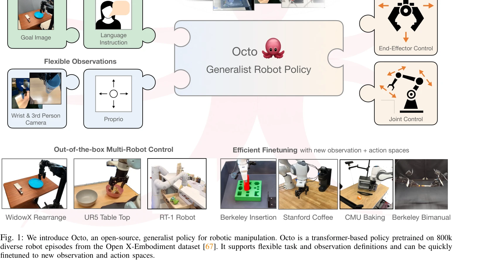
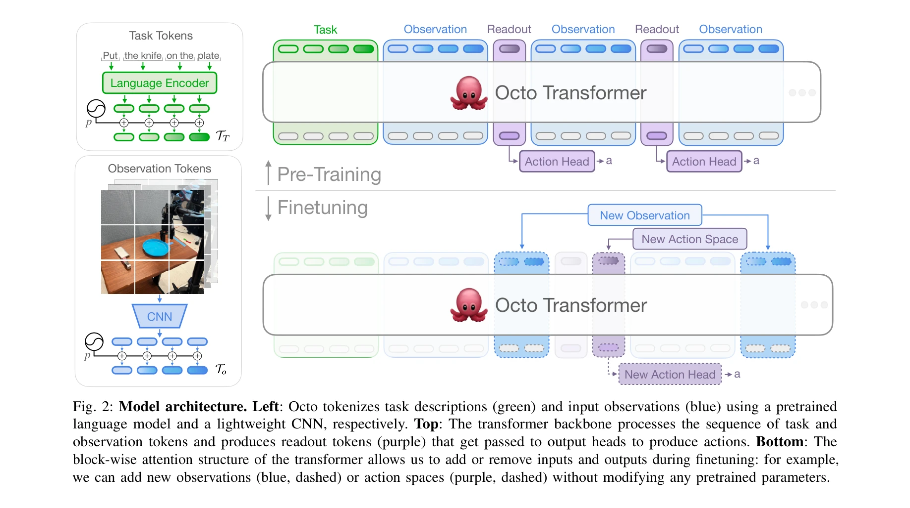

# Octo: An Open-Source Generalist Robot Policy

> **저자**: Octo Model Team, Dibya Ghosh, Homer Walke, Karl Pertsch, Kevin Black, Oier Mees, Sudeep Dasari, Joey Hejna, Tobias Kreiman, Charles Xu, Jianlan Luo, You Liang Tan, Lawrence Yunliang Chen, Pannag Sanketi, Quan Vuong, Ted Xiao, Dorsa Sadigh, Chelsea Finn, Sergey Levine | **날짜**: 2024-05-20 | **URL**: [https://arxiv.org/abs/2405.12213](https://arxiv.org/abs/2405.12213)

---

## Essence

*Fig. 1: We introduce Octo, an open-source, generalist policy for robotic manipulation. Octo is a transformer-based polic*

Open X-Embodiment 데이터셋의 800k 궤적으로 사전학습된 transformer 기반의 generalist robot policy인 Octo를 제안하며, 언어 명령이나 목표 이미지로 지시 가능하고 새로운 센서와 액션 공간으로 효율적으로 미세조정 가능하다.

## Motivation

- **Known**: RT-1, RoboCat 등 여러 robot embodiment을 다루는 generalist robot policy들이 제안되었으나, 대부분 사전정의된 센서와 액션 공간으로 제한되고 공개되지 않았다.
- **Gap**: 기존 generalist robot policy들은 새로운 관측과 액션 공간으로의 효율적인 미세조정을 지원하지 않으며, 다양한 로봇 플랫폼의 센서 설정 변화에 대응하기 어렵다.
- **Why**: 대규모 사전학습 정책의 공개는 로봇 커뮤니티의 접근성을 높이고, 효율적인 미세조정 능력은 새로운 로봇 설정에 빠르게 적응할 수 있게 하여 실제 응용을 가능케 한다.
- **Approach**: Tokenizer 기반 transformer 아키텍처로 임의의 입력(다양한 카메라, 센서)과 출력(다양한 액션 공간)을 처리하고, block-wise attention 구조로 새로운 관측 및 액션 헤드를 추가하여 미세조정한다.

## Achievement

*Fig. 1: We introduce Octo, an open-source, generalist policy for robotic manipulation. Octo is a transformer-based polic*

- **최대 규모 데이터셋 활용**: Open X-Embodiment의 800k 로봇 궤적으로 사전학습하여 이전 generalist robot policy보다 훨씬 큰 데이터에 노출
- **유연한 인터페이스**: 언어 명령 또는 목표 이미지로 지시 가능하며, 다양한 카메라 설정(워크스페이스, 손목 카메라)과 액션 공간(관절 제어, end-effector 제어)을 지원
- **효율적 미세조정**: 표준 consumer GPU에서 몇 시간 내에 새로운 센서와 액션 공간으로 미세조정 가능
- **9개 로봇 플랫폼 검증**: 4개 기관의 다양한 로봇(WidowX, UR5, RT-1 등)에서 우수한 성능 입증
- **완전 공개**: 모델 체크포인트(27M, 93M 파라미터), 사전학습 파이프라인, 미세조정 스크립트 등 전체 리소스 공개

## How

*Fig. 2: Model architecture. Left: Octo tokenizes task descriptions (green) and input observations (blue) using a pretrai*

- Task tokens (언어 인코더로 처리) + Observation tokens (lightweight CNN으로 처리)를 생성
- Transformer backbone에서 block-wise attention으로 시퀀스 처리하여 readout tokens 생성
- Diffusion head를 통해 expressive action distribution 모델링
- Action chunks 예측으로 temporal consistency 향상
- 미세조정 시 새로운 observation/action head 추가 및 adapters 사용으로 기존 파라미터 보존
- 대규모 다양한 데이터 혼합으로 사전학습하여 generalization 극대화

## Originality

- Transformer, diffusion objectives, action chunks, block-wise attention 등 기존 기법들의 조합이 novel하며, 특히 cross-embodied generalist policy 맥락에서 처음 적용
- 새로운 관측 및 액션 공간으로의 적응을 위해 adapter 기반 미세조정 방식 도입
- Open X-Embodiment 데이터의 최대 규모 활용으로 이전 연구보다 훨씬 큰 다양성 확보
- 완전 공개형 generalist robot policy로서 선례적 기여

## Limitation & Further Study

- 논문에서 미세조정 성능의 상세한 정량 비교 부족 (새로운 도메인별 향상도 수치 제한적)
- 9개 로봇이 모두 조작(manipulation) 태스크에 한정되어 navigation 등 다른 도메인 일반화 능력 미검증
- Diffusion head의 계산 비용이 더 높은지 여부와 real-time 제어 가능성 불명확
- 후속 연구: 다른 로봇 도메인(navigation, quadruped 등)으로의 확장, 더 큰 규모 사전학습, 온라인 학습 능력 추가 연구 필요

## Evaluation

- Novelty: 4/5
- Technical Soundness: 3/5
- Significance: 4/5
- Clarity: 4/5
- Overall: 4/5

**총평**: Octo는 대규모 다양한 데이터와 유연한 아키텍처로 generalist robot policy의 실질적 발전을 이루었으며, 완전 공개를 통해 로봇 커뮤니티에 즉시적 기여를 제공한다. 미세조정 효율성과 다중 플랫폼 호환성은 실제 응용성을 크게 높인다.

## Related Papers

- 🏛 기반 연구: [[papers/1504_Open_X-Embodiment_Robotic_Learning_Datasets_and_RT-X_Models/review]] — Open X-Embodiment 데이터셋이 Octo 모델의 사전훈련에 직접적인 데이터 기반을 제공한다.
- 🔄 다른 접근: [[papers/1315_AutoRT_Embodied_Foundation_Models_for_Large_Scale_Orchestrat/review]] — 대규모 로봇 정책 학습에서 generalist policy와 대규모 오케스트레이션의 서로 다른 접근 방식을 보여준다.
- 🔗 후속 연구: [[papers/1537_Learning_Social_Navigation_from_Positive_and_Negative_Demons/review]] — RoboCat의 self-improving generalist agent와 Octo의 generalist robot policy가 범용 로봇 정책의 발전된 형태를 제시한다.
- 🔄 다른 접근: [[papers/1287_π_0_A_Vision-Language-Action_Flow_Model_for_General_Robot_Co/review]] — 범용 로봇 정책을 flow matching과 transformer 기반 접근법으로 각각 다르게 구현한다
- ⚖️ 반론/비판: [[papers/1494_NORA-15_A_Vision-Language-Action_Model_Trained_using_World_M/review]] — NORA-1.5의 복잡한 아키텍처와 달리 Octo는 오픈소스 범용 로봇 정책으로 단순성과 접근성을 강조한다.
- 🧪 응용 사례: [[papers/1504_Open_X-Embodiment_Robotic_Learning_Datasets_and_RT-X_Models/review]] — Open X-Embodiment 데이터셋이 Octo generalist robot policy의 직접적인 훈련 데이터로 활용된다.
- 🔗 후속 연구: [[papers/1537_RoboCat_A_Self-Improving_Generalist_Agent_for_Robotic_Manipu/review]] — Octo의 open-source generalist robot policy가 RoboCat의 self-improving agent를 오픈소스 환경에서 구현한다.
- 🔄 다른 접근: [[papers/1546_Robot_Utility_Models_General_Policies_for_Zero-Shot_Deployme/review]] — 일반화된 로봇 정책 구현에서 utility model과 오픈소스 generalist model이라는 서로 다른 접근법을 제시한다.
- 🧪 응용 사례: [[papers/1562_Scaling_Cross-Embodied_Learning_One_Policy_for_Manipulation/review]] — generalist robot policy의 성능을 가정 내 재배치라는 구체적이고 현실적인 환경에서 평가하고 개선한다.
- 🔄 다른 접근: [[papers/1378_Embodied_Navigation_Foundation_Model/review]] — Octo도 다양한 로봇 플랫폼에서 작동하는 범용 정책을 제안한다.
