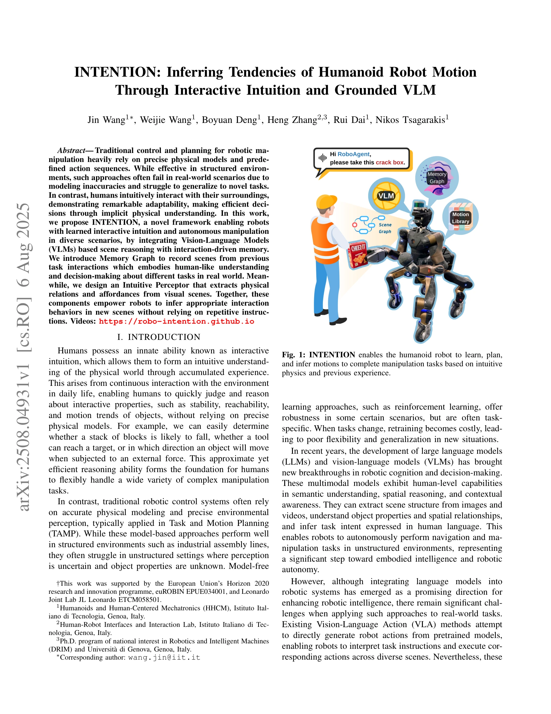

# INTENTION: Inferring Tendencies of Humanoid Robot Motion Through Interactive Intuition and Grounded VLM

> **저자**: Jin Wang, Weijie Wang, Boyuan Deng, Heng Zhang, Rui Dai, Nikos Tsagarakis | **날짜**: 2025-08-06 | **URL**: [https://arxiv.org/abs/2508.04931](https://arxiv.org/abs/2508.04931)

---

## Essence

*Fig. 1: INTENTION enables the humanoid robot to learn, plan,*

INTENTION은 Vision-Language Model 기반 Intuitive Perceptor와 Memory Graph를 통합하여 로봇이 상호작용 경험으로부터 직관적 물리 이해를 학습하고 미지의 조작 작업을 자율적으로 수행할 수 있도록 하는 프레임워크를 제안한다.

## Motivation

- **Known**: 전통적 로봇 제어는 정확한 물리 모델과 사전 정의된 행동 수열에 의존하여 구조화된 환경에서는 효과적이나 실제 환경에서는 실패하기 쉽다. 최근 LLM/VLM 기반 접근법이 로봇 인지 및 의사결정에 가능성을 보이지만 대규모 고품질 데이터셋 의존성과 물리적 상호작용 모델링 부족이라는 문제가 있다.
- **Gap**: 기존 VLA 방법들은 정적 이미지 이해에 중점을 두며 객체 속성, 상호작용 역학, 관계를 모델링하지 못하므로 미지의 작업에서 움직임을 예측하지 못한다. 또한 고차원의 인문형 로봇 제어에 필요한 대규모 데이터셋 수집이 현실적으로 어렵다.
- **Why**: 인문형 로봇이 구조화되지 않은 실제 환경에서 적응적으로 다양한 조작 작업을 수행하려면 인간처럼 경험으로부터 직관적 물리 이해를 축적하고 새로운 상황에 일반화할 수 있어야 한다.
- **Approach**: VLM 기반 Intuitive Perceptor로 장면에서 공간-기하학적 특징과 의미론적 상태를 추출하고, Memory Graph(MemoGraph)에 과거 상호작용 경험을 누적하여 새로운 장면에서 유사한 경험을 검색하여 행동을 선택한다.

## Achievement

*Fig. 2: Overview of the Framework. (a) Intuitive Perceptor takes the RGB image and human instruction as input, extractin*

- **VLM 통합 직관적 인지 프레임워크**: 기초 모델의 공간 및 객체 수준 추론을 활용하여 물리적으로 근거된 직관을 구성하고 인문형 로봇의 소량 학습 배포를 가능하게 함
- **Intuitive Perceptor 설계**: VLM 기반으로 작업 장면에서 정제된 공간 기하학과 의미론적 관찰을 추출하여 그래프 구조 표현 생성
- **Memory Graph 구축**: 인간-로봇 및 환경 상호작용으로부터 의미론적 정보를 저장하는 위상 그래프 구조로, 로봇 affordance와 결합하여 다양한 작업의 행동 선택을 지원
- **실제 환경 검증**: 다양한 작업 시나리오에 걸쳐 효과적인 적응을 입증하는 실제 인문형 로봇 시스템 실험 수행

## How

*Fig. 3: Graph Construction and Matching*

- Intuitive Perceptor가 RGB 이미지를 수신하여 공간-기하학적 관찰과 3D 특징을 추출하고 객체 및 에이전트 간의 의미론적 상태 속성과 기하학적 관계를 인코딩하는 그래프 표현 생성
- 각 실행 단계에서 MemoGraph가 Perceptor로부터 추출된 장면 정보(의미론적 지시, 실제 상호작용 상태, 공간 기하학)와 로봇 행동 및 피드백을 기록하여 경험 프라이어로 축적
- 새로운 작업 시나리오에서 현재 의미론적 장면 상태를 추출하고 MemoGraph의 과거 경험과 비교하여 가장 관련성 높은 상호작용 행동 선택
- 선택된 행동에 해당하는 스킬 라이브러리 Π = {π1, π2, ..., πn}의 매개변수화된 행동 또는 인지 기초 요소(primitive)를 로봇 하드웨어에서 실행

## Originality

- VLM을 활용하여 인문형 로봇의 상호작용적 직관을 구성하는 첫 번째 연구로, 기존 연구는 주로 고정 기저 로봇 팔(fixed-base robotic arms)에 집중했음
- Memory Graph라는 새로운 위상 그래프 구조를 제안하여 의미론적 정보와 기하학적 관계를 동시에 저장하고 경험 기반 행동 선택에 활용
- VLA 방식의 대규모 데이터셋 의존성을 극복하고 최소한의 명시적 지시 또는 지시 없이도 상황 맥락만으로 적절한 행동을 추론할 수 있는 가능성 제시

## Limitation & Further Study

- 실제 환경 실험 결과가 논문 발췌에 상세히 기술되지 않아 방법의 성공률, 실패 사례, 정량적 성과 평가 불명확
- MemoGraph의 확장성 문제: 경험이 무한정 축적될 경우 유사 경험 검색의 계산 복잡도 증가 가능성
- Intuitive Perceptor의 VLM 기반 한계: 정적 이미지 이해에 기반하므로 동적 장면 변화나 실시간 물리 시뮬레이션 필요 상황에서 성능 제약 가능
- 스킬 라이브러리 Π의 사전 정의 필요성: 새로운 작업 유형이 발생할 경우 라이브러리 확장 프로세스 불명확
- 후속 연구: 장기적 경험 축적 시 MemoGraph의 효율적 검색 및 압축 알고리즘 개발, 동적 환경에서 실시간 의사결정을 위한 perception 향상, 사람 시연으로부터의 스킬 학습 자동화

## Evaluation

- Novelty: 4/5
- Technical Soundness: 3/5
- Significance: 4/5
- Clarity: 4/5
- Overall: 4/5

**총평**: INTENTION은 VLM 기반 직관적 인지와 Memory Graph 경험 축적을 통해 인문형 로봇의 자율 조작 능력을 혁신적으로 개선하는 프레임워크로, 실제 환경에서의 실험 결과가 고무적이나 정량적 평가와 확장성 분석이 보강될 필요가 있다.