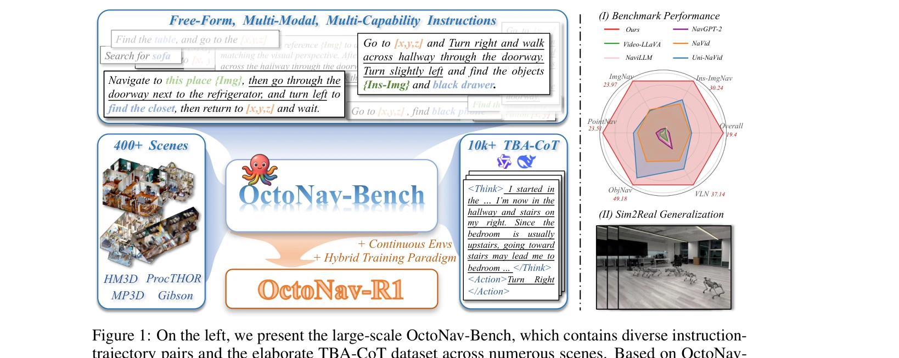
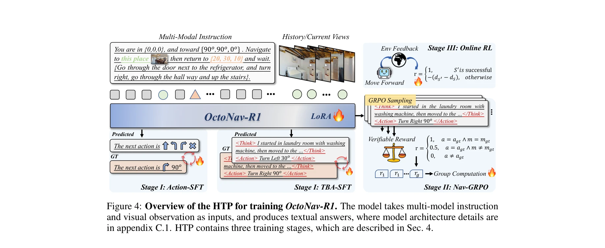

# OctoNav: Towards Generalist Embodied Navigation

> **저자**: Chen Gao, Liankai Jin, Xingyu Peng, Jiazhao Zhang, Yue Deng, Annan Li, He Wang, Si Liu | **날짜**: 2025-06-11 | **URL**: [https://arxiv.org/abs/2506.09839](https://arxiv.org/abs/2506.09839)

---

## Essence

*Figure 1: On the left, we present the large-scale OctoNav-Bench, which contains diverse instruction-*

자유형식의 멀티모달 멀티기능 지시를 따를 수 있는 일반화된 embodied navigation 에이전트를 위해 OctoNav-Bench 벤치마크와 OctoNav-R1 방법을 제안한다. Think-Before-Action 추론을 통해 복잡한 네비게이션 작업에서 향상된 성능을 달성한다.

## Motivation

- **Known**: 기존 embodied navigation 연구는 ObjNav, ImgNav, VLN 등 개별 작업으로 분리되어 있으며, 각각 별도의 데이터셋과 방법이 설계되어 있다. 최근 일반화된 navigation 에이전트 구축을 시도하는 작업들이 있지만 여전한 한계가 있다.
- **Gap**: 기존 벤치마크와 방법들은 단일 기능 또는 단일 모달리티만 포함하며 자유형식의 멀티모달 멀티기능 지시를 동시에 처리할 수 없다. 또한 일반화된 reasoning 능력을 갖춘 navigation 에이전트 개발이 부족하다.
- **Why**: 일반화된 navigation 에이전트는 실제 로봇 애플리케이션에서 다양한 작업을 유연하게 처리할 수 있어야 하며, 이는 embodied AI의 핵심 기능이다. Think-before-action을 통한 reasoning은 복잡한 지시 이해도를 향상시킬 수 있다.
- **Approach**: 400+개 장면과 45k+개 자동 생성된 지시-궤적 쌍, 그리고 TBA-CoT 데이터셋을 포함하는 대규모 OctoNav-Bench를 구축한다. MLLM 기반의 VLA 모델인 OctoNav-R1을 Action-/TBA-SFT, Nav-GRPO, Online RL 세 단계의 Hybrid Training Paradigm으로 학습한다.

## Achievement

*Figure 1: On the left, we present the large-scale OctoNav-Bench, which contains diverse instruction-*

- **OctoNav-Bench 벤치마크**: 400+개 연속 환경의 3D 장면에서 45k+개의 자유형식 멀티모달 멀티기능 지시-궤적 쌍과 10k+개의 TBA-CoT 데이터셋을 제공하는 대규모 통합 벤치마크 구축
- **OctoNav-R1 모델**: 자유형식 멀티모달 멀티기능 지시를 따르고 2D 시각 관찰로부터 저수준 행동을 직접 생성하는 VLA 기반 navigation 에이전트 개발
- **Hybrid Training Paradigm**: Action-/TBA-SFT, Nav-GRPO, Online RL을 통합하여 명시적 thinking 프로세스를 가진 모델 학습 방법 제안
- **성능 향상**: ObjNav, PointNav, ImgNav, Ins-ImgNav, VLN 모든 기능에서 기존 방법(NaVid, Uni-NaVid, NavGPT-2 등)을 초과하는 성능 달성
- **Sim2Real 일반화**: 실제 로봇 배포에서 실제 환경 미세조정 없이 초기 sim-to-real 전이 능력 입증

## How

*Figure 4: Overview of the HTP for training OctoNav-R1. The model takes multi-model instruction*

- 자동 annotation 파이프라인을 통해 HM3D, MP3D, Gibson, ProcTHOR 등 다양한 환경에서 자유형식 지시-궤적 쌍 생성
- Qwen-VL과 DeepSeek-R1을 활용하여 각 행동 뒤의 reasoning 과정을 포함하는 TBA-CoT 데이터셋 구축
- MLLM을 VLA 모델로 변환하여 egocentric 시각 관찰로부터 저수준 행동(move forward, turn left/right 등)을 직접 예측
- Action-SFT/TBA-SFT 단계에서 지도학습으로 cold-start 초기화
- Nav-GRPO 단계에서 group relative policy optimization을 사용하여 thinking 능력 개선
- Online RL 단계에서 환경 상호작용을 통한 추가 학습으로 성능 최적화

## Originality

- 기존 개별 navigation 작업들을 통합하여 자유형식 멀티모달 멀티기능 지시 처리가 가능한 첫 번째 통합 벤치마크와 방법 제시
- Think-Before-Action (TBA-CoT)이라는 새로운 개념으로 navigation에서 명시적 reasoning 프로세스 도입 (DeepSeek-R1의 thinking-before-answer 영감)
- VLA 모델에 RL을 통합하는 Hybrid Training Paradigm으로 기존 SFT 기반 VLA 학습 방식의 한계 극복
- continuous 환경 설정으로 그래프 기반 네비게이션의 제약 극복하고 실제 로봇 배포 가능성 증대

## Limitation & Further Study

- 현재 sim2real 성능은 '초기(preliminary)' 수준이므로 실제 환경에서의 안정적 성능 검증 필요", 'TBA-CoT 데이터 생성에 LLM(Qwen-VL, DeepSeek-R1) 의존으로 인한 annotation 품질의 일관성 문제 가능성
- 자유형식 지시의 다양성이 충분한지, 그리고 학습된 패턴이 정말 일반화되는지에 대한 더 깊은 분석 필요
- 다양한 환경과 실제 실내/실외 환경에서의 성능 평가 부재
- 후속 연구: (1) 더 다양한 실제 환경에서의 시뮬레이션 및 로봇 배포 확대, (2) TBA-CoT 데이터셋의 자동 품질 검증 메커니즘 개발, (3) 다양한 robot embodiment으로의 확장

## Evaluation

- Novelty: 4/5
- Technical Soundness: 3/5
- Significance: 4/5
- Clarity: 4/5
- Overall: 4/5

**총평**: 본 논문은 fragmented된 embodied navigation 작업들을 통합하는 포괄적인 벤치마크와 방법을 처음 제시하며, Think-Before-Action을 통한 명시적 reasoning 도입으로 일반화된 navigation 에이전트 개발에 중요한 기여를 한다. 초기 sim2real 결과는 실용적 가능성을 시사하지만, 추가 실제 환경 검증이 필요하다.

## Related Papers

- 🔗 후속 연구: [[papers/1467_Manipulate-Anything_Automating_Real-World_Robots_using_Visio/review]] — INTENTION의 Intuitive Perceptor와 유사하게 Humanoid Locomotion as Next Token Prediction에서 언어 모델 기반 모션 생성 패러다임을 확장하여 구현한다.
- 🏛 기반 연구: [[papers/1343_Cosmos-Reason1_From_Physical_Common_Sense_To_Embodied_Reason/review]] — Cosmos-Reason1의 물리 상식 추론과 INTENTION의 직관적 물리 이해 학습이 모두 embodied AI의 물리적 세계 이해 능력을 다룬다.
- 🔄 다른 접근: [[papers/1422_Hi_Robot_Open-Ended_Instruction_Following_with_Hierarchical/review]] — Hi Robot의 hierarchical instruction following과 INTENTION의 Memory Graph 기반 경험 학습은 모두 복잡한 조작 작업 수행을 위한 다른 접근법이다.
