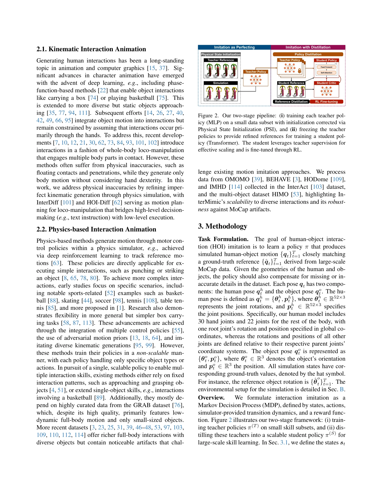
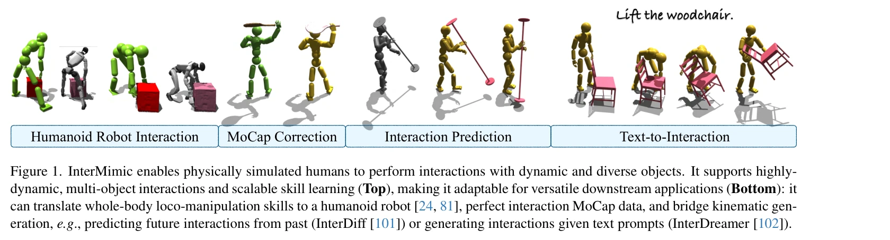

# InterMimic: Towards Universal Whole-Body Control for Physics-Based Human-Object Interactions

> **저자**: Sirui Xu, Hung Yu Ling, Yu-Xiong Wang, Liang-Yan Gui | **날짜**: 2025-02-27 | **URL**: [https://arxiv.org/abs/2502.20390](https://arxiv.org/abs/2502.20390)

---

## Essence

*Figure 2. Our two-stage pipeline: (i) training each teacher pol-*

InterMimic은 불완전한 모션 캡처 데이터로부터 다양한 객체와의 전신 상호작용을 학습할 수 있는 physics-based 정책 학습 프레임워크로, teacher-student 증류 전략과 RL fine-tuning을 통해 현실적이고 물리적으로 타당한 human-object interaction을 생성한다.

## Motivation

- **Known**: Physics-based 모션 모방은 단순한 상호작용(펀칭, 스트라이킹 등)에는 성공했으나, 복잡한 전신 loco-manipulation과 동적 객체와의 상호작용, 모션 캡처 데이터의 부정확성(접촉 오류, 손 동작 부족 등)을 다루는 것은 미해결 상태이다.
- **Gap**: 기존 physics-based 방법들은 특정 객체 타입이나 행동에만 적용되거나 curated 데이터에 의존하며, 다양하고 동적인 객체와의 전신 상호작용을 단일 정책으로 처리하는 확장 가능한 솔루션이 부족하다.
- **Why**: 인간-객체 상호작용의 현실적 시뮬레이션은 로봇 제어, 애니메이션 생성, 텍스트-인터랙션 생성 등 여러 응용분야에서 핵심적이며, 확장 가능한 physics-based 솔루션은 imperfect MoCap 데이터의 대규모 활용을 가능하게 한다.
- **Approach**: 먼저 작은 데이터 부분집합에서 subject-specific teacher 정책들을 훈련하여 모션을 모방·retarget·정제한 후, 이들을 단일 student 정책으로 증류하고 RL fine-tuning을 적용하여 demonstration 이상의 고품질 솔루션을 달성한다.

## Achievement

*Figure 1. InterMimic enables physically simulated humans to perform interactions with dynamic and diverse objects. It su*

- **확장 가능한 전신 loco-manipulation**: 다양하고 동적인 객체와의 복잡한 whole-body 상호작용을 단일 정책으로 처리할 수 있는 첫 번째 framework 제시
- **MoCap 데이터 정제 및 통합**: 부정확한 접촉과 hand detail 부족을 physics simulator를 통해 자동으로 보정하면서 여러 human shape에 대한 통합된 embodiment 달성
- **Teacher-student 증류 전략**: 병렬로 훈련된 teacher 정책들의 expertise를 student에 효율적으로 전달하여 RL의 sample inefficiency 문제를 space-time trade-off로 해결
- **다중 downstream 응용**: Kinematic generator와의 seamless 통합으로 interaction prediction, text-to-interaction generation, humanoid robot control 등을 가능하게 함

## How

*Figure 2. Our two-stage pipeline: (i) training each teacher pol-*

- Teacher 정책 훈련: 각 teacher는 작은 데이터 부분집합에서 **contact-guided reward**를 통해 MoCap 모션을 imitate하고 retarget하며 physical contact 오류를 보정
- 통합된 retargeting: Imitation과 retargeting 목표를 동시에 최적화하여 다양한 human shape에 대한 canonical human model로의 통일
- Student 정책 증류: Teacher rollout으로부터 refined HOI reference를 얻고, demonstration-based 초기화 후 점진적으로 pure RL 업데이트로 전환하는 curriculum 전략 적용
- RL fine-tuning: PPO를 사용한 추가 학습으로 demonstration 복제를 넘어 더 높은 품질의 physics-based 솔루션 도출
- Trajectory 최적화: Teacher 정책이 수집한 고품질 trajectory를 student 학습의 높은 수준의 reference로 활용

## Originality

- Physics-based human-object interaction의 확장성 문제를 curriculum-based teacher-student 증류 프레임워크로 해결한 새로운 접근
- Imperfect MoCap 데이터의 retargeting과 physical 정제를 단일 framework 내에서 통합 처리
- RL의 sample inefficiency 극복을 위한 space-time trade-off 활용 - 병렬 teacher 훈련과 sequential student 증류의 조합
- LLM의 alignment 전략(demonstration pre-training + RL fine-tuning)을 physics-based motion control에 적용한 첫 사례

## Limitation & Further Study

- Teacher 정책들의 병렬 훈련으로 인한 계산 비용이 높을 수 있으며, 여러 teacher의 효과적인 활용을 위한 데이터 분할 전략의 최적화 미흡
- Physics simulator의 정확도와 contact 모델링의 한계가 최종 interaction 품질에 영향을 줄 수 있음
- 매우 높은 역학적 복잡도의 상호작용(예: 미세한 손가락 manipulation)에 대한 성능 제한 가능성
- 후속 연구: 적응형 teacher 분할 전략, 더 정교한 contact 모델링, 실제 로봇 시스템에서의 sim-to-real transfer 검증

## Evaluation

- Novelty: 4/5
- Technical Soundness: 3/5
- Significance: 4/5
- Clarity: 4/5
- Overall: 4/5

**총평**: InterMimic은 imperfect MoCap 데이터로부터 확장 가능한 physics-based human-object interaction을 학습하는 첫 번째 통합 framework로, teacher-student 증류와 RL fine-tuning의 창의적 결합을 통해 animation, robotics, generative modeling 등 다양한 응용에서 높은 실용성을 보여준다.

## Related Papers

- 🔗 후속 연구: [[papers/1499_OmniVLA_An_Omni-Modal_Vision-Language-Action_Model_for_Robot/review]] — 대규모 모방 학습 기반 생성형 제어 확장 방법론을 InterMimic의 physics-based 정책 학습에 직접 적용할 수 있다
- 🏛 기반 연구: [[papers/1540_Learning_to_Control_Physically-simulated_3D_Characters_via_G/review]] — 2D 키포인트 기반 3D 캐릭터 제어 프레임워크가 InterMimic의 불완전한 모션 캡처 데이터 활용에 핵심 이론을 제공한다
- 🧪 응용 사례: [[papers/1297_A_Real-to-Sim-to-Real_Approach_to_Robotic_Manipulation_with/review]] — 양팔 원격조종 시스템이 InterMimic의 전신 상호작용 학습 검증에 실제적인 테스트 환경을 제공한다
- 🧪 응용 사례: [[papers/1628_WholeBodyVLA_Towards_Unified_Latent_VLA_for_Whole-Body_Loco-/review]] — InterMimic의 물리 기반 전신 제어와 WholeBodyVLA의 vision-language 기반 제어를 결합한 지능형 humanoid가 가능하다
- 🏛 기반 연구: [[papers/1599_Opening_the_Sim-to-Real_Door_for_Humanoid_Pixel-to-Action_Po/review]] — OmniH2O의 whole-body teleoperation이 1599의 teacher-student framework 구축에 필요한 기반 기술
- 🧪 응용 사례: [[papers/1540_Learning_to_Control_Physically-simulated_3D_Characters_via_G/review]] — 2D 키포인트 기반 3D 제어 프레임워크가 InterMimic의 불완전한 모션 캡처 데이터 활용에 직접적인 기술적 해결책을 제공한다
