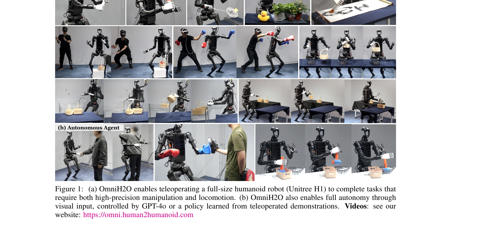
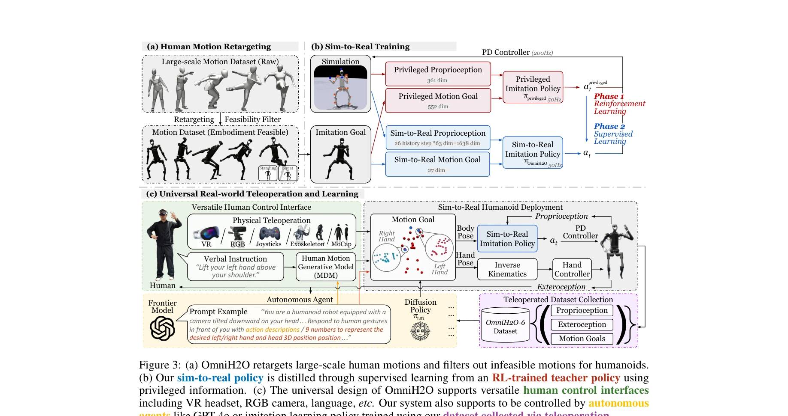

# OmniH2O: Universal and Dexterous Human-to-Humanoid Whole-Body Teleoperation and Learning

> **저자**: Tairan He, Zhengyi Luo, Xialin He, Wenli Xiao, Chong Zhang, Weinan Zhang, Kris Kitani, Changliu Liu, Guanya Shi | **날짜**: 2024-06-13 | **URL**: [https://arxiv.org/abs/2406.08858](https://arxiv.org/abs/2406.08858)

---

## Essence

*Figure 1: (a) OmniH2O enables teleoperating a full-size humanoid robot (Unitree H1) to complete tasks that*

OmniH2O는 kinematic pose를 통일된 제어 인터페이스로 사용하여 VR, 카메라, 음성 등 다양한 입력을 통해 휴머노이드 로봇을 원격 조종하고 자율적으로 동작하도록 하는 학습 기반 시스템이다.

## Motivation

- **Known**: 휴머노이드 로봇의 원격 조종 및 학습 기반 제어는 활발히 연구되어 왔으나, 기존 연구들은 주로 하반신 이동만 지원하거나 상하반신을 분리하여 제어했으며 대규모 데이터 수집을 위한 접근성 높은 인터페이스가 부족했다.
- **Gap**: 전신 운동과 정교한 손 조작을 동시에 수행하는 통합적인 휴머노이드 제어, 그리고 Motion Capture 없이도 작동 가능한 실용적인 원격 조종 인터페이스의 부재가 대규모 시연 데이터 수집을 저해했다.
- **Why**: 휴머노이드 로봇은 일반 지능의 물리적 구현 플랫폼으로 큰 잠재력을 가지고 있으며, 대규모 인간 시연 데이터로부터의 학습을 통해 다양한 실세계 작업을 수행할 수 있는 일반화된 기술 습득이 가능해진다.
- **Approach**: teacher-student distillation 기반 RL 파이프라인으로 AMASS 데이터셋을 kinematic pose로 재타겟팅하고, 특권 정보를 활용한 교사 정책으로부터 센서 입력이 제한된 실제 배포 정책을 학습한다. 또한 kinematic pose 기반 통일 인터페이스를 통해 다양한 입력 소스(VR, 카메라, GPT-4o)와 호환성을 확보한다.

## Achievement

*Figure 1: (a) OmniH2O enables teleoperating a full-size humanoid robot (Unitree H1) to complete tasks that*

- **통합 원격 조종 시스템**: VR 헤드셋, RGB 카메라, 음성 지시 등 다양한 입력 소스를 하나의 kinematic pose 인터페이스로 통합하여 접근성 높은 전신 제어를 실현
- **전신 운동-조작 통합 제어**: 안정적 이동과 정교한 손 조작을 동시에 수행하는 강건한 제어 정책 개발 (스포츠, 물체 이동/조작, 인간 상호작용 등 다양한 실세계 작업 시연)
- **Sim-to-Real 파이프라인**: 동작 데이터 분포 편향, 보상 설계, 입력 히스토리 활용 등을 통해 Motion Capture 없이 실제 배포 가능한 정책 학습
- **휴머노이드 전신 제어 데이터셋**: 6개 일상 작업을 포함한 OmniH2O-6 데이터셋 공개 (첫 휴머노이드 전신 운동-조작 데이터셋)

## How

*Figure 3: (a) OmniH2O retargets large-scale human motions and filters out infeasible motions for humanoids.*

- AMASS 데이터셋을 Unitree H1 휴머노이드에 맞게 retargeting하고 타당성 필터링 적용
- 안정적 자세 유지를 위해 고정된 하반신 동작 수열을 추가하여 학습 데이터 분포 편향 (standing/squatting 강화)
- 시뮬레이션의 privileged proprioception과 motion goal을 활용한 teacher policy 학습 (Phase 1: RL)
- 제한된 센서 입력(관성측정장치 등)으로만 작동하는 student policy 학습 (Phase 2: supervised learning from teacher)
- PPO 알고리즘 기반 목표 조건 RL로 kinematic pose 추적 작업 최적화
- VR, RGB 카메라, GPT-4o 등 다양한 입력으로부터 kinematic pose 생성하여 통합 제어 인터페이스 구성
- 시연 데이터셋으로부터 imitation learning을 통한 자율 정책 학습

## Originality

- Kinematic pose를 통일된 제어 추상화로 도입하여 Motion Capture 없이 다양한 입력 소스(VR, 카메라, 언어 모델)와 호환되는 통합 인터페이스 제시
- 동작 데이터 분포의 의도적 편향(standing/squatting)을 통해 전신 안정성과 조작 정밀도를 동시에 달성하는 학습 전략 제안
- 입력 히스토리를 글로벌 선형 속도 대체제로 활용하여 센서 제약 조건에서의 실제 배포 가능성 향상
- 첫 번째 휴머노이드 전신 운동-조작 데이터셋(OmniH2O-6) 공개로 이 분야의 벤치마크 제공

## Limitation & Further Study

- 시뮬레이션에서만 접근 가능한 privileged proprioception(글로벌 선형 속도 등)에 대한 의존도가 여전하며, 이로 인해 시뮬-리얼 갭이 발생할 수 있음
- OmniH2O-6 데이터셋이 6개 작업만 포함하여 다양한 전신 작업에 대한 학습 데이터 규모가 제한적
- VR 기반 원격 조종의 경우 고정 카메라/환경 설정이 필요하며, 야외 환경에서의 실시간 제어 안정성에 대한 평가 부재
- GPT-4o와의 통합은 시연되었으나 정량적 성공률 및 실패 분석이 제시되지 않음
- 후속 연구로 더 다양한 작업의 데이터 수집, 멀티모달 센서 퓨전을 통한 강건성 향상, 장기 자율 주행 능력 확장 필요

## Evaluation

- Novelty: 4/5
- Technical Soundness: 3/5
- Significance: 4/5
- Clarity: 4/5
- Overall: 4/5

**총평**: OmniH2O는 kinematic pose 기반 통합 인터페이스와 teacher-student 파이프라인을 통해 접근성 높은 휴머노이드 원격 조종 및 자율 제어를 실현한 중요한 기여이며, 첫 휴머노이드 전신 데이터셋 공개로 후속 연구의 기초를 제공한다.

## Related Papers

- 🔄 다른 접근: [[papers/1451_Learning_Human-to-Humanoid_Real-Time_Whole-Body_Teleoperatio/review]] — 둘 다 휴머노이드 전신 텔레오퍼레이션이지만 OmniH2O는 멀티모달에, H2O는 RGB 기반에 집중한다
- 🔗 후속 연구: [[papers/1593_OmniH2O_Universal_and_Dexterous_Human-to-Humanoid_Whole-Body/review]] — OmniH2O의 unified control interface를 다른 텔레오퍼레이션 시스템들이 확장했다
- 🏛 기반 연구: [[papers/1297_Bunny-VisionPro_Real-Time_Bimanual_Dexterous_Teleoperation_f/review]] — VR 기반 양팔 텔레오퍼레이션이 OmniH2O의 멀티모달 인터페이스의 기반이 된다
- 🔄 다른 접근: [[papers/1451_Learning_Human-to-Humanoid_Real-Time_Whole-Body_Teleoperatio/review]] — 둘 다 RGB 기반 휴머노이드 전신 텔레오퍼레이션이지만 H2O는 실시간 학습에, OmniH2O는 멀티모달 인터페이스에 집중한다
- 🔗 후속 연구: [[papers/1593_OmniH2O_Universal_and_Dexterous_Human-to-Humanoid_Whole-Body/review]] — OmniH2O의 통합 휴머노이드 제어 프레임워크가 범용적이고 정교한 OmniH2O 시스템으로 더욱 확장되었다.
