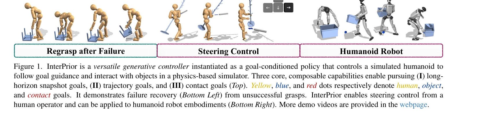
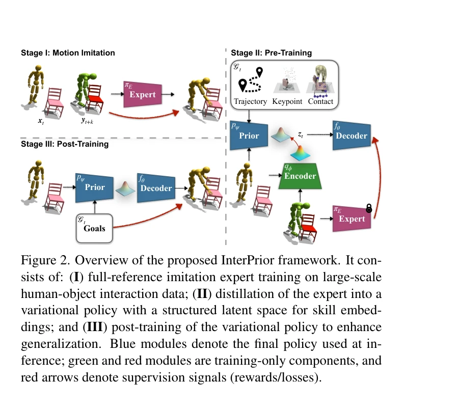

# InterPrior: Scaling Generative Control for Physics-Based Human-Object Interactions

> **저자**: Sirui Xu, Samuel Schulter, Morteza Ziyadi, Xialin He, Xiaohan Fei, Yu-Xiong Wang, Liangyan Gui | **날짜**: 2026-02-05 | **URL**: [https://arxiv.org/abs/2602.06035](https://arxiv.org/abs/2602.06035)

---

## Essence

*Figure 1. InterPrior is a versatile generative controller instantiated as a goal-conditioned policy that controls a simu*

InterPrior는 대규모 모방 학습과 강화학습 미세조정을 통해 물리 기반 인간-물체 상호작용을 수행하는 확장 가능한 생성형 제어기를 학습한다.

## Motivation

- **Known**: 기존 물리 기반 인간-물체 상호작용 제어는 참조 계획에 의존하거나 대규모 데이터 확장에 어려움을 겪으며, 생성형 제어기는 적대적 모방 학습이나 제한된 데이터셋에 의존한다.
- **Gap**: 모방 학습으로 훈련된 정책은 훈련 행동을 재구성하지만, 방대한 인간-물체 상호작용 구성 공간에서 일반화하지 못하며, RL 단독으로는 자연스럽지 않은 보상 해킹 행동으로 드리프트될 수 있다.
- **Why**: 인간형 로봇이 다양한 맥락에서 로코-조작 기술을 구성하고 일반화하면서 물리적으로 일관된 전신 조정을 유지하려면 확장 가능한 상호작용 선행 모델이 필수적이다.
- **Approach**: InterPrior는 전체 참조 모방 전문가를 목표 조건부 variational policy로 증류한 후, 물리적 섭동을 이용한 데이터 증강과 RL 미세조정을 통해 재구성된 잠재 기술을 유효한 다양체로 통합한다.

## Achievement

*Figure 1. InterPrior is a versatile generative controller instantiated as a goal-conditioned policy that controls a simu*

- **다중 목표 형식 지원**: 단일 정책이 스냅샷 목표, 궤적 목표, 접촉 목표 등 다양한 고수준 의도를 처리하며 목표 변환과 구성을 지원한다.
- **강건한 실패 복구**: 미세조정된 정책이 재접근 및 재파지(re-grasp) 같은 복구 행동을 자연스럽게 학습하고, 물리적 섭동 하에서도 안정성을 유지한다.
- **새로운 물체로의 일반화**: 훈련 데이터를 초과하여 일반화하며, 미처음 본 물체와의 상호작용을 포함한 새로운 행동을 통합할 수 있다.
- **신체 유연성**: G1 인간형 로봇에서 훈련하고 실시간 키보드 인터페이스를 통해 제어 가능하며, 실제 로봇 배포 가능성을 시연한다.

## How

*Figure 2. Overview of the proposed InterPrior framework. It con-*

- **전문가 정책 증류**: 전체 참조 모방 전문가에서 masked conditional variational policy로 증류하여 다중 양식 관찰 및 고수준 의도로부터 운동을 재구성한다.
- **물리적 섭동 데이터 증강**: 훈련 분포를 확장하고 정책의 강건성을 개선하기 위해 초기 상태와 물체 속성에 물리적 섭동을 적용한다.
- **RL 미세조정**: 미본 목표 및 초기화에서의 성공을 개선하고 정규화를 통해 사전훈련 지식을 유지하는 두 가지 목표를 최적화한다.
- **재구성된 기술 통합**: 증류된 정책이 생성한 인-비트윈 운동과 실패 상태를 활용하여 잠재 기술을 안정적인 연속 다양체로 변환한다.
- **목표 추출 및 조건화**: 사용자 제어, kinematic motion generator, MoCap 데이터로부터 고수준 목표를 추출하고 이를 현재 상태 및 이력과 함께 정책에 조건화한다.

## Originality

- **증류와 RL의 시너지**: 기존 연구는 증류 또는 RL을 개별적으로 사용했으나, InterPrior는 두 접근법을 결합하여 자연스러운 초기화와 강건한 최적화를 동시에 달성한다.
- **확장 가능한 생성형 제어**: 적대적 모방 학습의 불안정성을 피하면서 대규모 HOI 데이터를 흡수하는 새로운 방법을 제시한다.
- **물리적 섭동 기반 데이터 증강**: 구성 공간 확장을 위해 물리적 섭동을 체계적으로 활용하는 방법론을 도입한다.
- **다중 능력 통합**: 스냅샷 목표, 궤적 목표, 접촉 목표를 단일 정책으로 처리하는 통합된 프레임워크를 제공한다.

## Limitation & Further Study

- **시뮬레이션 중심 평가**: 실제 로봇 배포 가능성을 시연했지만, 대부분의 실험은 시뮬레이션(G1 humanoid, physics simulator)에 한정되어 실제 환경의 복잡성을 완전히 포착하지 못할 수 있다.
- **목표 추출 의존성**: 고수준 목표가 명확히 정의되어야 하며, kinematic generator나 MoCap 데이터 같은 외부 소스에 의존한다.
- **구성 공간 한계**: 방대한 인간-물체 상호작용 구성 공간이 완전히 해결되지 않았으며, 특정 유형의 물체나 상호작용에 대한 일반화 한계는 명확하지 않다.
- **후속 연구**: (1) 실제 로봇에서의 광범위한 검증, (2) 더 복잡한 다중-물체 상호작용과 동적 환경에서의 성능 평가, (3) sim-to-real transfer 기법 개발, (4) 정책의 해석성 및 실패 모드 분석 필요

## Evaluation

- Novelty: 4/5
- Technical Soundness: 3/5
- Significance: 4/5
- Clarity: 4/5
- Overall: 4/5

**총평**: InterPrior는 대규모 모방 학습과 RL 미세조정의 시너지를 통해 물리 기반 인간-물체 상호작용을 위한 확장 가능한 생성형 제어기를 성공적으로 구현하며, 다양한 목표 형식, 미처음 본 물체에 대한 일반화, 강건한 실패 복구를 시연하여 인간형 로봇 제어의 중요한 진전을 제시한다.

## Related Papers

- 🔄 다른 접근: [[papers/1575_Mobile-TeleVision_Predictive_Motion_Priors_for_Humanoid_Whol/review]] — 멀티모달 VLA 모델을 통한 통합 제어와 달리 상하체 분리 제어 방식으로 다른 아키텍처 접근법을 제시합니다.
