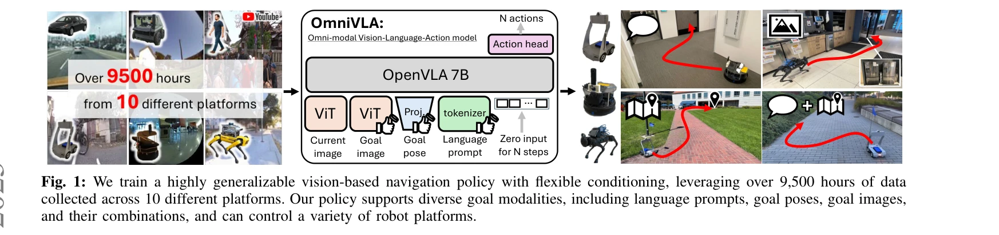
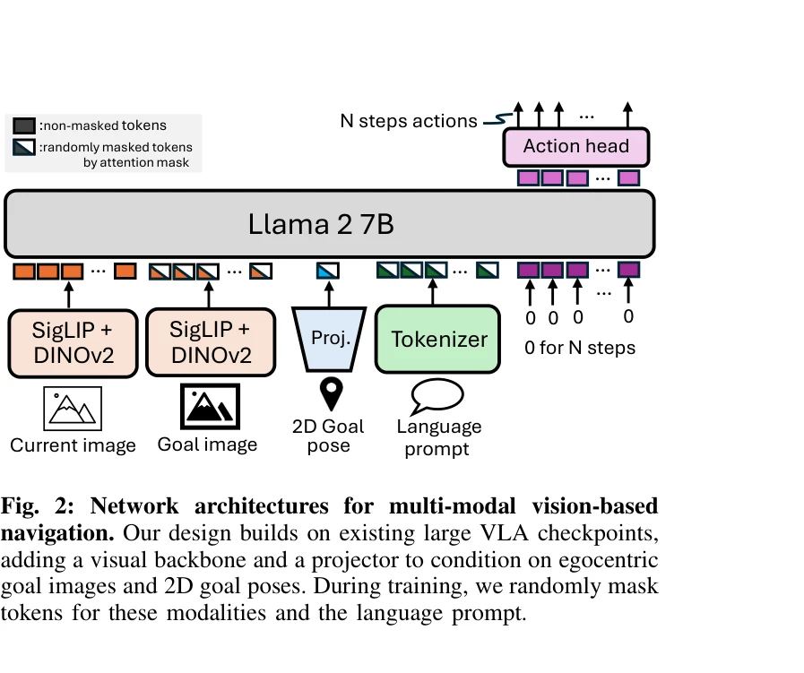

# OmniVLA: An Omni-Modal Vision-Language-Action Model for Robot Navigation

> **저자**: Noriaki Hirose, Catherine Glossop, Dhruv Shah, Sergey Levine | **날짜**: 2025-09-23 | **URL**: [https://arxiv.org/abs/2509.19480](https://arxiv.org/abs/2509.19480)

---

## Essence

*Fig. 1: We train a highly generalizable vision-based navigation policy with flexible conditioning, leveraging over 9,500*

OmniVLA는 2D 포즈, egocentric 이미지, 자연어 등 다양한 모달리티로 조건화된 목표를 처리할 수 있는 omni-modal vision-language-action 모델로, 9,500시간 이상의 다중 플랫폼 로봇 네비게이션 데이터로 학습되어 강력한 일반화 성능을 달성한다.

## Motivation

- **Known**: 기존 로봇 네비게이션 정책들은 대부분 단일 모달리티(egocentric 이미지, 2D 포즈, 또는 자연어)로만 학습되며, 이는 실제 환경에서의 적응성을 제한한다. VLA 모델과 modality masking 기법은 조작 분야에서 성공적으로 사용되었다.
- **Gap**: 기존 네비게이션 정책들은 단일 모달리티 조건화만 지원하여 실제 사용 시나리오의 유연성이 부족하고, 다양한 데이터셋을 동시에 활용할 수 없다. End-to-end VLA 기반 omni-modal 네비게이션 모델이 부재하다.
- **Why**: 인간은 자연스럽게 여러 정보 모달리티(GPS, 랜드마크, 언어 지시)를 조합하여 네비게이션을 수행하므로, 로봇도 이러한 유연성을 가져야 하며, omni-modal 학습은 더 풍부한 기하학적·의미론적·시각적 표현을 학습하게 한다.
- **Approach**: OpenVLA 7B 백본을 기반으로 하여 goal 이미지와 2D 포즈를 처리하는 ViT 인코더와 projection layer를 추가하고, 학습 중 randomized modality fusion 전략으로 세 가지 모달리티와 그 조합을 학습한다. Modality dropout과 masking을 통해 모달리티 불균형 문제를 해결한다.

## Achievement

*Fig. 2: Network architectures for multi-modal vision-based*

- **Omni-modal 조건화 지원**: 2D 포즈, egocentric 이미지, 자연어 및 이들의 조합으로부터 네비게이션이 가능하며, 사용자가 여러 모달리티를 함께 활용할 수 있다.
- **대규모 학습 데이터 활용**: 10개 플랫폼에서 수집한 9,500시간 이상의 데이터를 통합 학습하여 기존의 단일 모달리티 제약을 극복한다.
- **specialist baseline 초과 성능**: 단일 모달리티로 학습된 specialist 모델들보다 모든 모달리티에서 우수한 성능을 달성한다.
- **강력한 일반화 능력**: 미학습 환경으로의 일반화, 희소 모달리티에 대한 강건성, 새로운 자연어 지시 따르기를 모두 달성한다.
- **효율적 fine-tuning**: 제한된 데이터로 새로운 모달리티와 환경에 빠르게 적응 가능하다.

## How

*Fig. 2: Network architectures for multi-modal vision-based*

- OpenVLA 7B 기반 VLA 백본에 DINOv2와 SigLIP을 포함한 visual 인코더 추가
- Goal image와 goal pose를 각각 ViT로 인코딩하여 projection layer를 통해 language embedding space에 정렬
- Llama 2 7B tokenizer로 자연어 프롬프트 처리
- 학습 중 goal image, goal pose, language prompt의 토큰을 randomly mask하는 modality dropout으로 모달리티 불균형 처리
- 추론 시 masking을 통해 이용 가능한 모달리티만 사용 가능하도록 구현
- GNM mixture, LeLaN mixture, Frodobots-2K, BDD-V 등 공개 데이터셋 통합 학습
- Cross-embodiment 데이터 학습으로 다양한 로봇 플랫폼 지원

## Originality

- 네비게이션 분야 최초의 end-to-end VLA 모델로서 omni-modal goal conditioning을 구현하여, 조작 분야의 성공을 네비게이션에 체계적으로 적용한 첫 사례이다.
- Randomized modality fusion 전략으로 서로 다른 데이터셋의 모달리티 불균형을 해결하면서도 각 모달리티의 보완적 정보를 활용한다.
- 9,500시간이라는 대규모 다중 플랫폼 데이터로 pre-training함으로써, 단순히 아키텍처 설계뿐 아니라 데이터 규모와 다양성의 이점을 명확히 보여준다.
- Specialist baseline과의 직접 비교를 통해 omni-modal 학습의 일반화 이점을 정량적으로 입증한다.

## Limitation & Further Study

- 평가가 주로 시뮬레이션 및 제한된 실제 환경 데이터에 국한되었을 가능성 - 더 다양한 실제 환경(극한 날씨, 혼잡 지역)에서의 평가 필요
- Modality fusion의 최적화 방식이 randomized approach에 그쳐 있어, adaptive modality weighting이나 learned fusion mechanism의 탐색 여지가 있다.
- 새로운 모달리티(3D 포인트 클라우드, 깊이 정보 등) 추가 시 아키텍처 수정이 필요한 구조적 제약
- Language instruction의 robust 이해를 위한 hallucination 및 오류 분석이 부족하다.
- 후속 연구: (1) 더욱 복잡한 다중 모달리티 조합의 학습, (2) Continual learning을 통한 새로운 모달리티 온라인 적응, (3) 실제 배포 환경에서의 장기간 성능 평가

## Evaluation

- Novelty: 4/5
- Technical Soundness: 3/5
- Significance: 4/5
- Clarity: 4/5
- Overall: 4/5

**총평**: OmniVLA는 로봇 네비게이션에 omni-modal 조건화를 처음으로 체계적으로 도입한 강력한 foundation model로, 대규모 다중 플랫폼 데이터와 효과적인 모달리티 fusion 전략으로 기존 specialist 모델들을 능가하는 성능과 유연성을 달성한다. 이는 로봇 기초 모델의 일반화 및 확장성 연구에 중요한 기여를 한다.

## Related Papers

- 🏛 기반 연구: [[papers/1589_TopV-Nav_Unlocking_the_Top-View_Spatial_Reasoning_Potential/review]] — top-view 공간 추론 능력이 OmniVLA의 다중 플랫폼 로봇 네비게이션에서 상위 시점 경로 계획에 필수적이다
- 🔗 후속 연구: [[papers/1576_MobileH2R_Learning_Generalizable_Human_to_Mobile_Robot_Hando/review]] — 공간 표현 탐색 방법론을 OmniVLA의 omni-modal 목표 조건화 시스템에 통합하여 공간 이해를 강화할 수 있다
- 🧪 응용 사례: [[papers/1417_GRUtopia_Dream_General_Robots_in_a_City_at_Scale/review]] — 일반목적 휴머노이드 제어를 위한 파운데이션 모델이 OmniVLA의 multi-platform 일반화 검증에 실제 환경을 제공한다
- 🔗 후속 연구: [[papers/1554_RT-1_Robotics_Transformer_for_Real-World_Control_at_Scale/review]] — omni-modal VLA의 다중 조건화 방법을 LeVERB의 latent verb 인터페이스에 통합하여 명령 표현 능력을 강화할 수 있다
- 🔗 후속 연구: [[papers/1498_InterMimic_Towards_Universal_Whole-Body_Control_for_Physics-/review]] — 대규모 모방 학습 기반 생성형 제어 확장 방법론을 InterMimic의 physics-based 정책 학습에 직접 적용할 수 있다
