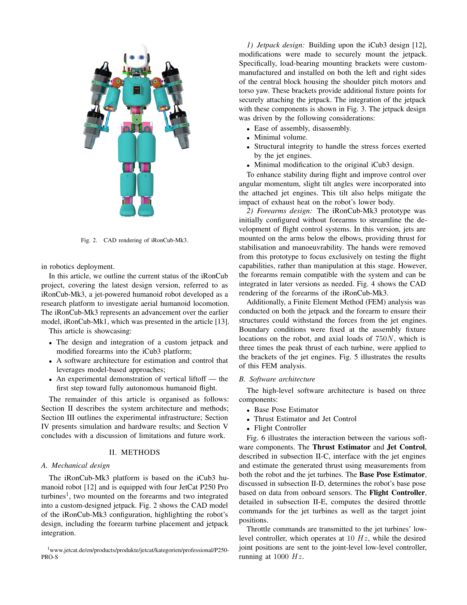

# iRonCub 3: The Jet-Powered Flying Humanoid Robot

> **저자**: Davide Gorbani, Hosameldin Awadalla Omer Mohamed, Giuseppe L'Erario, Gabriele Nava, Punith Reddy Vanteddu, Shabarish Purushothaman Pillai, Antonello Paolino, Fabio Bergonti, Saverio Taliani, Alessandro Croci, Nicholas James Tremaroli, Silvio Traversaro, Bruno Vittorio Trombetta, Daniele Pucci | **날짜**: 2025-06-01 | **URL**: [https://arxiv.org/abs/2506.01125](https://arxiv.org/abs/2506.01125)

---

## Essence

*Fig. 2.*

iRonCub 3는 네 개의 JetCat P250 Pro 터빈으로 구동되는 제트 동력 인형형 로봇으로, 처음으로 수직 이륙을 성공적으로 시연했다. 이는 인형형 로봇의 항공 이동성을 달성하기 위한 첫 번째 중요한 단계를 보여준다.

## Motivation

- **Known**: 이전 연구들은 멀티로터 플랫폼에 로봇 팔이나 그리퍼를 장착한 aerial manipulator, 또는 추진기를 갖춘 인형형 로봇의 단기 비행 개념을 제시했다. iRonCub 프로젝트는 항공, 지상, 조작 능력을 단일 인형형 플랫폼에 통합하려는 더 야심찬 방향을 추구한다.
- **Gap**: 기존 항공 로봇은 인형형이 아니고, 인형형 로봇의 비행 능력은 제한적이었다. 완전한 인형형 형태로 안정적인 비행을 달성하는 것, 특히 제트 추진을 통한 제어, 추정, 시스템 통합의 고유한 도전을 해결한 연구가 부족했다.
- **Why**: 비행 인형형 로봇은 수직 환경, 재난 지역, 고위험 산업 시설 검사 등 복잡한 3D 환경에서 인간과 유사한 형태로 물리적 상호작용과 공간 접근성을 결합할 수 있어 탐색 구조, 인프라 검사, 재난 대응에서 혁신적인 응용이 가능하다.
- **Approach**: iCub3 기반 플랫폼에 커스텀 제트팩과 수정된 전완부를 설계 및 통합하고, Unscented Kalman Filter를 이용한 thrust 추정, Variable Sampling Linear Model Predictive Controller(MPC) 기반 비행 제어기를 개발한다. 시뮬레이션으로 검증 후 실제 이륙 실험을 수행한다.

## Achievement

*Fig. 3.*

- **제트 추진 인형형 로봇의 첫 수직 이륙 시연**: 항공 인형형 로봇 개발의 첫 번째 중요한 단계를 달성했다.
- **기계 아키텍처 설계**: 750N 축방향 하중(각 터빈 최대 추력의 3배)을 견딜 수 있도록 FEM 분석을 통해 검증된 제트팩과 전완부 구조를 개발했다.
- **통합 소프트웨어 아키텍처**: Base Pose Estimator, Thrust Estimator, Flight Controller의 세 가지 주요 구성 요소로 이루어진 모델 기반 추정 및 제어 시스템을 구현했다.
- **Thrust 추정 시스템**: Force-torque 센서 데이터와 비선형 동적 모델을 결합한 UKF 기반 thrust 추정기를 개발했다.
- **실험 인프라 가이드라인**: 제트 동력 인형형 로봇 실험을 위한 안전하고 체계적인 실험 영역 설계 방법을 제시했다.

## How

- iCub3 플랫폼을 기반으로 어깨 피치 모터와 몸통 요 축에 로드 베어링 마운팅 브래킷을 설치하여 커스텀 제트팩을 장착
- 두 개의 JetCat P250 Pro 터빈을 제트팩에, 두 개를 수정된 전완부에 장착하고 추력 향상 및 각운동량 제어를 위해 엔진에 약간의 기울임각 부여
- Force-torque 센서를 로봇 팔과 제트팩에 장착하고 현장에서 보정
- 제트 엔진의 동적 특성을 파악하기 위해 전용 test bench를 구성하여 throttle 입력과 thrust 출력 관계 데이터 획득
- Unscented Kalman Filter를 사용하여 force-torque 센서 측정값과 비선형 동적 모델을 결합한 thrust 추정
- Variable Sampling Linear Model Predictive Controller(MPC)를 구현하여 제트 터빈의 throttle 명령과 목표 관절 위치 계산
- YARP middleware를 통해 onboard 컴퓨터에서 모든 소프트웨어 컴포넌트 통합 및 통신 (throttle 명령 10 Hz, 관절 위치 명령 1000 Hz)
- 시뮬레이션에서 테이크오프 및 궤적 추적으로 제어 및 추정 프레임워크 검증
- 실제 하드웨어에서 수직 이륙 실험 수행

## Originality

- 제트 터빈을 사용한 인형형 로봇 비행은 기존의 멀티로터 항공 로봇이나 단기 비행 capable 인형형 로봇과 차별화되는 혁신적 접근이다.
- 인형형 형태를 유지하면서 항공 이동성을 달성하려는 시도는 이전에 시도되지 않았던 독특한 기술 통합이다.
- Thrust 추정을 위해 force-torque 센서 데이터와 비선형 동적 모델을 UKF로 결합하는 방식은 제트 엔진의 복잡한 동특성을 다루기 위한 혁신적 해결책이다.
- MPC 기반 비행 제어기와 모델 기반 접근은 인형형 로봇의 이중 작업(비행과 안정화)을 동시에 관리하는 독창적인 방법이다.

## Limitation & Further Study

- 현재 프로토타입은 조작 능력 없이 비행만 테스트하기 위해 손과 전완부를 제거했으므로, 실제 응용을 위한 조작과 비행의 동시 달성은 미래 과제이다.
- 이륙에 성공했지만 지속적인 비행, 안정적인 호버링, 복잡한 궤적 추적에 대한 검증이 부족하다.
- 실험이 제한된 환경에서만 수행되었으므로 실외 환경, 바람, 기타 외란 조건에서의 견고성이 미검증 상태이다.
- 제트 터빈의 고열과 배기로 인한 로봇 내부 컴포넌트 손상 가능성에 대한 장기 내구성 분석이 필요하다.
- 10 Hz의 throttle 명령 업데이트 속도가 빠른 동적 비행 응답에는 제한적일 수 있다.

## Evaluation

- Novelty: 5/5
- Technical Soundness: 4/5
- Significance: 5/5
- Clarity: 4/5
- Overall: 4/5

**총평**: 본 논문은 제트 동력을 사용한 인형형 로봇의 첫 비행을 성공적으로 시연한 개척적 연구로, 기계 설계, 소프트웨어 아키텍처, 제어 기술이 잘 통합되어 있다. 다만 단순 이륙 실험에 그쳤으므로 안정적 비행과 조작 능력 통합을 위한 후속 연구가 필요하다.

## Related Papers

- 🔄 다른 접근: [[papers/1299_CAD-Driven_Co-Design_for_Flight-Ready_Jet-Powered_Humanoids/review]] — 실제 제트 엔진 구현과 CAD 기반 co-design의 서로 다른 제트 추진 휴머노이드 개발 접근법을 비교합니다.
- 🔗 후속 연구: [[papers/1516_Learning_Aerodynamics_for_the_Control_of_Flying_Humanoid_Rob/review]] — iRonCub 3의 수직 이륙 성공이 공기역학 학습 기반 정밀 비행 제어로 발전될 수 있습니다.
- 🏛 기반 연구: [[papers/1488_HUSKY_Humanoid_Skateboarding_System_via_Physics-Aware_Whole-/review]] — 제트 추진 시스템의 복잡한 제약 조건이 스케이트보드 제어의 비홀로노믹 제약 관리에 기초가 됩니다.
- 🔄 다른 접근: [[papers/1299_CAD-Driven_Co-Design_for_Flight-Ready_Jet-Powered_Humanoids/review]] — CAD 기반 co-design과 실제 제트 엔진 구현의 서로 다른 제트 추진 휴머노이드 개발 접근법을 비교할 수 있습니다.
- 🔄 다른 접근: [[papers/1488_HUSKY_Humanoid_Skateboarding_System_via_Physics-Aware_Whole-/review]] — 스케이트보드 탑승과 제트 비행의 서로 다른 비홀로노믹 제약 조건 하의 휴머노이드 제어를 비교할 수 있습니다.
- 🏛 기반 연구: [[papers/1516_Learning_Aerodynamics_for_the_Control_of_Flying_Humanoid_Rob/review]] — 공기역학 모델 학습과 제어가 iRonCub 3의 제트 추진 비행 성능 향상에 직접 적용됩니다.
