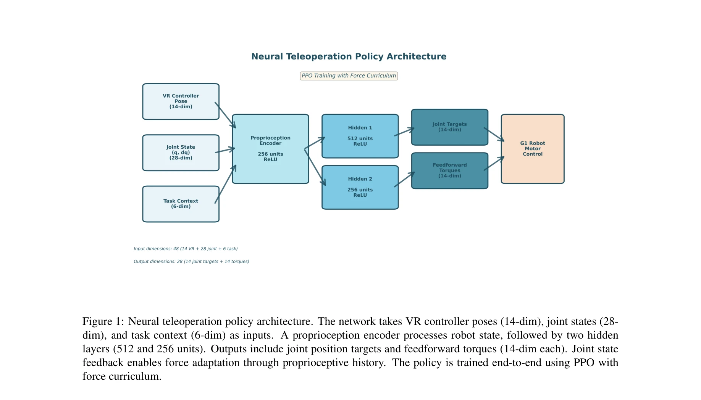

# Is imitation learning the route to humanoid robots?

> **저자**:  | **날짜**:  | **URL**: [https://www.cell.com/trends/cognitive-sciences/abstract/S1364-6613(99)01327-3](https://www.cell.com/trends/cognitive-sciences/abstract/S1364-6613(99)01327-3)

---

## Essence

*Figure 1: Neural teleoperation policy architecture. The network takes VR controller poses (14-dim), joint states (28-*

VR 텔레오퍼레이션 기반 휴머노이드 로봇 제어에서 기존 IK+PD 파이프라인을 신경망 정책으로 대체하여 힘 적응성과 동작 부드러움을 개선한다. Imitation learning과 RL fine-tuning을 결합한 학습 기반 접근법을 제시한다.

## Motivation

- **Known**: VR 텔레오퍼레이션은 복잡한 조작 작업을 위한 유망한 방식이며, 기존 시스템은 IK 솔버와 PD 제어기를 사용한다. RL은 로봇 제어에서 동적 환경 적응 능력을 보여주었다.
- **Gap**: IK+PD 파이프라인은 외부 힘을 무시하고 사용자 선호도에 적응하지 못하며 불자연스러운 동작을 생성한다. 실시간 텔레오퍼레이션 설정에서 힘 적응적 신경 제어의 부재가 있다.
- **Why**: 자연스럽고 강건한 로봇 텔레오퍼레이션은 창고 물류, 제조, 재난 대응 등 현실 응용에 필수적이며, 학습 기반 접근법은 기존 방식의 본질적 한계를 해결할 수 있다.
- **Approach**: Behavioral cloning으로 IK 데모를 통해 정책을 초기화한 후, PPO를 사용하여 추적 오류, 부드러움, 에너지 효율을 보상하는 다단계 RL fine-tuning을 수행한다. 힘 curriculum learning을 통해 외부 동요에 대한 적응성을 강화한다.

## Achievement

*Figure 3 provides a detailed breakdown of performance*

- **추적 정확도 개선**: IK 기준선 대비 34% 낮은 추적 오류 달성
- **동작 부드러움**: IK 기준선 대비 45% 더 매끄러운 궤적 생성
- **힘 적응성**: 외부 힘 교란에 대한 우수한 보상 능력 시연
- **실시간 성능**: 50Hz 제어 주파수 유지하면서 50Hz+ 실시간 계산 가능
- **다양한 작업 검증**: 물체 픽앤플레이스, 문 열기, 양팔 조정 작업에서 유효성 입증

## How

*Figure 1: Neural teleoperation policy architecture. The network takes VR controller poses (14-dim), joint states (28-*

- VR input encoder를 통해 상대 변환(relative transformation) 기반 컨트롤러 포즈 인코딩
- Proprioception encoder는 MLP를 사용하여 5 타임스텝 관절 상태 히스토리 처리
- LSTM policy head가 VR 입력과 고유감각을 결합하여 시간적 일관성 확보
- Behavioral cloning (식 10)으로 IK 데모 학습
- PPO를 통한 3단계 fine-tuning: (1) 추적 보상 (식 11), (2) 부드러움 보상 (식 12), (3) 에너지 정규화 (식 13)
- Force curriculum learning (식 15)으로 점진적 외부 힘 증가
- Domain randomization을 통한 sim-to-real 전이 (링크 질량 ±10% 등)

## Originality

- VR 텔레오퍼레이션 설정에서 end-to-end 신경 정책으로 IK+PD 파이프라인을 완전히 대체하는 시도
- Imitation learning과 RL을 결합한 다단계 학습 파이프라인의 효과적 설계
- 고유감각 피드백을 통한 암시적 힘 보상 메커니즘으로 센서 기반 제어와 차별화
- 상대 변환 기반 VR 입력 인코딩으로 좌표계 불변성 달성

## Limitation & Further Study

- LSTM 기반 아키텍처로 인한 온라인 학습 어려움; transformer 같은 대안 구조 탐색 필요
- Force curriculum의 수렴 보장성 부재; 더 체계적인 커리큘럼 설계 필요
- Unitree G1 단일 플랫폼에서만 검증; 다양한 형태의 휴머노이드에 대한 일반화 미검증
- 사용자 적응성 주장에도 불구하고 정량적 user study 데이터 부재
- 실제 외부 물체 상호작용에서의 성능; 더 복잡한 환경 조건 시험 필요
- 후속 연구: 시각 피드백 통합, haptic feedback 고려, 다중 사용자 적응 메커니즘 개발

## Evaluation

- Novelty: 4/5
- Technical Soundness: 3/5
- Significance: 4/5
- Clarity: 4/5
- Overall: 4/5

**총평**: 본 논문은 VR 텔레오퍼레이션에 대한 실질적이고 실용적인 학습 기반 솔루션을 제시하며, 명확한 동기, 체계적인 파이프라인, 강력한 실험 결과를 통해 IK+PD 기준선 대비 현저한 개선을 입증한다. 다만 단일 로봇 플랫폼 검증과 형식적 일반화 분석이 아쉬운 부분이다.

## Related Papers

- 🔄 다른 접근: [[papers/1515_Phantom_Training_Robots_Without_Robots_Using_Only_Human_Vide/review]] — 둘 다 VR 텔레오퍼레이션에서 신경망 정책을 다루지만 서로 다른 접근 방식이나 관점을 제시한다
- 🔗 후속 연구: [[papers/1441_Heavy_lifting_tasks_via_haptic_teleoperation_of_a_wheeled_hu/review]] — 기본적인 모방학습을 haptic 피드백과 힘 적응으로 확장했다
- 🔄 다른 접근: [[papers/1515_Phantom_Training_Robots_Without_Robots_Using_Only_Human_Vide/review]] — 둘 다 VR 텔레오퍼레이션에서 신경망 정책을 다루지만 서로 다른 접근 방식이나 개선사항을 제시한다
- 🏛 기반 연구: [[papers/1550_Robots_Enact_Malignant_Stereotypes/review]] — LLM/VLM 제어 로봇의 취약성 연구가 로봇 시스템에서 기초 모델 사용 시 발생할 수 있는 편향과 안전성 문제의 이론적 배경을 제공한다.
