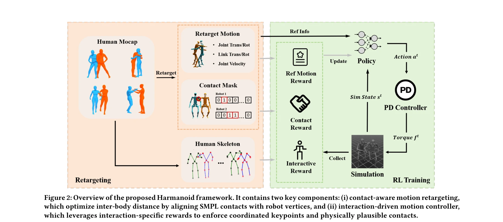
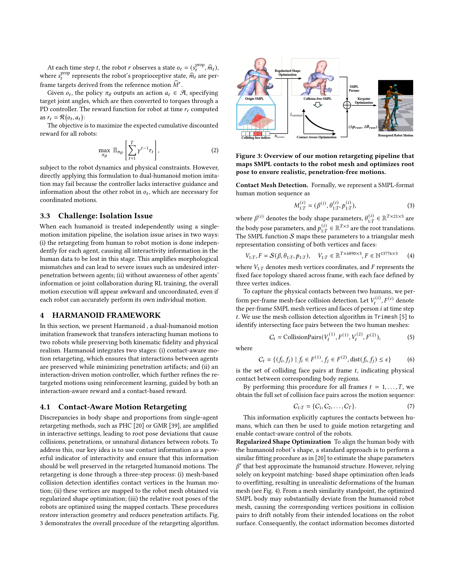

# It Takes Two: Learning Interactive Whole-Body Control Between Humanoid Robots

> **저자**: Zuhong Liu, Junhao Ge, Minhao Xiong, Jiahao Gu, Bowei Tang, Wei Jing, Siheng Chen | **날짜**: 2025-10-11 | **DOI**: [10.48550/arXiv.2510.10206](https://doi.org/10.48550/arXiv.2510.10206)

---

## Essence

*Figure 2: Overview of the proposed Harmanoid framework. It contains two key components: (i) contact-aware motion retarge*

Harmanoid는 두 개의 휴머노이드 로봇 간 상호작용을 학습하기 위한 이중-휴머노이드 모션 모방 프레임워크로, 접촉-인식 모션 재타겟팅과 상호작용-구동 모션 컨트롤러를 통해 키네마틱 충실도와 물리적 현실성을 동시에 보존한다.

## Motivation

- **Known**: 단일 휴머노이드 모션 모방 방법들은 충분히 발전했으나, 이들은 각 로봇을 독립적으로 취급하여 개별 에이전트의 자율적 행동 재현에만 집중한다. 상호작용 모션 합성은 컴퓨터 그래픽스에서 연구되었지만 실제 로봇의 물리적 제약을 고려하지 못한다.
- **Gap**: 기존 단일-휴머노이드 방법들은 다중 로봇 간 동적 상호작용, 접촉 정렬, 좌표 행동을 무시하여 상호작용 시나리오에서 실패한다. 에이전트 간 의존성과 coupled dynamics를 명시적으로 모델링하는 다중-휴머노이드 프레임워크가 부재하다.
- **Why**: 휴머노이드 로봇의 진정한 가치는 노인 돌봄, 재활 지원, 협력 제조 등 인간과 같은 사회적 상호작용이 필요한 실제 응용에 있으며, 이를 위해서는 물리적으로 현실적이고 조율된 이중-휴머노이드 행동 생성이 필수적이다.
- **Approach**: Harmanoid는 두 단계 파이프라인을 제안한다: (i) SMPL 접촉을 로봇 정점과 정렬하여 inter-body 조율을 복원하는 contact-aware motion retargeting, (ii) interaction-specific rewards와 curriculum learning을 활용하여 조율된 keypoint와 물리적으로 타당한 접촉을 강제하는 interaction-driven motion controller.

## Achievement

*Figure 2: Overview of the proposed Harmanoid framework. It contains two key components: (i) contact-aware motion retarge*

- **접촉-인식 재타겟팅**: 기존 단일-로봇 방법 대비 약 25% 성공률 향상을 달성하며, interpenetration을 실질적으로 완화하고 interactive characteristics를 보존
- **상호작용-구동 제어**: interaction-specific 및 contact-based rewards의 추가가 더욱 표현력있고 물리적으로 일관된 행동을 생성함을 ablation 결과로 증명
- **종합 성능**: Inter-X Dataset에서 단일 모션 모방 프레임워크를 능가하며, 동기화되고 안정적인 이중-휴머노이드 상호작용 모션 실현
- **curriculum learning**: 훈련 안정화 및 결과 모션 품질 개선 효과 확인

## How

*Figure 3: Overview of our motion retargeting pipeline that*

- **Motion retargeting stage**: SMPL 모델에서 추출한 human contact를 robot vertices와 정렬하기 위해 shape optimization 적용; 이를 통해 inter-body distance와 contact consistency 개선
- **Contact-aware optimization**: 재타겟팅 과정에서 inter-agent collision을 제약 조건으로 포함하여 격자 접촉 정렬 강화
- **Motion controller training**: interaction-specific rewards (coordinated keypoint enforcement, contact plausibility) 설계 및 curriculum learning을 통한 점진적 복잡도 증대
- **Reinforcement learning framework**: DeepMimic 기반의 whole-body 제어 정책 학습으로 reference motion 추적 최적화
- **Dual-agent dynamics modeling**: 두 로봇 간 coupled behavior 명시적 모델링으로 isolation issue 해결

## Originality

- **이중-휴머노이드 최초 프레임워크**: 상호작용하는 인간 모션을 두 로봇에 전달하면서 kinematic fidelity와 physical realism을 동시 보존하는 첫 번째 종합 접근
- **Contact-aware retargeting 혁신**: SMPL 접촉-로봇 정점 정렬 기법으로 기존 keypoint 기반 방법의 한계 극복
- **Interaction-driven reward design**: 상호작용 특이적 보상 구조로 단순 pose matching을 넘어 coordinated behavior 강제
- **Curriculum learning 통합**: 복잡한 다중 에이전트 제어를 점진적으로 습득하는 새로운 학습 전략

## Limitation & Further Study

- **데이터셋 제약**: Inter-X Dataset에서의 평가만 제시되었으며, 다양한 상호작용 시나리오(3명 이상 로봇, 복잡한 그룹 행동) 확장 필요
- **실로봇 배포 부재**: 시뮬레이션 결과만 제시되었으며, sim-to-real transfer 성공 여부 미확인
- **계산 복잡도 분석 부족**: 이중-휴머노이드 최적화의 computational cost 및 확장성 분석 필요
- **일반화 성능**: 형태가 다른 로봇 쌍이나 비균형적 morphology 간 상호작용 성능 미평가
- **후속 연구 방향**: (1) 3명 이상의 다중 에이전트 상호작용 확장, (2) 실제 로봇 시스템에서의 검증, (3) dynamic한 환경에서의 실시간 제어, (4) 인간-로봇 상호작용(human-robot interaction) 시나리오 추가

## Evaluation

- Novelty: 4/5
- Technical Soundness: 3/5
- Significance: 4/5
- Clarity: 4/5
- Overall: 4/5

**총평**: Harmanoid는 단일-휴머노이드 방법의 isolation issue를 체계적으로 식별하고 contact-aware retargeting과 interaction-driven control을 통해 해결함으로써, 이중-휴머노이드 상호작용 모방에서 새로운 벤치마크를 제시한다. 다만 실로봇 검증과 다중 에이전트 확장이 시급한 후속 과제이다.

## Related Papers

- 🔄 다른 접근: [[papers/1549_Learning_Whole-Body_Human-Humanoid_Interaction_from_Human-Hu/review]] — 둘 다 인간-인간 상호작용을 로봇 상호작용으로 변환하지만 1502는 이중-휴머노이드에, 1549는 인간-휴머노이드에 특화됨
- 🏛 기반 연구: [[papers/1594_OmniRetarget_Interaction-Preserving_Data_Generation_for_Huma/review]] — OmniRetarget의 상호작용 보존 기술이 이중-휴머노이드 상호작용 학습의 기반 방법론을 제공함
- 🧪 응용 사례: [[papers/1320_BitVLA_1-bit_Vision-Language-Action_Models_for_Robotics_Mani/review]] — Coordinated Humanoid Manipulation의 choice policies가 이중-휴머노이드 협력 제어의 실제 구현 사례를 보여줌
- 🏛 기반 연구: [[papers/1346_Diffusion_Forcing_for_Multi-Agent_Interaction_Sequence_Model/review]] — interactive control의 기본 프레임워크를 multi-agent로 확장하는 기반이다
- 🔄 다른 접근: [[papers/1549_Learning_Whole-Body_Human-Humanoid_Interaction_from_Human-Hu/review]] — 둘 다 인간-인간 상호작용을 로봇으로 변환하지만 1549는 인간-휴머노이드에, 1502는 이중-휴머노이드에 특화됨
- 🏛 기반 연구: [[papers/1594_OmniRetarget_Interaction-Preserving_Data_Generation_for_Huma/review]] — Harmanoid의 상호작용 보존 모션 재타겟팅이 interaction mesh 기반 데이터 생성의 기반 방법론을 제공함
- 🧪 응용 사례: [[papers/1611_PhysDiff_Physics-Guided_Human_Motion_Diffusion_Model/review]] — one-step diffusion policy의 빠른 생성이 PhysDiff의 물리 제약 방법과 결합되어 실시간 응용이 가능하다
