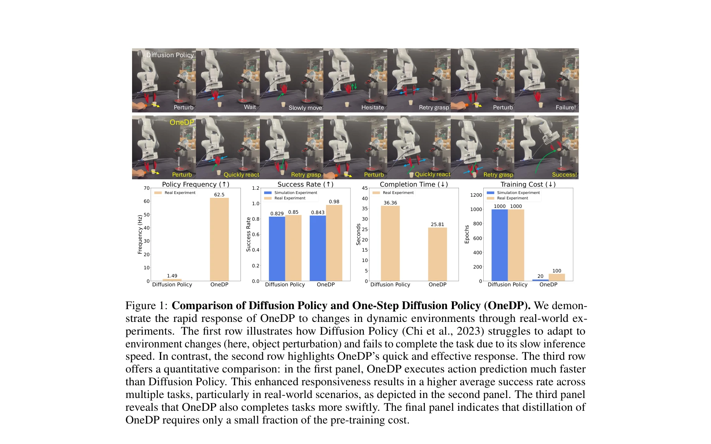
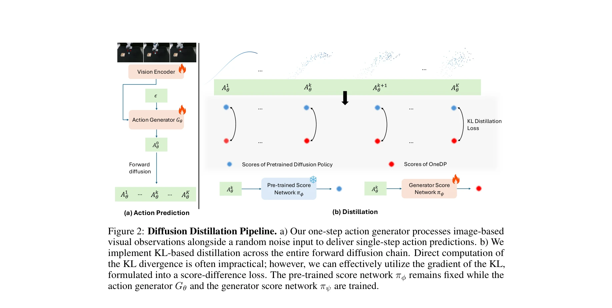

# One-Step Diffusion Policy: Fast Visuomotor Policies via Diffusion Distillation

> **저자**: Zhendong Wang, Zhaoshuo Li, Ajay Mandlekar, Zhenjia Xu, Jiaojiao Fan, Yashraj Narang, Linxi Fan, Yuke Zhu, Yogesh Balaji, Mingyuan Zhou, Ming-Yu Liu, Yu Zeng | **날짜**: 2024-10-28 | **URL**: [https://arxiv.org/abs/2410.21257](https://arxiv.org/abs/2410.21257)

---

## Essence

*Figure 1: Comparison of Diffusion Policy and One-Step Diffusion Policy (OneDP). We demon-*

One-Step Diffusion Policy (OneDP)는 사전 학습된 diffusion policy의 지식을 단일 단계 action generator로 distill하여 로봇 제어의 추론 속도를 42배 향상시킨다. KL divergence 최소화를 통해 원본 policy 분포와의 정렬을 보장하면서도 2%-10%의 추가 학습 비용만 필요하다.

## Motivation

- **Known**: Diffusion model은 생성 AI에서 뛰어난 성능을 보이며 로봇 제어의 behavior cloning에도 적용되고 있다. 그러나 iterative denoising step으로 인한 느린 추론 속도(1.49 Hz)는 실시간 로봇 애플리케이션에 부적합하다.
- **Gap**: 기존 diffusion policy 가속화 연구는 ODE solver 또는 몇 단계의 sampling에 의존하며, Consistency Policy도 여전히 여러 반복이 필요하다. 진정한 단일 단계 distillation으로 robotic control을 가속화하는 연구는 부족하다.
- **Why**: 동적 환경과 자원 제약 로봇에서는 빠른 응답이 필수적이며, 환경 변화에 신속하게 대응할 수 없으면 task 실패로 이어진다. 단계 inference로 실시간 제어를 가능하게 하는 것이 중요하다.
- **Approach**: 사전 학습된 diffusion policy의 score network와 새로운 one-step generator의 score network 간 KL divergence를 최소화하는 distillation 방법을 제안한다. Generator와 generator score network를 원본 모델로 초기화하여 효율적인 학습을 달성한다.

## Achievement

*Figure 1: Comparison of Diffusion Policy and One-Step Diffusion Policy (OneDP). We demon-*

- **추론 속도 대폭 개선**: 1.49 Hz에서 62.5 Hz로 42배 향상 (real-world 로봇 실험)
- **최고 수준의 성능**: Robomimic 벤치마크 6개 과제에서 state-of-the-art 성공률 달성
- **효율적 학습**: Distillation 수렴에 필요한 추가 학습 비용이 원본 학습의 2%-10%에 불과
- **빠른 task 완료**: 실제 task 완료 시간 36.36초에서 25.81초로 단축
- **동적 환경 대응**: 환경 변화(object perturbation)에 대한 신속한 반응으로 높은 성공률 유지

## How

*Figure 2: Diffusion Distillation Pipeline. a) Our one-step action generator processes image-based*

- One-step implicit action generator Gθ 설계: 노이즈 z와 observation O를 입력받아 single-step action 생성
- Generator score network πψ 도입: Generator가 생성한 actions의 score 추정
- KL divergence 최소화: 사전 학습된 diffusion policy의 score network πϕ와 generator score network πψ의 차이를 손실 함수로 정의
- Score difference loss 활용: KL divergence의 gradient를 score difference로 표현하여 효율적 학습
- 초기화 전략: Generator와 generator score network를 원본 diffusion model로 초기화하여 빠른 수렴 달성
- Forward diffusion chain 활용: Generated actions에 diffusion process를 적용하여 다양한 noise level에서 policy 정렬

## Originality

- Robotic control을 위한 최초의 진정한 one-step diffusion distillation 방법 제시 (Consistency Policy는 여전히 여러 단계 필요)
- SDS/VSD의 성공을 robot policy 영역으로 처음 적용한 policy-matching distillation 방법론
- Action distribution의 KL divergence를 diffusion chain 전체에 걸쳐 최소화하는 novel loss formulation
- Initialization 전략으로 2%-10% 추가 학습만으로 수렴 가능하게 한 효율적 설계

## Limitation & Further Study

- 평가가 6개 simulation task와 4개 real-world task로 제한적이며, 더 다양한 task 범위의 검증 필요
- Diffusion chain 전체에 대한 KL divergence 계산으로 인한 메모리 오버헤드 미분석
- Generator score network의 수렴성과 안정성에 대한 이론적 분석 부재
- One-step generator의 generalization 능력 및 새로운 환경에 대한 transfer learning 성능 미평가
- Offline RL 설정에서의 성능을 다루지 않으며, online learning 시나리오에서의 적용 가능성 미탐색

## Evaluation

- Novelty: 4/5
- Technical Soundness: 3/5
- Significance: 4/5
- Clarity: 4/5
- Overall: 4/5

**총평**: One-Step Diffusion Policy는 diffusion 기반 로봇 제어의 추론 속도 문제를 우아하게 해결하는 혁신적 접근법이다. 실험 결과가 강력하고 방법론이 명확하며 실제 로봇 애플리케이션의 가능성을 크게 확대한 중요한 연구다.

## Related Papers

- 🏛 기반 연구: [[papers/1339_Consistency_Policy_Accelerated_Visuomotor_Policies_via_Consi/review]] — consistency policy의 가속화 원리가 OneDP의 단일 단계 action generation 설계에 핵심 이론적 기반을 제공한다
- 🧪 응용 사례: [[papers/1488_NavDP_Learning_Sim-to-Real_Navigation_Diffusion_Policy_with/review]] — diffusion policy 가속화 기법이 NavDP의 실시간 trajectory generation 최적화에 직접 적용 가능하다
- 🔗 후속 연구: [[papers/1580_Streaming_Flow_Policy_Simplifying_diffusionflow-matching_pol/review]] — streaming flow policy의 실시간 처리 프레임워크를 OneDP의 단일 단계 추론과 결합하여 지연 시간을 더욱 단축할 수 있다
- 🔄 다른 접근: [[papers/1423_Hierarchical_Diffusion_Policy_manipulation_trajectory_genera/review]] — 둘 다 diffusion 기반이지만 hierarchical approach vs one-step approach로 서로 다른 속도-성능 트레이드오프를 제시합니다.
- 🏛 기반 연구: [[papers/1488_NavDP_Learning_Sim-to-Real_Navigation_Diffusion_Policy_with/review]] — diffusion policy의 추론 속도 최적화 기법이 NavDP의 실시간 trajectory generation 성능 향상에 필수적이다
- 🧪 응용 사례: [[papers/1525_Real-Time_Execution_of_Action_Chunking_Flow_Policies/review]] — 실시간 action chunking 알고리즘이 배드민턴의 정밀한 타이밍 제어와 diffusion policy 가속화에 모두 적용 가능하다
- 🔄 다른 접근: [[papers/1613_VITA_Vision-to-Action_Flow_Matching_Policy/review]] — 둘 다 빠른 정책 추론을 목표하지만 VITA는 flow matching, One-Step Diffusion은 diffusion 기반의 다른 접근법이다
- 🔗 후속 연구: [[papers/1339_Consistency_Policy_Accelerated_Visuomotor_Policies_via_Consi/review]] — One-Step Diffusion Policy의 단일 스텝 생성이 Consistency Policy의 저지연 추론을 더욱 극단적으로 최적화할 수 있다.
- 🔗 후속 연구: [[papers/1362_Diffusion_Policy_Visuomotor_Policy_Learning_via_Action_Diffu/review]] — One-step diffusion policy가 original diffusion policy의 추론 속도 문제를 해결하여 실시간 visuomotor control을 가능하게 한다.
