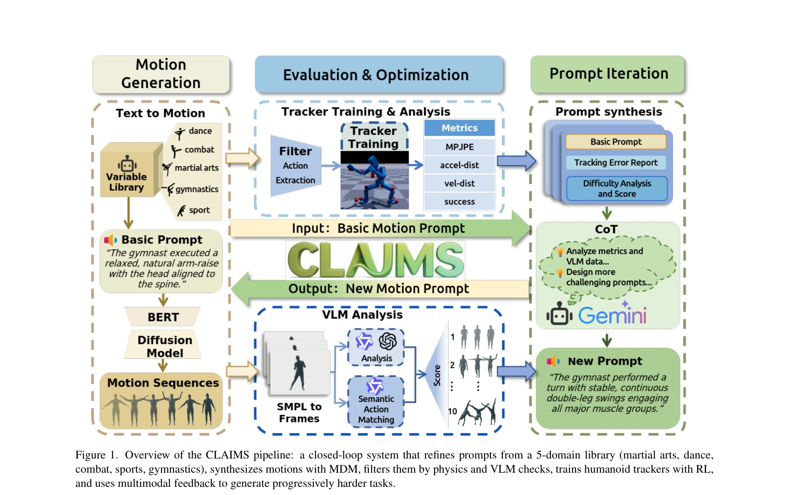

# Iterative Closed-Loop Motion Synthesis for Scaling the Capabilities of Humanoid Control

> **저자**: Weisheng Xu, Qiwei Wu, Jiaxi Zhang, Tan Jing, Yangfan Li, Yuetong Fang, Jiaqi Xiong, Kai Wu, Rong Ou, Renjing Xu | **날짜**: 2026-02-25 | **URL**: [https://arxiv.org/abs/2602.21599](https://arxiv.org/abs/2602.21599)

---

## Essence

*Figure 1. Overview of the CLAIMS pipeline: a closed-loop system that refines prompts from a 5-domain library (martial ar*

물리 기반 휴머노이드 제어를 위해 자동화된 폐쇄루프 모션 데이터 생성 프레임워크 CLAIMS를 제안하며, 이는 반복적으로 정책과 데이터의 난이도를 함께 향상시켜 고난이도 전문 동작 학습을 가능하게 한다.

## Motivation

- **Known**: DeepMimic, AMP, PHC 등의 방법은 MoCap 데이터 기반 강화학습으로 복잡한 동작을 학습하지만, 고정된 낮은 난이도의 데이터 분포로 인해 성능이 제한되고, 고품질 전문 MoCap 데이터 획득 비용이 높다.
- **Gap**: 기존 데이터셋은 정적 난이도 분포를 가지며 고난이도 전문 동작 커버리지가 부족하고, 정책 능력에 적응적으로 대응하는 동적 데이터 확장 메커니즘이 없다.
- **Why**: 적응적 난이도 상향은 정책의 성능 한계를 돌파할 수 있으며, 자동화된 데이터 생성은 고비용 MoCap을 대체하여 대규모 확장성을 실현한다.
- **Approach**: text-to-motion diffusion model (MDM)과 언어 프롬프트 기반 템플릿을 활용하여 자동 생성한 고난이도 모션으로 정책을 훈련하고, 강화학습과 multimodal agent 피드백을 통해 폐쇄루프 반복 최적화를 수행한다.

## Achievement

*Figure 1. Overview of the CLAIMS pipeline: a closed-loop system that refines prompts from a 5-domain library (martial ar*

- **자동화된 고품질 모션 생성**: 무술, 춤, 전투, 스포츠, 체조 등 5개 도메인에서 의미론적 태그와 명시적 난이도 계층을 가진 전문 모션 데이터 자동 합성
- **적응적 난이도 상향**: 정책의 현재 능력에 반응하여 고난이도 분포를 확장함으로써 기존 한계를 넘어 정책 성능 향상
- **우수한 실험 결과**: AMASS 데이터셋 크기의 약 1/10만 사용하여 테스트 실패율 45% 감소 (2201 클립 기준)
- **범용성**: 컨트롤러에 무관한 프레임워크로서 다양한 추적기에 일관된 성능 향상 제공

## How

- **의미론적 분류 체계**: 기본 동작(base action), 조합(combo action), 기술 디테일(detail), 속도·리듬(speed and rhythm)의 4축으로 난이도 정의
- **템플릿 기반 프롬프트 생성**: 전문 도메인 라이브러리에서 LLM으로 자동 인스턴스화된 액션 프롬프트를 MDM에 입력
- **물리 및 VLM 검증**: 생성된 모션의 물리적 타당성과 text-motion alignment를 multimodal 체크로 필터링
- **폐쇄루프 반복 최적화**: 생성→훈련→실패 분석→프롬프트 개선의 순환 구조로 정책과 데이터를 공진화(co-evolution)
- **정책 성능 지표 기반 난이도 조정**: 컨트롤러의 실패 패턴을 분석하여 다음 반복의 모션 난이도 자동 상향

## Originality

- 정책 숙달도에 적응하는 **동적 폐쇄루프 데이터 생성** 메커니즘으로, 기존 정적 데이터셋 패러다임을 탈피
- 5개 전문 도메인과 4축 난이도 정의를 통한 **체계적 의미론적 분류 체계** 제안
- diffusion 모델과 reinforcement learning을 **game-like competitive iteration**으로 결합하는 혁신적 접근
- VLM 피드백과 물리 메트릭을 통합한 **다차원 평가 및 선택 루프**로 기존 단일 평가 기준 극복

## Limitation & Further Study

- MDM이 HumanML3D 기반 사전학습되어 있어 생성 모션이 여전히 원본 코퍼스의 분포 제약을 받을 가능성
- 5개 도메인으로 제한되어 있으며 다른 전문 분야(예: 수영, 암벽 등반)로 확장 시 새로운 템플릿 개발 필요
- 폐쇄루프 수렴 조건과 최적 반복 횟수에 대한 이론적 분석 부재
- **후속 연구**: (1) 더 큰 규모의 multimodal 모션 생성 모델 활용, (2) 시뮬레이션-현실 전이(sim-to-real) 검증, (3) 다중 에고센트릭 뷰 기반 모션 재타겟팅 자동화

## Evaluation

- Novelty: 4/5
- Technical Soundness: 3/5
- Significance: 4/5
- Clarity: 4/5
- Overall: 4/5

**총평**: 본 논문은 폐쇄루프 자동 데이터 생성과 적응적 난이도 상향을 결합하여 고비용 MoCap 데이터 수집의 병목을 혁신적으로 해결하며, 체계적인 의미론적 분류와 실증적 성과로 휴머노이드 제어 분야에 상당한 기여를 제시한다.

## Related Papers

- 🔄 다른 접근: [[papers/1442_Heracles_Bridging_Precise_Tracking_and_Generative_Synthesis/review]] — 둘 다 반복적 폐쇄루프 접근을 사용하지만 1503은 모션 합성에, 1442는 추적-생성 결합에 특화됨
- 🔗 후속 연구: [[papers/1600_Opt2Skill_Imitating_Dynamically-feasible_Whole-Body_Trajecto/review]] — Opt2Skill의 DDP 기반 궤적 생성을 자동화된 폐쇄루프 시스템으로 확장하여 스케일링을 실현함
- 🏛 기반 연구: [[papers/1295_Booster_Gym_An_End-to-End_Reinforcement_Learning_Framework_f/review]] — Booster Gym의 end-to-end RL framework가 반복적 폐쇄루프 모션 합성의 기반 구조를 제공함
- 🏛 기반 연구: [[papers/1600_Opt2Skill_Imitating_Dynamically-feasible_Whole-Body_Trajecto/review]] — CLAIMS의 자동화된 폐쇄루프 모션 데이터 생성이 DDP 기반 동역학적 궤적 생성의 확장된 활용을 보여줌
- 🔄 다른 접근: [[papers/1366_Discrete_Diffusion_VLA_Bringing_Discrete_Diffusion_to_Action/review]] — Adaptive discrete action을 통한 OneTwoVLA가 discrete diffusion과 다른 방식으로 action token의 순서 문제를 해결한다.
