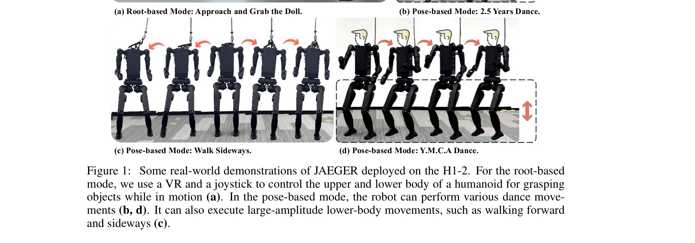

# JAEGER: Dual-Level Humanoid Whole-Body Controller

> **저자**: Ziluo Ding, Haobin Jiang, Yuxuan Wang, Zhenguo Sun, Yu Zhang, Xiaojie Niu, Ming Yang, Weishuai Zeng, Xinrun Xu, Zongqing Lu | **날짜**: 2025-05-10 | **URL**: [https://arxiv.org/abs/2505.06584](https://arxiv.org/abs/2505.06584)

---

## Essence

*Figure 2: The framework of JAEGER. The left shows the retargeting network, which uses an MLP*

JAEGER는 인간형 로봇의 전신 제어를 위해 상체와 하체를 독립적인 두 개의 컨트롤러로 분리하는 dual-level 제어 방식을 제안하며, root velocity tracking(coarse-grained)과 local joint angle tracking(fine-grained) 제어를 모두 지원한다.

## Motivation

- **Known**: 최근 humanoid 로봇의 whole-body control은 human motion dataset(AMASS)을 활용한 imitation learning과 RL을 결합하여 발전했으며, OmniH2O, HumanPlus, ExBody 등의 방법들이 다양한 추적 방식을 시도하고 있다.
- **Gap**: 기존 방법들은 coarse-grained과 fine-grained 제어를 효과적으로 통합하지 못하며, 상체와 하체의 상호작용이 학습 수렴을 방해하고 robust policy 학습을 어렵게 한다.
- **Why**: Human-like motion을 수행하면서도 균형을 유지하고 다양한 명령(속도 추적, 자세 추적)을 처리할 수 있는 robust humanoid controller는 실제 로봇 응용의 필수 요소이다.
- **Approach**: 상하체 분리를 통해 mutual interference를 제거하고, retargeting network, dual-level controller, curriculum learning(supervised initialization → RL)의 세 단계로 구성된 통합 프레임워크를 제안한다.

## Achievement

*Figure 1: Some real-world demonstrations of JAEGER deployed on the H1-2. For the root-based*

- **MLP 기반 retargeting**: optimization 기반 IK 방식보다 정확하고 부드러운 joint angle을 생성하며 1 kHz의 높은 실행 주파수로 real-time 성능 달성
- **Dual-level controller**: 상하체 독립적 제어로 dimensionality curse 완화 및 fault tolerance 향상, 각 컨트롤러가 자신의 작업에 집중 가능
- **구조화된 curriculum learning**: supervised initialization을 통한 효율적인 RL 수렴 가속화
- **양방향 실증**: H1-2 등 두 humanoid 플랫폼에서 시뮬레이션 및 실환경 모두에서 SOTA 방법 대비 우수성 입증, 다양한 동작(grabbing, dance, 측보 등) 성공

## How

*Figure 2: The framework of JAEGER. The left shows the retargeting network, which uses an MLP*

- **Retargeting Network**: AMASS 데이터셋으로부터 human-humanoid pose pair 생성 후 3-layer MLP로 매핑 학습
- **Dual-level Controller 구조**: upper-body controller(joint angle tracking)와 lower-body controller(root velocity tracking) 분리, 두 컨트롤러는 observation과 reward 공유
- **Root-based mode**: root velocity command + upper body reference joint angle
- **Pose-based mode**: 전신 reference joint angle command
- **Curriculum Learning Stage 1**: lower-body 독립 학습
- **Curriculum Learning Stage 2**: upper-body supervised initialization (retargeting network으로부터)
- **Curriculum Learning Stage 3**: PPO를 이용한 whole-body RL 학습
- **IsaacGym 시뮬레이션**: 학습 환경으로 사용, PD controller 활용

## Originality

- **상하체 분해(decoupling) 아이디어**: multi-agent system 관점에서 humanoid WBC를 재정의하여 상호간섭 제거
- **MLP 기반 retargeting**: 기존 optimization IK 대비 새로운 접근으로 real-time 성능과 smoothness 동시 달성
- **구조화된 curriculum learning**: supervised initialization → RL 단계적 접근으로 dual-level controller 학습 효율화
- **coarse/fine-grained 통합**: root velocity + joint angle tracking을 단일 프레임워크 내 효과적으로 통합하는 전략

## Limitation & Further Study

- **상하체 완전 독립성 가정**: 실제로는 상하체 간의 물리적 coupling이 존재하는데, 이를 완전히 제거하기 어려울 수 있음
- **AMASS 데이터셋 의존성**: human motion 특성의 편향이 학습에 영향을 미칠 수 있으며, 매우 다른 humanoid morphology에 적용시 generalization 한계
- **Curriculum learning 복잡성**: 각 stage별 hyperparameter tuning 및 초기화 방식이 성과에 중요한데, 이에 대한 민감도 분석 부족
- **실환경 검증 제한**: H1-2 플랫폼 외 다른 humanoid에서의 성능 검증 미흡
- **후속 연구 방향**: (1) 상하체 coupling effect의 명시적 모델링, (2) 더 다양한 morphology에 대한 generalization 개선, (3) online learning/adaptation 메커니즘 추가

## Evaluation

- Novelty: 4/5
- Technical Soundness: 4/5
- Significance: 4/5
- Clarity: 4/5
- Overall: 4/5

**총평**: JAEGER는 humanoid 전신 제어의 핵심 문제(coarse/fine-grained 통합, 상하체 간섭 제거)를 dual-level decomposition으로 우아하게 해결하며, MLP 기반 retargeting과 curriculum learning을 통해 실제 로봇에서 검증된 강력한 솔루션을 제시한다.

## Related Papers

- 🔗 후속 연구: [[papers/1453_Hold_My_Beer_Learning_Gentle_Humanoid_Locomotion_and_End-Eff/review]] — JAEGER의 dual-level control은 SoFTA의 상체/하체 분리 제어 개념을 더욱 체계화한 구현이다.
- 🔄 다른 접근: [[papers/1471_Humanoid_Policy__Human_Policy/review]] — 두 논문 모두 상하체 분리 제어를 다루지만, JAEGER는 dual-level에, Humanoid Policy는 시간 최적화에 초점을 둔다.
- 🏛 기반 연구: [[papers/1365_EGM_Efficiently_Learning_General_Motion_Tracking_Policy_for/review]] — JAEGER의 전신 제어기는 EGM의 general motion tracking을 dual-level로 구현한 결과이다.
- 🔄 다른 접근: [[papers/1271_Architecture_Is_All_You_Need_Diversity-Enabled_Sweet_Spots_f/review]] — layered 제어 대신 dual-level 계층적 제어 접근 방식을 제시한다
- 🏛 기반 연구: [[papers/1594_Transferring_Foundation_Models_for_Generalizable_Robotic_Man/review]] — Open X-Embodiment 데이터셋이 foundation model의 로봇 조작 전이를 위한 대규모 학습 데이터와 평가 기준을 제공
- 🏛 기반 연구: [[papers/1453_Hold_My_Beer_Learning_Gentle_Humanoid_Locomotion_and_End-Eff/review]] — SoFTA의 상체/하체 분리 제어 개념은 JAEGER의 dual-level control 아키텍처의 기반이 된다.
