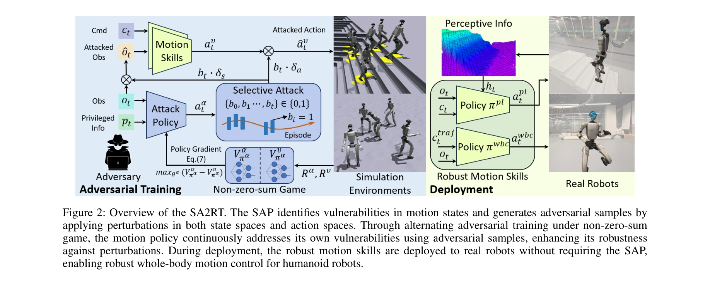
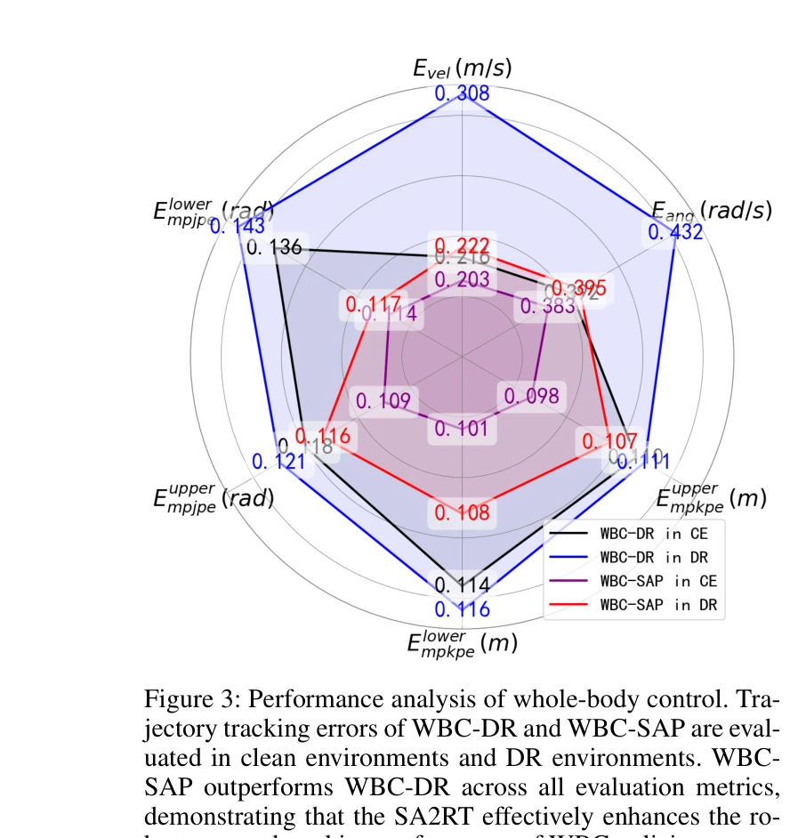

# Keep on Going: Learning Robust Humanoid Motion Skills via Selective Adversarial Training

> **저자**: Yang Zhang, Zhanxiang Cao, Buqing Nie, Haoyang Li, Zhong Jiangwei, Qiao Sun, Xiaoyi Hu, Xiaokang Yang, Yue Gao | **날짜**: 2025-07-11 | **URL**: [https://arxiv.org/abs/2507.08303](https://arxiv.org/abs/2507.08303)

---

## Essence

*Figure 2: Overview of the SA2RT. The SAP identifies vulnerabilities in motion states and generates adversarial samples b*

SA2RT(Selective Adversarial Attack for Robust Training)는 학습 가능한 적대자 네트워크를 통해 휴머노이드 로봇의 동작 정책 취약점을 식별하고 선택적으로 섭동을 가하여 장시간 안정적인 운동 기술을 학습한다.

## Motivation

- **Known**: RL 기반 휴머노이드 로봇 제어는 인상적인 결과를 달성했으나, 시뮬레이션-실제 간 격차, 센서/액추에이터 노이즈, 외부 교란으로 인해 신경망 제어기는 불안정성과 낮은 강건성을 보인다.
- **Gap**: 기존 Domain Randomization은 정책 취약점을 특정하지 못하고, 정규화 제약은 탐색과 강건성 간 트레이드오프를 요구하며, 정책 취약점을 정확히 식별하고 목표 섭동을 적용하는 접근법은 특히 고차원 휴머노이드 로봇에서 미탐색 상태이다.
- **Why**: 휴머노이드 로봇이 일상 환경에서 장시간 안정적으로 작동하려면 센서 노이즈와 외부 교란에 강건한 동작 정책이 필수적이며, 이는 실제 배포 시 신뢰성과 안전성을 크게 향상시킨다.
- **Approach**: 비영합 게임 기반 교대 최적화로 Selective Attack Policy(SAP)와 동작 정책을 동시에 학습하되, SAP는 공격 예산 제약 하에서 가장 취약한 상태와 행동을 식별하여 섭동을 가하고, 동작 정책은 이러한 공격에 대응하며 강건성을 증강한다.

## Achievement

*Figure 3: Performance analysis of whole-body control. Tra-*

- **지형 통과 성공률 40% 향상**: 다양한 지형에서의 보행 성능이 대폭 개선됨
- **궤적 추적 오차 32% 감소**: 전신 제어 태스크에서 추적 정확도 향상
- **장시간 안정성 유지**: 장기적 이동 및 추적 성능 유지로 실제 배포 가능성 확인
- **보편적 강건성**: 다양한 환경 변화와 외란에 대한 일반화된 강건성 달성

## How

*Figure 2: Overview of the SA2RT. The SAP identifies vulnerabilities in motion states and generates adversarial samples b*

- Two-Player Markov Game 프레임워크 도입: 적대자 π_α와 피해자 π_υ를 정의하여 게임 이론적 접근
- Selective Attack Policy(SAP) 설계: 공격 예산 제약(L_budget) 하에서 상태/행동 공간에 선택적 섭동
- 비영합 교대 최적화: SAP 학습(피해자 정책 불안정화) → 동작 정책 학습(공격 대응) 반복
- Unitree G1 휴머노이드 로봇에서 실제 배포 실험: 감지 기반 보행(perceptive locomotion)과 전신 제어(whole-body control) 태스크 검증
- 다양한 공격 정책 분석: 서로 다른 취약점 노출로 정책의 균형 잡힌 강건성 향상

## Originality

- **선택적 공격 예산 제약**: 무차별적 섭동이 아닌 공격 예산 하에서 최대 영향 섭동을 식별하여 보수적 과적합 회피
- **휴머노이드 특화**: 고차원 상태/행동 공간을 가진 휴머노이드 로봇의 취약점 식별에 맞춤형 설계
- **비영합 게임 적용**: 영합 게임이 아닌 비영합 교대 최적화로 지속적 강건성 향상 기대
- **실제 로봇 검증**: 시뮬레이션 없이 실제 Unitree G1 로봇에서 직접 성능 입증

## Limitation & Further Study

- **공격 예산 설정의 민감성**: 예산 값 결정에 대한 명확한 가이드라인 부재; 최적 값 탐색 비용
- **계산 비용**: 교대 최적화로 인한 학습 시간 증가; 추가 SAP 네트워크 유지 비용
- **일반화 범위**: Unitree G1 로봇에서만 검증되어 다른 휴머노이드 플랫폼으로의 확장성 미확인
- **후속연구 방향**: (1) 적응형 공격 예산 동적 조정, (2) 멀티 로봇 플랫폼 검증, (3) 실시간 배포 최적화

## Evaluation

- Novelty: 4/5
- Technical Soundness: 3/5
- Significance: 4/5
- Clarity: 4/5
- Overall: 4/5

**총평**: SA2RT는 선택적 적대 훈련 프레임워크를 통해 휴머노이드 로봇의 동작 강건성을 체계적으로 향상시키며, 실제 로봇 배포에서 유의미한 성능 개선(40% 성공률 향상)을 달성한 매우 강력한 연구이다.

## Related Papers

- 🏛 기반 연구: [[papers/1447_HiFAR_Multi-Stage_Curriculum_Learning_for_High-Dynamics_Huma/review]] — SA2RT의 선택적 적대 훈련은 HiFAR의 curriculum learning과 결합하여 더욱 강건한 동작 학습을 달성할 수 있다.
- 🔗 후속 연구: [[papers/1465_Humanoid_Goalkeeper_Learning_from_Position_Conditioned_Task-/review]] — SA2RT의 적대적 훈련 방법은 골키퍼와 같은 특정 태스크의 robust policy 학습에 적용될 수 있다.
- 🔄 다른 접근: [[papers/1258_Adversarial_Locomotion_and_Motion_Imitation_for_Humanoid_Pol/review]] — 두 논문 모두 adversarial training을 사용하지만, SA2RT는 selective attack에, 다른 논문은 general adversarial locomotion에 초점을 둔다.
- 🔗 후속 연구: [[papers/1374_Embedding_Classical_Balance_Control_Principles_in_Reinforcem/review]] — Keep on Going의 robust motion과 고전적 균형 원리를 결합하면 더욱 안정적인 낙상 복구 정책을 개발할 수 있다.
- 🔗 후속 연구: [[papers/1447_HiFAR_Multi-Stage_Curriculum_Learning_for_High-Dynamics_Huma/review]] — HiFAR의 다단계 curriculum은 SA2RT의 선택적 적대 훈련과 결합하여 더욱 강건한 fall recovery를 달성할 수 있다.
- 🏛 기반 연구: [[papers/1465_Humanoid_Goalkeeper_Learning_from_Position_Conditioned_Task-/review]] — 골키퍼 동작의 adversarial learning은 SA2RT의 적대적 훈련을 통해 더욱 강건한 정책을 학습할 수 있다.
- 🔗 후속 연구: [[papers/1396_FastTD3_Simple_Fast_and_Capable_Reinforcement_Learning_for_H/review]] — Keep on Going의 robust motion skills이 FastTD3의 빠른 학습을 더 안정적이고 지속가능한 방향으로 발전
