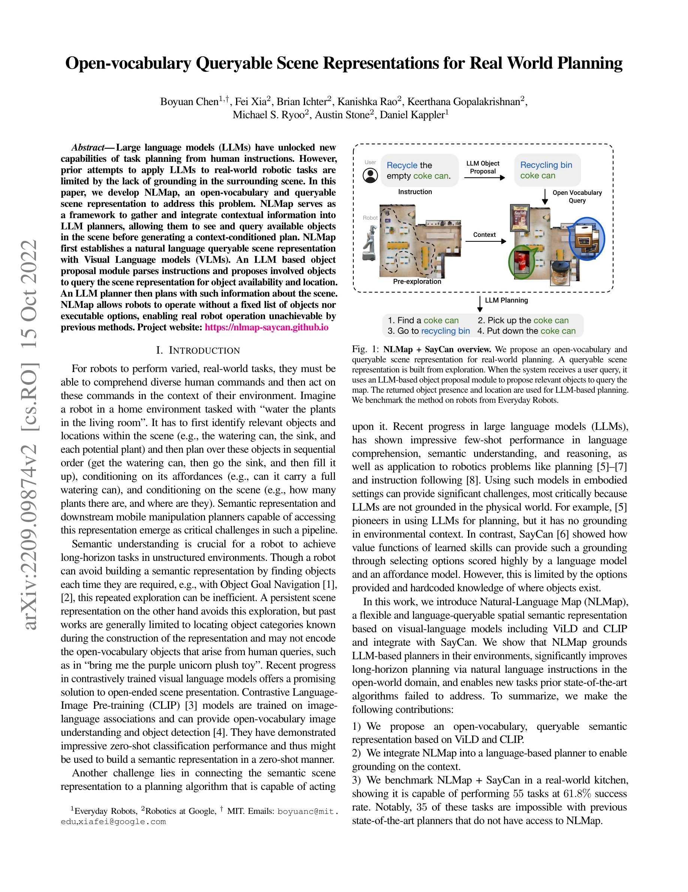
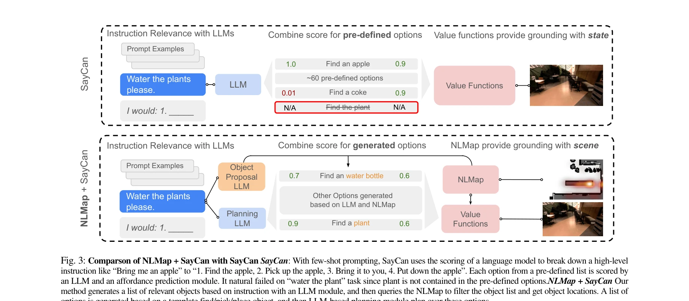
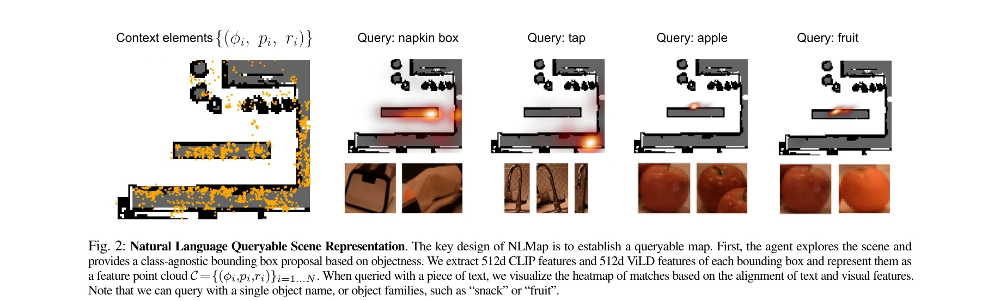

# Open-vocabulary Queryable Scene Representations for Real World Planning

> **저자**: Boyuan Chen, Fei Xia, Brian Ichter, Kanishka Rao, Keerthana Gopalakrishnan, Michael S. Ryoo, Austin Stone, Daniel Kappler | **날짜**: 2022-09-20 | **URL**: [https://arxiv.org/abs/2209.09874](https://arxiv.org/abs/2209.09874)

---

## Essence

*Fig. 1: NLMap + SayCan overview. We propose an open-vocabulary and*

NLMap은 Visual Language Model을 기반으로 한 개방형 어휘의 쿼리 가능한 장면 표현을 제안하여, LLM 기반 로봇 플래너가 실제 환경의 객체를 인식하고 위치를 파악한 후 맥락-조건부 계획을 수립할 수 있도록 한다.

## Motivation

- **Known**: LLM은 자연어 지시로부터 작업 계획 수립에서 우수한 성능을 보이고 있으나, 기존 접근법들은 환경 맥락에 대한 그라운딩이 부족하며 고정된 객체 목록과 실행 가능한 옵션에 제한된다.
- **Gap**: LLM 기반 로봇 플래너가 실제 환경의 다양한 객체를 동적으로 인식하고 위치를 파악하여 계획에 반영할 수 있는 개방형 어휘의 장면 표현이 필요하다.
- **Why**: 로봇이 다양한 현실 작업을 수행하려면 인간의 자연어 명령을 이해하고 환경 맥락을 기반으로 장기 계획을 수립해야 하는데, 이를 위해서는 관련 객체를 동적으로 파악하고 위치 정보를 활용할 수 있는 능력이 필수적이다.
- **Approach**: NLMap은 탐사 단계에서 CLIP과 ViLD와 같은 VLM의 이미지 인코더를 사용하여 객체의 특징을 추출하고, 자연어 쿼리로 장면 표현을 질의할 수 있는 구조를 제안한다. LLM 기반 객체 제안 모듈이 지시를 파싱하여 관련 객체를 제안하고, LLM 플래너가 이러한 정보를 활용하여 계획을 수립한다.

## Achievement

*Fig. 3: Comparson of NLMap + SayCan with SayCan SayCan: With few-shot prompting, SayCan uses the scoring of a language m*

- **개방형 어휘 장면 표현**: CLIP과 ViLD 기반의 자연어 쿼리 가능한 의미론적 장면 표현을 제안하여 테스트 시점에서 임의의 객체를 쿼리할 수 있음
- **LLM 플래너 그라운딩**: 장면 정보를 LLM 기반 플래너와 통합하여 환경 맥락을 기반으로 한 계획 수립 가능
- **실제 로봇 성능**: 실제 주방 환경에서 55개 작업을 61.8% 성공률로 수행하였으며, 이 중 35개 작업은 기존 방법으로는 불가능했음

## How

*Fig. 2: Natural Language Queryable Scene Representation. The key design of NLMap is to establish a queryable map. First,*

- 탐사 단계에서 클래스-무관 영역 제안 네트워크로 관심 영역(ROI) 검출
- 각 ROI에 대해 CLIP과 ViLD 이미지 인코더를 사용하여 512차원 특징 벡터 추출
- 특징 벡터, 위치 좌표, 크기 정보로 구성된 맥락 요소 생성 및 특징 포인트 클라우드 구성
- 자연어 쿼리와 추출된 특징 간의 내적을 통해 이미지-텍스트 정렬 점수 계산
- LLM 기반 객체 제안 모듈이 자연어 지시를 파싱하고 관련 객체 제안
- 제안된 객체들에 대해 장면 표현 쿼리로 객체 가용성 및 위치 정보 획득
- 획득한 장면 정보를 바탕으로 SayCan LLM 플래너가 순차적 계획 수립

## Originality

- VLM 특징을 기반으로 한 개방형 어휘의 자연어 쿼리 가능한 장면 표현 설계가 혁신적임
- LLM 기반 객체 제안 모듈을 통해 자연어 지시를 구조화된 장면 표현에 동적으로 연결하는 메커니즘 제시
- 기존의 고정된 객체 목록 및 옵션 제약을 제거하여 완전히 새로운 객체 조합으로도 작업 가능하도록 함
- VLMap 등 동시기 연구와 달리 로봇 조작 작업 중심의 실제 로봇 실험 제시

## Limitation & Further Study

- 탐사 단계의 효율성에 대한 상세한 분석 부재 - 모든 환경에서 효과적인 탐사 전략이 명시되지 않음
- VLM 특징 추출의 계산 비용 및 실시간성에 대한 논의 부족
- 61.8% 성공률은 아직 실제 배포에는 제약이 있으며, 실패 사례에 대한 상세한 분석 필요
- CLIP과 ViLD의 특징만 사용하는데, 다른 VLM 모델들의 성능 비교 및 앙상블 효과 분석이 제한적
- 후속연구로는 동적 환경에서의 장면 표현 업데이트 메커니즘, 더 정교한 객체 제안 알고리즘, 그리고 계획 실패에 대한 재학습 또는 적응 메커니즘 개발이 필요함

## Evaluation

- Novelty: 4/5
- Technical Soundness: 3/5
- Significance: 4/5
- Clarity: 4/5
- Overall: 4/5

**총평**: NLMap은 VLM 기반의 개방형 어휘 장면 표현을 LLM 플래너와 효과적으로 통합하여 로봇이 동적으로 환경 맥락을 인식하고 계획할 수 있도록 한 혁신적인 연구이며, 실제 로봇 실험에서도 기존 방법으로 불가능했던 작업들을 성공적으로 수행하여 실용적 가치를 입증했다.

## Related Papers

- 🏛 기반 연구: [[papers/1612_Visual_Language_Maps_for_Robot_Navigation/review]] — Visual Language Maps의 언어 기반 장면 표현이 NLMap의 개방형 어휘 쿼리 가능한 장면 표현의 기초 방법론을 제공한다.
- 🔗 후속 연구: [[papers/1561_SayPlan_Grounding_Large_Language_Models_using_3D_Scene_Graph/review]] — SayPlan의 3D Scene Graph가 NLMap의 VLM 기반 장면 표현을 대규모 태스크 계획으로 확장한다.
- 🧪 응용 사례: [[papers/1340_Context-Aware_Entity_Grounding_with_Open-Vocabulary_3D_Scene/review]] — Context-Aware Entity Grounding이 NLMap의 개방형 어휘 장면 표현을 실제 로봇 조작 환경에서 활용하는 구체적 응용 사례이다.
- 🧪 응용 사례: [[papers/1443_L3MVN_Leveraging_Large_Language_Models_for_Visual_Target_Nav/review]] — 오픈 어휘 장면 표현이 LLM 기반 의미적 추론을 실제 환경에서 구현하는 데 필요한 기술입니다.
- 🏛 기반 연구: [[papers/1487_Multimodal_Spatial_Language_Maps_for_Robot_Navigation_and_Ma/review]] — 오픈 어휘 장면 표현이 공간 언어 맵에서 다양한 모달리티를 공간적으로 그라운딩하는 기반을 제공합니다.
- 🏛 기반 연구: [[papers/1561_SayPlan_Grounding_Large_Language_Models_using_3D_Scene_Graph/review]] — NLMap의 개방형 어휘 쿼리 장면 표현이 SayPlan의 3D Scene Graph 활용을 위한 기초 방법론을 제공한다.
- 🔗 후속 연구: [[papers/1332_CLIP-Fields_Weakly_Supervised_Semantic_Fields_for_Robotic_Me/review]] — Open-vocabulary Queryable Scene Representations는 CLIP-Fields의 개념을 실제 로봇 응용으로 확장한다
- 🔗 후속 연구: [[papers/1340_Context-Aware_Entity_Grounding_with_Open-Vocabulary_3D_Scene/review]] — Open-vocabulary Queryable Scene Representations는 OVSG의 개념을 실제 로봇 응용을 위한 쿼리 가능한 장면 표현으로 확장한다
