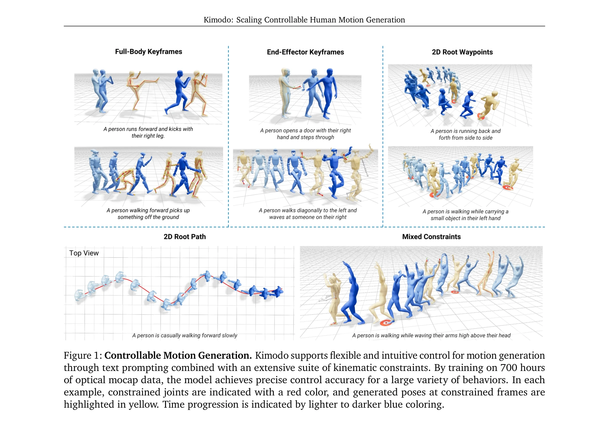
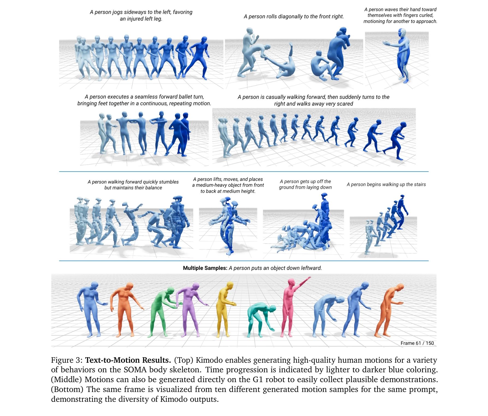
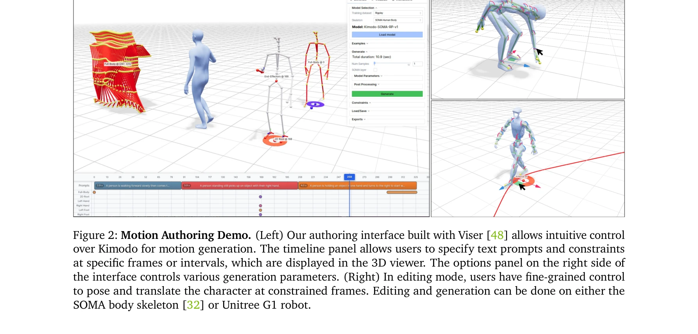

# Kimodo: Scaling Controllable Human Motion Generation

> **저자**:  | **날짜**: 2026-03-29 | **URL**: [https://arxiv.org/abs/2603.15546](https://arxiv.org/abs/2603.15546)

---

## Essence

*Figure 1: Controllable Motion Generation. Kimodo supports flexible and intuitive control for motion generation*

700시간의 광학 모션캡처 데이터로 학습한 kinematic motion diffusion model인 Kimodo를 제시하며, 텍스트 프롬프트와 다양한 kinematic constraint를 통해 고품질의 제어 가능한 인간 동작 생성을 실현한다.

## Motivation

- **Known**: 최근 diffusion, masked model, tokenized transformer 등의 생성 모델이 텍스트 기반 인간 동작 생성을 가능하게 했으나, 공개 mocap 데이터셋의 소규모로 인해 동작 품질과 제어 정확도가 제한되어 왔다.
- **Gap**: 기존 연구들은 작은 공개 데이터셋으로 인해 동작 품질, 제어 정확도, 일반화 능력이 제한되고, 비디오 기반 대규모 데이터 학습은 재구성 부정확성으로 인해 동작 품질을 손상시킨다.
- **Why**: 로보틱스, 시뮬레이션, 엔터테인먼트 분야에서 고품질의 인간 동작 데이터 수요가 증가하고 있으며, 효율적인 동작 합성은 수동 애니메이션의 비용과 시간을 대폭 절감할 수 있다.
- **Approach**: 700시간의 Bones Rigplay 고품질 mocap 데이터셋으로 학습하고, root와 body 예측을 분해하는 two-stage diffusion architecture와 정교한 motion representation을 설계하여 제어 정확도와 동작 품질을 동시에 달성한다.

## Achievement

*Figure 3: Text-to-Motion Results. (Top) Kimodo enables generating high-quality human motions for a variety*

- **대규모 학습 데이터**: 700시간의 광학 mocap 데이터(Bones Rigplay)로 기존 공개 데이터셋 대비 대폭 확대된 규모의 학습
- **다중 제어 수단**: 텍스트 프롬프트, full-body keyframe, sparse joint position/rotation, 2D waypoint, dense 2D path, foot contact pattern 등 포괄적인 kinematic constraint 지원
- **다중 스켈레톤 지원**: SOMA body model, Unitree G1 humanoid robot, SMPL-X skeleton에 대한 모델 체크포인트 제공
- **높은 제어 정확도**: two-stage denoiser architecture를 통해 floating과 foot skating 같은 일반적 아티팩트 최소화
- **다양성 확보**: 동일 프롬프트에 대해 다양한 동작 변수(one/two-handed, 높이, 타이밍 등) 생성 가능
- **로보틱스 응용**: 생성된 동작을 humanoid robot 제어에 직접 활용 가능한 데모 제시

## How

*Figure 2: Motion Authoring Demo. (Left) Our authoring interface built with Viser [48] allows intuitive control*

- Motion representation: root와 body motion을 분리하여 표현하고 두 단계로 예측하는 구조 설계
- Two-stage transformer denoiser: root motion과 body pose를 별도로 처리하여 아티팩트 최소화
- Constraint conditioning: 다양한 kinematic constraint를 diffusion process에 통합하기 위한 조건화 메커니즘
- Scaling 분석: 데이터셋 크기, 모델 크기, 배치 크기(GPU) 등 확장 요인이 성능에 미치는 영향 체계적으로 평가
- Multi-prompt 생성: timeline 인터페이스를 통해 순차적 동작 연결 및 프롬프트 간 연속성 보장
- Retargeting: SOMA retargeter를 이용한 Unitree G1 robot으로의 동작 변환

## Originality

- 700시간 대규모 mocap 데이터셋 활용으로 기존 연구 대비 본질적으로 다른 규모의 학습
- Root와 body 분리 예측 구조를 통한 novel two-stage diffusion architecture 제안
- Full-body keyframe부터 dense 2D path까지 포괄적 constraint suite의 통합 지원
- 생성 모델을 humanoid robot 데모나스트레이션 수집에 직접 적용한 로보틱스 활용 사례
- 대규모 데이터셋 기반 scaling law 실증적 분석

## Limitation & Further Study

- 오프라인 모션 저작 모델로 설계되어 실시간 상호작용 불가능
- NVIDIA RTX 3090에서 단일 프롬프트 생성에 2-5초 소요로 상대적으로 느린 생성 속도
- 10초 최대 시퀀스 길이 제한으로 더 긴 동작 생성 시 multi-prompt 접근 필요
- 학습 데이터가 특정 스타일과 동작 범주에 편향될 가능성
- Constraint 충돌 상황에서의 동작 예측 안정성 분석 부족
- 후속 연구: 실시간 생성 모델 개발, 더 긴 시퀀스 생성 능력 개선, 사용자 피드백 기반 반복적 생성

## Evaluation

- Novelty: 4/5
- Technical Soundness: 4/5
- Significance: 4/5
- Clarity: 4/5
- Overall: 4/5

**총평**: Kimodo는 대규모 고품질 mocap 데이터와 정교한 two-stage diffusion architecture를 통해 제어 가능한 인간 동작 생성의 실질적 진전을 이루었으며, 로보틱스와 애니메이션 등 다양한 응용 분야에 즉시 활용 가능한 강력한 솔루션을 제시한다.

## Related Papers

- 🔗 후속 연구: [[papers/1431_Guided_Motion_Diffusion_for_Controllable_Human_Motion_Synthe/review]] — Kimodo가 GMD의 제어 가능한 diffusion 기반 모션 생성을 700시간 대규모 데이터로 확장하여 스케일링함
- 🔄 다른 접근: [[papers/1592_OmniControl_Control_Any_Joint_at_Any_Time_for_Human_Motion_G/review]] — 둘 다 kinematic constraint 기반 모션 생성을 다루지만 1507은 대규모 학습에, 1592는 유연한 관절 제어에 특화됨
- 🏛 기반 연구: [[papers/1422_GENMO_A_GENeralist_Model_for_Human_MOtion/review]] — GENMO의 일반화된 인간 모션 모델이 대규모 제어 가능한 모션 생성의 이론적 기반을 제공함
- 🔗 후속 연구: [[papers/1386_Example-based_Motion_Synthesis_via_Generative_Motion_Matchin/review]] — example-based synthesis를 더 확장 가능한 controllable generation으로 발전시켰다
- 🔗 후속 연구: [[papers/1400_Flexible_Motion_In-betweening_with_Diffusion_Models/review]] — controllable motion generation을 keyframe constraints로 더 유연하게 확장했다
- 🔗 후속 연구: [[papers/1431_Guided_Motion_Diffusion_for_Controllable_Human_Motion_Synthe/review]] — 1431의 guided motion diffusion 개념을 대규모 데이터셋으로 확장하여 더 일반화된 제어 가능한 모션 생성을 실현함
- 🏛 기반 연구: [[papers/1592_OmniControl_Control_Any_Joint_at_Any_Time_for_Human_Motion_G/review]] — Kimodo의 대규모 kinematic diffusion이 임의 관절 제어의 확장된 기반을 제공함
- 🔄 다른 접근: [[papers/1438_HandX_Scaling_Bimanual_Motion_and_Interaction_Generation/review]] — 둘 다 large-scale motion generation이지만 HandX는 bimanual interaction에, Kimodo는 controllable human motion에 특화됩니다.
